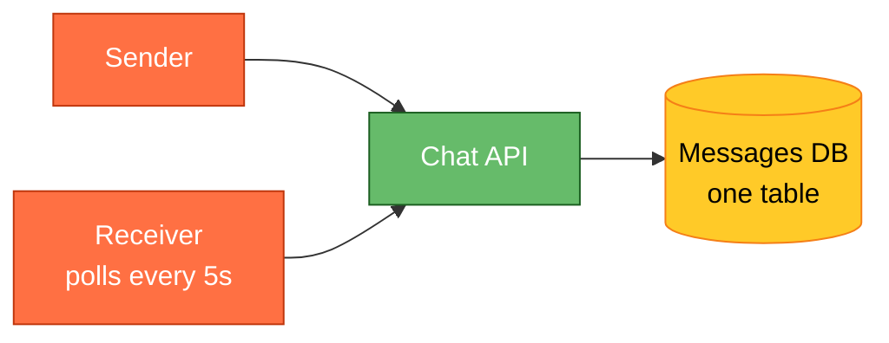
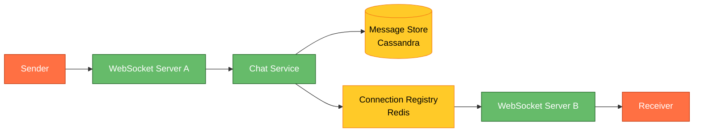
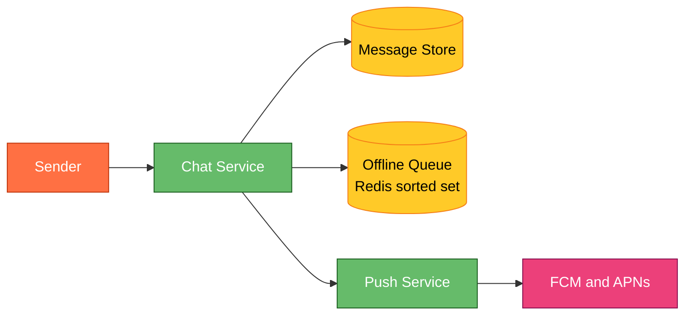
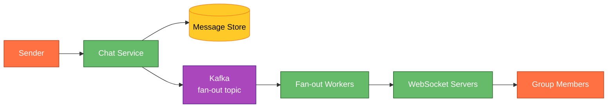
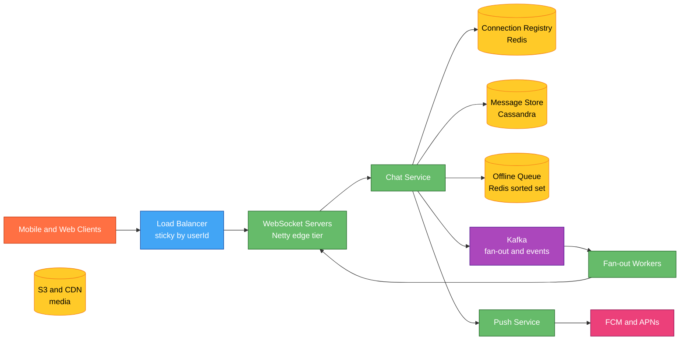

# Designing a Chat System Like WhatsApp

## Understanding the Problem

💬 **What is a chat system?** A real-time messaging platform that lets users send text, images, and files to individuals or groups. Messages must be delivered reliably (even if the recipient is offline), ordered correctly, and displayed in real-time. Think WhatsApp, Telegram, Facebook Messenger, or Slack. The hard parts: guaranteed delivery across flaky mobile networks, real-time push without polling, group fan-out at scale, and end-to-end encryption.

## Naive First Cut



Sender POSTs message to an API, stored in a DB. Receiver polls the API every 5 seconds for new messages.

Why this breaks:
- **Polling is wasteful** — 500M users polling every 5s = 100M QPS of mostly-empty responses. Massive cost, terrible latency.
- **5-second delay feels laggy** — real-time chat needs sub-second delivery.
- **Single DB for all messages** — billions of messages/day, one table collapses.
- **No offline handling** — if receiver is offline when message arrives, when do they get it?
- **No ordering guarantee** — if two messages arrive out of order at the DB, display is wrong.
- **Group messages multiply the problem** — 256-member group = 256 deliveries per message.

## Prior Art

- **[WhatsApp Architecture (InfoQ)](https://highscalability.com/whatsapp-architecture/)** — Erlang-based, 2M connections per server, XMPP-derived protocol, store-and-forward for offline delivery.
- **[Facebook Messenger Iris](https://engineering.fb.com/2014/10/09/production-engineering/building-mobile-first-infrastructure-for-messenger/)** — ordered log storage (like Kafka) per conversation. Messages appended to a per-user ordered log. Clients sync via sequence numbers.
- **[Discord How Messages Are Stored](https://discord.com/blog/how-discord-stores-billions-of-messages)** — migrated from MongoDB to Cassandra to ScyllaDB. Partition per channel + bucket.
- **[Signal Protocol](https://signal.org/docs/)** — end-to-end encryption with double-ratchet. Pre-keys for offline delivery. The gold standard for E2E chat encryption.
- **[Slack Real-Time Messaging](https://slack.engineering/flannel-an-application-level-edge-cache-to-make-slack-scale/)** — WebSocket connections for real-time, application-level edge cache (Flannel) for fast channel hydration.

## Technology Choices

| Tier | Purpose | Primary pick | Alternatives |
|---|---|---|---|
| Real-time transport | Push messages to online clients | WebSocket (long-lived) | SSE, MQTT (IoT/mobile-optimized), gRPC streaming |
| Connection management | Track who's online on which server | Redis Pub/Sub + connection registry | Kafka, custom session store |
| Message storage | Durable, ordered message log | Cassandra (partition per conversation) | ScyllaDB, DynamoDB, TiDB |
| Message queue | Decouple sender from fan-out | Kafka (per-user topic or partition) | SQS, RabbitMQ, Pulsar |
| Offline delivery | Store messages until recipient connects | Redis sorted set per user | SQS per user, Cassandra unread table |
| Presence | Who's online | Redis with TTL per user | Dedicated presence service |
| Media storage | Images, files, voice notes | S3 / GCS with CDN | MinIO, Azure Blob |
| Push notifications | Offline users | FCM + APNs | OneSignal, SNS |
| E2E encryption | Message privacy | Signal Protocol (Double Ratchet) | Custom, Noise Protocol |

## Functional Requirements

**Core:**
1. Users can send messages (text) to another user in real-time (1:1 chat).
2. Users can create groups and send messages to all group members.
3. Messages are delivered reliably even if the recipient is offline (store-and-forward).

**Below the line:**
- Read receipts, typing indicators
- Media messages (images, video, voice)
- End-to-end encryption
- Message search, reactions, threads
- Voice/video calling

## Non-Functional Requirements

**Core:**
- **Real-time delivery** — P99 < 500ms for online-to-online message delivery.
- **Reliability** — zero message loss. Once the server acks, the message WILL be delivered eventually.
- **Ordering** — messages within a conversation appear in send order.
- **Scale** — 500M DAU, 100B messages/day (WhatsApp scale).

**Below the line:**
- Sub-100ms delivery latency
- Exactly-once delivery (at-least-once + client-side dedupe is acceptable)
- Multi-device sync (web + mobile + desktop)

## Core Entities

- **User** — identified by phone number or userId. Has online/offline status.
- **Conversation** — a 1:1 or group thread. Has a unique `conversationId` and list of participants.
- **Message** — text content with `messageId`, `senderId`, `conversationId`, `timestamp`, `status` (sent/delivered/read).
- **Connection** — a live WebSocket session mapping `userId → serverId:connectionId`.

## API / System Interface

```
WebSocket: wss://chat.example.com/ws
  → Client authenticates on connect (JWT)
  → Bidirectional: send messages, receive messages, typing, presence

REST (fallback + media):
POST /v1/messages         → send a message (fallback if WS down)
GET  /v1/conversations/:id/messages?after=<seqNo>  → sync history
POST /v1/media/upload     → upload image/file, get a mediaUrl
POST /v1/groups           → create group
```

**Wire format (over WebSocket):**
```json
{"type": "message", "to": "conv_123", "text": "hello", "clientMsgId": "uuid"}
{"type": "ack", "messageId": "msg_456", "status": "delivered"}
{"type": "typing", "conversationId": "conv_123", "userId": "u_789"}
```

Security: WebSocket authenticated via JWT on handshake. `clientMsgId` is for client-side dedupe (idempotency). Server generates the authoritative `messageId` and `timestamp`.

## High-Level Design

### 1) User sends a 1:1 message (both online)



**Flow:**
1. Sender's app sends the message over its WebSocket connection to Server A.
2. Server A forwards to the Chat Service.
3. Chat Service persists the message to Cassandra (partition key = `conversationId`, clustering key = `messageId` for ordering).
4. Chat Service looks up receiver's WebSocket server from Redis connection registry: `ws_conn:{receiverId} → serverB`.
5. Chat Service pushes the message to Server B (internal pub/sub or direct gRPC).
6. Server B pushes the message down the receiver's WebSocket.
7. Receiver's app sends back an `ack` with `status: delivered`.
8. Server sends `delivered` receipt back to sender.

### 2) Receiver is offline — store and forward



**Flow:**
1. Chat Service checks connection registry → receiver not online.
2. Message persisted to Cassandra (same as before — always store).
3. Message ID added to receiver's offline queue (Redis sorted set, scored by sequence number).
4. Push notification sent via FCM/APNs: "You have a new message from X."
5. When receiver opens the app and reconnects via WebSocket, the server drains the offline queue: sends all pending messages in order.
6. Receiver acks each; server removes from offline queue.

### 3) Group message fan-out



**Flow:**
1. Sender sends to group `conv_123` (256 members).
2. Chat Service stores ONE copy of the message (partition key = `conv_123`).
3. Publishes a fan-out event to Kafka: `{messageId, conversationId, members: [u1..u256]}`.
4. Fan-out workers consume, look up each member's connection, and push individually.
5. Online members get real-time delivery. Offline members get offline queue + push notification.

**Why write-once, fan-out-on-read:**
- Store 1 copy, not 256. Saves massive storage.
- Fan-out is async — sender doesn't wait for 256 deliveries.
- If fan-out worker crashes, Kafka retries (at-least-once delivery).

## Potential Deep Dives

### Deep Dive 1 — How to handle 2M WebSocket connections per server

**Bad — one thread per connection (Java BIO).**
2M threads = impossible. OOM at ~10K threads.

**Good — NIO event loop (Netty, Node.js).**
Netty handles millions of connections on a single event loop group. Each connection is just a file descriptor + a small buffer. Memory = ~10KB per idle connection. 2M connections ≈ 20GB RAM. Doable on a 64GB box.

**Great — tiered connection handling.**
- **Edge tier:** lightweight WebSocket terminators (Envoy, HAProxy) that handle TLS + keepalive. Millions of connections per node.
- **Logic tier:** actual message routing in a separate service. Edge proxies messages to logic tier via gRPC.
- Separation means you can scale connection capacity (edge) independently from processing capacity (logic).

### Deep Dive 2 — Message ordering in distributed systems

**Problem:** Sender sends "Hello" then "How are you?" but they arrive at different servers or are processed out of order.

**Bad — rely on server timestamps.**
Clock skew between servers means timestamps can be out of order. NTP gives ~10ms accuracy at best.

**Good — per-conversation monotonic sequence number.**
Chat Service assigns a `seqNo` per conversation using Redis `INCR conv_seq:{convId}`. Messages display in `seqNo` order. Client sorts locally.

**Great — combine sequence number + client-side vector clock for offline conflict resolution.**
- Server assigns `seqNo` for ordering.
- Client embeds `lastSeenSeqNo` in each message so the server can detect gaps (missing message → re-request).
- For multi-device, each device maintains its own "last synced seqNo" and pulls delta on reconnect.

### Deep Dive 3 — Reliable delivery with at-least-once + client dedupe

**Problem:** Network is unreliable. Message might be delivered twice if the ack is lost.

**Flow:**
```
Sender → Server: message (clientMsgId: "abc")
Server → Sender: ack (messageId: "msg_1", clientMsgId: "abc")
Server → Receiver: message (messageId: "msg_1")
Receiver → Server: delivered ack (messageId: "msg_1")
```

**What if receiver's ack is lost?** Server retries delivery. Receiver sees `msg_1` twice. Client dedupes by `messageId` — if already in local DB, ignore.

**What if sender's send is retried?** Server checks `clientMsgId: "abc"` against a short-lived dedupe cache. If seen, returns the same `messageId` without re-storing.

**Result:** at-least-once from server side, exactly-once from user's perspective (client dedupe).

### Deep Dive 4 — How to sync message history across devices

**Problem:** User has phone + web + desktop. All three must show the same messages.

**Solution: pull-based sync with sequence numbers.**
- Each conversation has a `maxSeqNo`.
- Each device tracks `lastSyncedSeqNo` per conversation.
- On app open, device sends `GET /conversations/:id/messages?after=lastSyncedSeqNo`.
- Server returns the delta. Device applies locally.
- Real-time messages come via WebSocket; device increments its local seqNo on receipt.

This is the "ordered log" model (Facebook Iris). The server is the source of truth; clients are materialized views with a cursor.

### Deep Dive 5 — Group fan-out: write amplification vs read amplification

**Write amplification (push model):**
- On group message, write a copy to each member's inbox.
- 256-member group × 1000 messages/day = 256K writes/day for one group.
- **Pro:** reads are fast (each user reads their own inbox).
- **Con:** massive write cost at scale. Celebrity groups with 100K members are catastrophic.

**Read amplification (pull model):**
- Store one copy per conversation.
- On read, user's client fetches from the conversation's log.
- **Pro:** one write per message regardless of group size.
- **Con:** each read must merge multiple conversations' logs.

**Hybrid (what WhatsApp/Discord do):**
- **Small groups (≤256):** push model. Fan-out is bounded and fast.
- **Large channels (1000+):** pull model. Store in channel log, clients fetch on demand.
- Threshold is configurable per platform.

## Final Architecture



## Summary

| Decision | Choice | Why |
|---|---|---|
| Transport | WebSocket | Real-time bidirectional, sub-second delivery |
| Message store | Cassandra | Partition per conversation, append-only, handles billions |
| Connection registry | Redis | Sub-ms lookup of "which server has user X" |
| Offline delivery | Redis sorted set + push notification | Ordered drain on reconnect |
| Group fan-out | Kafka → workers | Async, retryable, doesn't block sender |
| Ordering | Per-conversation sequence number | Simple, no clock dependency |
| Delivery guarantee | At-least-once + client dedupe | Zero message loss, no duplicates visible to user |
| Multi-device | Pull sync with seqNo cursor | Ordered log model (Facebook Iris) |
