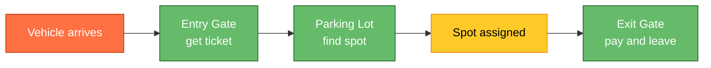
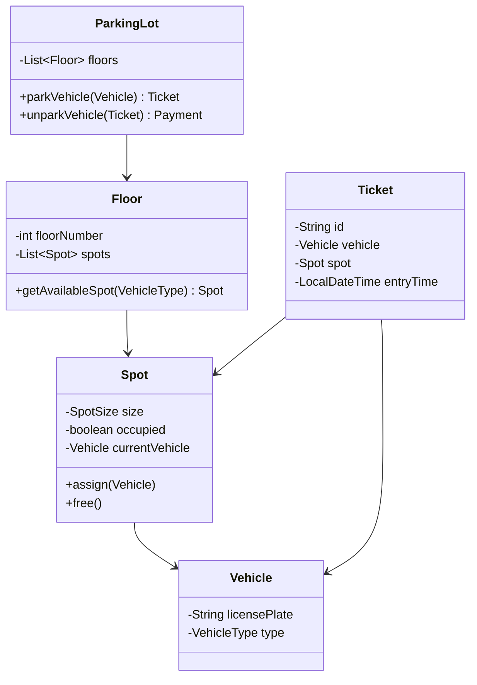

# Designing a Parking Lot System

⚡ **Difficulty:** Beginner (great first design problem!)
📋 **Prerequisites:** Basic OOP (classes, inheritance)
⏱️ **Reading time:** 10 min

---

## TL;DR

A parking lot system manages spots of different sizes, assigns vehicles to available spots, and tracks entry/exit for billing.



**In 3 sentences:** Vehicles enter → system finds the nearest available spot matching their size → assigns a ticket. On exit, the system calculates the fee based on duration and processes payment. It's an OOP design exercise, not a distributed systems problem.

---

## Why This Problem?

This is the **#1 recommended starting problem** for LLD interviews because:
- No distributed systems knowledge needed
- Tests pure OOP: classes, inheritance, composition
- Tests design patterns: Strategy (pricing), Factory (vehicle/spot creation)
- Clear entities with relationships
- Simple enough to code in 30 minutes

---

## Requirements

**Functional:**
1. Parking lot has multiple floors, each floor has spots of sizes: Small, Medium, Large
2. Different vehicle types: Motorcycle, Car, Truck
3. Motorcycle fits in any spot. Car fits in Medium or Large. Truck needs Large.
4. On entry: assign nearest available matching spot, issue ticket
5. On exit: calculate hourly fee, process payment

**Non-functional:** (not relevant for LLD — it's all in-memory, single process)

---

## Core Entities



---

## Class Design

### Enums

```java
enum VehicleType { MOTORCYCLE, CAR, TRUCK }
enum SpotSize { SMALL, MEDIUM, LARGE }
```

### Vehicle

```java
class Vehicle {
    String licensePlate;
    VehicleType type;
}
```

### Spot

```java
class Spot {
    int id;
    SpotSize size;
    boolean occupied;
    Vehicle currentVehicle;

    boolean canFit(Vehicle v) {
        if (occupied) return false;
        switch (v.type) {
            case MOTORCYCLE: return true;  // fits anywhere
            case CAR: return size != SpotSize.SMALL;
            case TRUCK: return size == SpotSize.LARGE;
        }
        return false;
    }

    void assign(Vehicle v) { occupied = true; currentVehicle = v; }
    void free() { occupied = false; currentVehicle = null; }
}
```

### Ticket

```java
class Ticket {
    String id;
    Vehicle vehicle;
    Spot spot;
    LocalDateTime entryTime;
}
```

### ParkingLot (main class)

```java
class ParkingLot {
    List<Floor> floors;
    Map<String, Ticket> activeTickets;  // ticketId -> Ticket

    Ticket parkVehicle(Vehicle vehicle) {
        for (Floor floor : floors) {
            Spot spot = floor.getAvailableSpot(vehicle);
            if (spot != null) {
                spot.assign(vehicle);
                Ticket ticket = new Ticket(vehicle, spot, LocalDateTime.now());
                activeTickets.put(ticket.id, ticket);
                return ticket;
            }
        }
        throw new RuntimeException("No available spot");
    }

    double unparkVehicle(String ticketId) {
        Ticket ticket = activeTickets.remove(ticketId);
        ticket.spot.free();
        long hours = ChronoUnit.HOURS.between(ticket.entryTime, LocalDateTime.now()) + 1;
        return hours * getRate(ticket.vehicle.type);
    }

    private double getRate(VehicleType type) {
        switch (type) {
            case MOTORCYCLE: return 10;
            case CAR: return 20;
            case TRUCK: return 30;
            default: return 20;
        }
    }
}
```

---

## Design Patterns Used

| Pattern | Where | Why |
|---|---|---|
| **Strategy** | Pricing (`getRate` could be a `PricingStrategy` interface) | Different pricing for weekdays vs weekends, or hourly vs flat-rate |
| **Factory** | Creating spots of different sizes | Decouple spot creation from floor logic |
| **Singleton** | `ParkingLot` instance (optional) | Only one lot exists in this system |

---

## How to Extend

| Extension | How |
|---|---|
| Multiple pricing strategies | Interface `PricingStrategy { double calculate(Ticket t); }` |
| Reserved/VIP spots | Add `boolean reserved` to Spot, check before assigning |
| Electric vehicle charging spots | New `SpotSize.EV_CHARGING` or boolean on Spot |
| Multi-floor display panel | Observer pattern: Spot notifies panel on occupy/free |
| Entrance/exit gates with sensors | Gate class that calls `parkVehicle` / `unparkVehicle` |

---

## Interview Tips

- **Start with entities** — draw the class diagram first
- **Ask clarifying questions** — "are all floors identical?", "can a motorcycle park in a large spot?"
- **Show the pattern** — name Strategy/Factory explicitly when you use them
- **Mention thread safety** — "in production, `parkVehicle` would need `synchronized` or a lock because two cars could race for the same spot"
- **Keep it simple** — don't over-engineer. The interviewer wants clean OOP, not a distributed system.

---

## Key Concepts

| Term | What it means |
|---|---|
| **OOP** | Object-Oriented Programming — organize code as objects with data + behavior |
| **Strategy Pattern** | Define a family of algorithms, put each in its own class, swap them at runtime |
| **Factory Pattern** | A method that creates objects without specifying the exact class |
| **Composition** | `ParkingLot` HAS floors, floors HAVE spots (vs inheritance "IS-A") |

---

*Related: [System Design Fundamentals](/concepts) · [Rate Limiter](/RateLimiter)*
