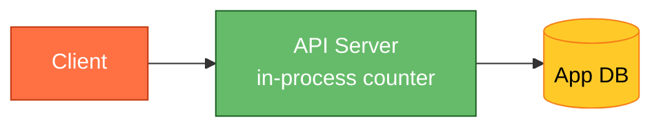
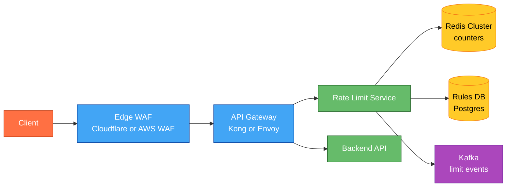
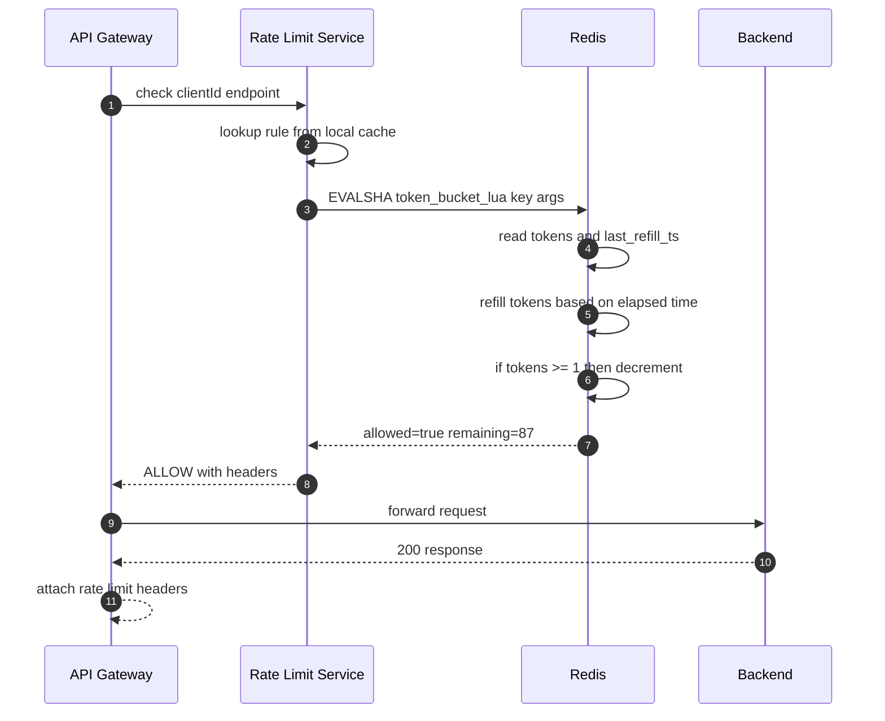
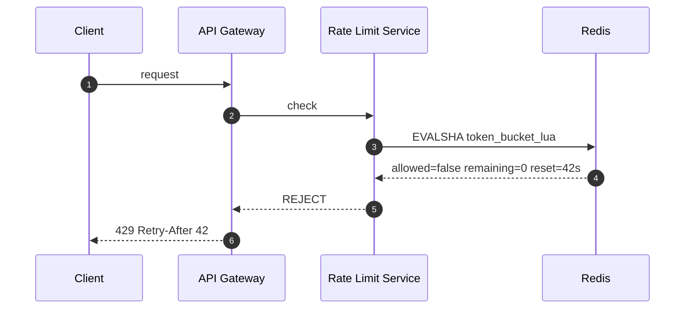
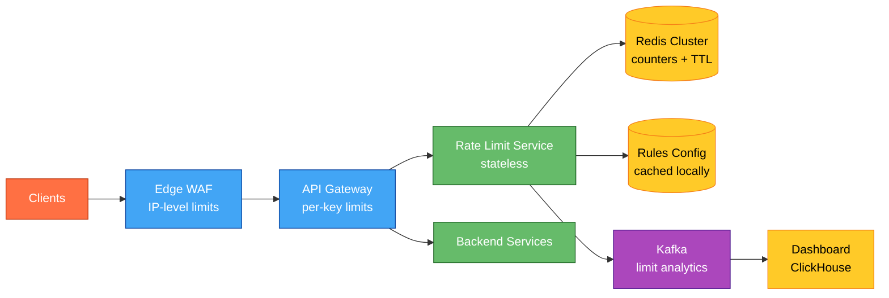

# Designing a Rate Limiter

## Understanding the Problem

🚦 **What is a rate limiter?** A mechanism that controls how many requests a client can make to a server within a time window. When the limit is exceeded, subsequent requests are rejected (typically with HTTP 429). Every major API — Stripe, GitHub, Twitter, AWS — rate-limits clients to protect backend resources, ensure fair usage, and prevent abuse. Despite the simple concept, building one that works correctly in a distributed system (multiple API servers, shared state, sub-millisecond overhead) is non-trivial.

## Naive First Cut



Keep a `HashMap<clientId, count>` in each API server process. Increment on each request, reset every minute.

Why this breaks:
- **Multiple API servers** — each has its own counter. Client hits server A 50 times, server B 50 times → 100 requests but each server thinks only 50. Limit bypassed.
- **Process restart loses state** — counters vanish. Post-deploy, everyone gets a fresh quota.
- **No coordination** — can't enforce global limits across a fleet of 100 pods.
- **Memory unbounded** — millions of unique clients means millions of map entries. OOM eventual.
- **Fixed window boundary burst** — send 100 requests at 11:59:59.999, another 100 at 12:00:00.001. Both windows allow 100, but 200 requests arrive in 2ms.

## Prior Art

- **[Stripe Rate Limiting Blog](https://stripe.com/blog/rate-limiters)** — multi-tier approach: per-user, per-IP, per-endpoint. Token bucket in Redis with Lua for atomicity. Load shedding as a last resort.
- **[Cloudflare Rate Limiting](https://blog.cloudflare.com/counting-things-a-lot-of-different-things/)** — sliding window counters at the edge. Billions of rules evaluated per second using a probabilistic approach (approximate sliding window).
- **[Kong Rate Limiting Plugin](https://docs.konghq.com/hub/kong-inc/rate-limiting/)** — API gateway-level limiter with Redis or Postgres backends, fixed/sliding window, cluster-wide sync.
- **[Google Cloud Armor](https://cloud.google.com/armor/docs/rate-limiting-overview)** — edge-level rate limiting using token bucket with per-IP or per-header keying, integrated with CDN.
- **[Envoy Local/Global Rate Limiting](https://www.envoyproxy.io/docs/envoy/latest/configuration/http/http_filters/rate_limit_filter)** — sidecar-based, calls a gRPC rate limit service for distributed decisions.

## Technology Choices

| Tier | Purpose | Primary pick | Alternatives |
|---|---|---|---|
| Edge rate limiter | Block abusive IPs before they reach origin | Cloudflare Rate Limiting / AWS WAF / Cloud Armor | Nginx `limit_req`, HAProxy stick tables |
| API Gateway limiter | Per-user, per-API-key limits | Kong / Envoy / AWS API Gateway | Apigee, Tyk, Traefik |
| Distributed counter store | Shared state for token counts | Redis (cluster mode) | Memcached, DynamoDB, etcd |
| Atomicity mechanism | Read-check-decrement in one op | Redis Lua scripts | Redis MULTI/EXEC, CAS loop |
| Rate limit rules store | Configuration of limits per tier/user/plan | Postgres / DynamoDB | Config file, etcd, Consul KV |
| Async analytics | Track limit hits for dashboards | Kafka + ClickHouse | Kinesis + Redshift, Prometheus |

**Why Redis for the counter store:**
- Sub-millisecond latency (must not slow down the request path)
- Atomic operations via Lua (read + check + decrement in one round-trip)
- Built-in TTL for automatic key expiry (window cleanup is free)
- Cluster mode for horizontal scale
- Every major rate limiter in production uses Redis (Stripe, GitHub, Shopify)

## Functional Requirements

**Core:**
1. Given a client identifier (API key, user ID, or IP) and an endpoint, decide **allow** or **reject** the request.
2. Support configurable limits: X requests per Y seconds, per client, per endpoint.
3. Return rate limit headers (`X-RateLimit-Limit`, `X-RateLimit-Remaining`, `X-RateLimit-Reset`) so clients can self-throttle.

**Below the line:**
- Multi-tier limits (per-second burst + per-minute sustained)
- Distributed rate limiting across regions
- Webhooks or notifications on limit breach
- Admin UI for rule management

## Non-Functional Requirements

**Core:**
- **Low latency** — rate limiting must add < 5ms to request path. If it's slower than that, it defeats the purpose.
- **High availability** — if the rate limiter is down, default to allowing (fail-open). A broken limiter shouldn't be a global outage.
- **Accuracy** — under concurrent traffic, the counter must not allow significantly more than the configured limit. Small over-count (~1-2%) is acceptable.
- **Scale** — handle 1M+ unique clients, 100K+ QPS of rate-limit checks.

**Below the line:**
- Exact precision (no over-count at all)
- Sub-1ms latency
- Multi-region synchronized counts

## Core Entities

- **Rule** — defines a limit: `{clientType, endpoint, maxRequests, windowSeconds}`. E.g., "free tier users can call /api/search 100 times per minute."
- **Counter** — the current count for a `(clientId, ruleId, windowKey)` tuple. Lives in Redis with TTL.
- **Client** — identified by API key, user ID, or IP address. Different clients may have different plan tiers.
- **Decision** — the outcome: ALLOW or REJECT, plus metadata (remaining quota, reset time).

## API / System Interface

For the rate limiter as an internal service (called by API gateway or sidecar):

```
POST /v1/check
Body: { clientId, endpoint, weight: 1 }
Response: {
  allowed: true,
  remaining: 87,
  limit: 100,
  resetAt: "2026-06-24T14:01:00Z"
}
```

Or if embedded in the gateway, it adds headers to the proxied response:

```http
HTTP/1.1 200 OK
X-RateLimit-Limit: 100
X-RateLimit-Remaining: 87
X-RateLimit-Reset: 1750860060

--- or on rejection ---

HTTP/1.1 429 Too Many Requests
Retry-After: 42
X-RateLimit-Limit: 100
X-RateLimit-Remaining: 0
X-RateLimit-Reset: 1750860060
```

## High-Level Design

### Architecture



**Color legend:**

| Color | Layer |
|---|---|
| 🟠 Orange | Clients |
| 🔵 Blue | Edge / Gateway |
| 🟢 Green | Services |
| 🟣 Purple | Async |
| 🟡 Yellow | Data |

### Request flow (numbered steps)

1. Client sends request to the edge (Cloudflare / AWS WAF).
2. Edge applies coarse IP-level limits (DDoS protection, bot blocking). Passes legit traffic.
3. API Gateway receives the request, extracts the client identifier (API key from header, user ID from JWT, or IP).
4. Gateway calls the Rate Limit Service (or evaluates inline if using a plugin like Kong's).
5. Rate Limit Service loads the applicable rule for this `(client tier, endpoint)` from a local cache (refreshed from Rules DB every 30s).
6. Executes a Lua script on Redis: atomically read counter → check against limit → increment if allowed → return decision.
7. If allowed: gateway forwards to backend, adds `X-RateLimit-*` headers to response.
8. If rejected: gateway returns `429` immediately with `Retry-After` header. Never reaches backend.
9. Limit events (both allows and rejects) are async-produced to Kafka for analytics dashboards.

## Core Flows

### Flow: Token Bucket check (the Redis Lua script)



### Flow: Rejection



## Potential Deep Dives

### Deep Dive 1 — Token Bucket vs Sliding Window vs Fixed Window

**Fixed Window:**
- Divide time into fixed intervals (e.g., 0:00–1:00, 1:00–2:00).
- One counter per window. Reset at window boundary.
- **Problem:** burst at boundary. 100 requests at 0:59 + 100 at 1:00 = 200 in 2 seconds.
- **Implementation:** `INCR rate:{client}:{minute}` with TTL=60s. Simplest.

**Sliding Window Log:**
- Store timestamp of every request. Count requests in `[now - window, now]`.
- **Problem:** stores every timestamp. 10K requests/min = 10K entries in Redis per client. Memory-heavy.
- **Accurate** but expensive.

**Sliding Window Counter (approximate):**
- Combine current window count + weighted previous window count.
- Formula: `count = current_count + prev_count * (overlap_percentage)`
- Example: at 1:15, window is 1 min. Current window (1:00–2:00) has 30 hits. Previous window (0:00–1:00) had 80 hits. Overlap = 45/60 = 75%. Estimate = 30 + 80 * 0.75 = 90.
- **Best trade-off:** accurate within ~1%, O(1) memory per client.
- **Cloudflare uses this** at billions of evaluations/sec.

**Token Bucket:**
- Bucket holds N tokens. Refills at rate R tokens/sec. Each request costs 1 token.
- Allows bursts (bucket can be full) but caps sustained rate.
- **Best for APIs** because it naturally allows short bursts while enforcing average rate.
- Redis implementation: store `{tokens: float, last_refill: timestamp}`. On each check, compute elapsed time, add tokens (cap at max), deduct 1.

**Recommendation:**
- Simple API with hard limits → **Sliding Window Counter** (Cloudflare style)
- API allowing bursts (e.g., "100/min but okay to burst 20 in 1 second") → **Token Bucket**
- Logging/audit needs exact precision → **Sliding Window Log** (accept the memory cost)

### Deep Dive 2 — Distributed Rate Limiting (multiple nodes, one limit)

**Bad — each node maintains its own counter.**
N nodes each allow the full limit. Actual throughput = N × limit. Useless.

**Good — centralized Redis. Every node calls Redis on every request.**
Correct but adds a network round-trip (0.5–2ms) to every request. At 100K QPS that's 100K Redis ops/sec. Works with Redis cluster but adds latency.

**Great — local counter with periodic sync (Stripe's approach).**
Each node tracks a local count. Every 100ms (or every 10 requests), it syncs with Redis: `INCRBY rate:{client} {local_count}` and reads back the global total. Between syncs, local decisions use `local_count + last_known_global`.

Trade-off: can overshoot by up to `num_nodes * sync_interval_requests`. For a limit of 1000/min across 10 nodes syncing every 10 requests, worst case overshoot = 100 extra (10%). For most APIs, 10% overshoot is acceptable.

For **strict** limits (billing, credits), always go to Redis. For **protective** limits (abuse prevention), local + periodic sync is fine.

### Deep Dive 3 — Rate Limiting at Different Layers

```
Layer 1: Edge (Cloudflare/WAF)     → IP-level, DDoS, bot blocking (coarse)
Layer 2: API Gateway (Kong/Envoy)  → Per-API-key, per-user, per-endpoint (fine)
Layer 3: Service-level             → Per-resource, per-operation (domain-specific)
```

**Why multiple layers:**
- Edge blocks volumetric attacks before they reach your infra (saves cost).
- Gateway enforces business limits (free tier: 100/min, paid: 10000/min).
- Service-level handles domain logic ("user can only send 5 password reset emails/hour").

Each layer has different rules, different keys, and different failure modes. Edge is always fail-open (never block all traffic). Service-level can be fail-closed (protect a critical resource).

### Deep Dive 4 — What happens when Redis is down? (Fail-open vs fail-closed)

**Bad — fail-closed (reject all requests).**
Redis down → entire API returns 429 → global outage. The rate limiter is now a single point of failure.

**Good — fail-open (allow all requests).**
Redis down → skip rate limiting, allow everything. Backend might get overloaded but at least users aren't locked out. Add alerts so ops knows limiting is degraded.

**Great — local fallback + circuit breaker.**
- If Redis responds within 5ms: use it (normal path).
- If Redis is slow (>5ms) or errors: open circuit breaker, switch to local in-memory token bucket per pod.
- Local bucket is conservative (each pod allows limit/N where N = pod count).
- Once Redis recovers, close circuit, resume centralized counting.
- Alert on circuit open so ops investigates.

This gives you graceful degradation: slightly less accurate during Redis outage, but never a global failure.

### Deep Dive 5 — Handling burst traffic gracefully

**Problem:** Client sends 100 requests in 1 second when the limit is 100/minute. Technically within quota, but the backend can't handle 100 concurrent requests from one client.

**Solution: Two-tier limiting.**
- **Sustained limit:** 100 requests / 60 seconds (token bucket, refill rate = 1.67/sec)
- **Burst limit:** max 10 requests in any 1-second window (separate counter)

Both must pass. Client can burst up to 10/sec but can't exceed 100/min total.

Redis implementation: two keys per client.
```
rate:{client}:sustained  → token bucket (max=100, refill=1.67/s)
rate:{client}:burst      → fixed window per-second (max=10, TTL=1s)
```

One Lua script checks both atomically. If either fails → 429.

## Final Architecture



## Summary

| Decision | Choice | Why |
|---|---|---|
| Algorithm | Token Bucket | Allows bursts, caps sustained rate, simple Redis impl |
| Counter store | Redis Cluster | Sub-ms latency, atomic Lua, built-in TTL |
| Atomicity | Lua script | Single round-trip, no race conditions |
| Failure mode | Fail-open + local fallback | Never be a SPOF |
| Multi-layer | Edge + Gateway + Service | Defense in depth |
| Headers | Standard X-RateLimit-* | Client self-throttling |
