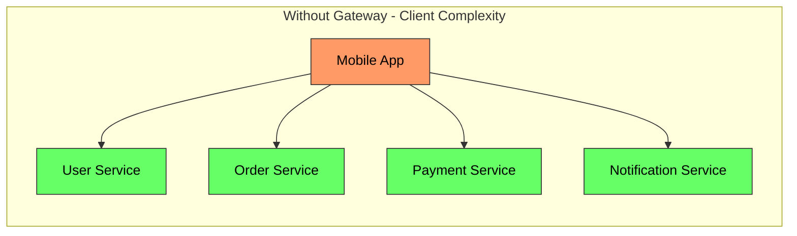
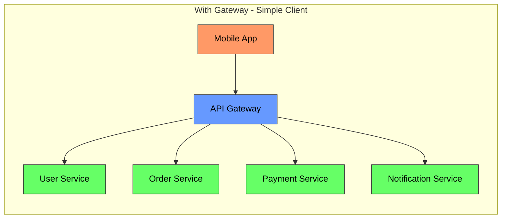
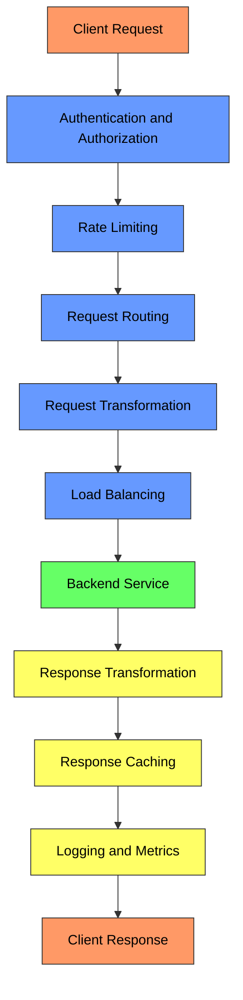
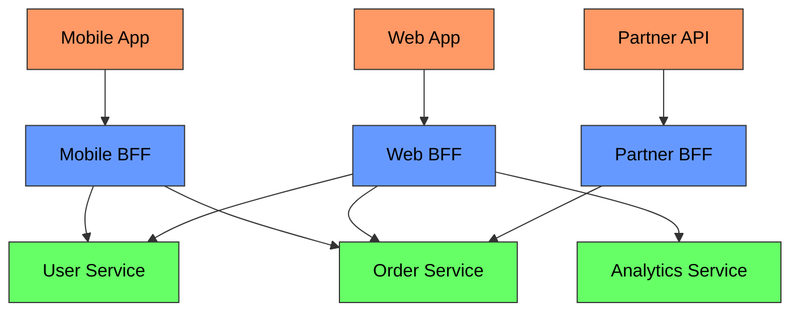
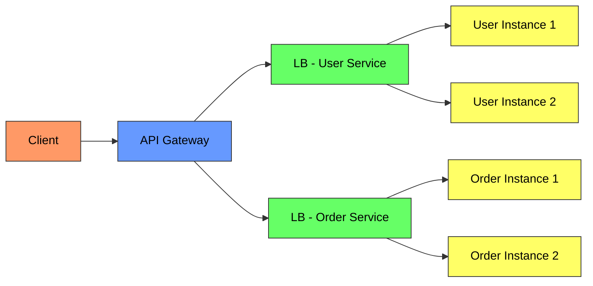

# API Gateway Pattern - Complete Deep Dive

> **Prerequisites:** [Load Balancing](/concepts/load-balancing/), [Rate Limiting](/concepts/rate-limiting/), [Service Discovery](/concepts/service-discovery/)
> **Used in:** [Uber](/hld/Uber/), [Instagram](/hld/Instagram/), [Zomato](/hld/Zomato/)

---

## What is an API Gateway?

An API Gateway is a single entry point for all client requests into a microservices architecture. It acts as a reverse proxy that routes requests to appropriate backend services while handling cross-cutting concerns like authentication, rate limiting, and response transformation.

**Real-world analogy:** Imagine a luxury hotel with a concierge desk. Guests don't wander the building looking for housekeeping, the restaurant, or the spa directly. They tell the concierge what they need, and the concierge routes the request, checks if they're a registered guest (auth), ensures they haven't exceeded their daily spa visits (rate limiting), and translates requests ("I want food" → specific restaurant reservation). The API gateway is that concierge.

---

## Why Use an API Gateway?

Without a gateway, every client must:
- Know the address of every microservice
- Handle authentication with each service individually
- Make multiple round-trips to compose a single view
- Deal with different protocols (gRPC, REST, GraphQL)

---

## Gateway Responsibilities

| Responsibility | What It Does |
|----------------|-------------|
| **Routing** | Map `/api/users/123` to User Service, `/api/orders` to Order Service |
| **Authentication** | Validate JWT/OAuth tokens before forwarding |
| **Rate Limiting** | Enforce per-user or per-IP request limits |
| **Request Transformation** | Convert REST to gRPC, add headers, rewrite paths |
| **Response Aggregation** | Combine responses from multiple services into one |
| **Caching** | Cache GET responses at the edge |
| **Circuit Breaking** | Stop forwarding to unhealthy services |
| **Protocol Translation** | Accept HTTP from clients, forward as gRPC internally |
| **SSL Termination** | Handle TLS at the gateway, use plain HTTP internally |
| **Observability** | Centralized logging, tracing, metrics for all traffic |

---

## Backend for Frontend (BFF) Pattern

Different clients have different needs. A mobile app needs compact responses; a web dashboard needs rich data. BFF provides a dedicated gateway per client type.

**BFF benefits:**
- Optimized response payloads per client (mobile gets less data)
- Different auth flows (mobile = OAuth + biometric, web = session cookies)
- Independent deployment per client team
- Can aggregate multiple backend calls into one client-optimized response

**Used by:** Netflix (per-device BFF), SoundCloud, Spotify

---

## Popular API Gateway Implementations

| Gateway | Type | Best For |
|---------|------|----------|
| **Kong** | Open-source + Enterprise | Plugin ecosystem, multi-cloud |
| **AWS API Gateway** | Managed | AWS-native, Lambda integration |
| **Nginx** | Self-managed | High performance, custom configs |
| **Envoy** | Service mesh proxy | L7 routing, gRPC-native |
| **Traefik** | Cloud-native | Kubernetes auto-discovery |
| **Apigee (Google)** | Managed | API monetization, developer portal |
| **Azure API Management** | Managed | Azure ecosystem |

### AWS API Gateway

| Feature | REST API | HTTP API | WebSocket API |
|---------|----------|----------|---------------|
| **Cost** | $3.50/million requests | $1.00/million requests | $1.00/million messages |
| **Latency** | ~30ms overhead | ~10ms overhead | Persistent connections |
| **Auth** | Cognito, Lambda, IAM | JWT, IAM | Lambda authorizer |
| **Use case** | Full-featured | Simple proxy, low cost | Real-time apps |

---

## Gateway vs Load Balancer

| Aspect | API Gateway | Load Balancer |
|--------|-------------|---------------|
| **Layer** | L7 (application) | L4 (TCP) or L7 (HTTP) |
| **Routing logic** | Path, header, method-based | Round-robin, least connections |
| **Authentication** | Yes | No (typically) |
| **Rate limiting** | Yes | Basic only |
| **Response transformation** | Yes | No |
| **Protocol translation** | Yes (REST ↔ gRPC) | No |
| **Caching** | Yes | No |
| **Use case** | External API entry point | Internal traffic distribution |

**In practice:** You use BOTH. The gateway handles external concerns (auth, rate limiting, routing to services). Within each service, a load balancer distributes across instances.

---

## Gateway Anti-Patterns

| Anti-Pattern | Problem | Solution |
|-------------|---------|----------|
| **God Gateway** | All business logic in the gateway | Keep gateway thin; logic belongs in services |
| **Single gateway for all** | One team's deploy blocks others | BFF pattern or team-owned gateways |
| **No timeout** | Slow backend hangs the gateway | Set aggressive timeouts + circuit breaker |
| **No rate limiting** | One abusive client DoSes all clients | Per-tenant rate limits |
| **Tight coupling** | Gateway knows internal service schemas | Use service contracts and versioned APIs |

---

## When to Use / When NOT to Use

✅ **Use an API gateway when:**
- You have multiple microservices exposed to external clients
- Cross-cutting concerns (auth, rate limiting, logging) need centralization
- Clients need aggregated responses from multiple services
- You need protocol translation (clients speak REST, services speak gRPC)
- Different client types need different API shapes (BFF)

❌ **Don't use when:**
- You have a monolithic application (one service = no routing needed)
- Internal service-to-service communication (use service mesh instead)
- You're adding it "just in case" with only one backend service
- The gateway becomes a bottleneck and you can't scale it horizontally

---

## Common Interview Questions

**Q1: How do you prevent the API gateway from becoming a single point of failure?**
> Deploy multiple gateway instances behind a load balancer (AWS ALB/NLB or DNS round-robin). Keep the gateway stateless — no session state stored locally; use external stores (Redis) for rate limiting counters. Use health checks to remove unhealthy gateway instances. For managed services (AWS API Gateway), the provider handles availability. In Kubernetes, run gateway pods with horizontal pod autoscaling.

**Q2: Gateway vs service mesh — when to use each?**
> API gateway handles north-south traffic (external clients → your services): auth, rate limiting, public API concerns. Service mesh handles east-west traffic (service → service internally): mTLS, retries, circuit breaking between your own services. They're complementary, not competing. An external request hits the gateway first, then service mesh handles internal routing. Some teams use Envoy as both (gateway mode + sidecar mode).

**Q3: How would you handle API versioning at the gateway level?**
> Options: (1) Path-based: `/v1/users` routes to UserService v1, `/v2/users` to v2. (2) Header-based: `Accept: application/vnd.api+json;version=2`. (3) Query param: `/users?version=2`. Path-based is most common for public APIs (clear, cacheable). The gateway can route different versions to different service deployments, enabling gradual rollout and backward compatibility.

**Q4: How does Netflix handle API gateway at scale?**
> Netflix uses Zuul (now replaced by Zuul 2, async/non-blocking). They handle 200B+ API requests/day. Key patterns: (1) Filters for cross-cutting concerns (pre-routing, routing, post-routing), (2) Dynamic routing rules (no redeploy for route changes), (3) Request shedding under load (priority-based), (4) Canary testing at the gateway level, (5) Playback testing (replay production traffic to new versions in shadow mode).

---

## Navigation

[← Back to Fundamentals](/concepts)

[All Concepts](/concepts/) | [HLD Designs](/hld/)
