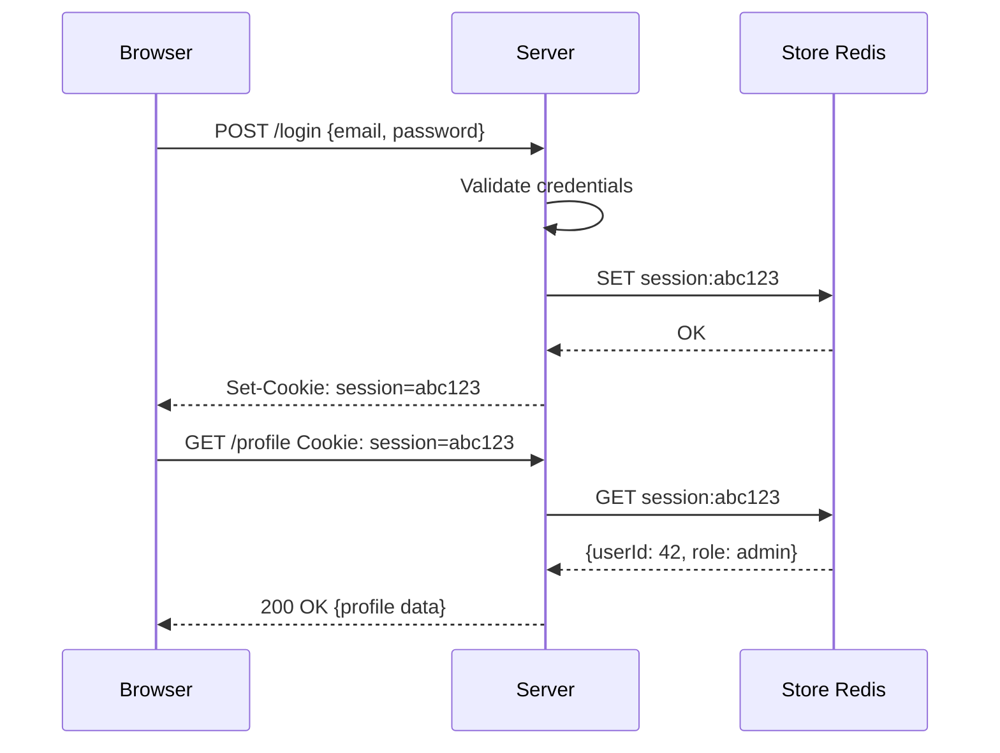
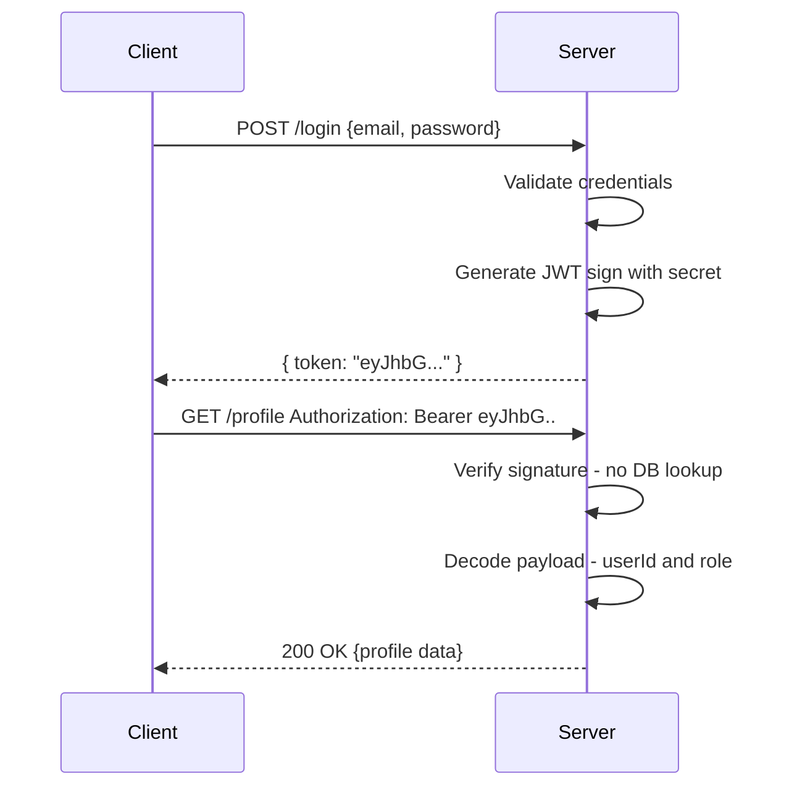
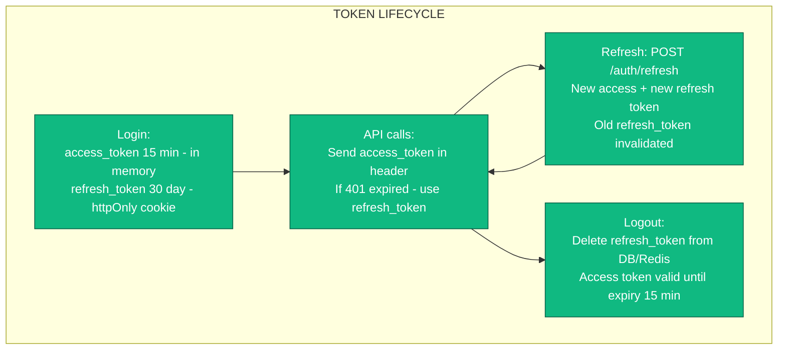
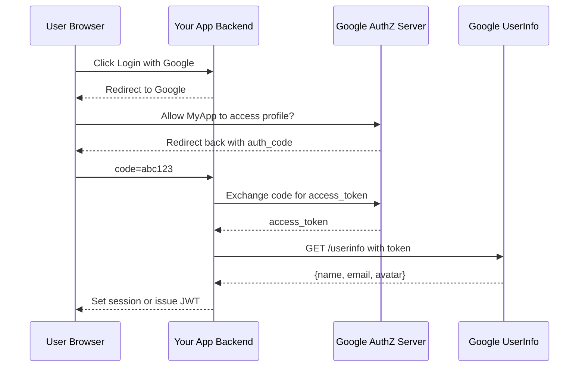

# Authentication - Complete Deep Dive

> **Prerequisites:** [API Design](/concepts/api-design/), [Caching](/concepts/caching/)
> **Used in:** All system designs that have user authentication (most designs on this site)

---

## What is Authentication?

Authentication (AuthN) is verifying **who you are**. Authorization (AuthZ) is verifying **what you can do**. In system design, you need both.

**Real-world analogy:** 
- **Authentication:** Showing your ID at an airport security checkpoint (proving you are who you claim to be).
- **Authorization:** Your boarding pass determines which gate and seat you can access (what you're allowed to do).


```
Authentication: "Are you really Bob?"     → identity verification
Authorization:  "Can Bob delete this?"    → permission check
```

---

## Session-Based Authentication (Traditional)

Server creates a session and stores it server-side. Client gets a session ID cookie.



**Session store:** Redis (fast, shared across servers) or database.

---

## Token-Based Authentication (JWT)

Server generates a signed token containing user info. Client stores and sends it. Server validates the signature — no server-side storage needed.



---

## JWT Structure

A JWT has three parts separated by dots: `header.payload.signature`

```
eyJhbGciOiJIUzI1NiIsInR5cCI6IkpXVCJ9.
eyJ1c2VySWQiOiI0MiIsInJvbGUiOiJhZG1pbiIsImV4cCI6MTcwOTEyMzQ1Nn0.
SflKxwRJSMeKKF2QT4fwpMeJf36POk6yJV_adQssw5c

┌─────────────────────────────────────────────────────────┐
│ HEADER (base64):                                        │
│ {                                                       │
│   "alg": "HS256",     ← signing algorithm              │
│   "typ": "JWT"        ← token type                     │
│ }                                                       │
├─────────────────────────────────────────────────────────┤
│ PAYLOAD (base64):                                       │
│ {                                                       │
│   "userId": "42",     ← custom claims                  │
│   "role": "admin",    ← custom claims                  │
│   "exp": 1709123456,  ← expiration time                │
│   "iat": 1709119856,  ← issued at                      │
│   "iss": "myapp.com"  ← issuer                         │
│ }                                                       │
├─────────────────────────────────────────────────────────┤
│ SIGNATURE:                                              │
│ HMAC_SHA256(                                            │
│   base64(header) + "." + base64(payload),              │
│   secret_key                                            │
│ )                                                       │
│                                                         │
│ Server verifies: recompute signature with its secret.   │
│ If it matches → token is valid and unmodified.          │
└─────────────────────────────────────────────────────────┘
```

**Key property:** Anyone can READ the payload (it's just base64). But nobody can MODIFY it without the secret key (signature would break).

---

## Refresh Tokens

Access tokens are short-lived (15 min). Refresh tokens are long-lived (7-30 days). This limits damage from stolen access tokens.



---

## OAuth 2.0 (Social Login)

Allows users to log in with Google/GitHub/Facebook without sharing their password with your app.



---

## API Keys (Service-to-Service)

For machine-to-machine authentication. Not for end users.

```
┌──────────────────────────────────────────────────────┐
│  API Key Usage:                                      │
│                                                      │
│  Request:                                            │
│  GET /api/data                                       │
│  X-API-Key: sk_live_abc123def456                     │
│                                                      │
│  Server:                                             │
│  1. Look up key in database                          │
│  2. Check: is key valid? Not revoked? Not expired?   │
│  3. Check: what permissions does this key have?      │
│  4. Rate limit based on key's tier                   │
│  5. Process request                                  │
│                                                      │
│  Key format conventions:                             │
│  sk_live_xxx  → secret key, production              │
│  sk_test_xxx  → secret key, sandbox                 │
│  pk_live_xxx  → publishable key (safe for frontend) │
└──────────────────────────────────────────────────────┘
```

---

## Comparison Table

| Feature | Sessions | JWT | OAuth 2.0 | API Keys |
|---|---|---|---|---|
| State | Server-side (Redis/DB) | Stateless (client) | Stateless | Server-side |
| Scalability | Need shared session store | No server storage | No server storage | Lookup per request |
| Revocation | Easy (delete session) | Hard (wait for expiry) | Token rotation | Easy (revoke key) |
| Security | Cookie: HttpOnly, Secure | Token theft = impersonation | Delegated access | Key leaked = full access |
| Cross-domain | Cookies limited to domain | Works anywhere (header) | Redirect-based | Works anywhere |
| Mobile support | Tricky (cookie handling) | Easy (stored in app) | Easy (deep links) | Easy |
| Best for | Web apps, SSR | SPAs, mobile, microservices | Third-party login | B2B, service-to-service |

---

## When to Use What

| Scenario | Choice | Why |
|---|---|---|
| Traditional web app (server-rendered) | Sessions + cookies | Simple, secure with HttpOnly cookies |
| SPA (React/Vue) + API backend | JWT with refresh tokens | Stateless, works cross-origin |
| Mobile app | JWT with refresh tokens | Easy to store and send |
| "Login with Google/GitHub" | OAuth 2.0 | Delegates auth to identity provider |
| Public API for developers | API keys | Simple for machines, easy to revoke |
| Microservice-to-microservice | JWT (service tokens) or mTLS | No user context needed, fast validation |
| Internal admin tools | Sessions + MFA | Extra security for sensitive operations |

---

## When NOT to Use

- **JWT for sensitive instant-revocation needs** — JWTs can't be revoked until they expire (unless you maintain a denylist, which defeats the stateless benefit)
- **Sessions for mobile apps** — cookie management on mobile is awkward
- **API keys for end users** — no user-level granularity, easy to leak
- **OAuth for your own login form** — OAuth is for third-party delegation. For your own users, use username/password → JWT/session

---

## Real-World Examples

| Company | Approach |
|---|---|
| **Stripe** | API keys (sk_live/sk_test) for merchants. OAuth for platform integrations (Stripe Connect). |
| **GitHub** | Personal access tokens (PAT), OAuth apps, GitHub Apps (JWT). Session cookies for web. |
| **Google** | OAuth 2.0 for third-party apps. Firebase Auth for delegated identity. Service accounts (JWT) for GCP. |
| **Netflix** | JWT-based token system for device authentication. Short-lived access + long-lived device tokens. |
| **Slack** | OAuth 2.0 for workspace apps. Bot tokens (xoxb-). User tokens (xoxp-). Webhook URLs. |

---

## Common Interview Questions

**Q: "How would you implement authentication in this system?"**
A: JWT with refresh tokens. User logs in with credentials → server returns access token (15 min, in memory) and refresh token (30 days, httpOnly cookie). All API calls include the access token in Authorization header. When access token expires, use refresh token to get a new pair. Store refresh tokens in Redis for revocation.

**Q: "JWT vs Sessions — when would you pick each?"**
A: JWT for stateless scalability — works great for microservices and mobile apps. No shared state needed between servers. Sessions for instant revocation (just delete from Redis) and when you need to track active sessions (e.g., "log out all devices"). Many production systems use a hybrid: JWT for performance + a short denylist in Redis for revocation.

**Q: "How do you handle token theft?"**
A: Short access token TTL (15 min) limits damage window. Refresh token rotation (each use invalidates the old one). If a stolen refresh token is used after rotation, detect the anomaly and invalidate the entire token family. Store device fingerprint with refresh tokens. Rate limit token refresh endpoints.

**Q: "How does OAuth 2.0 work at a high level?"**
A: Three parties: User, Your App, Identity Provider (Google). User clicks "Login with Google". Your app redirects to Google's consent screen. User approves. Google redirects back with an authorization code. Your backend exchanges the code for tokens (server-to-server, secure). You now have the user's profile info and can create a local account/session.

**Q: "How do you secure API keys?"**
A: Never expose secret keys in frontend code (use publishable keys there). Hash keys in your database (like passwords). Support key rotation (multiple active keys). Scope keys to specific permissions. Rate limit per key. Log all key usage for audit. Allow customers to restrict keys by IP allowlist.

---

[← Back to Fundamentals](/concepts) | [Next: Back-of-Envelope Estimation →](/concepts/back-of-envelope/)
