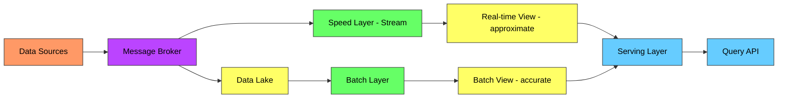
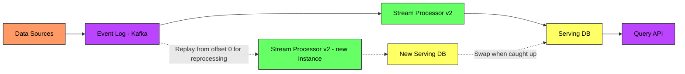

# Batch vs Stream Processing - Complete Deep Dive

> **Prerequisites:** [Message Queues](/concepts/message-queues/), [Scalability](/concepts/scalability/)
> **Used in:** [News Aggregator](/hld/news-aggregator/), [Leaderboard](/hld/leaderboard/), [Netflix](/hld/netflix/), [Stock Broker](/hld/stock-broker/)

---

## What is Batch vs Stream Processing?

**Batch processing** collects data over a period, then processes it all at once (like doing laundry — you wait until the basket is full, then wash everything together).

**Stream processing** handles data in real-time as it arrives (like washing dishes as you use them — each plate is cleaned immediately).

**Real-world analogy:** Payroll is batch — salaries are computed once a month for all employees. Fraud detection is stream — every transaction must be checked the instant it happens, not 24 hours later.

---

## How They Work

```mermaid
flowchart TD
    subgraph Batch["Batch Processing"]
        A[Data Sources] --> B["Data Lake or S3"]
        B --> C["Batch Job runs every hour or day"]
        C --> D["Process ALL data in window"]
        D --> E["Write results to warehouse"]
    end

    subgraph Stream["Stream Processing"]
        F[Data Sources] --> G["Event Stream - Kafka"]
        G --> H["Stream Processor"]
        H --> I["Process EACH event immediately"]
        I --> J["Update real-time view"]
    end

    classDef client fill:#f96,stroke:#333,color:#000
    classDef service fill:#6f6,stroke:#333,color:#000
    classDef data fill:#ff6,stroke:#333,color:#000
    classDef async fill:#b4f,stroke:#333,color:#000

    class A,F client
    class B,G data
    class C,H service
    class D,I async
    class E,J data
```

---

## Comparison Table

| Aspect | Batch Processing | Stream Processing |
|--------|-----------------|-------------------|
| **Latency** | Minutes to hours | Milliseconds to seconds |
| **Data scope** | Bounded (fixed dataset) | Unbounded (infinite stream) |
| **Throughput** | Very high (optimized for bulk) | High (but per-event overhead) |
| **Complexity** | Lower (simpler failure handling) | Higher (ordering, exactly-once) |
| **Accuracy** | Complete (sees all data) | May need late-data handling |
| **Resource usage** | Spiky (burst during job) | Steady (continuous) |
| **Reprocessing** | Easy (re-run the job) | Hard (need to replay stream) |
| **State** | Stateless (read all, compute, write) | Stateful (maintain running state) |
| **Use case** | Analytics, reports, ML training | Alerts, fraud, real-time dashboards |

---

## Batch Processing Technologies

| Technology | Strength | Scale | Use Case |
|-----------|----------|-------|----------|
| **Apache Spark** | In-memory compute, SQL support | PB-scale | ETL, ML training, analytics |
| **Hadoop MapReduce** | Reliable, disk-based | PB-scale | Legacy batch, large datasets |
| **AWS Glue** | Serverless Spark | TB-scale | Managed ETL on AWS |
| **dbt** | SQL-based transforms | Depends on warehouse | Analytics engineering |
| **Presto/Trino** | Interactive queries on data lake | TB-scale | Ad-hoc analytics |

---

## Stream Processing Technologies

| Technology | Strength | Latency | Use Case |
|-----------|----------|---------|----------|
| **Apache Flink** | True streaming, exactly-once | ms | Complex event processing, stateful streaming |
| **Kafka Streams** | Lightweight, embedded in app | ms | Microservice-level stream processing |
| **Apache Spark Structured Streaming** | Unified batch + stream API | seconds | Near-real-time analytics |
| **AWS Kinesis Data Analytics** | Serverless Flink | seconds | Managed stream processing |
| **Apache Storm** | Low-latency (legacy) | ms | Simple event routing |

---

## Lambda Architecture

Lambda architecture runs BOTH batch and stream in parallel to get the best of both worlds:

**How it works:**
1. All data flows into both the speed layer (stream) and the data lake
2. **Speed layer** provides real-time approximate results (last few hours)
3. **Batch layer** periodically recomputes accurate results (last 24h+)
4. **Serving layer** merges both views — recent data from stream, historical from batch

**Problem:** You maintain TWO codepaths (batch + stream) for the same logic. Bugs in one but not the other cause inconsistencies.

---

## Kappa Architecture

Kappa architecture simplifies by using ONLY the stream layer, with the ability to reprocess by replaying the stream:

**How it works:**
1. All data flows through a single event log (Kafka with long retention)
2. Stream processor handles real-time processing
3. For reprocessing: deploy a new processor version, replay from the beginning of the log
4. When the new version catches up, swap it in as the primary

**Advantage:** Single codebase for all processing. No batch/stream code divergence.
**Limitation:** Requires retaining the full event log (or at least the history you need to reprocess).

---

## Lambda vs Kappa

| Aspect | Lambda Architecture | Kappa Architecture |
|--------|--------------------|--------------------|
| **Codebases** | Two (batch + stream) | One (stream only) |
| **Reprocessing** | Re-run batch job | Replay stream from offset 0 |
| **Accuracy** | Batch corrects stream approximations | Single source of truth |
| **Complexity** | Higher (maintain both paths) | Lower (one path) |
| **Storage** | Data lake + stream | Event log (long retention) |
| **Best for** | Very large historical datasets | Event-sourced systems |

---

## Windowing in Stream Processing

Streams are unbounded — you need windows to create finite chunks for aggregation:

| Window Type | Description | Use Case |
|-------------|-------------|----------|
| **Tumbling** | Fixed-size, non-overlapping (every 5 min) | Hourly click counts |
| **Sliding** | Fixed-size, overlapping (5 min window, slides every 1 min) | Moving average |
| **Session** | Dynamic, grouped by activity gaps | User session analytics |
| **Global** | Single window for all data | Running total |

---

## Exactly-Once Semantics in Streaming

| Guarantee | Meaning | Complexity |
|-----------|---------|------------|
| **At-most-once** | May lose events | Lowest |
| **At-least-once** | No loss, may duplicate | Medium |
| **Exactly-once** | No loss, no duplicates | Highest |

Flink achieves exactly-once via distributed snapshots (Chandy-Lamport algorithm). Kafka Streams uses idempotent producers + transactional writes.

---

## When to Use Which

✅ **Use Batch when:**
- Latency of hours is acceptable (daily reports, ML model training)
- Processing requires the complete dataset (training a recommendation model)
- Simple retry/reprocessing is important
- Cost efficiency matters (spot instances, off-peak processing)

✅ **Use Stream when:**
- Real-time results needed (fraud detection, live dashboards)
- Events must trigger immediate actions (alerts, notifications)
- Data arrives continuously and must be acted on immediately
- Low latency is a core requirement

✅ **Use Lambda when:**
- You need BOTH real-time AND accurate historical views
- Stream processing alone can't handle late-arriving data
- The batch layer serves as a correction mechanism

✅ **Use Kappa when:**
- The event log can be retained long enough for reprocessing
- You want a single processing paradigm
- Event sourcing is your data model

---

## Common Interview Questions

**Q1: When would you choose Flink over Kafka Streams?**
> Kafka Streams is a library embedded in your application — great for simple transformations, filtering, and lightweight aggregations within a microservice. Flink is a distributed processing cluster — better for complex event processing, large state management (TB-scale), multi-source joins, and when you need exactly-once guarantees across multiple sinks. If the processing fits in a single microservice, Kafka Streams. If it's a dedicated data pipeline with complex logic, Flink.

**Q2: How do you handle late-arriving data in stream processing?**
> Use event-time processing (not processing-time). Each event carries a timestamp from when it was generated. Define a watermark — a threshold that says "I don't expect events older than X." Late events (beyond the watermark) are either dropped, sent to a side output for manual reconciliation, or trigger an update to the already-emitted result. Flink and Spark Structured Streaming both support watermarking natively.

**Q3: Why not just use stream processing for everything?**
> Stream processing is more complex (state management, ordering, exactly-once), more expensive to operate (always running), and harder to debug. For use cases where latency of hours is fine (daily reports, ML model training), batch is simpler, cheaper, and easier to reason about. You also can't efficiently join a stream with a 5TB historical dataset — that's batch territory.

**Q4: How would you build a real-time leaderboard?**
> Events (game scores) flow into Kafka. A stream processor (Kafka Streams or Flink) maintains a stateful sorted set of top scores, updated in real-time as events arrive. The sorted set is materialized to Redis (Sorted Set with ZADD). The leaderboard API reads directly from Redis (ZREVRANGE for top N). For global leaderboards with millions of users, partition by score ranges and merge at query time.

---

## Navigation

← [Message Queues](/concepts/message-queues/) | [Object Storage](/concepts/object-storage/) →

[All Concepts](/concepts/) | [HLD Designs](/hld/)
