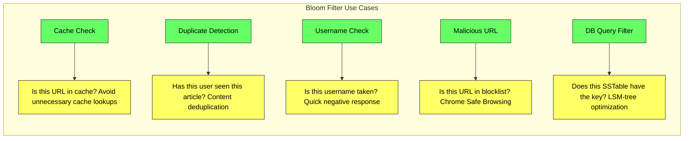

# Bloom Filters - Complete Deep Dive

> **Prerequisites:** [Caching](/concepts/caching/), [Database Indexing](/concepts/database-indexing/)
> **Used in:** [URL Shortener](/hld/URLShortner/), [News Aggregator](/hld/NewsAggregator/), [Key-Value Store](/hld/KeyValueStore/)

---

## What is a Bloom Filter?

A Bloom filter is a space-efficient probabilistic data structure that answers the question: "Is this element in the set?" It can tell you **definitely not in the set** or **probably in the set** — but never gives false negatives.

**Real-world analogy:** Imagine a bouncer at a nightclub with a guest list. The bouncer has a terrible memory but never forgets a face that was on the list. If the bouncer says "you're NOT on the list" — you're definitely not. But if the bouncer says "you look familiar, go ahead" — there's a small chance they confused you with someone else (false positive). The bouncer is fast and takes up very little space (no need to store the full list).

---

## How It Works

Think of it as a tiny array of light switches (bits). Initially all OFF (0).

**Setup:** You have a bit array of 10 slots and 3 hash functions.

```
Bit array: [0, 0, 0, 0, 0, 0, 0, 0, 0, 0]
             0  1  2  3  4  5  6  7  8  9
```

---

### Step 1: INSERT "cat"

Run "cat" through 3 hash functions:
- hash1("cat") = 1
- hash2("cat") = 4  
- hash3("cat") = 7

Set those positions to 1:

```
Bit array: [0, 1, 0, 0, 1, 0, 0, 1, 0, 0]
             0  1  2  3  4  5  6  7  8  9
                ↑        ↑        ↑
              cat      cat      cat
```

---

### Step 2: INSERT "dog"

Run "dog" through 3 hash functions:
- hash1("dog") = 2
- hash2("dog") = 4  ← same position as "cat"! That's fine, just stays 1
- hash3("dog") = 9

Set those positions to 1:

```
Bit array: [0, 1, 1, 0, 1, 0, 0, 1, 0, 1]
             0  1  2  3  4  5  6  7  8  9
                ↑  ↑     ↑        ↑     ↑
              cat dog  cat+dog   cat   dog
```

---

### Step 3: QUERY "cat" — is it in the set?

Hash "cat" → positions 1, 4, 7. Check each:
- Position 1 = 1 ✓
- Position 4 = 1 ✓
- Position 7 = 1 ✓

All bits are 1 → **"probably yes"** (and in this case, correct — we did insert "cat")

---

### Step 4: QUERY "bird" — is it in the set?

Hash "bird" → positions 1, 5, 9. Check each:
- Position 1 = 1 ✓
- Position 5 = 0 ✗ ← **STOP. Definitely NOT in the set.**

If even ONE bit is 0, the element was never inserted. Guaranteed.

---

### Step 5: QUERY "fox" — the false positive

Hash "fox" → positions 1, 2, 9. Check each:
- Position 1 = 1 ✓ (set by "cat")
- Position 2 = 1 ✓ (set by "dog")
- Position 9 = 1 ✓ (set by "dog")

All bits are 1 → **"probably yes"** — but we NEVER inserted "fox"! This is a **false positive.** The bits were coincidentally set by other elements.

---

### Why this happens

The bit array is shared. Different elements can set the same bits. When all of an element's hash positions happen to be set by OTHER elements, the filter incorrectly says "probably yes." This is the unavoidable tradeoff for extreme space efficiency.

**The fix:** make the bit array bigger (more bits = fewer collisions = fewer false positives). With the right sizing (~10 bits per element), false positive rate drops below 1%.

---

### The two guarantees

| Filter says | Meaning | Can it be wrong? |
|---|---|---|
| "Definitely NOT in set" | At least one bit was 0 | **Never wrong** — if we'd inserted it, all bits would be 1 |
| "Probably in set" | All bits are 1 | **Sometimes wrong** — other elements may have set those bits |

This asymmetry is what makes it useful: you trust the "no" answer absolutely, and tolerate occasional false "yes" answers.

---

## False Positive Rate

The probability of a false positive depends on three factors:

| Parameter | Symbol | Effect on False Positive Rate |
|-----------|--------|-------------------------------|
| Bit array size | m | Larger m → fewer collisions → lower FP rate |
| Number of hash functions | k | Optimal k minimizes FP (too few or too many is bad) |
| Number of inserted elements | n | More elements → more bits set → higher FP rate |

**Formula:** `P(false positive) ≈ (1 - e^(-kn/m))^k`

**Practical sizing:**

| Elements (n) | Target FP Rate | Bits needed (m) | Hash functions (k) | Memory |
|-------------|----------------|-----------------|-------------------|--------|
| 1 million | 1% | 9.6M bits | 7 | ~1.2 MB |
| 1 million | 0.1% | 14.4M bits | 10 | ~1.8 MB |
| 100 million | 1% | 960M bits | 7 | ~120 MB |
| 1 billion | 1% | 9.6B bits | 7 | ~1.2 GB |

Compare this to storing 1 billion URLs (avg 50 bytes each) = 50 GB. A Bloom filter uses 40x less memory.

---

## Key Properties

| Property | Value |
|----------|-------|
| **False negatives** | NEVER (if filter says "not present," it's guaranteed) |
| **False positives** | Possible (configurable rate, typically 1%) |
| **Deletion** | NOT supported (unsetting bits could affect other elements) |
| **Space** | O(m) bits — far less than storing actual elements |
| **Insert time** | O(k) hash computations |
| **Query time** | O(k) hash computations |

---

## Real-World Use Cases



| Use Case | Company | How |
|----------|---------|-----|
| **Avoid disk reads (LSM-tree)** | Cassandra, LevelDB, RocksDB | Check if an SSTable might contain the key before reading from disk |
| **Duplicate content detection** | Medium, Twitter | Check if a user has already seen a post/article |
| **Malicious URL detection** | Google Chrome Safe Browsing | Check URL against local Bloom filter before querying server |
| **Cache miss optimization** | Akamai CDN | Avoid caching one-hit-wonders; only cache items requested 2+ times |
| **Username/email uniqueness** | Registration flows | Quick "definitely available" response without hitting DB |
| **Weak password detection** | HaveIBeenPwned | Check if password hash exists in known breach sets |

---

## Variants

| Variant | Supports Deletion? | Extra Feature |
|---------|-------------------|---------------|
| **Standard Bloom Filter** | No | Simplest, most common |
| **Counting Bloom Filter** | Yes | Uses counters instead of bits (4 bits per slot) |
| **Cuckoo Filter** | Yes | Better space efficiency for FP < 3% |
| **Quotient Filter** | Yes | Cache-friendly, supports merging |
| **Scalable Bloom Filter** | No | Grows dynamically as elements are added |

---

## Bloom Filter vs Alternatives

| Approach | Memory | False Positives | False Negatives | Deletion |
|----------|--------|----------------|-----------------|----------|
| **Bloom Filter** | Very low | Yes (tunable) | Never | No |
| **HashSet** | High (stores elements) | Never | Never | Yes |
| **Cuckoo Filter** | Low | Yes (tunable) | Never | Yes |
| **HyperLogLog** | Very low | N/A (counts only) | N/A | No |
| **Sorted Set + Binary Search** | High | Never | Never | Yes |

---

## When to Use

✅ **Use when:**
- Space efficiency matters more than absolute accuracy
- False positives are acceptable but false negatives are not
- You need to quickly check membership in a very large set
- You want to avoid expensive operations (disk reads, network calls) for elements definitely not in a set
- The set is write-once or rarely updated

❌ **Don't use when:**
- You need to delete elements (use Cuckoo Filter instead)
- False positives are unacceptable (use exact set membership)
- The set is small enough to fit in a HashSet
- You need to retrieve the actual stored elements (Bloom filters only answer yes/no)
- You need exact count of elements (use HyperLogLog)

---

## Common Interview Questions

**Q1: Why can't Bloom filters have false negatives?**
> Because insertion only sets bits from 0 to 1, never from 1 to 0. If an element was inserted, all its hash positions are guaranteed to be 1. If any hash position is 0, the element was definitely never inserted. There's no mechanism by which an inserted element's bits could become unset.

**Q2: Why can't you delete from a standard Bloom filter?**
> Multiple elements can hash to the same bit position. If you clear a bit for element A, you might be clearing a bit that element B also needs. This would create a false negative for B, violating the core guarantee. Counting Bloom Filters solve this by using counters instead of single bits — you decrement on delete rather than clearing.

**Q3: How would you use a Bloom filter in a URL shortener?**
> Before generating a new short URL, check the Bloom filter: "Does this short code already exist?" If the filter says NO, the code is definitely available — write it directly. If the filter says MAYBE, query the database to confirm. This eliminates database lookups for ~99% of URL generation requests (assuming 1% FP rate), massively reducing DB load.

**Q4: How does Google Chrome use Bloom filters for Safe Browsing?**
> Chrome downloads a Bloom filter containing hashes of known malicious URLs (updated every 30 minutes). When you visit a URL, Chrome checks it against the local Bloom filter. If the filter says "not present" — no network call needed (safe). If it says "maybe present" — Chrome sends a hash prefix to Google's server for confirmation. This keeps browsing fast while protecting against 99%+ of malicious URLs without sending every URL you visit to Google.

---

## Navigation

← [Consistent Hashing](/concepts/consistent-hashing/) | [Write-Ahead Log](/concepts/write-ahead-log/) →

[All Concepts](/concepts/) | [HLD Designs](/hld/)
