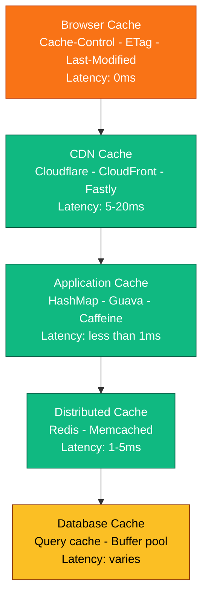

# Caching - Complete Deep Dive

> **Prerequisites:** [Database Indexing](/concepts#database-indexing), [Scalability](/concepts#scalability)
> **Used in:** Every single system design (literally all 20 designs on this site use caching)

---

## What is Caching?

Caching is storing frequently accessed data in a faster storage layer so you don't hit the slower layer (database) every time.

**Real-world analogy:** You keep your most-used books on your desk (cache) instead of walking to the library (database) every time. The desk is small (limited space) but instant access. The library is huge but slow.

```
Without cache:
  Client → Server → Database (50ms)
  Client → Server → Database (50ms)
  Client → Server → Database (50ms)
  = 150ms total for 3 requests

With cache:
  Client → Server → Database (50ms) → store in cache
  Client → Server → Cache (1ms) ← HIT
  Client → Server → Cache (1ms) ← HIT
  = 52ms total for 3 requests (3x faster)
```

---

## Where Caches Live (Cache Layers)



**In HLD interviews, you'll mostly discuss Layer 4 (Redis/Memcached).**

---

## Caching Strategies

### 1. Cache-Aside (Lazy Loading) — Most Common

The application manages the cache explicitly. Cache is a separate system.

```
READ:
  1. Check cache → hit? Return data
  2. Miss? → Query database
  3. Store result in cache (with TTL)
  4. Return data

WRITE:
  1. Write to database
  2. Invalidate (delete) the cache key
  (Next read will miss, fetch fresh data, re-cache)
```

```java
// Pseudocode
public User getUser(String userId) {
    // 1. Check cache
    User cached = redis.get("user:" + userId);
    if (cached != null) return cached;  // HIT

    // 2. Cache miss → query DB
    User user = database.query("SELECT * FROM users WHERE id = ?", userId);

    // 3. Store in cache with 5 min TTL
    redis.set("user:" + userId, user, Duration.ofMinutes(5));

    return user;
}
```

**Pros:** Only caches data that's actually requested. Simple.
**Cons:** First request is always slow (miss). Cache can become stale if DB is updated by another service.

**When to use:** Read-heavy workloads. Most common choice in interviews.

---

### 2. Write-Through

Every write goes to BOTH cache and database synchronously.

```
WRITE:
  1. Write to cache
  2. Cache writes to database (synchronously)
  3. Return success

READ:
  1. Always read from cache (it's always up-to-date)
```

**Pros:** Cache is never stale. Reads are always fast.
**Cons:** Write latency increases (two writes). Cache stores data that might never be read.

**When to use:** When you can't tolerate stale reads (financial data, user sessions).

---

### 3. Write-Behind (Write-Back)

Write to cache immediately, flush to database asynchronously in batches.

```
WRITE:
  1. Write to cache → return success immediately
  2. Background worker batches writes to database every N seconds

READ:
  1. Always read from cache
```

**Pros:** Write latency is minimal (just cache write). Great for high-throughput writes.
**Cons:** Data loss risk if cache crashes before flushing to DB. Complex.

**When to use:** High write throughput where slight data loss is acceptable (view counts, analytics events, session data).

---

### 4. Read-Through

Cache itself fetches from database on miss (application doesn't manage this).

```
READ:
  1. Application calls cache.get(key)
  2. Cache checks → miss → cache itself queries DB
  3. Cache stores result and returns to application

(Application never talks to DB directly for reads)
```

**When to use:** When using a caching library that supports it (e.g., Caffeine with a loader function).

---

## Comparison Table

| Strategy | Read Latency | Write Latency | Data Freshness | Complexity |
|---|---|---|---|---|
| Cache-Aside | Miss: slow, Hit: fast | Normal (DB only) | May be stale (TTL-bound) | Low |
| Write-Through | Always fast | Slow (2 writes) | Always fresh | Medium |
| Write-Behind | Always fast | Very fast (cache only) | Fresh in cache, DB lags | High |
| Read-Through | Miss: slow, Hit: fast | Normal | TTL-bound | Low |

---

## Cache Eviction Policies

When cache is full, which item do you remove?

| Policy | How | Best For |
|---|---|---|
| **LRU** (Least Recently Used) | Remove item accessed longest ago | General purpose (most common) |
| **LFU** (Least Frequently Used) | Remove item with lowest access count | Hot content stays (trending feeds) |
| **FIFO** (First In First Out) | Remove oldest item | Simple, time-based data |
| **TTL** (Time To Live) | Remove after fixed time, regardless of usage | All caching (set TTL on every key) |
| **Random** | Remove a random item | When access patterns are uniform |

**In interviews, say LRU + TTL.** LRU handles space limits. TTL handles staleness.

---

## Cache Invalidation (The Hard Part)

> "There are only two hard things in Computer Science: cache invalidation and naming things." — Phil Karlton

### The Problem

Database is updated, but cache still has old data. User sees stale information.

### Solutions

**1. TTL (Time-to-Live) — simplest**
```
Set TTL = 5 minutes on every cache entry.
After 5 min, entry auto-deletes.
Next read fetches fresh data from DB.
```
Trade-off: data can be up to 5 min stale.

**2. Explicit Invalidation**
```
On write/update: delete the cache key immediately.
Next read will miss → fetch fresh data → re-cache.
```
```java
public void updateUser(User user) {
    database.update(user);
    redis.delete("user:" + user.getId());  // Invalidate
}
```

**3. Event-based Invalidation (CDC)**
```
Database change → publish event → cache subscriber deletes/updates key
```
Best for: when multiple services write to the same DB and any of them might invalidate the cache.

---

## Cache Stampede (Thundering Herd)

### The Problem

Popular cache key expires → 1000 concurrent requests all miss at the same time → all 1000 hit the database simultaneously → DB crashes.

```
TTL expires for "popular_product_123"
Thread 1: cache miss → query DB
Thread 2: cache miss → query DB
Thread 3: cache miss → query DB
...
Thread 1000: cache miss → query DB ← DB is overwhelmed
```

### Solutions

**1. Lock/Mutex:** First thread to miss acquires a lock. Others wait. First thread refreshes cache. Others read from refreshed cache.

**2. Early Recompute:** Refresh the cache BEFORE it expires (background job refreshes at 80% of TTL).

**3. Stale-While-Revalidate:** Serve stale data immediately, refresh in background.

```java
// Lock-based solution
public Product getProduct(String id) {
    Product cached = redis.get("product:" + id);
    if (cached != null) return cached;

    // Try to acquire lock
    boolean gotLock = redis.set("lock:product:" + id, "1", "NX", "EX", 5);
    if (gotLock) {
        // I won the lock — fetch from DB and cache
        Product product = database.get(id);
        redis.set("product:" + id, product, Duration.ofMinutes(5));
        redis.delete("lock:product:" + id);
        return product;
    } else {
        // Someone else is fetching — wait and retry
        Thread.sleep(100);
        return getProduct(id);  // Retry — should hit cache now
    }
}
```

---

## Redis vs Memcached

| | Redis | Memcached |
|---|---|---|
| Data structures | Strings, Lists, Sets, Sorted Sets, Hashes, Streams | Strings only |
| Persistence | Optional (RDB snapshots, AOF) | None (pure cache) |
| Replication | Primary-replica | No built-in |
| Pub/Sub | Yes | No |
| Lua scripting | Yes | No |
| Max value size | 512MB | 1MB |
| Multi-threaded | Single-threaded (6.0+ has I/O threads) | Multi-threaded |
| Use case | Cache + data structure server + pub/sub + queues | Pure high-throughput cache |

**In interviews, always say Redis.** It does everything Memcached does plus more. Only pick Memcached if asked "what if you need pure simple caching with maximum throughput and don't need data structures?"

---

## Common Interview Questions

**Q: "Where would you add caching in this design?"**
A: Between the API server and the database. Cache the most frequently read data with TTL. Use cache-aside pattern.

**Q: "What happens if the cache goes down?"**
A: All requests fall through to the database. The system is slower but still works. Design for graceful degradation — don't make the cache a single point of failure.

**Q: "How do you keep cache consistent with the database?"**
A: Use cache-aside with TTL (5-15 min). On writes, invalidate the cache key explicitly. For stronger consistency, use write-through.

**Q: "How do you handle hot keys?"**
A: A single cached item getting millions of requests (celebrity profile, viral post). Solution: local in-memory cache on each server (Layer 3) with very short TTL (10s). Reduces Redis load.

**Q: "What's the cache hit ratio you'd target?"**
A: 90-99% for read-heavy workloads. If below 80%, your TTL might be too short or your access patterns are too random for caching to help.

---

## When NOT to Cache

- Write-heavy workloads (cache invalidates faster than it's read)
- Random access patterns (every request is unique — cache never helps)
- Data that must be perfectly fresh (use DB directly with read replicas)
- Large objects rarely accessed (wastes memory)

---

[← Back to Fundamentals](/concepts) | [Next: Rate Limiting →](/concepts/rate-limiting/)
