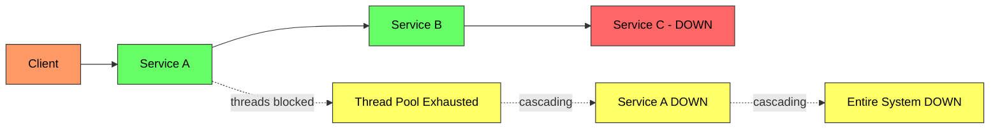
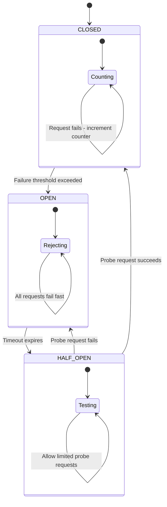
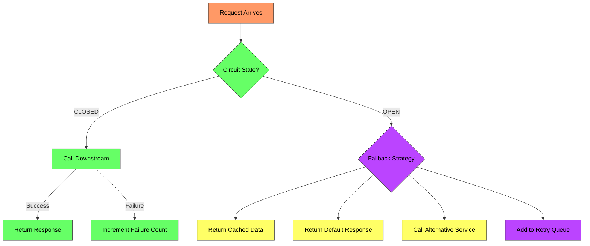

# Circuit Breaker Pattern - Complete Deep Dive

> **Prerequisites:** [Rate Limiting](/concepts/rate-limiting/), [Load Balancing](/concepts/load-balancing/)
> **Used in:** [Uber](/hld/uber/), [Zomato](/hld/zomato/), [Netflix](/hld/netflix/), [Notification System](/hld/notification-system/)

---

## What is a Circuit Breaker?

A circuit breaker is a stability pattern that prevents a service from repeatedly calling a downstream dependency that is failing, giving the failing service time to recover instead of overwhelming it with requests.

**Real-world analogy:** Think of an electrical circuit breaker in your home. When there's a power surge (too many failures), the breaker trips (opens) and cuts off current (stops requests). You have to manually reset it (or wait for a timeout) before power flows again. This protects your house wiring (your service) from catching fire (cascading failure).

---

## Why Do We Need It?

Without a circuit breaker, when a downstream service is down:

1. Every request waits for a timeout (e.g., 30s)
2. Thread pool fills up with waiting threads
3. Your service becomes unresponsive
4. Upstream callers start timing out
5. **Cascading failure** takes down the entire system

---

## How It Works — The Three States

The circuit breaker has three states that control whether requests pass through or get blocked:

| State | Behavior | Transitions To |
|-------|----------|----------------|
| **CLOSED** | All requests pass through. Failures are counted. | → OPEN (when failure count exceeds threshold) |
| **OPEN** | All requests fail immediately (no network call). Returns fallback. | → HALF-OPEN (after timeout period) |
| **HALF-OPEN** | Allows a limited number of probe requests through. | → CLOSED (if probe succeeds) or → OPEN (if probe fails) |

---

## Configuration Parameters

| Parameter | Description | Typical Value |
|-----------|-------------|---------------|
| **Failure Threshold** | Number of failures before opening | 5-10 failures |
| **Failure Rate (%)** | Percentage of failures in sliding window | 50-60% |
| **Sliding Window Size** | Number of calls to evaluate | 10-100 calls |
| **Wait Duration (Open)** | Time to wait before transitioning to half-open | 30-60 seconds |
| **Permitted Calls (Half-Open)** | Number of probe calls allowed | 3-5 calls |
| **Slow Call Threshold** | Calls exceeding this duration count as failures | 2-5 seconds |

---

## Fallback Strategies

When the circuit is OPEN, you need a fallback:

| Strategy | Use Case | Example |
|----------|----------|---------|
| **Cached response** | Data doesn't change frequently | Return last known user profile |
| **Default value** | Acceptable degradation | Show 0 recommendations instead of personalized |
| **Alternative service** | Redundant dependencies | Switch from primary to secondary payment provider |
| **Queue for later** | Non-critical operations | Buffer notifications for retry |
| **Graceful error** | No reasonable fallback | "Service temporarily unavailable, try again later" |

---

## Comparison: Circuit Breaker vs Retry vs Timeout

| Aspect | Circuit Breaker | Retry | Timeout |
|--------|----------------|-------|---------|
| **Purpose** | Stop calling a failing service | Recover from transient failures | Limit wait time per call |
| **When** | After repeated failures | On individual failure | On every call |
| **Scope** | Aggregate (many calls) | Single call | Single call |
| **Effect** | Fail fast, no network call | Repeat the same call | Cancel if too slow |
| **Best for** | Sustained outages | Blips, network glitches | Slow dependencies |

They work together: **Timeout** on each call → **Retry** for transient failures → **Circuit Breaker** if retries keep failing.

---

## Libraries and Implementations

| Library | Language | Notes |
|---------|----------|-------|
| **Resilience4j** | Java | Modern, lightweight, functional API |
| **Hystrix** (deprecated) | Java | Netflix, replaced by Resilience4j |
| **Polly** | .NET | Full resilience toolkit |
| **pybreaker** | Python | Simple circuit breaker |
| **opossum** | Node.js | Promise-based circuit breaker |

---

## When to Use

✅ **Use when:**
- Calling remote services over the network
- Downstream service has known reliability issues
- You can provide a meaningful fallback
- Thread pool exhaustion is a risk
- You need to protect against cascading failures

❌ **Don't use when:**
- Calling local in-memory operations
- The failure is in your own service logic (use proper error handling)
- There's no reasonable fallback (the request must succeed or fail honestly)
- The downstream is a database you own (use connection pooling instead)

---

## Common Interview Questions

**Q1: How is a circuit breaker different from a retry?**
> A retry repeats a single failed request hoping it succeeds on the next attempt — it's optimistic about transient failures. A circuit breaker monitors aggregate failure rates across many requests and stops all calls to a failing service — it's pessimistic and protects the system from sustained outages. They complement each other: retry handles blips, circuit breaker handles prolonged failures.

**Q2: What happens to in-flight requests when the circuit opens?**
> In-flight requests that are already waiting for a response continue to wait until their individual timeout. Only NEW requests are immediately rejected. The circuit breaker doesn't cancel existing connections — it prevents new ones from being established.

**Q3: How do you set the failure threshold in production?**
> Start with a sliding window approach: track the last N requests (e.g., 100) and open if failure rate exceeds 50%. Use slow-call duration thresholds alongside error counts. Monitor actual service behavior in production for 1-2 weeks before tuning. Prefer percentage-based thresholds over absolute counts to handle varying traffic volumes.

**Q4: How does the circuit breaker pattern work in a microservices mesh?**
> Each service-to-service edge gets its own circuit breaker instance. In a service mesh (Istio, Envoy), circuit breaking is configured at the sidecar proxy level — no application code changes needed. Envoy tracks outlier detection per upstream host and ejects unhealthy hosts from the load balancing pool, effectively implementing per-host circuit breaking.

**Q5: Can a half-open state cause a thundering herd?**
> Yes, if many threads are waiting for the circuit to transition from OPEN to HALF-OPEN and all rush in simultaneously. To prevent this, limit the number of probe requests in half-open state (e.g., only 3 requests allowed). Use a semaphore or token bucket to control how many probes execute concurrently.

---

## Navigation

← [Rate Limiting](/concepts/rate-limiting/) | [Saga Pattern](/concepts/saga-pattern/) →

[All Concepts](/concepts/) | [HLD Designs](/hld/)
