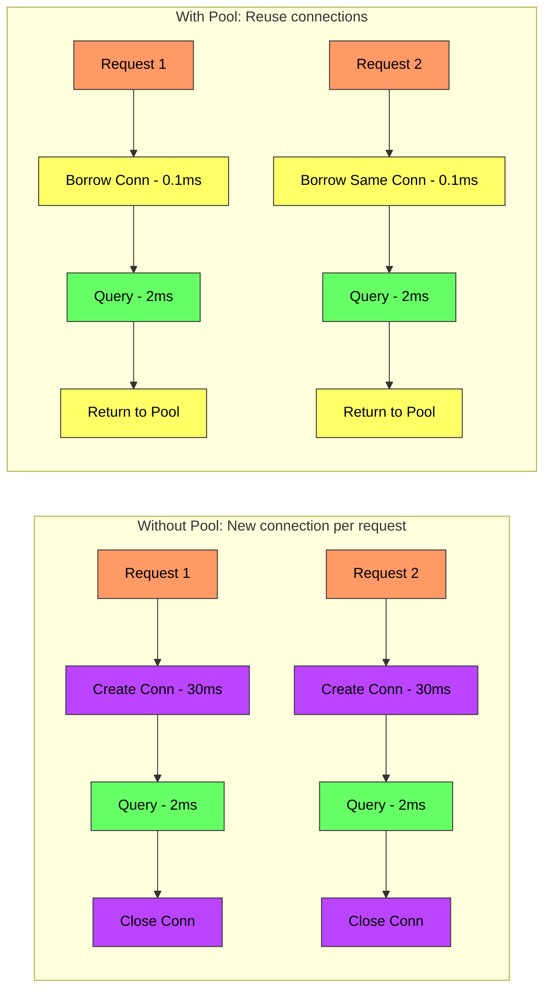
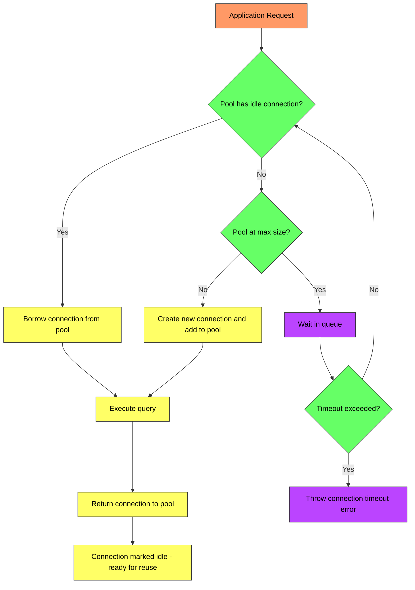
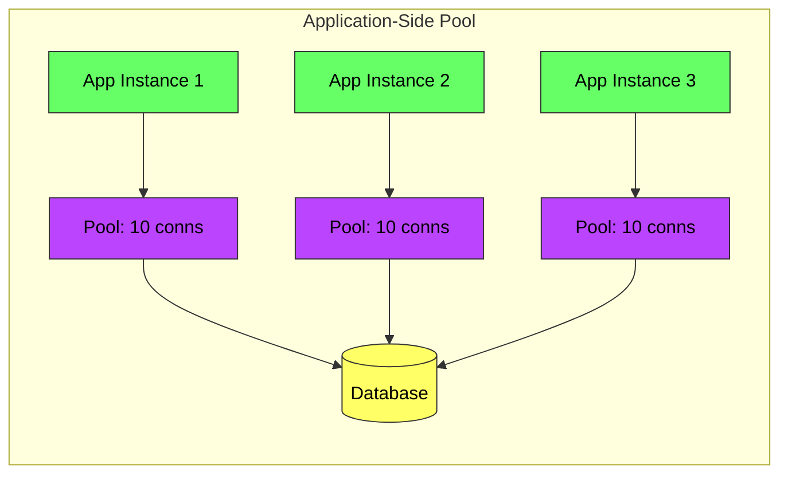

# Connection Pooling - Complete Deep Dive

> **Prerequisites:** [Scalability](/concepts/scalability/), [Database Indexing](/concepts/database-indexing/)
> **Used in:** [Digital Wallet](/hld/digital-wallet/), [Uber](/hld/uber/), [Zomato](/hld/zomato/), Any system with a database

---

## What is Connection Pooling?

Connection pooling is a technique of maintaining a set of pre-established database connections that are reused across requests, instead of creating a new connection for every query and closing it when done.

**Real-world analogy:** Imagine a busy office building with a security gate. Without pooling, every employee goes through the full security check (ID, bag scan, badge print) every time they enter — even if they just stepped out for coffee. With pooling, employees keep their badge (connection) active all day. When they need to enter, they just tap the badge. The badges (connections) are limited in number, so if all are in use, new employees wait in line.

---

## Why Are Connections Expensive?

Creating a new database connection involves:

| Step | Action | Time |
|------|--------|------|
| 1 | DNS resolution | 1-5 ms |
| 2 | TCP handshake (SYN/ACK) | 1-3 ms |
| 3 | TLS handshake (if SSL) | 5-30 ms |
| 4 | Authentication (username/password) | 2-10 ms |
| 5 | Server allocates memory for session | 5-10 MB per connection |
| 6 | Connection ready | **Total: 10-50 ms** |

For a web request that needs a 2ms query, spending 30ms on connection setup is 15x overhead. At 1000 RPS, that's 1000 connections created and destroyed per second — massive waste.



---

## How Connection Pooling Works



**Pool lifecycle:**
1. **Initialization:** Pool creates `minIdle` connections at startup
2. **Borrow:** Application requests a connection → pool hands one out
3. **Use:** Application executes queries
4. **Return:** Application returns connection to pool (not closed)
5. **Validation:** Pool checks if returned connection is still alive
6. **Eviction:** Idle connections beyond `minIdle` are closed after `idleTimeout`

---

## Pool Sizing: The Formula

The optimal pool size is NOT "more is better." Too many connections actually hurt performance:

**Formula (from PostgreSQL wiki and HikariCP docs):**

```
Pool Size = (Number of CPU cores × 2) + Number of Disk Spindles
```

For SSD-backed databases, a good starting point:
```
Pool Size = CPU cores × 2 + 1
```

**Why small pools are better:**

| Pool Size | Behavior |
|-----------|----------|
| **Too small (5)** | Requests queue up, high latency under load |
| **Optimal (10-20)** | Max throughput, CPU and disk fully utilized |
| **Too large (200)** | Context switching overhead, lock contention, WORSE throughput |

A PostgreSQL server with 4 cores typically performs best with a pool of 9-10 connections, not 200.

---

## Pool Configuration Parameters

| Parameter | What it does | Recommended |
|-----------|-------------|-------------|
| **maxPoolSize** | Maximum connections in pool | 10-30 (depends on DB cores) |
| **minIdle** | Connections kept alive when idle | 5-10 |
| **connectionTimeout** | Max wait time for a connection | 3-10 seconds |
| **idleTimeout** | Close idle connections after this | 10-30 minutes |
| **maxLifetime** | Force close after this (prevent stale) | 30-60 minutes |
| **validationQuery** | Query to test if connection is alive | `SELECT 1` |
| **leakDetectionThreshold** | Log if connection not returned after | 30-60 seconds |

---

## Connection Pooling Technologies

| Technology | Type | Language/DB | Notes |
|-----------|------|-------------|-------|
| **HikariCP** | Application-side | Java | Fastest Java pool, default in Spring Boot |
| **PgBouncer** | Proxy-side | PostgreSQL | External proxy, handles 10K+ connections |
| **ProxySQL** | Proxy-side | MySQL | Connection multiplexing for MySQL |
| **c3p0** | Application-side | Java | Older, less performant than HikariCP |
| **pgpool-II** | Proxy-side | PostgreSQL | Pool + replication + load balancing |
| **RDS Proxy** | Managed proxy | AWS | Serverless-friendly, handles Lambda bursts |

---

## Application-Side vs Proxy-Side Pooling



| Aspect | Application-Side (HikariCP) | Proxy-Side (PgBouncer) |
|--------|---------------------------|----------------------|
| **Where** | Inside each app instance | Separate process between app and DB |
| **Total connections** | N instances × pool size | Shared pool, fewer DB connections |
| **Use case** | Fixed number of app instances | Many instances or serverless (Lambda) |
| **Problem** | 50 instances × 20 pool = 1000 DB connections | Multiplexes to fewer actual DB connections |
| **Complexity** | None (library config) | Extra infrastructure to manage |

---

## Connection Leaks

A connection leak occurs when application code borrows a connection but never returns it. The pool gradually runs out of available connections until all requests block.

**Common causes:**
- Exception thrown before `connection.close()` in finally block
- Missing try-with-resources
- Long-running transactions holding connections
- Forgetting to close in async code paths

**Detection and prevention:**
- Set `leakDetectionThreshold` (HikariCP logs a warning with stack trace)
- Monitor pool metrics: active vs idle connections
- Use try-with-resources (Java) or context managers (Python)
- Set a hard `maxLifetime` to force-close stale connections

---

## Connection Pooling with Serverless

Serverless (Lambda) creates a new problem: each Lambda invocation might open a new connection, and thousands of concurrent invocations can exhaust DB connection limits.

| Solution | How |
|----------|-----|
| **RDS Proxy** | Sits between Lambda and DB, multiplexes connections |
| **PgBouncer** | External pooler shared across all Lambda instances |
| **Connection reuse** | Initialize connection outside handler, reuse across warm invocations |
| **DynamoDB** | Avoid the problem entirely (HTTP-based, no persistent connections) |

---

## When to Use

✅ **Use connection pooling when:**
- Your application makes frequent short-lived database queries
- Multiple requests/threads need concurrent DB access
- You want to limit the number of connections to the database
- You need fast response times (can't afford connection setup per query)

❌ **Don't use when:**
- Single long-running batch job (one dedicated connection is fine)
- Using HTTP-based databases (DynamoDB, CockroachDB serverless)
- Cron jobs that run infrequently (connection overhead is negligible)
- Database access is through a managed ORM that handles pooling internally

---

## Common Interview Questions

**Q1: Why is a connection pool of 200 slower than a pool of 20?**
> The database server has limited CPU cores (say 8). With 200 concurrent connections all executing queries, the DB spends more time context-switching between connections than actually executing queries. Lock contention increases, CPU cache misses increase, and disk I/O becomes more random. A pool of 20 lets the DB focus on 20 queries with full CPU utilization, while other requests wait briefly in the pool queue — resulting in higher overall throughput and lower average latency.

**Q2: How do you handle connection pooling with 100 microservice instances?**
> If each of 100 instances has a pool of 20, that's 2000 connections to the database — most databases can't handle that efficiently. Solutions: (1) Use a connection proxy like PgBouncer that multiplexes 2000 app connections into 50-100 actual DB connections. (2) Reduce per-instance pool size to 5 (500 total). (3) Use RDS Proxy if on AWS. (4) Consider if all 100 instances actually need direct DB access — maybe a dedicated data service with fewer instances can serve them.

**Q3: What is connection multiplexing in PgBouncer?**
> PgBouncer accepts thousands of connections from application instances but maintains a much smaller pool of actual PostgreSQL connections. When an app connection executes a query, PgBouncer assigns it a real DB connection for the duration of the query (transaction mode) or statement (statement mode). After the query completes, the real connection is returned to the shared pool for another app to use. This lets 1000 app connections share 50 DB connections efficiently.

**Q4: How do you detect and fix a connection leak in production?**
> Symptoms: pool exhaustion errors (connection timeout), increasing "active" connections that never return to "idle," growing wait times. Detection: enable leak detection (HikariCP logs the stack trace of the code that borrowed the connection), monitor pool metrics (active vs total), set alerts when active connections approach maxPoolSize. Fix: find the code path that doesn't return the connection (usually a missing finally/close in an exception path), add try-with-resources, and deploy. Short-term mitigation: set maxLifetime to force-reclaim leaked connections.

---

## Navigation

← [Scalability](/concepts/scalability/) | [Database Indexing](/concepts/database-indexing/) →

[All Concepts](/concepts/) | [HLD Designs](/hld/)
