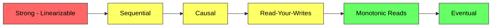
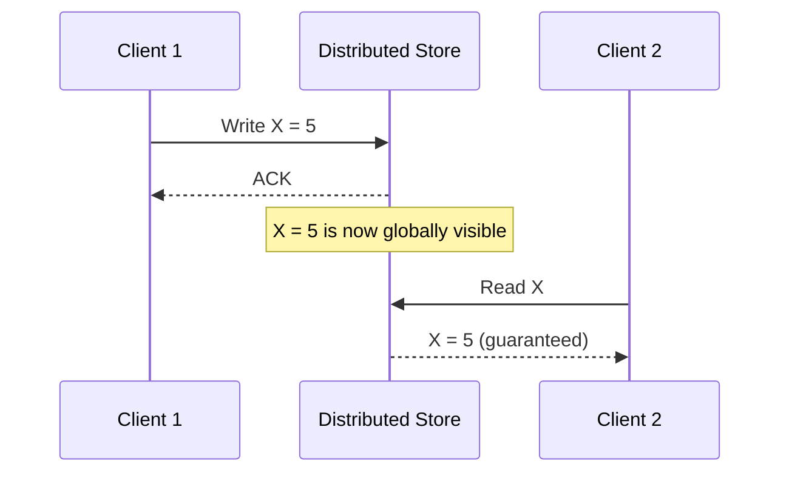
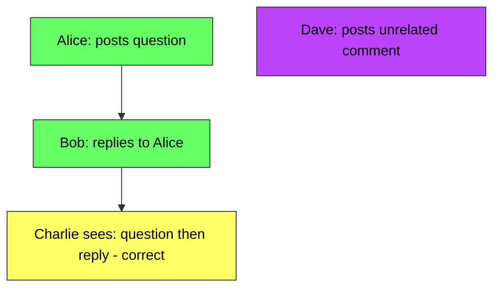
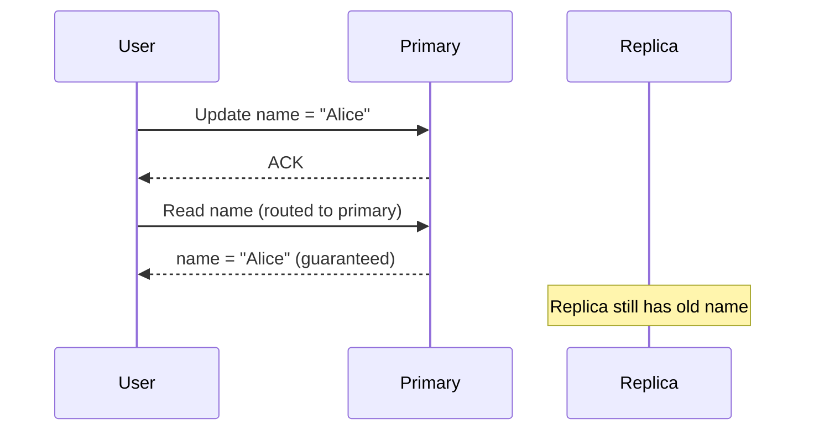

# Consistency Models - Complete Deep Dive

> **Prerequisites:** [CAP Theorem](/concepts/cap-theorem/), [Database Replication](/concepts/database-replication/)
> **Used in:** [Key-Value Store](/hld/KeyValueStore/), [Digital Wallet](/hld/DigitalWallet/), [Chat System](/hld/ChatSystem/)

---

## What is a Consistency Model?

A consistency model defines the contract between a distributed data store and its clients about what values a read can return after a write. It answers: "If I write X, when and where can I expect to read X back?"

**Real-world analogy:** Imagine updating your profile picture on social media. Strong consistency means everyone sees the new picture immediately — like changing a poster in a single room. Eventual consistency means some friends see the old picture for a while — like mailing printed photos to friends around the world; they arrive at different times, but eventually everyone has the new one.

---

## The Consistency Spectrum

| Direction | Stronger ← | → Weaker |
|-----------|------------|----------|
| **Guarantees** | More predictable | Fewer guarantees |
| **Latency** | Higher | Lower |
| **Availability** | Lower (CAP tradeoff) | Higher |
| **Throughput** | Lower | Higher |

---

## How Each Model Works

### Linearizability (Strongest)

Every operation appears to execute atomically at some point between its start and end. All clients see the same order of operations.

**Properties:**
- Once a write is acknowledged, ALL subsequent reads (from any client) see that write
- Operations have a real-time ordering — you can reason about "before" and "after"
- Equivalent to having a single copy of the data

**Real examples:** Google Spanner (TrueTime), ZooKeeper (linearizable reads with sync), CockroachDB

---

### Sequential Consistency

All clients see operations in the same order, but that order doesn't need to respect real-time — only program order within each client.

| Linearizable | Sequential |
|-------------|-----------|
| Real-time ordering matters | Only per-client ordering matters |
| If A completes before B starts, A is ordered first | A and B can be reordered if from different clients |
| Harder to implement | Slightly easier |

**Real example:** ZooKeeper default reads (not linearizable unless you call `sync()`)

---

### Causal Consistency

Operations that are causally related are seen in the same order by all nodes. Concurrent operations (no causal link) can be seen in different orders.

**Causal rules:**
- If A writes X, then reads X and writes Y — Y is causally after X
- If process reads A's write, then any subsequent write is causally after A's
- Concurrent writes (no causal link) can appear in any order

**Tracked via:** Vector clocks, Lamport timestamps, or explicit dependency tracking

**Real examples:** MongoDB (causal consistency sessions), COPS (research system)

---

### Read-Your-Writes

A client always sees its own writes. Other clients may see stale data.

**Implementation strategies:**
- Route reads to primary for recently-written keys
- Track per-user write timestamps; read from replicas only if caught up
- Sticky sessions — pin user to one replica

**Real examples:** DynamoDB (strongly consistent reads), Facebook TAO (read-after-write within same DC)

---

### Monotonic Reads

Once a client reads a value, it will never see an older value in subsequent reads. No "going back in time."

**Problem without it:**
1. User reads from Replica A → sees 10 comments
2. User refreshes, hits Replica B (lagging) → sees only 8 comments
3. User thinks comments disappeared

**Solution:** Pin user to a single replica for the duration of a session, or track read version and only serve from replicas at that version or newer.

---

### Eventual Consistency (Weakest)

If no new writes occur, eventually all replicas converge to the same value. No guarantee about when or in what order clients see updates.

| Guarantee | Eventual Consistency Provides |
|-----------|-------------------------------|
| **Convergence** | Yes — all replicas eventually agree |
| **Read freshness** | No guarantee |
| **Ordering** | No guarantee |
| **Duration** | Typically milliseconds to seconds |

**Real examples:** DNS propagation, Amazon S3 (historically, now strong), DynamoDB default reads, Cassandra (tunable)

---

## Comparison Table

| Model | Ordering Guarantee | Latency | Availability | Example System |
|-------|-------------------|---------|--------------|----------------|
| **Linearizable** | Global real-time order | High | Lower | Spanner, CockroachDB |
| **Sequential** | Same order for all clients | Medium-High | Medium | ZooKeeper |
| **Causal** | Respects cause-effect | Medium | High | MongoDB sessions |
| **Read-Your-Writes** | Own writes visible | Low-Medium | High | DynamoDB consistent read |
| **Monotonic Reads** | No backward time-travel | Low | High | Session pinning |
| **Eventual** | None (converges later) | Lowest | Highest | Cassandra, DynamoDB default |

---

## Real-World Systems and Their Models

| System | Default Consistency | Stronger Option |
|--------|-------------------|-----------------|
| **DynamoDB** | Eventual | Strongly consistent reads (per-request) |
| **Cassandra** | Tunable (quorum) | ALL reads + ALL writes = linearizable |
| **PostgreSQL (single node)** | Linearizable | N/A — it's already strong |
| **PostgreSQL (replicas)** | Eventual on replicas | Synchronous replication |
| **MongoDB** | Eventual | Causal consistency sessions, majority write concern |
| **Google Spanner** | Linearizable (default) | N/A — strong by design |
| **Redis** | Eventual (async replication) | WAIT command for sync replication |
| **CockroachDB** | Serializable | Linearizable with follower reads disabled |

---

## When to Use Each Model

| Use Case | Recommended Model | Why |
|----------|-------------------|-----|
| Bank transfers | Linearizable | Cannot have phantom money |
| Social media feed | Eventual | Slight staleness is acceptable |
| Chat messages | Causal | Messages must appear in causal order |
| Shopping cart | Read-your-writes | User must see their own additions |
| Analytics dashboard | Eventual | Historical data; freshness not critical |
| Distributed lock | Linearizable | Lock must be globally agreed upon |
| User profile updates | Read-your-writes | User expects immediate self-visibility |
| Inventory count | Linearizable | Over-selling is unacceptable |

---

## When to Use / When NOT to Use Strong Consistency

✅ **Use strong consistency when:**
- Financial transactions or inventory (correctness > performance)
- Distributed locks and leader election
- Configuration that must be globally agreed upon
- User-facing operations where staleness causes visible bugs

❌ **Don't require strong consistency when:**
- Eventual convergence is acceptable (likes, view counts)
- Latency is critical and staleness is tolerable (feeds, recommendations)
- High availability is more important than freshness (shopping cart)
- Cross-region deployments where synchronous replication adds 100ms+ latency

---

## Common Interview Questions

**Q1: What's the difference between linearizability and serializability?**
> Linearizability is about single-object, real-time ordering — every read sees the most recent write globally. Serializability is about multi-object transactions — the result is equivalent to some serial execution order. Strict serializability (Google Spanner) combines both: transactions appear serial AND respect real-time ordering.

**Q2: Can you have strong consistency and high availability?**
> No — the CAP theorem proves that during a network partition, you must choose between consistency (C) and availability (A). In practice, Spanner achieves "effectively CA" by using redundant network links and TrueTime to minimize partition probability, but under a true partition, it sacrifices availability to maintain consistency.

**Q3: How does DynamoDB let you choose consistency per request?**
> DynamoDB stores data across three nodes. For eventually consistent reads (default), it reads from one node — fast but might be stale. For strongly consistent reads, it reads from the primary node (write leader) for that partition, guaranteeing the latest value. The cost: strongly consistent reads consume double the read capacity units and cannot be served from global secondary indexes.

**Q4: How would you implement causal consistency in a chat application?**
> Use vector clocks or Lamport timestamps. Each message carries a causal dependency (the ID of the message it replies to or the sender's latest observed timestamp). When displaying messages, the client waits for dependencies to arrive before showing a reply. This ensures "reply after original" ordering without requiring global ordering of unrelated messages.

**Q5: What is tunable consistency and why does Cassandra use it?**
> Cassandra lets you choose W (write quorum) and R (read quorum) per query. If R+W > N (number of replicas), you get strong consistency for that operation. If R+W ≤ N, you get eventual. This lets different queries on the same data have different consistency levels — e.g., writes to a ledger use QUORUM, while reads for analytics use ONE.

---

## Navigation

[← Back to Fundamentals](/concepts)

[All Concepts](/concepts/) | [HLD Designs](/hld/)
