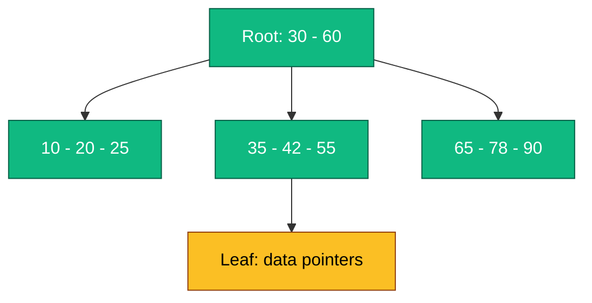
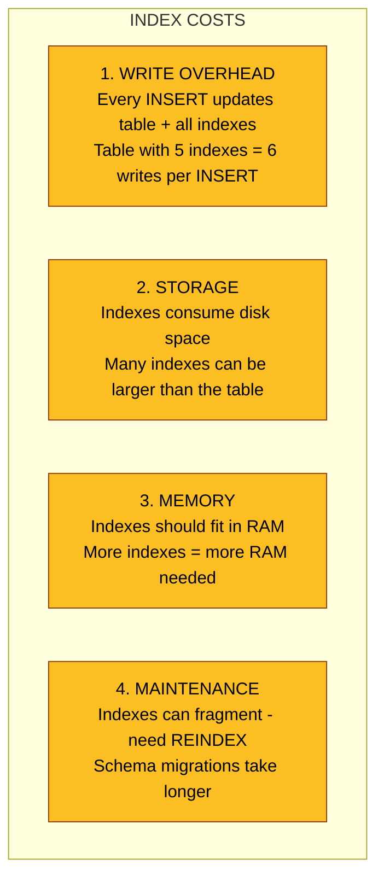

# Database Indexing - Complete Deep Dive

> **Prerequisites:** [Database Sharding](/concepts/database-sharding/), [CAP Theorem](/concepts/cap-theorem/)
> **Used in:** All system designs that use databases (every design on this site)

---

## What is an Index?

An index is a data structure that makes queries faster by avoiding full table scans. Instead of reading every row, the database uses the index to jump directly to matching rows.

**Real-world analogy:** A textbook index at the back of the book. Want to find "Binary Search"? Without an index, you'd flip through every page. With an index, you look up "Binary Search → page 142" and go directly there. The index is smaller than the book itself but lets you find things instantly.

```
Without index (full table scan):
  Table: 10 million rows
  Query: SELECT * FROM users WHERE email = 'bob@mail.com'
  Operation: Scan all 10M rows, check each → O(N) → SLOW (seconds)

With index on email:
  Index: sorted structure mapping email → row location
  Query: SELECT * FROM users WHERE email = 'bob@mail.com'
  Operation: Binary search in index → O(log N) → FAST (milliseconds)
```

---

## How B-Tree Index Works (Default in Postgres/MySQL)

The most common index type. A balanced tree structure where:
- Each node holds multiple keys (sorted)
- Leaf nodes point to actual table rows
- Tree stays balanced (all leaves at same depth)



```
Query: WHERE age = 42
  Root: 42 > 30, 42 < 60 → go middle child
  Internal: 42 > 35, 42 = 42 → found!
  Leaf: points to row → fetch row data

Depth = ~3-4 for millions of rows
Each lookup = 3-4 disk reads = milliseconds
```

**B-Tree supports:**
- Equality: `WHERE age = 25`
- Range: `WHERE age BETWEEN 20 AND 40`
- Prefix: `WHERE name LIKE 'Bob%'`
- Sorting: `ORDER BY age`

---

## Hash Index

Maps key → exact row location using a hash function. O(1) lookups.

```
Hash Index on 'email' column:

hash('bob@mail.com')   → bucket 7  → row_id 42
hash('alice@mail.com') → bucket 3  → row_id 18
hash('eve@mail.com')   → bucket 7  → row_id 99 (collision, chaining)

Query: WHERE email = 'bob@mail.com'
  hash('bob@mail.com') = bucket 7 → check entries → found row 42
  O(1) lookup!
```

**Hash index supports:**
- Equality only: `WHERE email = 'x'`

**Hash index does NOT support:**
- Range queries: `WHERE age > 25` (hashes destroy order)
- Sorting: `ORDER BY email`
- Prefix matching: `WHERE name LIKE 'Bob%'`

---

## Composite Index (Multi-Column)

Index on multiple columns. **Column order matters enormously.**

```sql
CREATE INDEX idx_user_country_age ON users (country, age);
```

```
Composite Index (country, age):
  Sorted by country FIRST, then age within each country:

  ('India', 20) → row 5
  ('India', 25) → row 12
  ('India', 30) → row 8
  ('USA', 18)   → row 3
  ('USA', 22)   → row 15
  ('USA', 35)   → row 7
```

### The Left-Prefix Rule

A composite index on `(A, B, C)` can be used for:

| Query | Uses Index? | Why |
|---|---|---|
| `WHERE A = x` | Yes | Left-most column |
| `WHERE A = x AND B = y` | Yes | Left prefix |
| `WHERE A = x AND B = y AND C = z` | Yes | Full index |
| `WHERE B = y` | **No** | Skipped A (left-most) |
| `WHERE C = z` | **No** | Skipped A and B |
| `WHERE A = x AND C = z` | Partial | Uses A only, scans for C |
| `WHERE B = y AND C = z` | **No** | Left-most not included |

**Rule of thumb:** Put the most selective (most unique) column first, equality conditions before range conditions.

```sql
-- GOOD: equality first, range last
CREATE INDEX idx ON orders (user_id, status, created_at);
-- Supports: WHERE user_id = 123 AND status = 'active' AND created_at > '2024-01-01'

-- BAD: range in the middle breaks subsequent columns
CREATE INDEX idx ON orders (user_id, created_at, status);
-- WHERE user_id = 123 AND created_at > '2024-01-01' AND status = 'active'
-- Only uses (user_id, created_at), can't use status efficiently
```

---

## Covering Index

An index that contains ALL columns needed by a query. The database can answer the query from the index alone without touching the table.

```sql
-- Query:
SELECT name, email FROM users WHERE age > 25;

-- Regular index on (age):
-- Step 1: Find matching rows in index → get row IDs
-- Step 2: Go to table, fetch 'name' and 'email' for each row (random I/O!)

-- Covering index on (age, name, email):
CREATE INDEX idx_covering ON users (age, name, email);
-- Step 1: Find matching rows in index
-- Step 2: name and email are already IN the index → return directly!
-- No table access needed → much faster (index-only scan)
```

**Trade-off:** Covering indexes are larger (store more data) and slower to update. Use for critical, frequently-run queries.

---

## Comparison Table

| Index Type | Lookup | Range | Sorting | Size | Best For |
|---|---|---|---|---|---|
| B-Tree | O(log N) | Yes | Yes | Medium | General purpose (default) |
| Hash | O(1) | No | No | Small | Exact match lookups |
| Composite | O(log N) | Yes (leftmost) | Yes | Larger | Multi-column queries |
| Covering | O(log N) | Yes | Yes | Large | Avoiding table lookups |
| GIN (inverted) | O(log N) | Depends | No | Large | Full-text search, arrays, JSON |
| GiST | O(log N) | Yes | Depends | Medium | Geospatial, range types |
| BRIN | O(1) | Yes | Yes | Tiny | Naturally ordered data (timestamps) |

---

## The Cost of Indexes (When NOT to Index)

Indexes are **not free.** Every index has costs:



### When NOT to Index

| Scenario | Why |
|---|---|
| Small tables (< 1000 rows) | Full scan is fast enough, index overhead not worth it |
| Write-heavy tables | Each write updates all indexes, slowing writes |
| Low-cardinality columns | Boolean, status (3 values) — index doesn't help much |
| Columns rarely queried | Index sits unused but costs storage/write perf |
| Frequently updated columns | Every update = index modification |
| Wide columns (TEXT, BLOB) | Index on large values is expensive |

---

## Index Selection Strategy for Interviews

```
Step 1: Identify hot queries (most frequent, slowest)
Step 2: For each query, identify WHERE and ORDER BY columns
Step 3: Create composite index following:
        - Equality columns first (left to right)
        - Range/sort column last
Step 4: Check if covering index is worth it (critical queries)
Step 5: Avoid over-indexing (max 5-7 indexes per table)
```

```sql
-- Example: E-commerce orders table
-- Hot query: "Get recent orders for a user filtered by status"
-- SELECT * FROM orders WHERE user_id = ? AND status = ? ORDER BY created_at DESC

-- Best index:
CREATE INDEX idx_orders_user_status_created
ON orders (user_id, status, created_at DESC);

-- user_id: equality (most selective)
-- status: equality
-- created_at: range/sort (last)
```

---

## Real-World Examples

| Company | Indexing Strategy |
|---|---|
| **Uber** | Geospatial indexes (PostGIS/H3) for "drivers near me" queries |
| **Twitter** | Composite indexes on (user_id, created_at) for timeline queries |
| **Shopify** | Covering indexes on hot product catalog queries to avoid table lookups |
| **Stripe** | B-tree indexes on payment_intent_id + idempotency_key for fast lookups |
| **Netflix** | BRIN indexes on timestamp columns for time-range content queries |

---

## Common Interview Questions

**Q: "How would you optimize a slow query?"**
A: First, run EXPLAIN ANALYZE to see if it's doing a full table scan. If yes, identify the WHERE/ORDER BY columns and create a composite index. Check if the query can use a covering index. Verify with EXPLAIN that the new index is actually being used (sometimes the optimizer ignores it for small result sets).

**Q: "Should you index every column?"**
A: No. Indexes slow down writes and consume storage. Index only columns used in WHERE, JOIN, and ORDER BY clauses of frequent queries. A table with 20 indexes will have terrible write performance. Aim for 3-7 well-designed composite indexes per table.

**Q: "What's the difference between a primary key index and a secondary index?"**
A: Primary key index (clustered): the table data is physically stored in primary key order. There's only one per table. Secondary index: a separate structure pointing back to the primary key. Lookups through a secondary index require an additional hop to the primary index to fetch the full row (in InnoDB/Postgres).

**Q: "How do indexes work with database sharding?"**
A: Each shard has its own local indexes. A query on the shard key routes to one shard and uses local indexes efficiently. A query on a non-shard column might need to hit ALL shards (scatter-gather), which is slow. Choose shard key and indexes together. Consider a global secondary index (like DynamoDB GSI) for cross-shard queries.

---

[← Back to Fundamentals](/concepts) | [Next: Authentication →](/concepts/authentication/)
