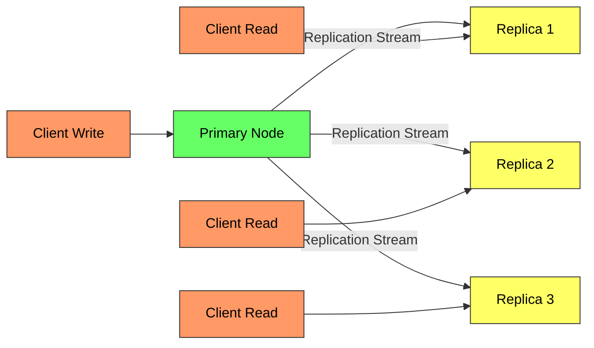
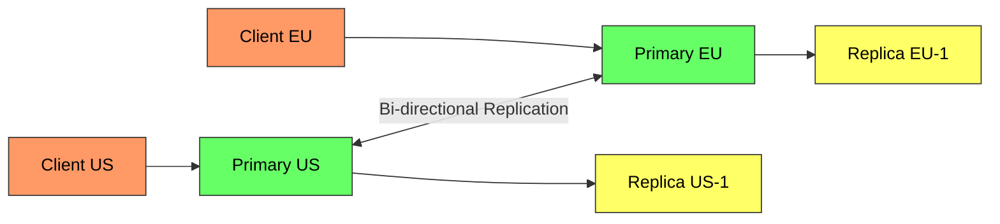
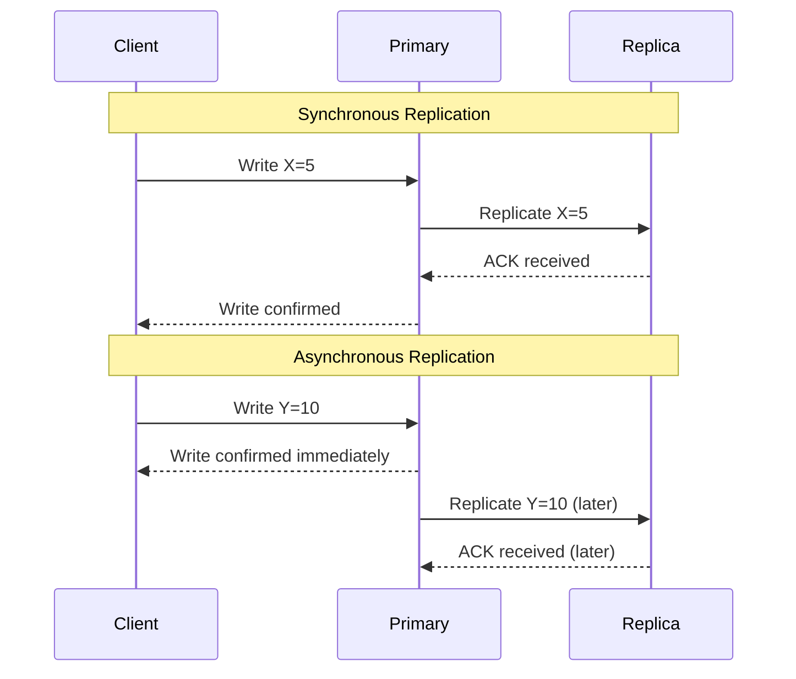
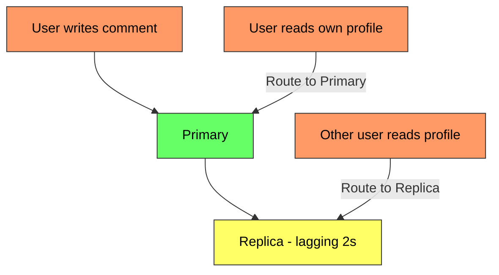
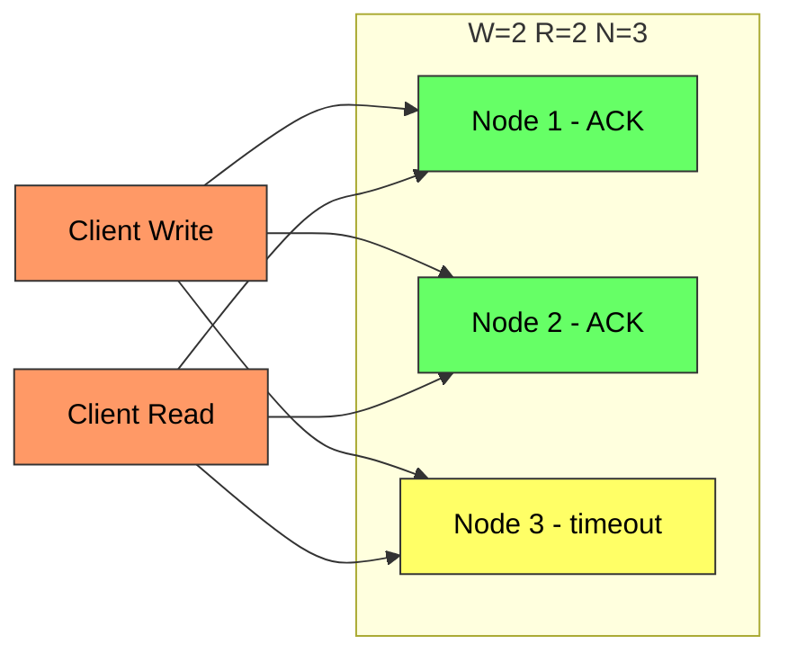
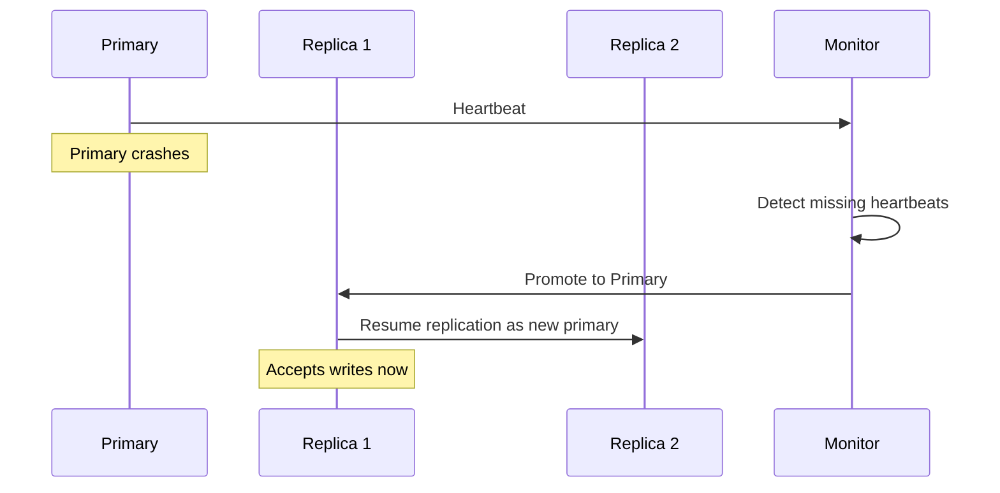

# Database Replication - Complete Deep Dive

> **Prerequisites:** [Database Indexing](/concepts/database-indexing/), [CAP Theorem](/concepts/cap-theorem/)
> **Used in:** [Key-Value Store](/hld/key-value-store/), [Chat System](/hld/chat-system/), [Digital Wallet](/hld/digital-wallet/)

---

## What is Database Replication?

Database replication is the process of maintaining copies of the same data on multiple machines (nodes) to improve availability, fault tolerance, and read performance.

**Real-world analogy:** Imagine a popular library with one original copy of every book. If that building burns down, all books are lost. Replication is like making copies and storing them in multiple branch libraries. Readers can go to any branch to read, but when a new book arrives, you need a system to decide which branch gets it first and how other branches get their copies.

---

## Why Replicate?

| Reason | Explanation |
|--------|-------------|
| **High Availability** | If one node dies, others serve traffic |
| **Read Scalability** | Distribute read load across replicas |
| **Geo-locality** | Place data closer to users geographically |
| **Disaster Recovery** | Survive entire data center failures |

---

## How It Works

### Primary-Replica (Leader-Follower)

One node accepts writes (primary), others replicate and serve reads.

**How it flows:**
1. Client sends write to the primary node
2. Primary writes to its local storage (WAL + commit)
3. Primary streams changes to all replicas
4. Replicas apply changes in the same order
5. Clients read from any replica (eventual consistency) or from primary (strong consistency)

### Multi-Primary (Leader-Leader)

Multiple nodes accept writes. Each primary replicates to the others.

**Conflict resolution strategies:**
- Last-Write-Wins (LWW) — simple but lossy
- Application-level merge — custom logic per data type
- CRDTs — conflict-free replicated data types (counters, sets)

---

## Synchronous vs Asynchronous Replication

| Aspect | Synchronous | Asynchronous |
|--------|-------------|--------------|
| **Durability** | Guaranteed on N nodes | Guaranteed only on primary |
| **Latency** | Higher (waits for replica ACK) | Lower (immediate response) |
| **Availability** | Lower (replica failure blocks writes) | Higher (primary works alone) |
| **Data loss risk** | None | Possible on primary crash |
| **Use case** | Financial transactions | Social media feeds |

**Semi-synchronous:** One replica is synchronous (guarantees at least one backup), others are async. Used by MySQL and PostgreSQL in practice.

---

## Replication Lag

The delay between a write on the primary and that write appearing on a replica.

**Problems caused by lag:**
1. **Stale reads** — user writes, then reads from replica and sees old data
2. **Inconsistent reads** — two reads from different replicas return different values
3. **Causal violations** — reply appears before the original message

### Read-Your-Writes Consistency

**Strategies:**
- Read from primary for data the user recently modified
- Track last write timestamp; only read from replicas that are caught up
- Use monotonic reads: pin a user to a single replica within a session

---

## Quorum Reads and Writes

In leaderless replication (e.g., DynamoDB, Cassandra), writes go to multiple nodes and reads also query multiple nodes.

**Formula: R + W > N** guarantees overlap between read and write sets.

| Variable | Meaning |
|----------|---------|
| N | Total number of replicas |
| W | Nodes that must ACK a write |
| R | Nodes that must respond to a read |

| Configuration | Behavior | Use Case |
|---------------|----------|----------|
| W=N, R=1 | All nodes must ACK write; any single node read works | Write-heavy consistency needs |
| W=1, R=N | Fast writes; read from all nodes to find latest | Read-heavy workloads |
| W=2, R=2, N=3 | Balanced; tolerates 1 node failure | General distributed stores |
| W=3, R=3, N=5 | Strong consistency; tolerates 2 failures | Financial systems |

---

## Failover

When the primary dies, a replica must be promoted.

**Failover challenges:**
- **Split-brain:** Two nodes think they are primary → use fencing tokens
- **Data loss:** Async replicas may be behind → accept lost writes or use consensus
- **Stale DNS:** Clients still routing to old primary → use service discovery with short TTL

**Real-world examples:**
- **PostgreSQL:** Streaming replication + pg_auto_failover
- **MySQL:** Group Replication + MySQL Router
- **MongoDB:** Replica Sets with automatic election (Raft-like)
- **AWS Aurora:** Storage-level replication, failover in <30 seconds

---

## When to Use / When NOT to Use

✅ **Use replication when:**
- You need high availability (99.99%+ uptime)
- Read traffic significantly exceeds write traffic
- Users are geographically distributed
- You need disaster recovery across regions

❌ **Don't use (or be careful) when:**
- Strong consistency is required on every read (adds latency)
- Write volume is the bottleneck (replication doesn't help writes — use sharding)
- Budget is tight (replicas cost money for storage and compute)
- Data changes rarely and a single backup suffices

---

## Common Interview Questions

**Q1: What's the difference between replication and sharding?**
> Replication copies the same data to multiple nodes for availability and read scaling. Sharding splits different data across nodes for write scaling and storage capacity. In production systems you typically use both: shard the data, then replicate each shard.

**Q2: How do you handle split-brain in primary-replica setups?**
> Use fencing tokens (monotonically increasing IDs). When a new primary is elected, it gets a higher token. The storage layer rejects writes from any node presenting a stale (lower) fencing token. Additionally, use consensus protocols (Raft, Paxos) to ensure only one primary is elected at a time.

**Q3: When would you choose multi-primary over single-primary?**
> Multi-primary is useful for geo-distributed writes where latency to a single primary is unacceptable (e.g., a user in Europe writing to a primary in US-East). However, it introduces write conflicts. Use it when conflicts are rare and can be resolved automatically (LWW, CRDTs). Avoid it for data with strict invariants (account balances, inventory).

**Q4: How does DynamoDB achieve single-digit millisecond reads with replication?**
> DynamoDB uses quorum-based leaderless replication. For eventually consistent reads (default), it reads from one node — fast but might be stale. For strongly consistent reads, it reads from a quorum (R+W>N) to guarantee the latest version. DynamoDB also uses anti-entropy (Merkle trees) to keep replicas in sync.

**Q5: What's the tradeoff between W=1 and W=N?**
> W=1 gives low write latency and high availability (write succeeds even if N-1 nodes are down), but risks data loss if that one node fails before replicating. W=N gives maximum durability (data on all nodes before ACK) but a single slow or failed node blocks all writes. Most systems use W=majority for a balance.

---

## Navigation

[← Back to Fundamentals](/concepts)

[All Concepts](/concepts/) | [HLD Designs](/hld/)
