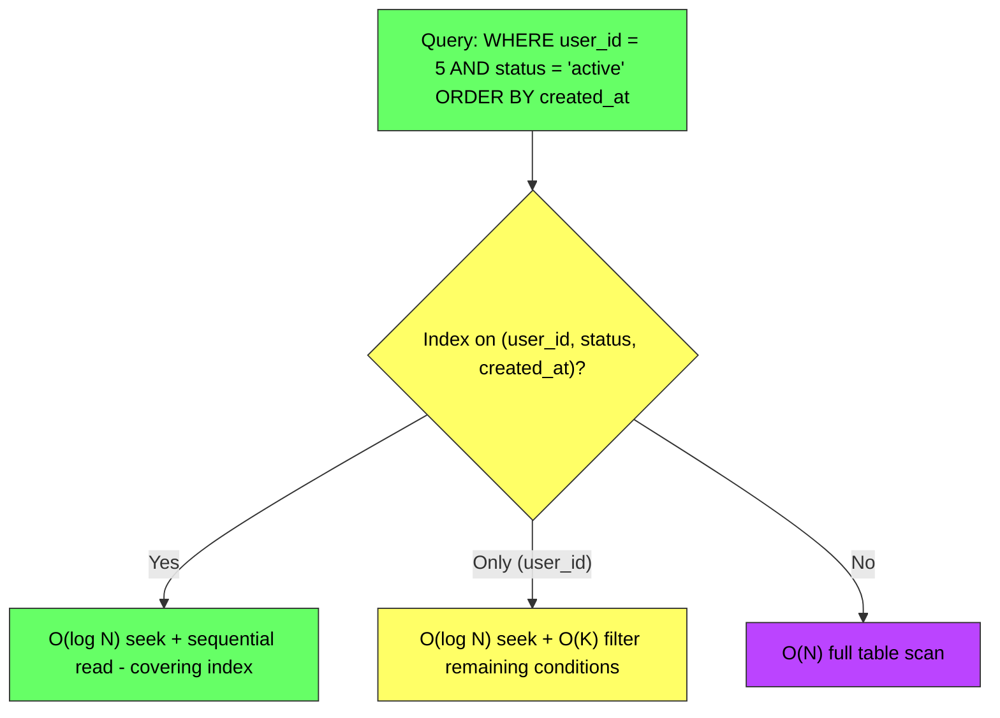
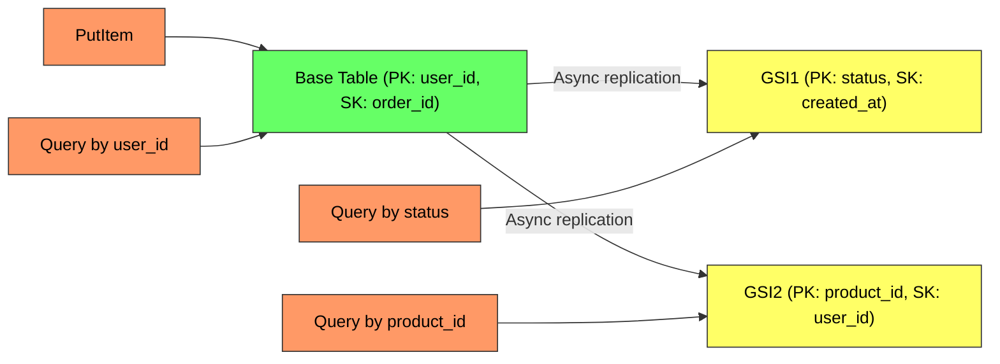
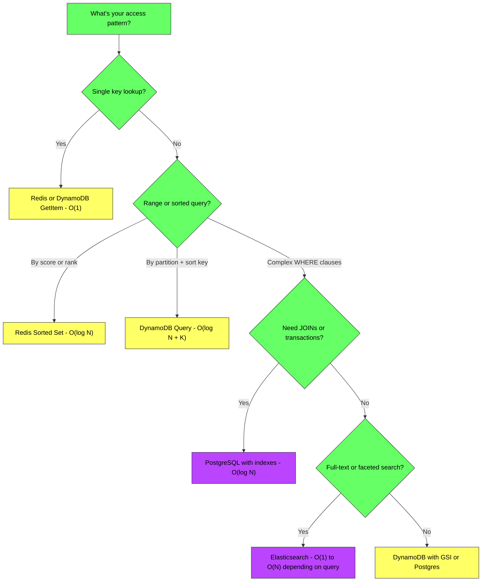

# Database Query Complexity - Complete Deep Dive

> **Prerequisites:** [Database Indexing](/concepts/database-indexing/), [Database Sharding](/concepts/database-sharding/), [Caching](/concepts/caching/)
> **Used in:** [Leaderboard](/hld/Leaderboard/), [Key-Value Store](/hld/KeyValueStore/), [Instagram](/hld/Instagram/)

---

## What is Query Complexity?

Query complexity describes the time and resource cost of database operations relative to the data size. In system design, knowing whether an operation is O(1), O(log N), or O(N) determines whether your design works at scale — the difference between 1ms and 10 seconds for 100M rows.

**Real-world analogy:** Imagine finding a name in a phone book. If the book is sorted alphabetically (indexed), you can binary search — O(log N), maybe 20 page flips for a million entries. If the book is unsorted (no index), you must scan every page — O(N), potentially all million pages. If you just need page 1 (key lookup) — O(1), instant. Database query complexity tells you which type of lookup you're doing.

---

## PostgreSQL Query Complexity

### Without Index (Sequential Scan)

| Operation | Complexity | Explanation |
|-----------|-----------|-------------|
| `SELECT * FROM users WHERE email = ?` | O(N) | Full table scan — checks every row |
| `SELECT * FROM users WHERE age > 25` | O(N) | Range scan without index — checks every row |
| `SELECT * FROM users ORDER BY created_at LIMIT 10` | O(N log N) | Sort entire table, then take 10 |
| `SELECT COUNT(*) FROM users` | O(N) | Must scan all rows (MVCC) |
| `INSERT INTO users VALUES (...)` | O(1) | Append to heap (no index maintenance) |
| `UPDATE users SET name = ? WHERE id = ?` | O(N) | Find row (scan) + update |
| `DELETE FROM users WHERE id = ?` | O(N) | Find row (scan) + mark dead |

### With B-Tree Index

| Operation | Complexity | Explanation |
|-----------|-----------|-------------|
| `SELECT * WHERE id = ?` (Primary Key) | O(log N) | B-tree traversal to leaf |
| `SELECT * WHERE email = ?` (Unique Index) | O(log N) | Index seek + heap fetch |
| `SELECT * WHERE age > 25` (Index on age) | O(log N + K) | Seek + scan K matching rows |
| `SELECT * ORDER BY created_at LIMIT 10` (Indexed) | O(log N) | Index already sorted; read first 10 |
| `INSERT` (with indexes) | O(log N) per index | Insert row + update each B-tree |
| `UPDATE` (indexed column) | O(log N) | Find via index + update index entries |
| `SELECT COUNT(*)` (no WHERE) | O(N) | Still scans — Postgres MVCC has no exact count |

### With Composite Index

**Composite index rules (leftmost prefix):**
- Index on `(A, B, C)` supports: `WHERE A = ?`, `WHERE A = ? AND B = ?`, `WHERE A = ? AND B = ? AND C = ?`
- Does NOT efficiently support: `WHERE B = ?` alone, `WHERE C = ?` alone
- Range condition stops further index usage: `WHERE A = ? AND B > 5 AND C = ?` — C cannot use the index

---

## DynamoDB Query Complexity

### Core Operations

| Operation | Complexity | Cost (RCU/WCU) | Explanation |
|-----------|-----------|----------------|-------------|
| `GetItem(PK)` | O(1) | 1 RCU (4KB strongly consistent) | Direct hash lookup |
| `GetItem(PK, SK)` | O(1) | 1 RCU | Hash + exact sort key |
| `Query(PK, SK begins_with)` | O(1) + O(K) | K × RCUs | Hash lookup + sorted scan of K items |
| `Query(PK, SK between)` | O(1) + O(K) | K × RCUs | Hash lookup + range within sort key |
| `Scan(full table)` | O(N) | N × RCUs | Reads every item — avoid in production |
| `PutItem` | O(1) | 1 WCU (1KB) | Direct hash write |
| `UpdateItem` | O(1) | 1 WCU | In-place update by primary key |
| `DeleteItem` | O(1) | 1 WCU | Direct hash delete |
| `BatchGetItem` (up to 100) | O(K) | K × RCUs | Parallel GetItem calls |
| `TransactWriteItems` (up to 100) | O(K) | 2K × WCUs | ACID transaction (2x cost) |

### Global Secondary Index (GSI)

| Operation | Complexity | Notes |
|-----------|-----------|-------|
| Query on GSI | O(1) + O(K) | Same as base table query on different key |
| Scan on GSI | O(N) | Same cost as base table scan |
| Write to table with GSI | O(1) + O(G) per GSI | Each GSI is an async copy — eventual consistency |

**Key DynamoDB rules:**
- Every query MUST include the partition key (PK) — no way around this
- Sort key (SK) enables range queries within a partition
- GSI lets you query by a different attribute — but adds write cost and eventual consistency
- Scan is always O(N) — design your keys to avoid it

---

## Redis Query Complexity

### Core Data Structures

| Command | Data Structure | Complexity | Use Case |
|---------|---------------|-----------|----------|
| `GET key` | String | O(1) | Session, cache |
| `SET key value` | String | O(1) | Write cache entry |
| `HGET hash field` | Hash | O(1) | User profile fields |
| `HGETALL hash` | Hash | O(N fields) | Read entire object |
| `LPUSH list value` | List | O(1) | Queue append |
| `LRANGE list 0 -1` | List | O(N) | Read entire list |
| `LRANGE list 0 9` | List | O(10) = O(1) | Read first 10 (pagination) |
| `SADD set member` | Set | O(1) | Tag membership |
| `SISMEMBER set member` | Set | O(1) | Check membership |
| `SMEMBERS set` | Set | O(N members) | Get all members |
| `ZADD zset score member` | Sorted Set | O(log N) | Leaderboard insert |
| `ZRANGE zset 0 9` | Sorted Set | O(log N + 10) | Top 10 leaderboard |
| `ZRANGEBYSCORE zset min max` | Sorted Set | O(log N + K) | Range by score |
| `ZRANK zset member` | Sorted Set | O(log N) | Get rank of member |
| `ZCARD zset` | Sorted Set | O(1) | Count of members |
| `PFADD hll element` | HyperLogLog | O(1) | Unique count approximation |
| `PFCOUNT hll` | HyperLogLog | O(1) | Get approximate count |
| `GEOADD geo lng lat member` | Geo | O(log N) | Add location |
| `GEORADIUS geo lng lat radius` | Geo | O(N+log N) for bounded | Find nearby |

---

## Decision Framework: "How Will You Query This?"

### Choosing by Access Pattern

| Access Pattern | Best Store | Why |
|---------------|-----------|-----|
| Get user by ID | DynamoDB / Redis | O(1) hash lookup |
| Get user by email | Postgres (unique index) / DynamoDB GSI | O(log N) B-tree or O(1) hash |
| Top 100 players by score | Redis Sorted Set | O(log N + 100) — designed for this |
| Orders by user sorted by date | DynamoDB (PK=user_id, SK=timestamp) | O(1) + sequential read |
| Full-text search on product name | Elasticsearch | Inverted index, O(terms) |
| Count of unique visitors | Redis HyperLogLog | O(1) approximate, 12KB memory |
| Nearby restaurants within 5km | Redis Geo / PostGIS | Geospatial index |
| Complex JOIN (orders + users + products) | PostgreSQL | Only relational DB handles multi-table JOINs |
| Time-series metrics (last 1 hour) | Redis (Sorted Set by timestamp) / TimescaleDB | Range query on time |
| Event log (append-only, ordered) | Kafka / DynamoDB (SK=timestamp) | Sequential writes, range reads |

---

## Composite Index Design Rules

| Rule | Explanation | Example |
|------|-------------|---------|
| **Equality first** | Put = conditions before range | `(status, created_at)` not `(created_at, status)` |
| **High cardinality first** | More selective column first (for equality) | `(user_id, status)` not `(status, user_id)` |
| **Range column last** | Only one range per composite index | `(user_id, status, price)` — range on price only |
| **Cover the query** | Include SELECT columns to avoid heap fetch | `(email) INCLUDE (name, avatar)` |
| **Match ORDER BY** | Index order must match sort direction | `(created_at DESC)` for `ORDER BY created_at DESC` |

---

## Cost at Scale: Quick Reference

| Operation | 1M rows | 100M rows | 1B rows |
|-----------|---------|-----------|---------|
| **Postgres: indexed lookup** | ~1ms | ~2ms | ~3ms |
| **Postgres: full scan** | ~500ms | ~50s | ~500s (unusable) |
| **DynamoDB: GetItem** | ~5ms | ~5ms | ~5ms (constant) |
| **DynamoDB: Scan** | ~10s | ~16min | ~2.7hr (never do this) |
| **Redis: GET** | ~0.1ms | ~0.1ms | ~0.1ms (in-memory) |
| **Redis: ZRANGE top 10** | ~0.1ms | ~0.2ms | ~0.3ms |

---

## When to Use / When NOT to Use Each

✅ **PostgreSQL:** Complex queries, JOINs, ACID transactions, flexible querying, moderate scale (< 10TB)
❌ **Not Postgres:** Single-key lookups at >100K QPS, unbounded horizontal scaling

✅ **DynamoDB:** Key-value or key-range access, predictable performance at any scale, auto-scaling
❌ **Not DynamoDB:** Ad-hoc queries, JOINs, changing access patterns (schema changes are expensive)

✅ **Redis:** Sub-millisecond reads, leaderboards, sessions, caching, real-time counters
❌ **Not Redis:** Data larger than RAM, complex queries, durability-critical primary store

---

## Common Interview Questions

**Q1: Why is DynamoDB Scan O(N) but Query is O(1) + O(K)?**
> Query uses the partition key to hash directly to the correct storage partition (O(1)), then reads K items sequentially from the sorted sort key range. Scan has no partition key filter — it must read every partition, every item in the entire table, then filter client-side. Scan consumes RCUs proportional to total table size regardless of how many items match your filter. This is why DynamoDB access patterns must be designed upfront around the primary key.

**Q2: When would you use Redis Sorted Sets vs PostgreSQL with an index for a leaderboard?**
> Redis Sorted Set gives O(log N) insert and O(log N + K) range queries in-memory — perfect for real-time leaderboards with sub-millisecond latency. PostgreSQL with a B-tree index gives O(log N) lookups but requires disk I/O. At high QPS (>10K ops/sec) and moderate data size (<100M entries), Redis is clearly better. Use PostgreSQL when: you need complex leaderboard queries (e.g., "rank among friends"), transactional score updates tied to other data, or the dataset exceeds available RAM.

**Q3: How do you design DynamoDB keys for a multi-access-pattern system?**
> Use single-table design with overloaded keys. Example for an e-commerce system: PK = `USER#123`, SK = `ORDER#2024-01-15#abc` for user's orders. Add GSI with PK = `PRODUCT#456`, SK = `ORDER#2024-01-15` for product's orders. Each GSI adds one access pattern at the cost of additional write throughput and eventual consistency. If you have more than 5 access patterns, consider whether a relational database with multiple indexes is simpler.

**Q4: What's the complexity of a JOIN in PostgreSQL?**
> It depends on the join algorithm. Nested Loop Join: O(N × M) worst case, O(N × log M) with index on inner table. Hash Join: O(N + M) — builds hash table on smaller relation, probes with larger. Merge Join: O(N log N + M log M) if unsorted, O(N + M) if both inputs are already sorted (e.g., index scan). PostgreSQL's query planner chooses the best algorithm based on table statistics. Always check `EXPLAIN ANALYZE` to verify.

**Q5: How does Redis achieve O(log N) for Sorted Sets while maintaining O(1) for membership checks?**
> Redis Sorted Sets use two data structures internally: a skip list (for sorted range operations — O(log N) insert, delete, range query) AND a hash table (for O(1) score lookups by member). This dual structure means `ZSCORE member` is O(1) via the hash table, while `ZRANGE 0 9` is O(log N + K) via the skip list. The tradeoff is 2x memory usage per entry.

---

## Navigation

[← Back to Fundamentals](/concepts)

[All Concepts](/concepts/) | [HLD Designs](/hld/)
