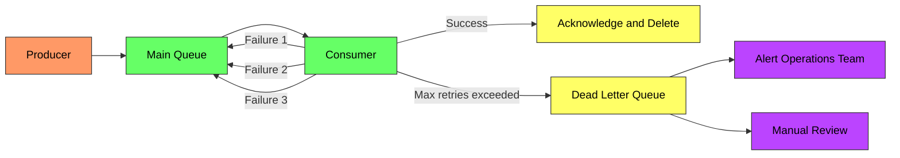
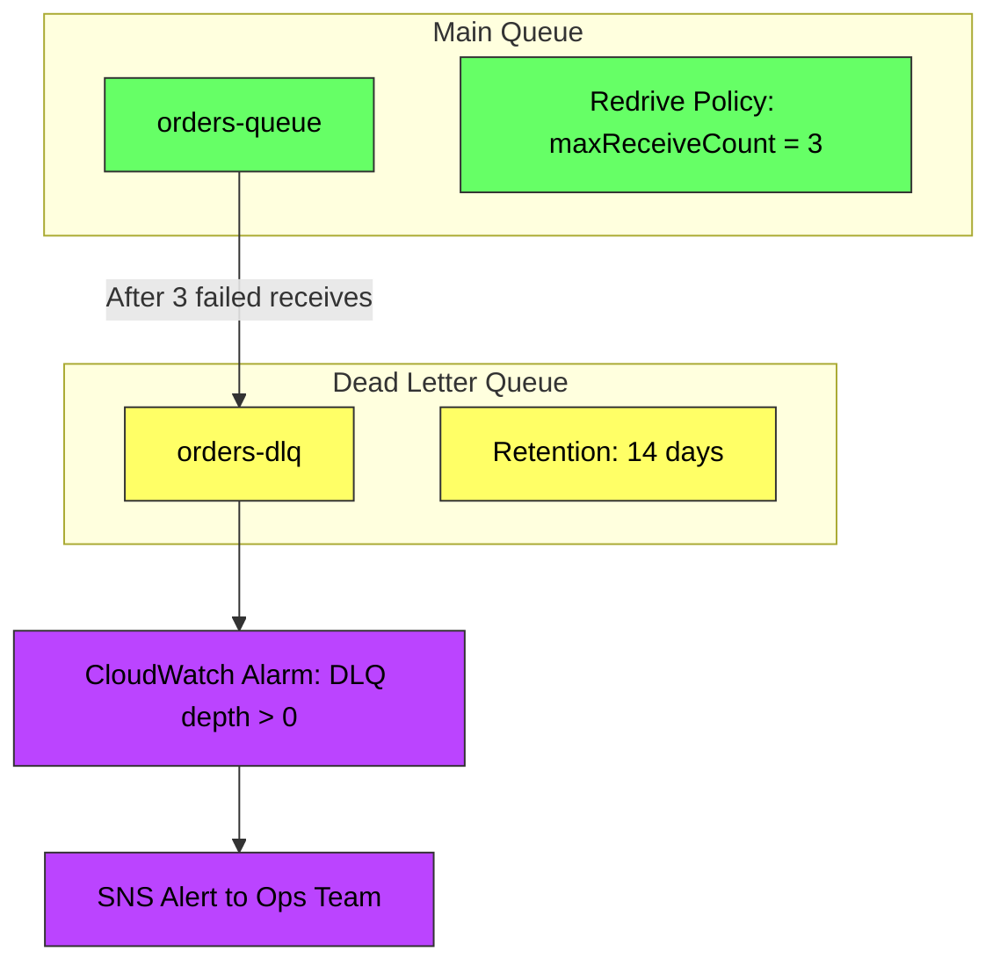
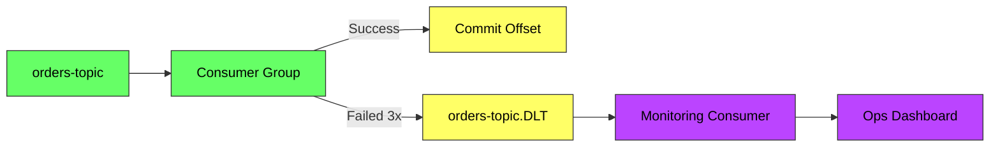
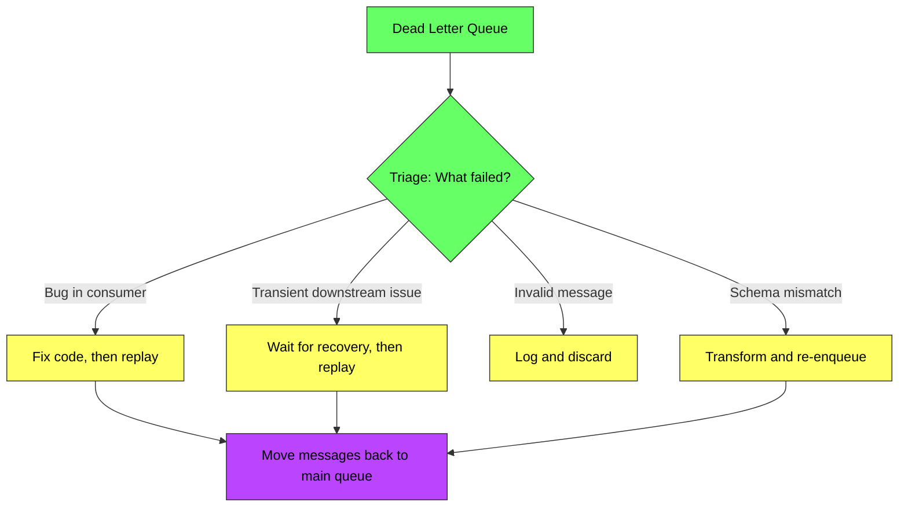

# Dead Letter Queue (DLQ) - Complete Deep Dive

> **Prerequisites:** [Message Queues](/concepts/message-queues/), [Retry and Backoff](/concepts/retry-backoff/)
> **Used in:** [Notification System](/hld/NotificationSystem/), [Job Scheduler](/hld/JobScheduler/), [Digital Wallet](/hld/DigitalWallet/)

---

## What is a Dead Letter Queue?

A Dead Letter Queue (DLQ) is a special queue where messages that cannot be processed successfully after multiple attempts are moved. It isolates "poison" messages so they don't block the main processing pipeline, while preserving them for investigation and potential reprocessing.

**Real-world analogy:** Imagine a post office sorting machine. Most letters are scanned, sorted, and routed correctly. But some letters have damaged barcodes, invalid addresses, or are torn — the machine can't process them. Instead of jamming the entire sorting line, these letters are diverted to a special bin where a human examines them later. The DLQ is that special bin — it keeps the main line moving while preserving problematic items for manual review.

---

## Why DLQ Exists



**Without a DLQ:**
- Poison messages block the queue (head-of-line blocking)
- Consumer retries infinitely, wasting compute
- Other valid messages behind the poison message are delayed
- No visibility into what's failing or why

**With a DLQ:**
- Poison messages are isolated after N attempts
- Main queue continues processing healthy messages
- Operations team gets alerts on DLQ depth
- Failed messages are preserved for debugging and reprocessing

---

## Poison Messages

A poison message is one that will NEVER be processed successfully, regardless of retries:

| Cause | Example |
|-------|---------|
| **Schema mismatch** | Producer sends v2 schema, consumer expects v1 |
| **Invalid data** | Null field where non-null required, malformed JSON |
| **Missing dependency** | Message references entity that was deleted |
| **Bug in consumer** | Unhandled edge case causes exception |
| **Size limit** | Payload exceeds consumer's memory limit |
| **Expired context** | Message is too old to be meaningful |

---

## SQS DLQ Configuration

Amazon SQS has native DLQ support via **redrive policy**.



**Configuration:**
| Setting | Value | Purpose |
|---------|-------|---------|
| `maxReceiveCount` | 3-5 typically | Attempts before moving to DLQ |
| `MessageRetentionPeriod` (DLQ) | 14 days | Time to investigate before message expires |
| `VisibilityTimeout` (main queue) | 30s-5min | Time consumer has to process before retry |

**SQS redrive allow policy:** Controls which source queues can send to a DLQ. Prevents accidental routing.

**SQS DLQ redrive (replay):** Since 2021, SQS supports moving messages FROM the DLQ BACK to the source queue for reprocessing — no custom code needed.

---

## Kafka Dead Letter Topics

Kafka doesn't have native DLQ support, but the pattern is implemented at the consumer level.



**Implementation approaches:**

| Approach | How It Works | Tradeoff |
|----------|-------------|----------|
| **Spring Kafka DLT** | `@RetryableTopic` with `dlt` suffix topic auto-created | Easy but Spring-specific |
| **Manual producer** | Consumer catches exceptions, publishes to DLT topic manually | Full control, more code |
| **Kafka Connect DLQ** | Connectors have built-in `errors.deadletterqueue.topic.name` | Only for Connect pipelines |
| **Retry topics** | Chain: main → retry-1 (1min delay) → retry-2 (5min) → DLT | Graduated retry delays |

**Kafka retry topics pattern (Uber-style):**
```
orders-topic → orders-topic.retry-1 (delay 1min) → orders-topic.retry-2 (delay 10min) → orders-topic.DLT
```

---

## Monitoring and Alerting

| Metric | Alert Threshold | Action |
|--------|----------------|--------|
| **DLQ depth** | > 0 messages | Investigate immediately |
| **DLQ growth rate** | > 10 messages/min | Likely systemic bug, not isolated poison message |
| **DLQ age** | Oldest message > 24h | Messages aging out without review |
| **DLQ as % of total** | > 1% of throughput | Consumer has a significant bug |
| **Main queue age** | Messages not being consumed | Consumer might be down |

**Alert escalation:**
1. DLQ depth > 0 → Slack notification to team channel
2. DLQ depth > 100 → PagerDuty alert to on-call
3. DLQ growth rate sustained > 1min → Auto-pause producer (circuit breaker)

---

## Reprocessing Strategies



**Reprocessing options:**

| Strategy | When to Use |
|----------|-------------|
| **Automatic replay** | Known transient issue; replay after cooldown period |
| **Manual replay** | After code fix deployed; ops triggers replay |
| **Selective replay** | Filter DLQ messages by criteria; replay subset |
| **Transform and replay** | Fix message format before re-enqueue |
| **Discard with logging** | Message is truly unprocessable; log for audit trail |
| **Side-channel processing** | Special handler processes DLQ differently than main consumer |

---

## DLQ in Practice: Design Patterns

### Pattern 1: DLQ with Metadata Enrichment

When moving to DLQ, attach diagnostic metadata:
- Original queue/topic name
- Number of processing attempts
- Error message from last failure
- Timestamp of first failure
- Consumer instance that failed

### Pattern 2: Tiered Retry with DLQ

```
Attempt 1 → immediate retry
Attempt 2 → retry after 1 minute (delay queue)
Attempt 3 → retry after 10 minutes (delay queue)
Attempt 4 → DLQ (human review)
```

### Pattern 3: DLQ Consumer (Auto-healing)

A separate consumer watches the DLQ and periodically attempts reprocessing with a different strategy (e.g., relaxed validation, fallback service). Only truly unprocessable messages remain.

---

## When to Use / When NOT to Use

✅ **Use a DLQ when:**
- Message processing can fail for reasons beyond the consumer's control
- You need to preserve failed messages for debugging and reprocessing
- Head-of-line blocking is unacceptable (other messages must continue)
- Compliance requires audit trail of all received messages
- Operations team needs visibility into processing failures

❌ **Don't use (or reconsider) when:**
- Message ordering is critical and you can't skip messages
- All failures are transient and always resolve with retries
- Messages have no value after a short TTL (just drop them)
- System is simple enough that failed messages can be logged and ignored
- You're using it as a band-aid for a consumer bug (fix the bug instead)

---

## Common Interview Questions

**Q1: How do you prevent a DLQ from growing indefinitely?**
> Set a retention policy (e.g., 14 days). Monitor DLQ depth with alerts. Implement auto-replay for known transient failures. For persistent failures, have a DLQ consumer that classifies messages: reprocessable ones go back to the main queue after a fix, truly invalid ones are logged to a permanent audit store and deleted from the DLQ. Run periodic reports on DLQ trends to catch systematic issues early.

**Q2: What's the difference between a DLQ and a retry queue?**
> A retry queue is for messages that WILL eventually succeed — they're delayed and re-attempted automatically (e.g., downstream service is temporarily down). A DLQ is for messages that have EXHAUSTED all retries and likely won't succeed without intervention (code fix, manual data correction). The retry queue is automated recovery; the DLQ is an escalation to humans.

**Q3: How would you handle ordering guarantees with a DLQ?**
> If strict ordering matters (e.g., events for a single user must be processed in order), moving one message to the DLQ means subsequent messages for that user are also blocked. Solutions: (1) Move all messages for that partition key to DLQ together, (2) Pause processing for that specific key until DLQ is resolved, (3) Use a per-key retry counter and skip the key after N failures while continuing others. Kafka's partition-based ordering makes this particularly challenging.

**Q4: How do you implement a DLQ for Kafka where there's no built-in support?**
> Create a dead letter topic (e.g., `my-topic.DLT`). In the consumer, wrap processing in try-catch. After N failures for a message: (1) Produce the failed message to the DLT with error metadata in headers, (2) Commit the offset on the original topic (so it's not retried), (3) Continue processing next messages. A separate monitoring consumer reads the DLT for alerting. For replay, read from DLT and produce back to the original topic.

---

## Navigation

[← Back to Fundamentals](/concepts)

[All Concepts](/concepts/) | [HLD Designs](/hld/)
