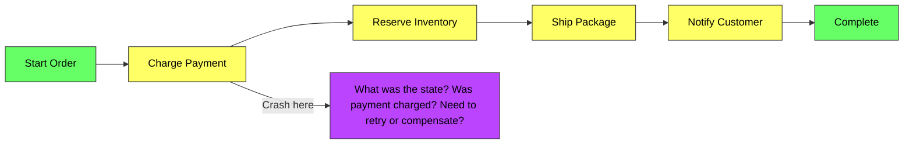
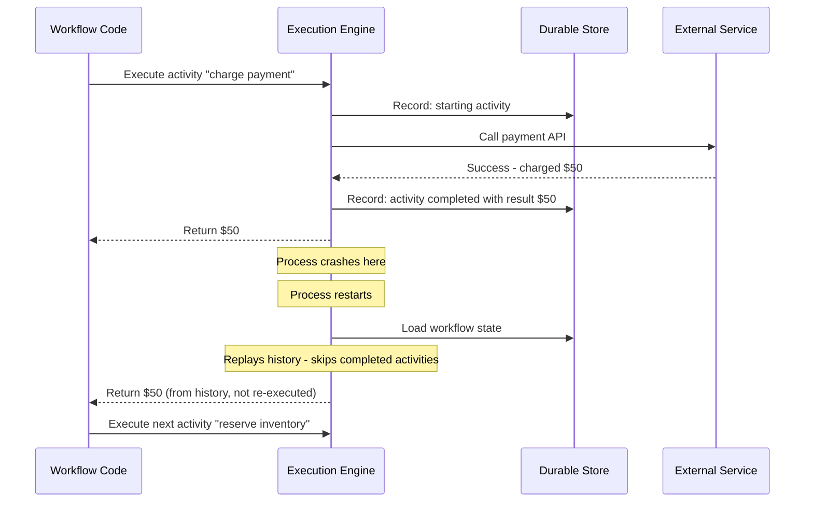
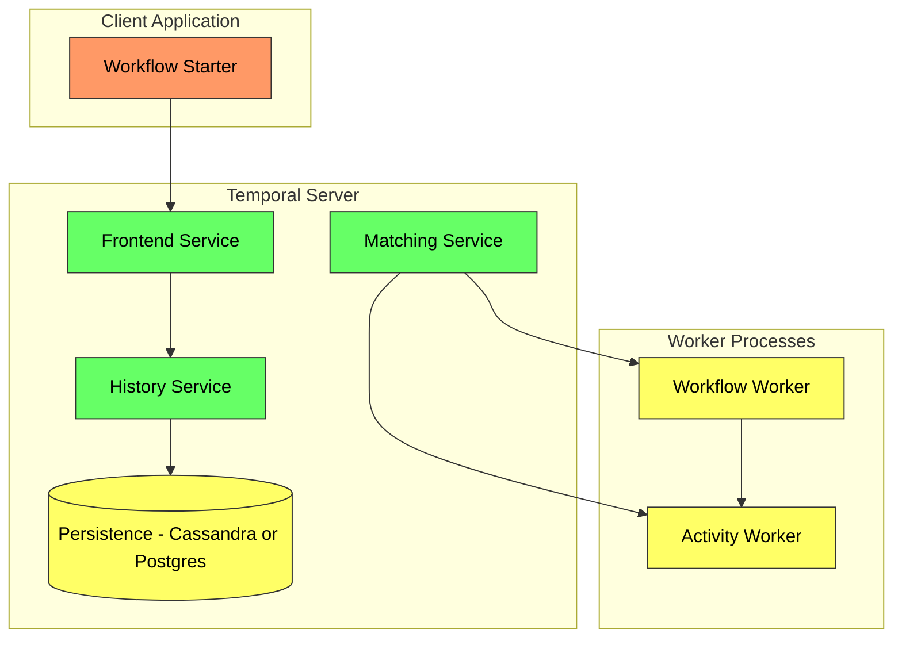
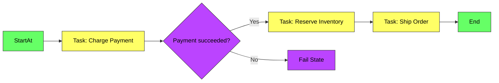
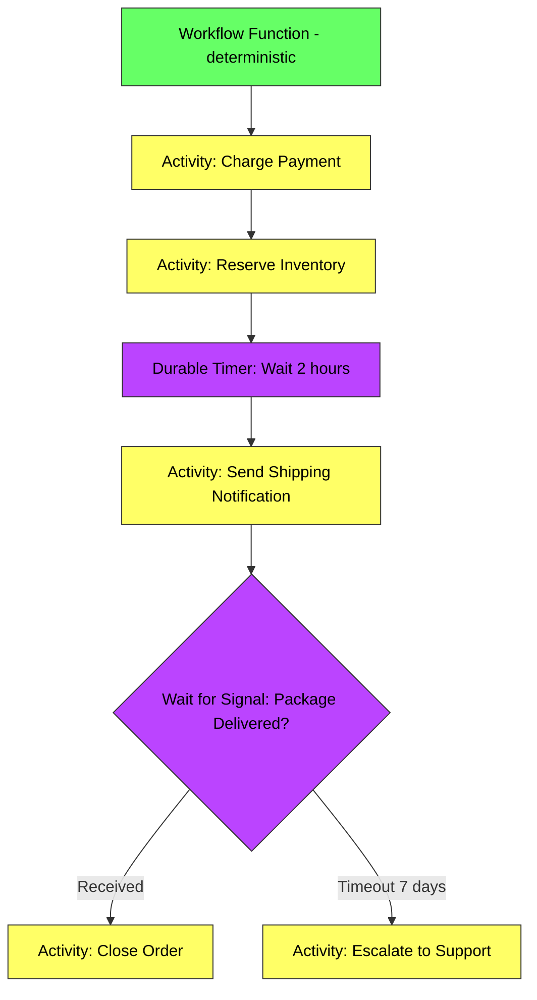

# Durable Execution - Complete Deep Dive

> **Prerequisites:** [Message Queues](/concepts/message-queues/), [Retry and Backoff](/concepts/retry-backoff/), [Saga Pattern](/concepts/saga-pattern/)
> **Used in:** [Job Scheduler](/hld/JobScheduler/), [Digital Wallet](/hld/DigitalWallet/), [Delayed Trigger Service](/hld/DelayedTriggerService/)

---

## What is Durable Execution?

Durable execution is a programming model where the state of a long-running workflow is automatically persisted at each step. If the process crashes, the workflow resumes exactly where it left off — without re-executing completed steps or losing progress.

**Real-world analogy:** Imagine assembling IKEA furniture with a friend who takes a photo after completing each step. If you're interrupted (fire alarm, power outage, fall asleep), you look at the last photo and resume from that exact step — you don't start over from scratch. Durable execution engines are that photographer: they snapshot your workflow's state after every side effect (API call, DB write, timer) so recovery is instant.

---

## The Problem: Long-Running Workflows Crash

Traditional request-response services assume operations complete in seconds. But many real workflows take minutes, hours, or days:

- Payment processing (auth → capture → settle → reconcile)
- Order fulfillment (reserve → pack → ship → deliver → confirm)
- User onboarding (signup → verify email → KYC → activate)
- Subscription billing (charge → retry → escalate → cancel)

**Without durable execution:** You build ad-hoc state machines with database flags, cron jobs, and retry queues. Every failure mode needs custom handling. It's error-prone and hard to reason about.

---

## How Durable Execution Works

**Key mechanism: Event sourcing of workflow state.**
1. Every side effect (activity) is recorded before execution
2. Results are persisted after completion
3. On recovery, the engine replays the event history
4. Completed activities return cached results (no re-execution)
5. Execution resumes from the first incomplete activity

---

## Temporal (Most Popular)

Temporal is an open-source durable execution platform (fork of Uber's Cadence).

**Temporal concepts:**
| Concept | What It Is |
|---------|-----------|
| **Workflow** | A function that orchestrates activities; must be deterministic |
| **Activity** | A side-effectful operation (API call, DB write); can be retried independently |
| **Worker** | A process that polls for and executes workflows/activities |
| **Task Queue** | Routes work to specific workers |
| **Signal** | External input sent to a running workflow |
| **Timer** | Durable sleep — survives crashes (sleep 30 days? no problem) |

---

## AWS Step Functions

AWS's managed state machine service. JSON-based (ASL — Amazon States Language) rather than code.

**Step Functions features:**
- Visual workflow designer in AWS Console
- Native integration with 200+ AWS services (Lambda, SQS, DynamoDB, ECS)
- Express workflows (high-volume, short-duration, at-least-once)
- Standard workflows (long-duration, exactly-once, up to 1 year)

---

## Comparison: Temporal vs Step Functions vs Cadence

| Feature | Temporal | AWS Step Functions | Cadence |
|---------|----------|-------------------|---------|
| **Definition** | Code (Go, Java, TypeScript, Python) | JSON (ASL) | Code (Go, Java) |
| **Hosting** | Self-hosted or Temporal Cloud | Fully managed AWS | Self-hosted |
| **Max duration** | Unlimited | 1 year (Standard) | Unlimited |
| **Pricing** | Infrastructure cost | Per state transition ($0.025/1000) | Infrastructure cost |
| **Debugging** | Replay + step-through | Visual console | Replay |
| **Versioning** | Built-in workflow versioning | Deploy new state machine | Manual |
| **Signals** | Yes (external events to workflow) | Wait-for-callback, EventBridge | Yes |
| **Child workflows** | Yes | Yes (nested state machines) | Yes |
| **Retries** | Per-activity configurable | Per-state retry policies | Per-activity |
| **Language** | Multi-language SDKs | Language-agnostic (JSON) | Go, Java |
| **Community** | Large, growing | AWS ecosystem | Declining (Temporal fork) |

---

## When to Use Each

| Use Case | Best Choice | Why |
|----------|-------------|-----|
| Complex business logic with branching | Temporal | Code is more expressive than JSON |
| AWS-native with Lambda orchestration | Step Functions | Native integrations, no infra to manage |
| Long-running human-in-the-loop | Temporal | Signals, unlimited duration |
| Simple ETL pipeline on AWS | Step Functions | Visual, integrates with Glue and S3 |
| High-throughput event processing | Temporal | Better performance at scale |
| Existing Uber Cadence migration | Temporal | Direct successor, migration path exists |

---

## Workflow as Code Pattern

**Determinism requirement:** Workflow code must be deterministic (same inputs → same outputs). No random numbers, no current time, no direct I/O. All non-deterministic operations go into activities. This enables replay-based recovery.

---

## Retry and Timeout Built-in

| Feature | How It Works |
|---------|-------------|
| **Activity retry** | Configurable per activity: max attempts, backoff, non-retryable errors |
| **Workflow timeout** | Overall deadline for the entire workflow |
| **Activity timeout** | StartToClose (execution time) + ScheduleToStart (queue wait time) |
| **Heartbeat** | Long activities send heartbeats; engine detects stuck activities |
| **Cancellation** | External signal to gracefully cancel a running workflow |

---

## When to Use / When NOT to Use

✅ **Use durable execution when:**
- Workflows span minutes, hours, or days
- Failures mid-workflow require automatic resume without re-execution
- You need durable timers (wait 30 days then execute)
- Multiple services must be coordinated with compensation on failure (saga)
- Human-in-the-loop approvals or external event waiting

❌ **Don't use when:**
- Simple request-response within milliseconds (overkill)
- Single-step operations with built-in retries (use retry middleware)
- Stateless event processing (use Kafka consumers)
- Batch processing with no per-item state (use Spark/Flink)
- Cost-sensitive high-volume simple workflows (Step Functions pricing adds up)

---

## Common Interview Questions

**Q1: How does Temporal handle a worker crash mid-activity?**
> When a worker crashes, the activity task times out (no heartbeat received). Temporal's matching service reassigns the task to another available worker. The new worker executes the activity from scratch (activities are not resumed — they're retried). The workflow state is safe because only completed activity results are persisted. In-flight activities are treated as failed-and-retriable.

**Q2: Why must workflow code be deterministic in Temporal?**
> On recovery, Temporal replays the workflow's event history to reconstruct state. Each activity result is loaded from history (not re-executed). But the workflow code's branching and loops must produce the same sequence of activity calls during replay as during original execution. Non-determinism (random, clock, I/O) would cause replay to diverge from history, crashing the workflow.

**Q3: How would you implement a saga pattern with Temporal?**
> Each saga step is an activity. If step N fails, the workflow code calls compensation activities for steps N-1, N-2, ..., 1 in reverse order. Temporal handles retries for each compensation activity. The entire saga is a single workflow — if the process crashes mid-compensation, it resumes from the exact compensation step. No external saga coordinator needed.

**Q4: When would you choose Step Functions over Temporal?**
> Choose Step Functions when: (1) your team is all-in on AWS and wants zero infrastructure management, (2) workflows are simple (linear or single-choice branching), (3) you need native integration with AWS services without writing Lambda code, (4) visual debugging in the AWS Console is valuable for your operations team. Choose Temporal when workflows are complex, long-running, or need code-level expressiveness.

---

## Navigation

[← Back to Fundamentals](/concepts)

[All Concepts](/concepts/) | [HLD Designs](/hld/)
