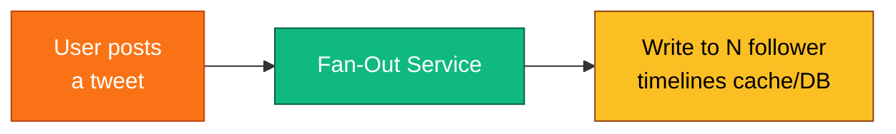
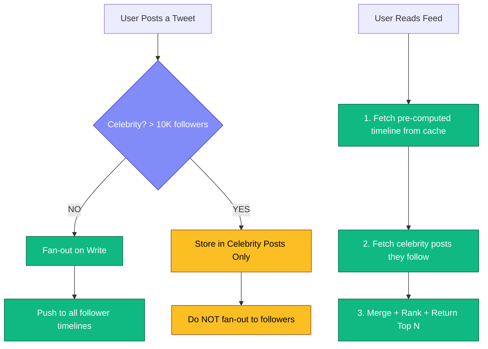
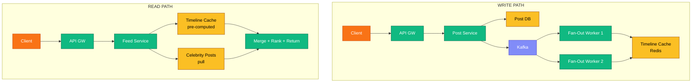

# Fan-Out Patterns - Complete Deep Dive

> **Prerequisites:** [Message Queues](/concepts/message-queues/), [Caching](/concepts/caching/)
> **Used in:** [Twitter Feed](/hld/TwitterFeed/), [Instagram](/hld/Instagram/), [Notification System](/hld/NotificationSystem/)

---

## What is Fan-Out?

Fan-out is distributing data from one source to many recipients. When a user posts content, how does it appear in their followers' feeds? That distribution mechanism is "fan-out."

**Real-world analogy:** A newspaper publisher. 
- **Fan-out on write (push):** The publisher prints a copy for each subscriber and delivers it to their mailbox every morning. When the paper is published, delivery happens immediately. But if you have 10 million subscribers, printing and delivering takes time and resources.
- **Fan-out on read (pull):** No delivery. Each reader drives to the newsstand and picks up the paper when they want to read. The publisher does no work upfront, but each reader does work on every read.

```
User with 1000 followers posts a tweet.

Fan-out on write: write to 1000 follower timelines immediately
Fan-out on read: do nothing now, compute when each follower opens app
```

---

## Fan-Out on Write (Push Model)

When a user publishes content, immediately write it to every follower's feed/inbox.



```
Detailed flow:
  1. User A (1000 followers) posts "Hello World"
  2. Fan-out worker fetches follower list: [B, C, D, ... 1000 users]
  3. For each follower, push tweet to their pre-computed timeline:
     Redis: ZADD timeline:B <timestamp> <tweet_id>
     Redis: ZADD timeline:C <timestamp> <tweet_id>
     Redis: ZADD timeline:D <timestamp> <tweet_id>
     ... (1000 writes)
  4. When follower B opens app:
     Redis: ZREVRANGE timeline:B 0 49  → instant! Already computed.

Timeline storage (Redis Sorted Set per user):
  timeline:userB
  Score (timestamp)  |  Value (tweet_id)
  1709123456         |  tweet_001
  1709123400         |  tweet_002
  1709123300         |  tweet_003
  ...
  (keep last 800 tweets, trim rest)
```

**Pros:**
- Read is extremely fast (pre-computed, just fetch from cache)
- Consistent user experience (instant feed loading)
- Simple read path (one cache lookup)

**Cons:**
- Write amplification (1 post → N writes, where N = follower count)
- Wasted work for inactive users (write to timelines of users who may never log in)
- Celebrity problem (celebrity with 50M followers = 50M writes per tweet!)
- Higher storage (every follower gets a copy of the tweet reference)

---

## Fan-Out on Read (Pull Model)

Do nothing at write time. When a user opens their feed, fetch and merge posts from everyone they follow.


```
Detailed flow:
  1. User B opens app, requests feed
  2. Feed service fetches B's following list: [A, X, Y, Z, ... 500 users]
  3. For each followed user, fetch their recent posts:
     Get posts from A (last 50)
     Get posts from X (last 50)
     Get posts from Y (last 50)
     ... (500 queries!)
  4. Merge all posts, sort by timestamp
  5. Return top 50 to user B

  Latency: depends on how many users B follows
           500 users × 1ms per query = 500ms (too slow!)
           Optimized with parallel fetches: ~50-100ms
```

**Pros:**
- Write is fast (just store the post once)
- No wasted work (only compute when user actually reads)
- Celebrity posts handled naturally (no fan-out at all)
- Less storage (post stored once, not copied to millions of timelines)

**Cons:**
- Read is slow (must aggregate from many sources in real-time)
- Inconsistent latency (depends on following count)
- Complex merge logic (deduplication, ranking, filtering)
- Higher read-time compute cost

---

## Hybrid Approach (What Twitter/Instagram Actually Use)

Combine both: use fan-out-on-write for regular users, fan-out-on-read for celebrities.



```
Example:
  User B follows: [Alice(200 followers), Bob(500), Taylor(50M)]

  When Alice posts:
    → Fan-out on write: push to all 200 follower timelines (incl. B)

  When Taylor posts:
    → No fan-out. Store in Taylor's post list only.

  When User B opens feed:
    → Fetch pre-computed timeline (has Alice's and Bob's posts)
    → Fetch Taylor's recent posts (fan-out on read for celebrity)
    → Merge and return
```

---

## The Celebrity Problem (Hot Partition)

The core challenge that makes fan-out interesting:

```
Regular user (1000 followers):
  Posts a tweet → fan-out to 1000 timelines → done in ~1 second
  Cost: 1000 Redis writes = cheap

Celebrity (50 million followers):
  Posts a tweet → fan-out to 50M timelines → takes MINUTES!
  Cost: 50M Redis writes = extremely expensive
  Problem 1: massive write amplification
  Problem 2: followers see tweet minutes late
  Problem 3: single tweet consumes enormous system resources
```

### Solutions

| Approach | How | Trade-off |
|---|---|---|
| **Hybrid model** | Skip fan-out for celebrities, merge at read time | Slightly slower reads |
| **Tiered fan-out** | Prioritize active followers first, fan-out to inactive later | Complexity |
| **Selective fan-out** | Only fan-out to online/recently-active users | May miss some users |
| **Async with priority** | Celebrity posts get lower priority in fan-out queue | Eventual delivery |

---

## Comparison Table

| Feature | Fan-Out on Write | Fan-Out on Read | Hybrid |
|---|---|---|---|
| Write speed | Slow (N writes per post) | Fast (1 write) | Medium |
| Read speed | Very fast (pre-computed) | Slow (aggregate on demand) | Fast |
| Storage | High (copies everywhere) | Low (stored once) | Medium |
| Celebrity handling | Terrible (50M writes) | Good | Good |
| Inactive users | Wasted writes | No waste | Configurable |
| Consistency | High (feed ready instantly) | Depends on merge window | High |
| Complexity | Low (read path simple) | High (complex merge) | High |
| Best for | Most social feeds | Celebrity-heavy feeds | Production systems |

---

## Architecture for News Feed (Complete)



---

## When to Use / When NOT to Use

### Fan-Out on Write:
- **Use when:** Read-heavy, followers are mostly active, user follows < 5000 people
- **Don't use when:** Many celebrities, write-heavy, most followers are inactive

### Fan-Out on Read:
- **Use when:** Users follow many celebrities, writes must be fast, storage is expensive
- **Don't use when:** Read latency must be < 50ms, simple architecture preferred

### Hybrid:
- **Use when:** Building a production social feed at scale
- **Don't use when:** Simplicity is priority (small user base < 1M)

---

## Real-World Examples

| Company | Approach | Details |
|---|---|---|
| **Twitter** | Hybrid | Fan-out on write for < 10K followers. Pull for celebrities. Timeline stored in Redis. |
| **Instagram** | Hybrid | Similar to Twitter. Machine learning ranking applied at read time. |
| **Facebook** | Fan-out on read (mostly) | Complex ranking model requires read-time aggregation. Edge Rank algorithm. |
| **LinkedIn** | Fan-out on write | Feed pre-computed for faster load. Network smaller than Twitter/FB. |
| **TikTok** | Fan-out on read | Algorithm-driven, not follow-based. Content fetched by recommendation model at read time. |

---

## Common Interview Questions

**Q: "How would you design a news feed system?"**
A: Hybrid fan-out. On write: publish post → fan-out workers push to follower timelines (Redis sorted sets) for regular users. Skip celebrities. On read: fetch pre-computed timeline from cache + pull recent celebrity posts + merge + rank + return top 50. Use Kafka to decouple write from fan-out.

**Q: "How do you handle the celebrity problem?"**
A: Define a threshold (e.g., > 10K followers). Above threshold, don't fan out on write — store post in celebrity's own list only. On read, merge celebrity posts with the pre-computed timeline. This limits write amplification to at most 10K writes per post.

**Q: "What's the storage requirement for pre-computed timelines?"**
A: Store only tweet IDs (not full tweets). Each entry: 8 bytes (tweet_id) + 8 bytes (timestamp) = 16 bytes. Keep last 800 tweets per user. 200M DAU × 800 × 16B = ~2.5 TB in Redis. Expensive but feasible with Redis Cluster.

**Q: "How do you handle a user unfollowing someone?"**
A: For fan-out on write: don't immediately remove old posts from timeline (expensive). Let them age out naturally as new posts push them down. For new posts, the unfollowed user's tweets simply stop being fanned out. Eventually the timeline contains none of their content.

**Q: "Fan-out on write or read for a notification system?"**
A: Fan-out on write (push). Notifications are time-sensitive and infrequent per user. When an event triggers a notification (new follower, like, comment), immediately write to the recipient's notification inbox. Users check notifications infrequently, so pre-computing ensures instant load when they do.

---

[← Back to Fundamentals](/concepts) | [Next: Event Sourcing →](/concepts/event-sourcing/)
