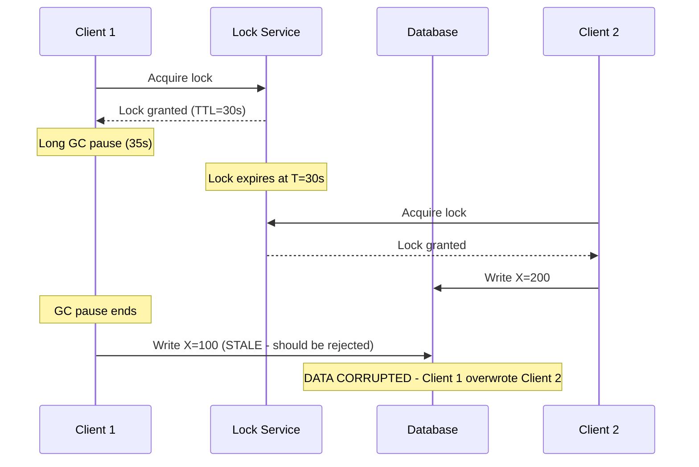
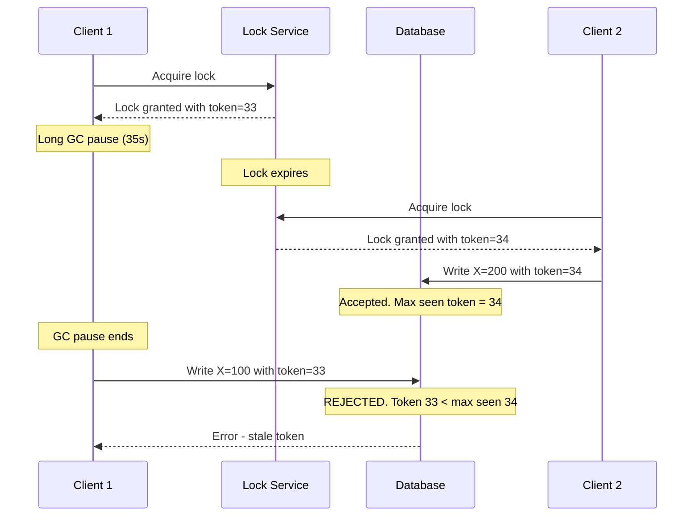
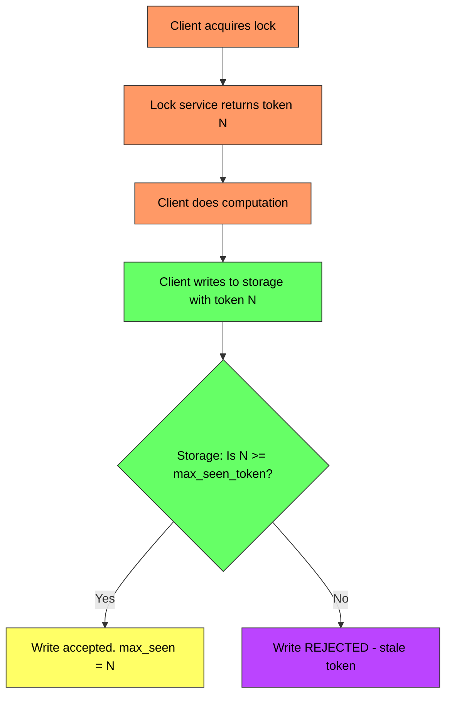

# Fencing Tokens - Complete Deep Dive

> **Prerequisites:** [Distributed Locking](/concepts/distributed-locking/), [Leader Election](/concepts/leader-election/)
> **Used in:** [Job Scheduler](/hld/JobScheduler/), [Digital Wallet](/hld/DigitalWallet/), [Key-Value Store](/hld/KeyValueStore/)

---

## What is a Fencing Token?

A fencing token is a monotonically increasing number issued with every lock acquisition. The storage layer (database, file system, message queue) rejects any write that presents a token lower than the highest token it has already seen. This prevents stale lock holders from corrupting data after their lock has expired and been re-issued to another client.

**Real-world analogy:** Imagine a relay race where the baton has a number on it. Runner 1 gets baton #5. They stumble and slow down, so the race organizer gives Runner 2 baton #6. If Runner 1 eventually reaches the finish line with baton #5, the judges reject their result — baton #6 has already crossed. The baton number is the fencing token; the judges are the storage layer that enforces ordering.

---

## The Problem: Expired Lock Holders

Distributed locks have a timeout (TTL). If a lock holder pauses (GC pause, network delay, CPU saturation) longer than the TTL, the lock expires and gets re-acquired by another client.



**Without fencing tokens:** Client 1 doesn't know its lock expired. It proceeds to write stale data, overwriting Client 2's valid write. The lock provided a false sense of mutual exclusion.

---

## How Fencing Tokens Solve This



**Key insight:** The safety guarantee moves from the lock service (which can't prevent GC pauses) to the storage layer (which sees every write and can enforce ordering).

---

## How It Works



**Requirements:**
1. Lock service issues monotonically increasing tokens (never reuses or decreases)
2. Storage layer tracks the maximum token it has seen per resource
3. Storage rejects any write with a token lower than the current maximum
4. Client includes the token with every write operation

---

## Implementation Patterns

### With ZooKeeper

ZooKeeper's sequential ephemeral znodes naturally provide fencing tokens:

| ZooKeeper Feature | Role as Fencing Token |
|-------------------|----------------------|
| Sequential znode number | Monotonically increasing token |
| Ephemeral znode | Auto-deletes on session timeout (lock release) |
| Zxid (transaction ID) | Global ordering of all operations |

### With Redlock

Redis-based distributed locks (Redlock) do NOT natively provide fencing tokens. Martin Kleppmann's critique of Redlock specifically highlights this gap. You must add fencing separately:

```
LOCK = redis.lock("resource-X")
TOKEN = redis.incr("fence:resource-X")  # Separate atomic counter
# ... do work ...
storage.write(data, fence_token=TOKEN)   # Storage validates token
```

### With Database (Advisory Locks + Sequence)

```sql
-- Lock acquisition with fencing token
BEGIN;
SELECT pg_advisory_lock(resource_id);
INSERT INTO fence_tokens (resource_id, token)
  VALUES ('job-123', nextval('fence_seq'))
  RETURNING token;
-- ... do work with token ...
COMMIT;
```

---

## Storage Layer Enforcement

The storage layer MUST enforce fencing. Without it, the token is just a number with no power.

| Storage Type | How to Enforce |
|-------------|---------------|
| **PostgreSQL** | Conditional update: `UPDATE ... SET ... WHERE fence_token < $new_token` |
| **DynamoDB** | Conditional expression: `ConditionExpression: "fence_token < :new_token"` |
| **S3** | Include token in object metadata; application-level check before overwrite |
| **Custom service** | Middleware that rejects requests with stale tokens |
| **Kafka** | Producer epoch (similar concept — broker rejects zombie producers) |

---

## Fencing Tokens vs Other Safety Mechanisms

| Mechanism | Prevents Stale Writes | Requires Storage Cooperation | Complexity |
|-----------|----------------------|------------------------------|------------|
| **Fencing token** | Yes | Yes | Low |
| **Lock with heartbeat** | Partially (still has window) | No | Medium |
| **CAS (Compare-and-Swap)** | Yes | Yes | Low |
| **Lease with refresh** | Partially | No | Medium |
| **Consensus (Raft/Paxos)** | Yes (via leader term) | Built-in | High |

**Raft's term number** is essentially a fencing token — when a new leader is elected with term T+1, followers reject AppendEntries from the old leader with term T.

---

## Real-World Examples

| System | Fencing Mechanism |
|--------|-------------------|
| **ZooKeeper** | Sequential znode number / zxid |
| **etcd** | Revision number (monotonically increasing) |
| **Kafka** | Producer epoch (broker rejects zombie producers) |
| **Google Chubby** | Sequencer (lock sequence number included in RPCs) |
| **Raft consensus** | Leader term number |

---

## When to Use / When NOT to Use

✅ **Use fencing tokens when:**
- Distributed locks protect writes to external storage
- GC pauses, network delays, or process hangs could exceed lock TTL
- Data corruption from stale writes is unacceptable
- You need correctness, not just best-effort mutual exclusion

❌ **Don't use when:**
- Lock is only for efficiency (duplicate work is acceptable, not dangerous)
- Storage layer cannot be modified to check tokens (third-party API)
- Single-node system with no distributed coordination
- Using a consensus protocol that already provides equivalent guarantees (Raft terms)

---

## Common Interview Questions

**Q1: Why aren't distributed locks sufficient without fencing tokens?**
> Distributed locks have TTLs to prevent deadlocks if a holder crashes. But a holder can pause (GC, network) longer than the TTL without crashing. When it resumes, it believes it still holds the lock and writes stale data. The lock service has already given the lock to someone else. Fencing tokens make the STORAGE layer the enforcer — it rejects outdated writes regardless of what the client believes about its lock status.

**Q2: How is a fencing token different from optimistic concurrency control (CAS)?**
> Both prevent stale writes, but CAS compares the CURRENT value/version ("update if version = 5"), while fencing tokens compare a LOCK-ISSUED number ("reject if token < max seen"). CAS works for any concurrent access. Fencing tokens specifically address the "lock expired but holder didn't notice" problem. You can combine both: use CAS for general concurrency and fencing tokens for lock-protected critical sections.

**Q3: What happens if the lock service crashes and restarts?**
> The new lock service instance must issue tokens HIGHER than any previously issued. Solutions: (1) persist the last issued token to durable storage and resume from there, (2) use a source that never decreases like ZooKeeper's zxid or a database sequence, (3) use timestamps with sufficient precision (risky — clock can jump backward).

**Q4: How does Kafka use fencing to handle zombie producers?**
> When a transactional producer starts, it gets an epoch number from the transaction coordinator. If the producer hangs and a new instance starts, it gets epoch+1. When the zombie producer eventually tries to commit, brokers see its epoch is lower than the current epoch and reject the write. This prevents duplicate/stale messages from zombie producers.

**Q5: Can fencing tokens prevent all split-brain scenarios?**
> They prevent stale WRITES to cooperating storage layers, but they don't prevent stale READS or actions to non-cooperating external systems. If a stale lock holder sends an email or calls a third-party API, fencing tokens can't undo that. For those cases, you need idempotency keys and compensating transactions in addition to fencing.

---

## Navigation

[← Back to Fundamentals](/concepts)

[All Concepts](/concepts/) | [HLD Designs](/hld/)
