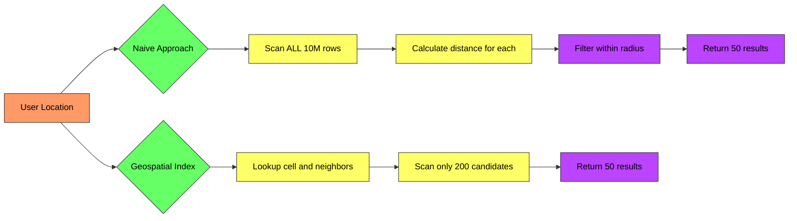
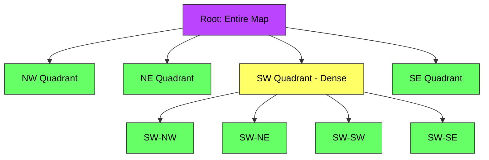

# Geospatial Indexing - Complete Deep Dive

> **Prerequisites:** [Database Indexing](/concepts/database-indexing/), [Caching](/concepts/caching/)
> **Used in:** [Uber](/hld/Uber/), [Zomato](/hld/Zomato/), [Yelp-like systems](/hld/)

---

## What is Geospatial Indexing?

Geospatial indexing is a technique for efficiently storing and querying location data (latitude/longitude) so you can answer questions like "find all restaurants within 2km of me" without scanning every record in the database.

**Real-world analogy:** Imagine you're looking for a coffee shop in a city. Without an index, you'd have to call every single coffee shop in the world and ask "are you within 2km of me?" With geospatial indexing, it's like having the city divided into numbered zones — you only check shops in your zone and neighboring zones, ignoring the rest of the world.

---

## The Problem: Why Not Just Use lat/lng?

A naive query like `WHERE distance(lat, lng, my_lat, my_lng) < 2km` requires computing the distance to EVERY row in the table. For 10M restaurants, that's 10M distance calculations per query.

---

## Geohash

Geohash divides the Earth into a grid of cells, each identified by a string. Longer strings = smaller cells = higher precision.

**Key insight:** Points that share a common prefix are geographically close. To find nearby points, just search for points with similar prefixes.

| Geohash Length | Cell Size | Use Case |
|---------------|-----------|----------|
| 4 | ~39km × 20km | Country-level |
| 5 | ~5km × 5km | City-level |
| 6 | ~1.2km × 0.6km | Neighborhood |
| 7 | ~150m × 150m | Block-level |
| 8 | ~38m × 19m | Building-level |

**Advantages:**
- Simple string prefix matching (works with any DB that supports LIKE or range queries)
- Easy to store in Redis Sorted Sets
- Compact representation

**Limitations:**
- Edge problem: two points on opposite sides of a cell boundary have very different geohashes despite being physically close
- Solution: always query the target cell AND its 8 neighbors

---

## H3 (Uber's Hexagonal Grid)

H3 divides the Earth into hexagons at multiple resolutions. Hexagons have a uniform distance from center to all edges (unlike squares), making them ideal for proximity queries.

| Resolution | Hex Edge Length | Area | Use Case |
|-----------|----------------|------|----------|
| 7 | ~1.2km | ~5.2 km² | City-level matching |
| 8 | ~460m | ~0.74 km² | Neighborhood matching |
| 9 | ~174m | ~0.1 km² | Block-level matching |
| 10 | ~66m | ~0.015 km² | Precise location |

**Advantages over Geohash:**
- Uniform distance from center to all neighbors (no edge distortion)
- Consistent neighbor traversal (always exactly 6 neighbors)
- Better for hexagonal ring queries (find all drivers in 1-ring, 2-ring, etc.)

---

## Quadtree

A quadtree recursively divides 2D space into four quadrants. Each node either contains points or is subdivided into 4 children. The tree adapts to data density — dense areas get more subdivisions.

**Best for:** In-memory spatial indexes where data density varies wildly (e.g., lots of drivers in Manhattan, few in rural areas).

---

## R-Tree

R-Trees group nearby objects using minimum bounding rectangles (MBRs) in a balanced tree. Used extensively in spatial databases (PostGIS, SQLite, MySQL).

**Best for:** Disk-based spatial indexes, range queries, and queries involving polygons or complex shapes (not just points).

---

## Query Flow: Find Nearby Drivers

```mermaid
flowchart LR
    A[Rider App] -->|"lat=12.97 lng=77.59 radius=3km"| B[Location Service]
    B --> C[Compute Geohash and Neighbors]
    C --> D["Query: geohash IN tdr1wy and 8 neighbors"]
    D --> E[(Redis Geo)]
    E --> F["Return drivers within cells"]
    F --> G[Exact Distance Filter]
    G --> H[Sort by Distance]
    H --> I["Return top 10 drivers"]

    classDef client fill:#f96,stroke:#333,color:#000
    classDef service fill:#6f6,stroke:#333,color:#000
    classDef data fill:#ff6,stroke:#333,color:#000
    classDef edge fill:#6cf,stroke:#333,color:#000

    class A client
    class B,C,G,H service
    class D,E data
    class F,I edge
```

**Steps:**
1. Rider sends location + radius
2. Service computes geohash of rider's location
3. Find the target cell + 8 neighboring cells
4. Query Redis/DB for all drivers in those 9 cells
5. Compute exact distances, filter within radius
6. Sort and return nearest drivers

---

## Comparison Table

| Feature | Geohash | H3 | Quadtree | R-Tree |
|---------|---------|-----|----------|--------|
| **Cell shape** | Rectangle | Hexagon | Rectangle (variable) | Rectangle (MBR) |
| **Resolution** | String length | Resolution level (0-15) | Tree depth | Tree depth |
| **Storage** | String (Redis, any DB) | 64-bit integer | In-memory tree | Disk-based tree |
| **Edge problem** | Yes (check 8 neighbors) | Minimal (6 uniform neighbors) | No (tree traversal) | No (MBR overlap) |
| **Best for** | Simple proximity, Redis | Ride-sharing, hex rings | In-memory, variable density | PostGIS, polygons |
| **Complexity** | Low | Medium | Medium | High |
| **Update cost** | O(1) | O(1) | O(log n) | O(log n) |

---

## Technology Choices

| Tool | Type | Use Case |
|------|------|----------|
| **Redis GEOADD/GEOSEARCH** | In-memory | Real-time proximity, driver matching |
| **PostGIS** | Disk-based (R-Tree) | Complex spatial queries, polygons |
| **Elasticsearch geo_distance** | Search engine | Full-text + location combined |
| **DynamoDB + Geohash** | NoSQL | Serverless geospatial |
| **MongoDB 2dsphere** | NoSQL | Document-based geo queries |
| **H3 library** | Library | Hex-based analytics, Uber-style |

---

## When to Use Which

✅ **Geohash** when:
- You want simplicity and wide tool support
- Using Redis for real-time driver/rider matching
- Prefix-based queries are sufficient

✅ **H3** when:
- Building ride-sharing or delivery systems
- You need consistent ring-based queries
- Doing spatial analytics at multiple resolutions

✅ **Quadtree** when:
- Data density varies wildly across regions
- You need an in-memory spatial index
- You want adaptive resolution

✅ **R-Tree / PostGIS** when:
- Querying complex shapes (polygons, routes)
- You need disk-based persistence
- Combining spatial with relational queries

---

## Common Interview Questions

**Q1: How would you design "find nearby drivers" for Uber?**
> Use Redis Geo (backed by geohash internally). Drivers send GPS updates every 3-5 seconds, writing to Redis with GEOADD. When a rider requests a ride, use GEOSEARCH to find drivers within a radius. Start with a small radius (1km), expand if too few results. Filter by driver status (available, not on a trip). This gives sub-millisecond lookups for millions of drivers.

**Q2: What is the edge/boundary problem with geohash?**
> Two points can be physically very close (10 meters apart) but have completely different geohash prefixes because they sit on opposite sides of a cell boundary. Solution: always query the target cell AND all 8 surrounding cells. This guarantees you catch all nearby points regardless of boundary positions. The tradeoff is 9x more candidates to filter, but the exact distance calculation is cheap.

**Q3: Why does Uber use H3 instead of geohash?**
> Hexagons have a uniform distance from center to all 6 edges, unlike squares where corner distance is 1.4x the edge distance. This makes ring queries consistent — "all hexagons within 2 rings" gives a uniform coverage area. H3 also supports hierarchical resolution (zoom in/out) and the 6-neighbor traversal is simpler than geohash's 8-neighbor lookup. For dynamic pricing and supply-demand balancing across zones, hexagons give more accurate geographic representation.

**Q4: How would you handle real-time location updates at scale?**
> Drivers send updates every 3-5 seconds. At 1M active drivers, that's 200K-330K writes/second. Use Redis Geo with GEOADD (O(log N) per write). Shard by city/region to distribute load. Each Redis instance handles one geographic region. Use a consistent hashing layer to route location updates to the correct shard. TTL-based expiration removes stale driver locations automatically.

---

## Navigation

← [Database Sharding](/concepts/database-sharding/) | [Bloom Filters](/concepts/bloom-filters/) →

[All Concepts](/concepts/) | [HLD Designs](/hld/)
