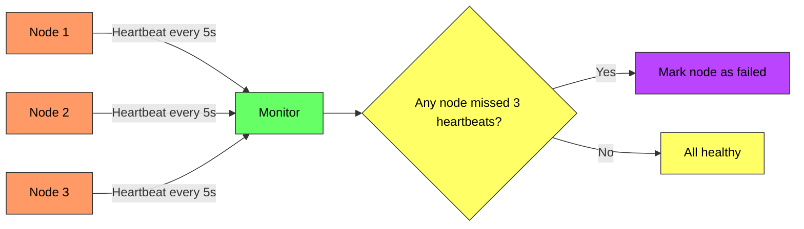
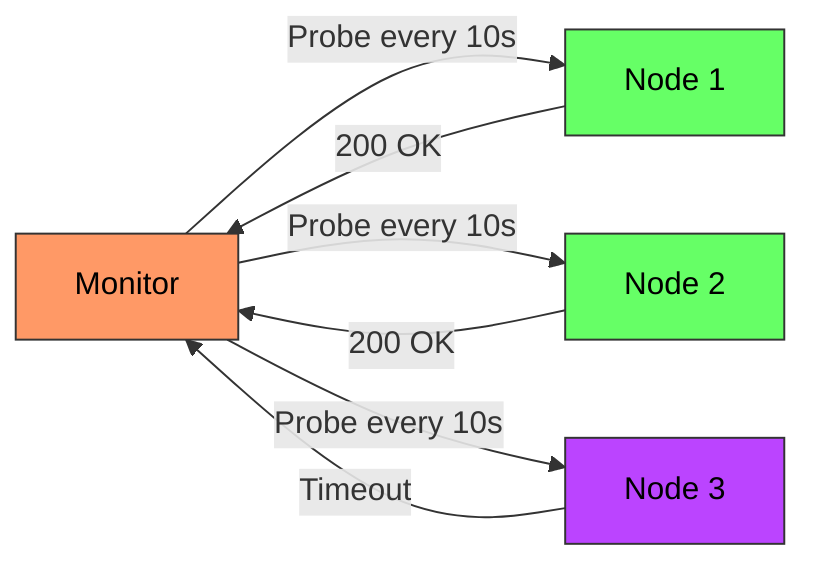
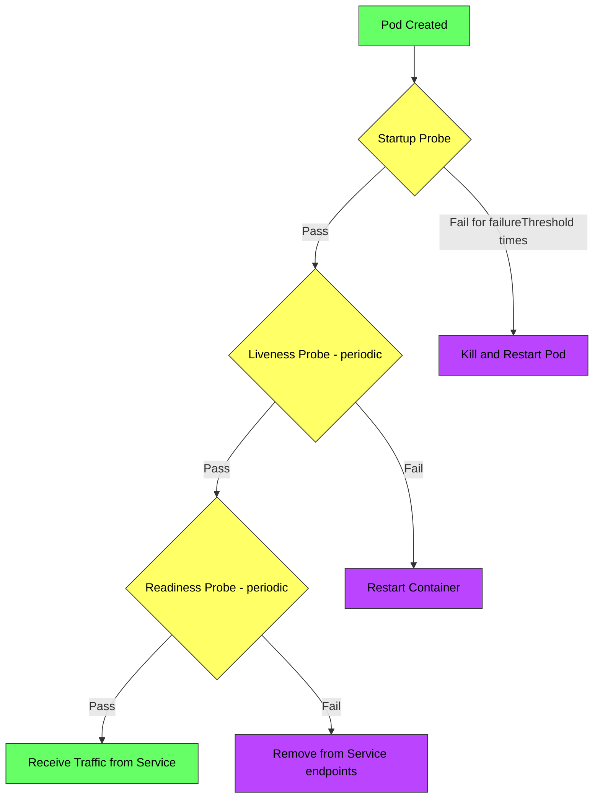
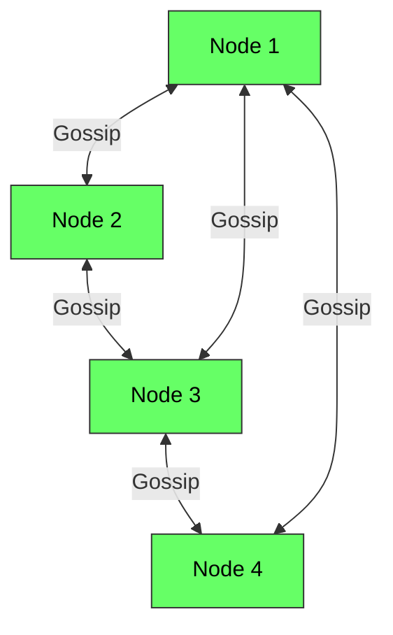

# Heartbeat and Health Checks - Complete Deep Dive

> **Prerequisites:** [Load Balancing](/concepts/load-balancing/), [Service Discovery](/concepts/service-discovery/)
> **Used in:** [Key-Value Store](/hld/key-value-store/), [Chat System](/hld/chat-system/), [Job Scheduler](/hld/job-scheduler/)

---

## What are Heartbeats and Health Checks?

Heartbeats are periodic signals sent by a node to indicate it's alive. Health checks are probes sent to a node to verify it can serve traffic. Both are failure detection mechanisms — they answer: "Is this node still alive and functional?"

**Real-world analogy:** Imagine a group of mountain climbers connected by a rope on a glacier. Every 30 seconds, each climber tugs the rope twice — a heartbeat. If a climber stops tugging, the others know something is wrong within 60 seconds and can begin rescue. Alternatively, the team leader shouts "everyone okay?" every minute (health check) and expects a response. No response within 2 minutes = trigger emergency protocol. Both detect problems; the choice depends on who initiates.

---

## Why Needed: Failure Detection

In distributed systems, nodes fail silently — they don't announce "I'm dying." You must actively detect failures to:

| Need | Why |
|------|-----|
| **Route around failures** | Stop sending traffic to dead nodes |
| **Trigger failover** | Promote replica to primary if leader dies |
| **Reclaim resources** | Release locks held by dead processes |
| **Maintain quorum** | Know cluster membership for consensus |
| **Alert operators** | Page on-call when capacity drops |

**The fundamental challenge:** You can't distinguish between "node is dead" and "network is slow." A missing heartbeat could mean either. This is why timeout tuning is critical.

---

## Push vs Pull Heartbeat

### Push-Based (Node Sends Heartbeat)



**Characteristics:**
- Node actively sends "I'm alive" messages to a central monitor
- Monitor tracks last heartbeat timestamp per node
- If no heartbeat received within timeout, node is declared dead

**Used by:** ZooKeeper (session heartbeats), Kafka (broker heartbeats to controller), HDFS (DataNode → NameNode)

---

### Pull-Based (Monitor Probes Node)



**Characteristics:**
- Monitor actively checks each node at regular intervals
- Node responds to health check probe
- No response within timeout = mark as unhealthy

**Used by:** AWS ELB health checks, Kubernetes probes, Consul health checks, Nagios/Prometheus

---

### Comparison

| Aspect | Push (Heartbeat) | Pull (Health Check) |
|--------|-------------------|---------------------|
| **Initiator** | Node → Monitor | Monitor → Node |
| **Network overhead** | Higher (every node sends periodically) | Controlled (monitor decides frequency) |
| **Scalability** | Better (no bottleneck at monitor polling) | Can bottleneck if monitoring many nodes |
| **Failure detection** | Node stops sending = maybe dead | Node doesn't respond = maybe dead |
| **Best for** | Large clusters, peer-to-peer | Centralized monitoring, load balancers |

---

## Health Check Endpoints

Modern services expose dedicated health endpoints for monitoring.

| Endpoint | Purpose | Response |
|----------|---------|----------|
| `/health` | Basic liveness | 200 OK or 503 |
| `/health/live` | Can the process respond at all? | 200 OK |
| `/health/ready` | Can it serve real traffic? | 200 OK or 503 (warming up) |
| `/health/startup` | Has initialization completed? | 200 OK or 503 |

**What to check in `/health/ready`:**
- Database connection pool has available connections
- Cache (Redis) is reachable
- Required downstream services are responding
- Disk space is sufficient
- Memory usage is within limits
- Application-specific readiness (model loaded, warmup complete)

---

## Kubernetes: Liveness vs Readiness vs Startup Probes



| Probe | Purpose | On Failure |
|-------|---------|------------|
| **Startup** | Has the app finished initializing? | Kill pod after failureThreshold |
| **Liveness** | Is the app alive or deadlocked? | Restart the container |
| **Readiness** | Can the app serve traffic right now? | Remove from load balancer (don't restart) |

**Critical distinction:**
- Liveness failure = "this process is broken, restart it"
- Readiness failure = "this process is temporarily unable to serve, stop sending traffic but don't kill it"

**Example:** During a database migration, readiness fails (don't send traffic) but liveness passes (process is fine, just busy).

---

## Failure Detection Timeout

Choosing the right timeout involves a tradeoff:

| Timeout | Too Short | Too Long |
|---------|-----------|----------|
| **Effect** | False positives (healthy nodes marked dead) | Slow detection (dead nodes serve traffic for too long) |
| **Risk** | Cascading failures from unnecessary failovers | Increased error rate from routing to dead nodes |
| **Typical** | 3-5 missed intervals | 10-30 seconds after last heartbeat |

**Common configuration:**
```
heartbeat_interval = 5 seconds
failure_threshold = 3 missed heartbeats
detection_time = 5s × 3 = 15 seconds
```

**Adaptive timeouts:** Some systems (like Cassandra's Phi Accrual Failure Detector) use statistical analysis of heartbeat arrival times to dynamically adjust the threshold — accounting for network jitter and node load.

---

## Gossip Protocol

In large clusters, a centralized monitor is a single point of failure. Gossip protocols decentralize failure detection.



**How gossip works:**
1. Each node maintains a membership list with heartbeat counters
2. Periodically, each node picks a random peer and exchanges membership info
3. If a node's heartbeat counter hasn't incremented within a timeout, it's suspected
4. Suspected nodes are confirmed dead after a grace period (or if multiple nodes agree)

**Properties:**
- No single point of failure (all nodes participate equally)
- Eventually consistent membership view
- Scales to thousands of nodes
- Converges in O(log N) rounds

**Used by:** Cassandra (gossiper), Consul (Serf), DynamoDB, Akka Cluster, HashiCorp Memberlist

---

## Real-World Implementations

| System | Mechanism | Detection Time |
|--------|-----------|---------------|
| **ZooKeeper** | Session heartbeat (push) | tickTime × sessionTimeout (typically 6-20s) |
| **Kafka** | Broker heartbeat to controller | 10s default (session.timeout.ms) |
| **Cassandra** | Gossip protocol | 10-20s with Phi Accrual Detector |
| **Kubernetes** | Pull-based probes (kubelet) | periodSeconds × failureThreshold (typically 30s) |
| **AWS ELB** | Pull-based HTTP/TCP check | interval × unhealthyThreshold (typically 30s) |
| **Consul** | Serf gossip + active health checks | 10-30s configurable |
| **HDFS** | DataNode heartbeat to NameNode | Default 10 minutes for dead declaration |

---

## When to Use / When NOT to Use

✅ **Use heartbeats and health checks when:**
- Load balancers need to route around failed instances
- Leader election requires failure detection (who is the new leader?)
- Distributed locks need to detect dead holders (release the lock)
- Service discovery must return only healthy instances
- Auto-scaling needs to replace failed instances

❌ **Don't use (or be careful) when:**
- Network is unreliable — frequent false positives cause thrashing
- Heartbeat storms during network partition cause cascading failures
- Health checks are too expensive (checking every dependency in `/health` overloads those dependencies)
- Simple client-side retry is sufficient (no need for proactive failure detection)

---

## Common Interview Questions

**Q1: What's the difference between liveness and readiness probes in Kubernetes?**
> Liveness answers "is this process broken beyond recovery?" — failure triggers a restart. Readiness answers "can this process handle traffic right now?" — failure removes it from the Service's endpoints but doesn't restart it. Example: a pod doing a cache warmup is NOT ready (don't send traffic) but IS live (don't kill it). Getting these wrong causes either unnecessary restarts (liveness too strict) or traffic to broken pods (readiness too lenient).

**Q2: How does Cassandra detect node failures without a central monitor?**
> Cassandra uses the Phi Accrual Failure Detector on top of gossip. Each node tracks the inter-arrival time of heartbeats from every other node. Rather than a binary alive/dead decision, it computes a "phi" value representing the suspicion level. When phi exceeds a threshold (default 8), the node is marked down. This adaptive approach handles variable network latency better than fixed timeouts — a node behind a slow link gets a longer leash than one on a fast network.

**Q3: How do you prevent false positives during GC pauses?**
> GC pauses cause heartbeats to stop temporarily, triggering false failure detection. Mitigations: (1) Set heartbeat timeout longer than the worst-case GC pause (e.g., 30s timeout for 10s max GC). (2) Use multiple heartbeat misses before declaring failure (failureThreshold = 3). (3) Separate the heartbeat thread from GC-affected threads if possible. (4) Use ZGC or Shenandoah GC to minimize pause times. (5) Implement "I'm back" recovery announcements so falsely-evicted nodes can rejoin quickly.

**Q4: How would you design failure detection for a 10,000 node cluster?**
> Centralized monitoring doesn't scale — the monitor becomes a bottleneck. Use gossip-based detection: each node monitors a small random subset of peers (3-5 nodes). Information propagates via epidemic gossip (O(log N) rounds to converge). Combine with SWIM protocol (Scalable Weakly-consistent Infection-style Membership): when a node suspects a peer, it asks K random other nodes to confirm (indirect probing), reducing false positives from asymmetric network issues.

---

## Navigation

[← Back to Fundamentals](/concepts)

[All Concepts](/concepts/) | [HLD Designs](/hld/)
