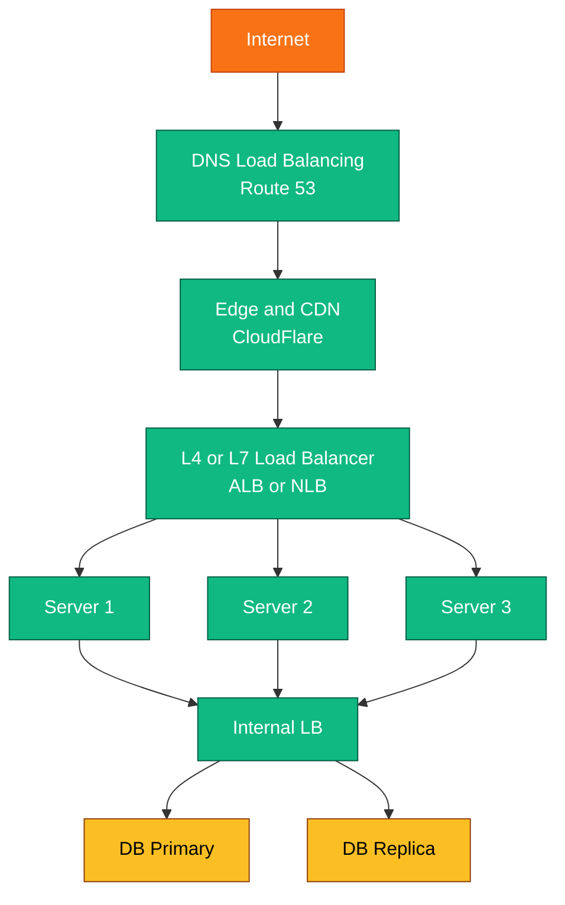

# Load Balancing - Complete Deep Dive

> **Prerequisites:** [Scalability](/concepts#scalability)
> **Used in:** Every system with multiple servers (all 20 designs)

---

## What is Load Balancing?

A load balancer distributes incoming requests across multiple servers so no single server gets overwhelmed.

**Real-world analogy:** A restaurant hostess. Customers (requests) arrive at the door. The hostess (load balancer) seats them at different tables (servers) so no single waiter is overloaded while others stand idle.

```
Without LB:
  All 10,000 users → Server 1 → crashes

With LB:
  10,000 users → Load Balancer → Server 1 (3,333 users)
                                → Server 2 (3,333 users)
                                → Server 3 (3,334 users)
```

---

## Why You Need It

1. **High availability:** If one server dies, LB routes to healthy servers. Zero downtime.
2. **Scalability:** Add more servers behind the LB when traffic grows.
3. **Performance:** Spread load evenly so no server is a bottleneck.
4. **Maintenance:** Take a server offline for updates without affecting users.

---

## Where Load Balancers Sit



You can have LBs at every layer — external (user-facing), internal (service-to-service), and even DB-level (read replicas).

---

## Load Balancing Algorithms

### 1. Round Robin

Rotate through servers in order: 1 → 2 → 3 → 1 → 2 → 3 ...

```
Request 1 → Server A
Request 2 → Server B
Request 3 → Server C
Request 4 → Server A
...
```

**Pros:** Dead simple. Even distribution.
**Cons:** Doesn't account for server capacity or current load. Server with a slow request still gets the next one.
**When to use:** All servers are identical and requests take similar time.

### 2. Weighted Round Robin

Same as Round Robin but stronger servers get more traffic.

```
Server A (weight=5): gets 5 out of every 8 requests
Server B (weight=2): gets 2 out of every 8 requests
Server C (weight=1): gets 1 out of every 8 requests
```

**When to use:** Mixed hardware (some servers have more CPU/RAM).

### 3. Least Connections

Send to the server with fewest active connections right now.

```
Server A: 45 active connections
Server B: 12 active connections  ← next request goes here
Server C: 67 active connections
```

**Pros:** Adapts to real-time load. Slow requests naturally get fewer new ones.
**Cons:** Slightly more overhead (must track connection counts).
**When to use:** Requests have varying processing times (some fast, some slow).

### 4. Least Response Time

Send to the server with the fastest recent response time + fewest connections.

**When to use:** When latency matters more than pure load distribution.

### 5. IP Hash

Hash the client's IP to determine which server to use. Same client always hits the same server.

```
hash("192.168.1.1") % 3 = 0 → Server A (always)
hash("10.0.0.5") % 3 = 2 → Server C (always)
```

**Pros:** Session persistence without sticky sessions. Good for caching (same user's data stays on same server).
**Cons:** Uneven if certain IPs send more traffic. Adding/removing servers changes all mappings.
**When to use:** When you need session affinity without cookies.

### 6. Consistent Hashing

Advanced version of IP Hash that minimizes disruption when servers are added/removed. Only K/N keys need to be remapped (K = keys, N = nodes).

**When to use:** Distributed caches (Redis cluster), database sharding.
**Full explanation:** [Consistent Hashing →](/concepts#consistent-hashing)

---

## Algorithm Comparison

| Algorithm | Even Distribution | Session Affinity | Adapts to Load | Complexity |
|---|---|---|---|---|
| Round Robin | Yes | No | No | Very Low |
| Weighted RR | Configurable | No | No | Low |
| Least Connections | Adaptive | No | Yes | Medium |
| IP Hash | Depends on IPs | Yes | No | Low |
| Consistent Hashing | Good | Yes | No | Medium |

---

## L4 vs L7 Load Balancing

| | Layer 4 (Transport) | Layer 7 (Application) |
|---|---|---|
| Sees | IP + Port + TCP/UDP | Full HTTP: URL, headers, cookies, body |
| Decision based on | Source/dest IP and port | URL path, headers, cookies, content |
| Speed | Faster (less parsing) | Slower (inspects full request) |
| Features | Basic distribution | Path routing, header-based routing, auth |
| SSL | Passes through (or terminates) | Always terminates, can inspect |
| Example | AWS NLB, HAProxy TCP mode | AWS ALB, Nginx, Envoy |

**L4 example:**
```
All traffic on port 443 → distribute to backend servers
(Doesn't know if it's /api/users or /static/image.png)
```

**L7 example:**
```
/api/* → API server pool
/static/* → CDN/static server pool
/ws/* → WebSocket server pool
Host: admin.example.com → Admin servers
```

**In interviews, L7 is almost always what you want** — you need path-based routing for microservices.

---

## Health Checks

How the LB knows a server is alive:

```
LB → GET /health → Server responds 200 OK (every 10 seconds)
LB → GET /health → Server responds 200 OK
LB → GET /health → Server doesn't respond (timeout)
LB → GET /health → Server doesn't respond (2nd miss)
LB: "Server is dead" → stop sending traffic → alert
```

**Types:**
- **Active:** LB periodically pings each server (most common)
- **Passive:** LB monitors real traffic. If a server returns 5xx for N consecutive requests, mark it unhealthy.

**Health check endpoint should verify:**
- Server process is running ✓
- Can connect to database ✓
- Can connect to Redis ✓
- Disk space is okay ✓

```java
@GetMapping("/health")
public ResponseEntity<Map<String, String>> health() {
    Map<String, String> status = new HashMap<>();
    status.put("server", "UP");
    status.put("database", dbCheck() ? "UP" : "DOWN");
    status.put("redis", redisCheck() ? "UP" : "DOWN");

    boolean healthy = status.values().stream().allMatch(v -> v.equals("UP"));
    return ResponseEntity.status(healthy ? 200 : 503).body(status);
}
```

---

## Sticky Sessions (Session Affinity)

**Problem:** User logs into Server A (session stored in Server A's memory). Next request goes to Server B → session not found → user is logged out.

**Solutions (in order of preference):**

| Solution | How | Pros | Cons |
|---|---|---|---|
| External session store (Redis) | Store sessions in shared Redis | Stateless servers, best approach | Extra infrastructure |
| Sticky sessions (cookie-based) | LB routes same user to same server | Simple | Server death = lost sessions |
| JWT tokens | Session data in the token itself | No server storage needed | Can't revoke easily, token size |

**Best practice:** Store sessions in Redis. Servers are stateless. LB uses any algorithm without worrying about session affinity.

---

## Load Balancing at Scale

**Single LB is a single point of failure.** Solutions:

1. **Active-Passive:** Two LBs. Primary handles all traffic. If it dies, passive takes over (via floating IP/DNS failover). 
2. **Active-Active:** Both LBs handle traffic (DNS returns both IPs). If one dies, the other handles all.
3. **DNS Load Balancing:** Multiple LB IPs in DNS. Client picks one. Coarse-grained but simple.

```
DNS returns: LB1 (52.1.1.1), LB2 (52.1.1.2)
Client A resolves to LB1 → routes to backend
Client B resolves to LB2 → routes to backend
LB1 dies → DNS health check removes it → all clients go to LB2
```

---

## Common Interview Questions

**Q: "What load balancing algorithm would you use here?"**
A: Least Connections for most cases (adapts to varying request times). Round Robin if all requests are similar duration. IP Hash or Consistent Hashing if you need session affinity or cache locality.

**Q: "How do you handle a server going down?"**
A: Health checks every 10 seconds. After 2-3 consecutive failures, mark server as unhealthy and stop routing traffic to it. Alert the team. Auto-scaling replaces it.

**Q: "What's the difference between L4 and L7?"**
A: L4 routes based on IP/port (fast, simple). L7 reads the full HTTP request and routes based on URL path, headers, or cookies (flexible, needed for microservices).

**Q: "Can the load balancer become a bottleneck?"**
A: Yes, if it's a single instance. Solutions: DNS-based multi-LB, active-active pair, or scaling the LB horizontally (AWS ALB auto-scales).

---

## Real-World Tools

| Tool | Type | Best For |
|---|---|---|
| AWS ALB | L7, managed | Most web apps, microservices |
| AWS NLB | L4, managed | Ultra-low latency, TCP/UDP |
| Nginx | L7, self-managed | Reverse proxy + LB combo |
| HAProxy | L4/L7, self-managed | High-performance, fine control |
| Envoy | L7, sidecar | Service mesh (Istio) |
| Cloudflare | L7, edge | CDN + LB + DDoS protection |

---

[← Back to Fundamentals](/concepts) | [← Rate Limiting](/concepts/rate-limiting/) | [Next: Message Queues →](/concepts/message-queues/)
