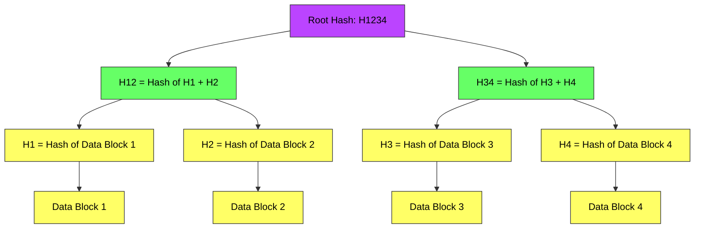
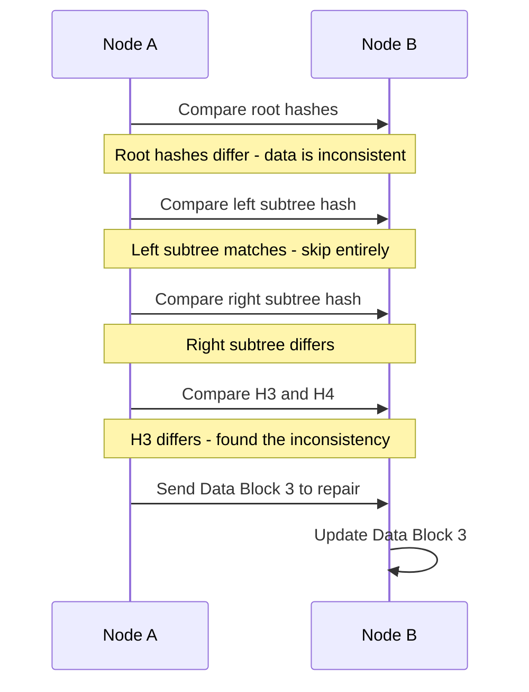
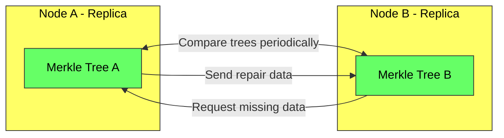
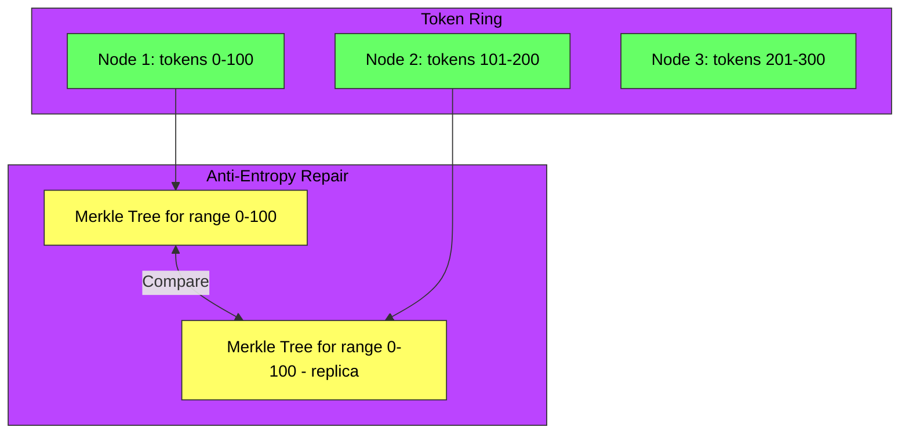

# Merkle Trees in System Design - Complete Deep Dive

> **Prerequisites:** [Database Replication](/concepts/database-replication/), [Consistent Hashing](/concepts/consistent-hashing/)
> **Used in:** [Key-Value Store](/hld/KeyValueStore/), [Unique ID Generator](/hld/UniqueIDGenerator/)

---

## What is a Merkle Tree?

A Merkle tree (hash tree) is a tree data structure where every leaf node contains the hash of a data block, and every non-leaf node contains the hash of its children's hashes. This allows efficient verification of data integrity and quick identification of differences between datasets.

**Real-world analogy:** Imagine two libraries trying to verify they have identical book collections. Instead of comparing every single book page-by-page (millions of pages), they first compare a single "summary hash" of the entire collection. If it matches — they're identical. If not, they compare section hashes (Fiction vs Non-Fiction), then shelf hashes, narrowing down to the exact books that differ. A Merkle tree lets you find differences in O(log n) comparisons instead of O(n).

---

## How It Works

### Structure

**Key property:** If any single data block changes, its hash changes, which propagates all the way up to the root. Two identical datasets produce identical root hashes.

### Detecting Differences Between Replicas

**Efficiency:** For N data blocks, finding the inconsistent blocks requires only O(log N) hash comparisons, not O(N) full comparisons.

---

## Anti-Entropy Repair

In distributed databases, replicas can drift out of sync due to node failures, network partitions, or missed writes. Anti-entropy is the background process that detects and repairs these inconsistencies.

**Process:**
1. Each replica maintains a Merkle tree over its data partition
2. Periodically, replicas exchange root hashes
3. If roots differ, traverse the tree to find divergent branches
4. Transfer only the differing data blocks
5. Rebuild affected tree hashes after repair

---

## Real-World Usage

| System | How Merkle Trees Are Used |
|--------|--------------------------|
| **Cassandra** | Anti-entropy repair via `nodetool repair`; compares token ranges between replicas |
| **DynamoDB** | Background anti-entropy to sync replicas after failures or network partitions |
| **Git** | Each commit is a Merkle tree of file hashes; efficiently detects changed files |
| **Blockchain** | Each block contains a Merkle root of all transactions; enables SPV (Simple Payment Verification) |
| **IPFS** | Content-addressed storage using Merkle DAGs for deduplication |
| **ZFS / Btrfs** | Filesystem integrity verification; detects silent data corruption (bit rot) |
| **AWS S3** | Verifies data integrity during transfers using content hashes |

---

## Merkle Trees in Cassandra

**Cassandra repair process:**
1. Coordinator picks a token range to repair
2. Each replica builds a Merkle tree for that range (hashing each partition key's data)
3. Trees are exchanged and compared
4. Differing partitions are streamed from the up-to-date replica
5. Process repeats for all token ranges

**Operational note:** Full repair in Cassandra can be expensive — it reads all data to build the tree. Incremental repair tracks which SSTables have been repaired to avoid redundant work.

---

## Merkle Trees in Git

Every Git commit is essentially a Merkle tree:

| Git Object | Role in Merkle Tree |
|-----------|---------------------|
| **Blob** | Leaf node — hash of file content |
| **Tree** | Interior node — hash of child blobs and trees (directory) |
| **Commit** | Root pointer — hash of root tree + parent commit |

This enables:
- **Fast diff:** Compare two commit trees; only traverse branches where hashes differ
- **Deduplication:** Identical files across branches share the same blob hash
- **Integrity:** Changing any file changes all ancestor hashes up to the root commit

---

## Building a Merkle Tree

| Step | Action | Complexity |
|------|--------|------------|
| 1. Hash leaves | Hash each data block | O(N) |
| 2. Build tree | Pair and hash up to root | O(N) |
| 3. Compare roots | Exchange single hash | O(1) |
| 4. Find diffs | Traverse differing branches | O(log N) |
| 5. Repair | Transfer differing blocks | O(D) where D = diffs |

**Total comparison cost:** O(log N) instead of O(N) — critical when N is millions of keys.

---

## When to Use / When NOT to Use

✅ **Use Merkle trees when:**
- You need to efficiently detect differences between large datasets on separate nodes
- Data integrity verification is critical (detecting corruption or tampering)
- You want to minimize data transfer during synchronization (only send diffs)
- Background anti-entropy repair is needed for eventually consistent systems

❌ **Don't use when:**
- Dataset is small enough to compare directly (< 1000 items)
- Data changes too frequently (constant tree rebuilds are expensive)
- You only need to verify a single item, not find diffs between sets
- Strong consistency protocols (Raft, Paxos) already keep replicas in sync — anti-entropy is a backup, not primary mechanism

---

## Comparison with Alternatives

| Approach | Finds All Diffs | Transfer Cost | Build Cost | Use Case |
|----------|----------------|---------------|-----------|----------|
| **Full scan** | Yes | O(N) | O(1) | Small datasets |
| **Checksum (single hash)** | Detects "any diff" only | O(N) to repair | O(N) | Simple integrity |
| **Merkle Tree** | Yes | O(D) | O(N) | Large datasets, few diffs |
| **Bloom Filter** | Approximate | O(D) | O(N) | Membership-only checks |
| **Version vectors** | Causal diffs | O(D) | O(1) per write | Detecting concurrent writes |

---

## Common Interview Questions

**Q1: How do Merkle trees help in distributed databases?**
> They enable efficient anti-entropy repair. When replicas drift out of sync (due to failures or partitions), comparing Merkle trees identifies exactly which data blocks differ in O(log N) comparisons. Only the differing blocks are transferred, minimizing network bandwidth. Without Merkle trees, you'd need to compare every single key-value pair — O(N) comparisons for potentially millions of keys.

**Q2: Why does Git use Merkle trees?**
> Git stores every file as a content-addressed blob (named by its SHA hash). Directories are trees of blob hashes. Commits point to root trees. This means: (1) identical files are automatically deduplicated, (2) comparing two commits only requires traversing branches where hashes differ, making diff O(changed files) not O(all files), and (3) any tampering with history changes all descendant hashes, making it detectable.

**Q3: What's the overhead of maintaining a Merkle tree?**
> Building the tree is O(N) where N is the number of data blocks. Each write requires updating O(log N) hashes (from leaf to root). Storage overhead is 2N-1 hash values (for a complete binary tree). For Cassandra, trees are typically built on-demand during repair rather than maintained continuously, trading repair speed for write performance.

**Q4: How do blockchains use Merkle trees?**
> Each block contains a Merkle root of all transactions in that block. This enables light clients (SPV) to verify a transaction is included in a block by requesting only O(log N) hashes (the Merkle proof/path) rather than downloading all transactions. The light client can verify the proof against the block header's Merkle root without trusting the full node.

---

## Navigation

[← Back to Fundamentals](/concepts)

[All Concepts](/concepts/) | [HLD Designs](/hld/)
