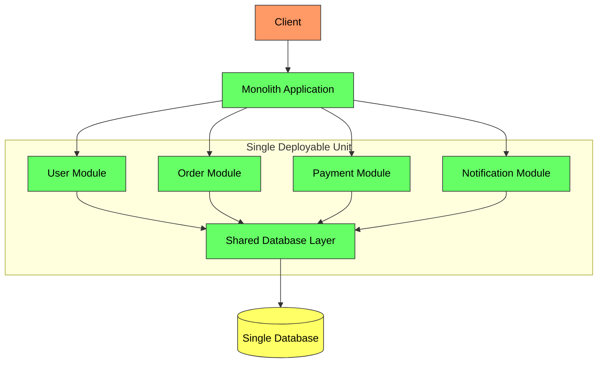
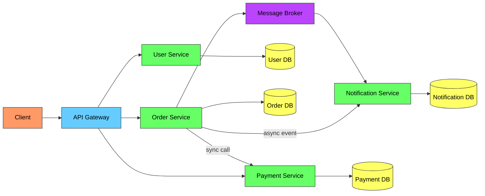
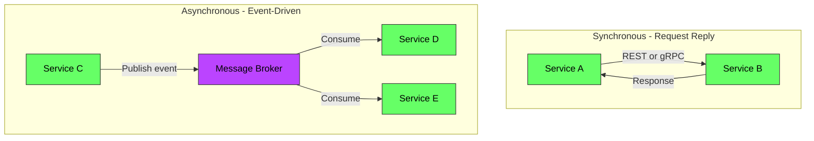

# Microservices vs Monolith - Complete Deep Dive

> **Prerequisites:** [Scalability](/concepts/scalability/), [Message Queues](/concepts/message-queues/), [API Design](/concepts/api-design/)
> **Used in:** [Uber](/hld/uber/), [Netflix](/hld/netflix/), [Zomato](/hld/zomato/), [Instagram](/hld/instagram/)

---

## What are Microservices?

Microservices is an architectural style where an application is composed of small, independently deployable services, each owning its own data and communicating over the network. A monolith is a single deployable unit containing all functionality.

**Real-world analogy:** A monolith is like a single massive factory that builds an entire car — engine, body, electronics, interior — all on one floor. If the paint machine breaks, the entire factory stops. Microservices are like an automotive supply chain: one company makes engines, another makes seats, another handles electronics. Each can scale, update, and deploy independently. But now you need shipping logistics (network), quality control across suppliers (observability), and contracts between companies (APIs).

---

## Monolith Architecture

---

## Microservices Architecture

---

## Monolith vs Microservices Comparison

| Aspect | Monolith | Microservices |
|--------|----------|---------------|
| **Deployment** | All or nothing | Independent per service |
| **Scaling** | Scale entire app | Scale individual services |
| **Team structure** | Single team or tightly coupled | Independent teams per service |
| **Data** | Shared database | Database per service |
| **Technology** | Single tech stack | Polyglot (each service picks best fit) |
| **Consistency** | ACID transactions easy | Eventual consistency, sagas needed |
| **Debugging** | Simple (single process, stack traces) | Complex (distributed tracing required) |
| **Latency** | In-process function calls | Network calls between services |
| **Failure** | Entire app fails together | Partial failure possible |
| **Development speed** | Fast initially, slows with size | Slower initially, scales with teams |

---

## When to Choose Monolith

✅ **Start with monolith when:**
- Small team (< 10 engineers)
- Unclear domain boundaries
- Early-stage product (still exploring)
- Simple deployment requirements
- Strong consistency needed everywhere

**The monolith-first approach** (recommended by Martin Fowler): Start monolithic, identify service boundaries as the system matures, then extract services where the pain is greatest.

---

## When to Choose Microservices

✅ **Move to microservices when:**
- Large team (> 20 engineers) that can't ship independently
- Different parts have vastly different scaling needs (e.g., search vs checkout)
- Different parts have different release cadences
- Clear domain boundaries exist
- Need technology diversity (ML service in Python, API in Go)

---

## Decomposition Strategies

| Strategy | How | Example |
|----------|-----|---------|
| **By business capability** | One service per business function | User, Order, Payment, Inventory |
| **By subdomain (DDD)** | Bounded contexts from Domain-Driven Design | Core domain vs supporting vs generic |
| **By data ownership** | Who owns this data? That's a service | User Profile Service owns user table |
| **Strangler fig** | Gradually replace monolith pieces | Route new features to microservice, old features stay |

---

## Inter-Service Communication

| Pattern | When to Use | Trade-off |
|---------|-------------|-----------|
| **REST (sync)** | Simple CRUD, client needs immediate response | Coupling, cascading failures |
| **gRPC (sync)** | Internal service-to-service, performance critical | Strong contracts, requires proto management |
| **Events (async)** | Decoupled notifications, eventual consistency OK | Harder to debug, eventual consistency |
| **Command queue (async)** | Work that can be deferred, retry needed | Latency, complexity |

---

## Data Ownership

Each microservice owns its data — no shared databases:

| Rule | Reason |
|------|--------|
| **No shared database** | Services become coupled through schema changes |
| **No direct DB access** | Other services query through the API, not SQL |
| **Each service has its own DB** | Can pick the right DB type per service |
| **Data duplication is OK** | Eventual consistency via events beats tight coupling |

**How services get data they don't own:**
- **API calls:** Ask the owning service (adds latency, creates dependency)
- **Event-driven sync:** Subscribe to change events, maintain a local read-only copy
- **CQRS:** Separate read models aggregating data from multiple services

---

## Challenges of Microservices

| Challenge | Solution |
|-----------|----------|
| **Distributed tracing** | OpenTelemetry, Jaeger — propagate trace IDs across services |
| **Distributed transactions** | Saga pattern (choreography or orchestration) |
| **Service discovery** | Consul, Eureka, Kubernetes DNS |
| **Configuration** | Centralized config server (Spring Cloud Config, Consul KV) |
| **Testing** | Contract testing (Pact), integration test environments |
| **Deployment** | CI/CD per service, container orchestration (Kubernetes) |
| **Debugging** | Centralized logging (ELK), distributed tracing |
| **Network reliability** | Circuit breakers, retries, timeouts, service mesh |
| **Data consistency** | Outbox pattern, CDC, eventual consistency |

---

## Service Mesh

A service mesh (Istio, Linkerd) handles cross-cutting concerns at the infrastructure level:
- mTLS between services (encryption)
- Circuit breaking and retries
- Traffic routing and canary deployments
- Observability (metrics, traces, logs)

All without changing application code — the sidecar proxy handles it.

---

## When to Use / When NOT to Use

✅ **Microservices excel when:**
- Teams need to ship independently
- Services have very different scaling profiles
- Clear bounded contexts exist
- Organization is large enough to own services end-to-end

❌ **Microservices hurt when:**
- Small team trying to move fast (operational overhead kills velocity)
- Domain boundaries are unclear (wrong cuts cause constant cross-service changes)
- Strong consistency is required everywhere (distributed transactions are painful)
- You can't invest in DevOps infrastructure (CI/CD, monitoring, tracing)

---

## Common Interview Questions

**Q1: How do you decide where to split a monolith into microservices?**
> Look for natural seams: modules that change independently, have different scaling needs, or are owned by different teams. Use Domain-Driven Design to identify bounded contexts. Good splits have minimal cross-service communication. Bad splits require constant synchronous calls between services. Start with the highest-pain module (slowest to deploy, most scaling bottleneck) and extract it first.

**Q2: How do you handle transactions across microservices?**
> You can't use traditional ACID transactions across services. Use the Saga pattern: a sequence of local transactions where each step publishes an event triggering the next. If a step fails, compensating transactions undo previous steps. Two flavors: choreography (services react to events) or orchestration (central coordinator manages the flow). Prefer choreography for simple flows, orchestration for complex ones with many steps.

**Q3: What's the biggest operational cost of microservices?**
> Observability. In a monolith, a stack trace shows you the full request path. In microservices, a single user request might touch 5-10 services. You need distributed tracing (OpenTelemetry), centralized logging (all services log to one place with correlated request IDs), and per-service dashboards. Without these, debugging production issues becomes nearly impossible.

**Q4: How does Netflix manage 700+ microservices?**
> Netflix invested heavily in platform tooling: Eureka (service discovery), Zuul (API gateway), Hystrix (circuit breaker, now deprecated for Resilience4j), Ribbon (client-side load balancing). Each service team owns their service end-to-end (you build it, you run it). They use chaos engineering (Chaos Monkey) to ensure resilience. The key insight: microservices at Netflix scale require a dedicated platform team building internal tools that other teams consume.

---

## Navigation

← [Scalability](/concepts/scalability/) | [API Design](/concepts/api-design/) →

[All Concepts](/concepts/) | [HLD Designs](/hld/)
