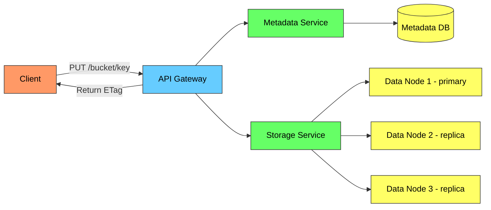
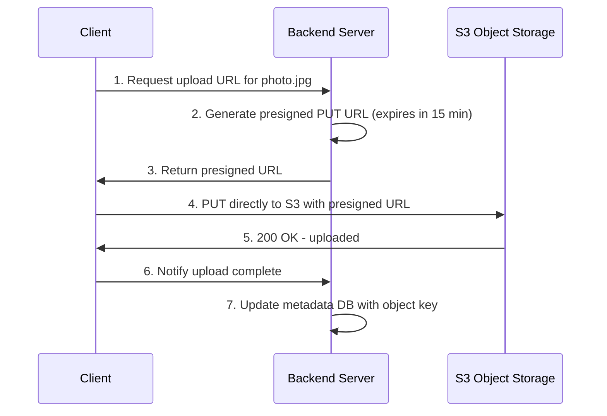
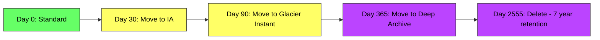

# Object Storage (S3) - Complete Deep Dive

> **Prerequisites:** [CDN](/concepts/cdn/), [API Design](/concepts/api-design/)
> **Used in:** [Instagram](/hld/instagram/), [Netflix](/hld/netflix/), [Pastebin](/hld/pastebin/), [Google Docs](/hld/google-docs/)

---

## What is Object Storage?

Object storage is a flat-namespace storage system designed for storing unstructured data (files, images, videos, backups) as discrete objects, each with a unique key, the data blob, and metadata. Unlike file systems (hierarchical) or block storage (raw disk), object storage is accessed via HTTP APIs and scales to exabytes.

**Real-world analogy:** Think of a massive warehouse with numbered lockers (objects). Each locker has a unique number (key), the stuff inside (data), and a label on the front describing what's inside (metadata). There are no folders or aisles — you just know the locker number and go directly to it. The warehouse can expand infinitely by adding more lockers.

---

## Object Storage vs File vs Block

| Aspect | Object Storage | File Storage | Block Storage |
|--------|---------------|--------------|---------------|
| **Access** | HTTP API (GET/PUT) | File system (NFS/SMB) | Raw blocks (iSCSI) |
| **Namespace** | Flat (key-value) | Hierarchical (directories) | None (raw sectors) |
| **Scale** | Exabytes (unlimited) | Petabytes | Terabytes |
| **Performance** | High latency, high throughput | Medium | Low latency |
| **Modification** | Replace entire object | Edit in place | Edit any block |
| **Use case** | Images, videos, backups, data lake | Shared files, home directories | Databases, VMs |
| **Examples** | S3, GCS, Azure Blob | EFS, NFS, CIFS | EBS, SAN |

---

## How Object Storage Works (S3 Architecture)

**Internal components:**
- **API Gateway:** Handles HTTP requests, authentication, routing
- **Metadata Service:** Maps keys to physical storage locations, stores object metadata
- **Storage Service:** Manages the actual data across distributed nodes
- **Data Nodes:** Store object data with replication (typically 3 copies across AZs)

---

## Presigned URLs (Upload/Download Without Backend)

Presigned URLs let clients upload/download directly to/from object storage without routing bytes through your backend servers:

**Why presigned URLs?**
- Your backend doesn't handle file bytes (saves bandwidth and CPU)
- Client uploads directly to object storage (faster, fewer hops)
- Time-limited (expires after 5-60 min)
- Scoped to specific key and operation (PUT or GET)
- No need to expose storage credentials to the client

---

## Storage Tiers and Lifecycle

| Tier | Access Pattern | Latency | Cost (per GB/month) | Use Case |
|------|---------------|---------|--------------------:|----------|
| **Standard** | Frequent | ms | ~$0.023 | Active data, app assets |
| **Infrequent Access (IA)** | Monthly | ms | ~$0.0125 | Backups, older logs |
| **Glacier Instant** | Quarterly | ms | ~$0.004 | Archives needing instant access |
| **Glacier Flexible** | Yearly | 3-5 hours | ~$0.0036 | Long-term archives |
| **Glacier Deep Archive** | Rarely | 12-48 hours | ~$0.00099 | Compliance, legal hold |

**Lifecycle rules** automatically transition objects between tiers:

---

## Multipart Upload

For large files (> 100MB), use multipart upload:

| Step | Action |
|------|--------|
| 1 | Initiate multipart upload → get upload ID |
| 2 | Split file into parts (5MB-5GB each) |
| 3 | Upload parts in parallel |
| 4 | Complete upload → S3 assembles parts |

**Benefits:**
- Parallel uploads (faster)
- Resume from failed part (no full re-upload)
- Stream upload (start before file is fully generated)

---

## Key Design Patterns

| Pattern | Description | When |
|---------|-------------|------|
| **Presigned URLs** | Client uploads/downloads directly | Always for user-generated content |
| **CDN in front** | Cache popular objects at edge | Static assets, media streaming |
| **Event notifications** | Trigger Lambda/function on upload | Image processing, virus scanning |
| **Cross-region replication** | Copy objects to another region | Disaster recovery, compliance |
| **Versioning** | Keep all versions of an object | Prevent accidental deletion |
| **Object Lock (WORM)** | Immutable objects | Compliance, legal hold |
| **Server-side encryption** | Encrypt at rest | Security compliance |

---

## Object Storage in System Design

| System | How Object Storage is Used |
|--------|---------------------------|
| **Instagram** | Store photos and videos; CDN serves them |
| **Netflix** | Store encoded video segments (HLS/DASH) |
| **Pastebin** | Store paste content (key = paste ID) |
| **Google Docs** | Store document revisions and attachments |
| **Data Lake** | Raw data landing zone for analytics |
| **ML Pipeline** | Training data and model artifacts |
| **Backup/DR** | Database dumps, point-in-time backups |

---

## S3 Consistency Model

Since December 2020, Amazon S3 provides **strong read-after-write consistency**:

| Operation | Consistency |
|-----------|-------------|
| PUT (new object) | Strongly consistent (read immediately) |
| PUT (overwrite) | Strongly consistent |
| DELETE | Strongly consistent |
| LIST | Strongly consistent |

This means: after a successful PUT, any subsequent GET will return the latest version. No more eventual consistency headaches for S3.

---

## When to Use

✅ **Use object storage when:**
- Storing unstructured data (images, videos, documents, logs)
- Files are written once and read many times (WORM pattern)
- You need virtually unlimited storage capacity
- HTTP-based access is sufficient (no random byte-range edits)
- You want built-in durability (99.999999999% — 11 nines)
- Serving static content behind a CDN

❌ **Don't use when:**
- You need low-latency random writes (use block storage/database)
- Files are frequently modified in-place (use file storage or database)
- You need POSIX file system semantics (use EFS/NFS)
- Sub-millisecond access is required (use in-memory cache)
- Storing small structured records (use a database)

---

## Common Interview Questions

**Q1: How would you design image upload for Instagram?**
> Client requests a presigned PUT URL from the backend (specifying file type, size). Backend generates the URL with a unique key (e.g., `images/{user_id}/{uuid}.jpg`), stores metadata in the database (status: "uploading"), and returns the URL. Client uploads directly to S3. S3 triggers an event notification which invokes an image processing pipeline (resize, thumbnail, CDN invalidation). On completion, the pipeline updates the metadata status to "ready" and the image becomes visible in the feed.

**Q2: How does S3 achieve 11 nines of durability?**
> S3 stores each object redundantly across a minimum of 3 Availability Zones within a region. Each AZ is a physically separate data center. The system continuously monitors data integrity using checksums and automatically repairs any detected corruption by re-replicating from healthy copies. The combination of geographic distribution, redundant copies, and continuous integrity checking achieves 99.999999999% durability — meaning you'd lose 1 object out of 10 billion stored over a 10,000-year period.

**Q3: Why use presigned URLs instead of proxying uploads through your backend?**
> Proxying means every byte flows through your servers — this consumes bandwidth, CPU, and memory. For a 50MB video upload at 10K concurrent uploads, your backend needs to handle 500GB of data in transit simultaneously. With presigned URLs, the client uploads directly to S3 (which is designed for this), and your backend only handles the lightweight metadata operation. This also reduces latency for the user since they connect directly to the nearest S3 edge.

**Q4: How do you handle large file uploads reliably?**
> Use multipart upload. Split the file into 5-100MB chunks, upload each chunk independently (with retries), then finalize. If a chunk fails, retry only that chunk, not the entire file. Upload chunks in parallel (5-10 concurrent) for speed. On mobile with unstable connections, use smaller chunks (5MB). Track upload progress on the client and resume from the last successful chunk. Set a lifecycle rule to abort incomplete multipart uploads after 24 hours to avoid storage costs.

---

## Navigation

← [Batch vs Stream](/concepts/batch-vs-stream/) | [CDN](/concepts/cdn/) →

[All Concepts](/concepts/) | [HLD Designs](/hld/)
