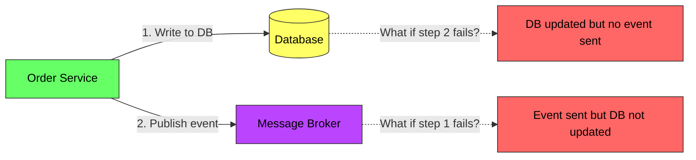
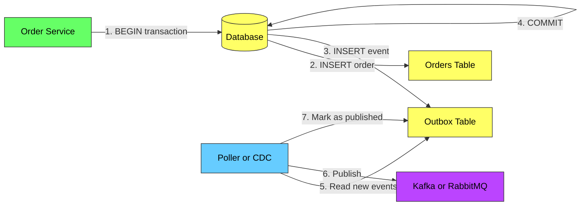
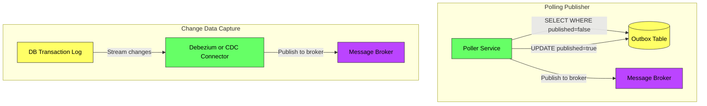

# Outbox Pattern - Complete Deep Dive

> **Prerequisites:** [Message Queues](/concepts/message-queues/), [Event Sourcing](/concepts/event-sourcing/), [Database Indexing](/concepts/database-indexing/)
> **Used in:** [Digital Wallet](/hld/DigitalWallet/), [Notification System](/hld/NotificationSystem/), [Stock Broker](/hld/StockBroker/)

---

## What is the Outbox Pattern?

The Outbox Pattern ensures that a database write and an event publication happen atomically — either both succeed or neither does. It solves the "dual-write problem" by writing the event to an outbox table in the same database transaction as the business data, then a separate process publishes those events to the message broker.

**Real-world analogy:** Imagine you're at a post office. Instead of handing a letter directly to the delivery truck (which might drive away before you finish paying), you pay at the counter and drop the letter in the outgoing mailbox (outbox) inside the building. A postal worker later picks up all letters from the outbox and puts them on the truck. The payment and letter placement happen together inside the building — the truck delivery is a separate, reliable step.

---

## The Dual-Write Problem

When a service needs to update its database AND publish an event, naive approaches fail:



| Scenario | Problem |
|----------|---------|
| DB write succeeds, event publish fails | Downstream services never learn about the change |
| Event publish succeeds, DB write fails | Downstream services act on phantom data |
| Service crashes between the two operations | Inconsistency depending on which completed |

You cannot make two independent systems (DB + broker) transactional without a coordination pattern.

---

## How the Outbox Pattern Works



**Step-by-step:**

1. Service begins a database transaction
2. Writes business data (e.g., insert order)
3. Writes event to the `outbox` table in the SAME transaction
4. Commits the transaction — atomicity guaranteed by the DB
5. A separate process (poller or CDC connector) reads unpublished events
6. Publishes events to the message broker
7. Marks events as published (or deletes them)

---

## Outbox Table Schema

```sql
CREATE TABLE outbox (
    id            UUID PRIMARY KEY,
    aggregate_type VARCHAR(255),    -- e.g., "Order", "Payment"
    aggregate_id   VARCHAR(255),    -- e.g., order ID
    event_type    VARCHAR(255),     -- e.g., "OrderCreated"
    payload       JSONB,           -- event data
    created_at    TIMESTAMP,       -- for ordering
    published     BOOLEAN DEFAULT FALSE
);
```

---

## Two Approaches: Polling vs CDC



| Aspect | Polling Publisher | CDC-Based (Debezium) |
|--------|-----------------|---------------------|
| **How it works** | Periodically queries outbox table | Reads database transaction log (WAL/binlog) |
| **Latency** | Polling interval (100ms - 5s) | Near real-time (sub-second) |
| **DB load** | Adds read queries to DB | Zero additional DB queries |
| **Complexity** | Simple to implement | Requires CDC infrastructure |
| **Ordering** | Must handle carefully | Preserves commit order |
| **Scalability** | Limited by polling frequency | Scales with DB throughput |
| **Best for** | Low-medium throughput | High throughput, low latency |

---

## Exactly-Once Publishing

The outbox pattern guarantees **at-least-once** delivery. For exactly-once semantics:

| Technique | How |
|-----------|-----|
| **Idempotent consumers** | Consumers deduplicate using event ID |
| **Idempotency key in event** | Include unique ID; consumer checks before processing |
| **Transactional outbox + dedup table** | Consumer writes to its own dedup table in same transaction |

---

## Comparison with Alternatives

| Pattern | Atomicity | Complexity | Performance | Use Case |
|---------|-----------|------------|-------------|----------|
| **Outbox (Polling)** | Strong | Low | Good | Most services |
| **Outbox (CDC)** | Strong | Medium | Excellent | High-throughput systems |
| **Event Sourcing** | Strong | High | Excellent | When full audit trail needed |
| **2PC (Two-Phase Commit)** | Strong | High | Poor | Legacy systems only |
| **Saga (Choreography)** | Eventual | Medium | Good | Multi-service workflows |
| **Best-effort + reconciliation** | Weak | Low | Excellent | Non-critical events |

---

## When to Use

✅ **Use when:**
- You need reliable event publishing after a DB write
- Downstream services depend on events for consistency
- You cannot tolerate lost events (payments, orders, notifications)
- You want to decouple services without sacrificing data integrity

❌ **Don't use when:**
- Events are purely informational and losing some is acceptable
- You're already using event sourcing (events ARE your state)
- Single-service, no downstream consumers
- Read-heavy system with no state changes to propagate

---

## Common Interview Questions

**Q1: Why not just publish the event first, then write to the DB?**
> If the DB write fails after publishing, downstream services will process a phantom event that doesn't correspond to any real data. Rolling back a published event is extremely difficult — consumers may have already acted on it. The outbox pattern avoids this by making the event write part of the DB transaction.

**Q2: How do you handle ordering of events?**
> For polling: use `created_at` timestamp and process events in order per aggregate ID (not globally). For CDC: the transaction log naturally preserves commit order. If strict global ordering is required, route all events for the same aggregate to the same Kafka partition using the aggregate ID as the partition key.

**Q3: What happens if the poller crashes after publishing but before marking as published?**
> The event will be published again on the next poll — this is the at-least-once guarantee. Consumers must be idempotent: they check the event ID against a deduplication table before processing. This is why the outbox event includes a unique ID.

**Q4: How does Debezium-based CDC outbox differ from the polling approach?**
> Debezium reads the database's write-ahead log (WAL/binlog) directly, so it sees committed events in real-time without polling. This means zero additional load on the database, sub-second latency, and natural commit ordering. The tradeoff is operational complexity — you need to manage Debezium connectors, handle schema evolution, and monitor connector lag.

**Q5: Can the outbox table grow unbounded?**
> Yes, if you don't clean it up. Two strategies: (1) Delete published events after a retention period (e.g., 7 days) via a scheduled job. (2) With CDC, you can delete immediately after commit since Debezium reads from the log, not the table. Monitor outbox table size as an operational metric.

---

## Navigation

← [Event Sourcing](/concepts/event-sourcing/) | [Saga Pattern](/concepts/saga-pattern/) →

[All Concepts](/concepts/) | [HLD Designs](/hld/)
