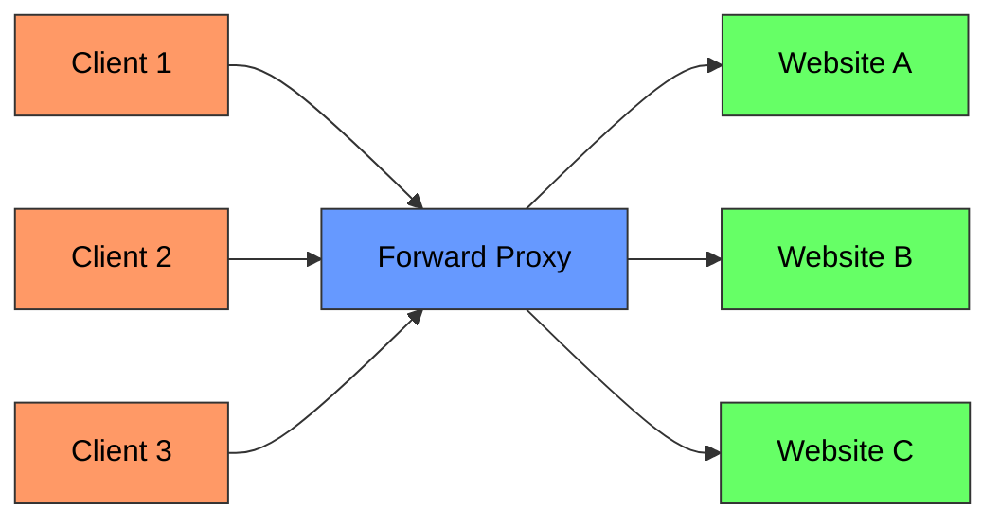
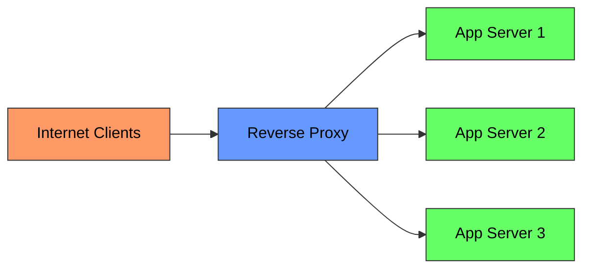
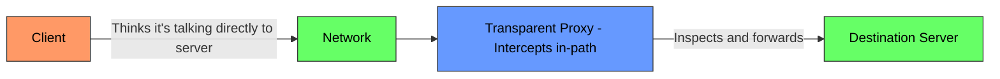
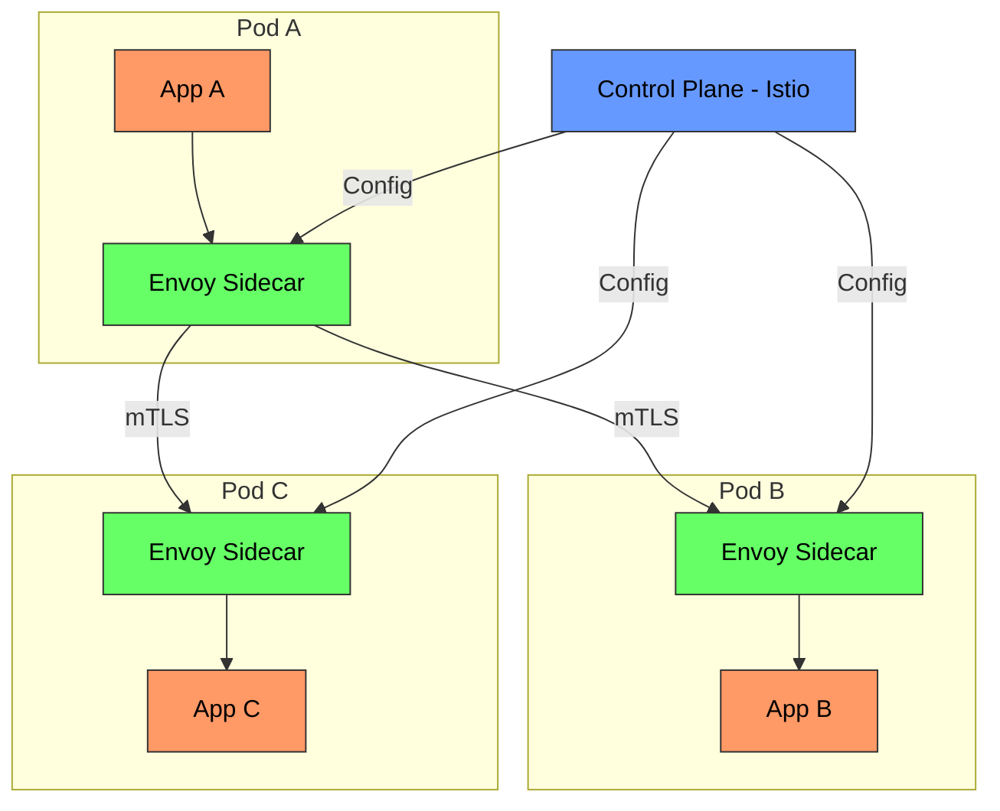

# Proxy in System Design - Complete Deep Dive

> **Prerequisites:** [Load Balancing](/concepts/load-balancing/), [CDN](/concepts/cdn/)
> **Used in:** [Uber](/hld/uber/), [Netflix](/hld/netflix/), [Instagram](/hld/instagram/)

---

## What is a Proxy?

A proxy is an intermediary server that sits between a client and a destination server, forwarding requests on behalf of one side. It can modify, filter, cache, or log traffic passing through it.

**Real-world analogy:** Think of a proxy as a personal assistant. A **forward proxy** is YOUR assistant — you tell them "get me information from Company X" and they go on your behalf (Company X sees the assistant, not you). A **reverse proxy** is COMPANY X's receptionist — you call the company, the receptionist answers, routes your call to the right department, and you never know the internal extension numbers. Both are intermediaries, but they work for different sides.

---

## Forward Proxy (Client-Side)

A forward proxy sits in front of clients and forwards their requests to the internet. The destination server sees the proxy's IP, not the client's.

**Use cases:**

| Use Case | How |
|----------|-----|
| **Corporate filtering** | Block access to certain websites |
| **Anonymity** | Hide client IP from destination |
| **Caching** | Cache frequently accessed content (reduce bandwidth) |
| **Access control** | Require authentication before internet access |
| **Geo-bypass** | Access content restricted to other regions (VPN) |
| **Logging** | Monitor all outbound traffic from an organization |

**Examples:** Squid proxy, corporate firewalls, VPN services, Tor network

---

## Reverse Proxy (Server-Side)

A reverse proxy sits in front of servers and handles incoming requests from the internet. Clients see the proxy's address, not the actual server's.

**Use cases:**

| Use Case | How |
|----------|-----|
| **Load balancing** | Distribute requests across backend servers |
| **SSL termination** | Handle TLS encryption/decryption at the proxy |
| **Caching** | Cache static assets and API responses |
| **Compression** | Gzip responses before sending to client |
| **Security** | Hide backend topology, WAF, DDoS protection |
| **A/B testing** | Route percentage of traffic to different backends |
| **Canary deployments** | Send 5% traffic to new version |

**Examples:** Nginx, HAProxy, Cloudflare, AWS ALB, Apache httpd

---

## Forward vs Reverse Proxy Comparison

| Aspect | Forward Proxy | Reverse Proxy |
|--------|--------------|---------------|
| **Works for** | Clients | Servers |
| **Hides** | Client identity | Server identity |
| **Position** | In front of clients | In front of servers |
| **Who configures** | Client or client's network admin | Server owner |
| **Common use** | Corporate networks, VPN | Web servers, CDN, LB |
| **Client awareness** | Client knows it's using a proxy | Client doesn't know (transparent) |
| **Example** | Squid, corporate firewall | Nginx, Cloudflare, HAProxy |

---

## Transparent Proxy

A transparent proxy intercepts traffic without the client's knowledge or configuration. The client doesn't know a proxy exists.

**Use cases:**
- ISP caching (intercepting HTTP to serve cached content)
- Corporate content filtering without client configuration
- CDN edge caching (intercepting DNS to route to nearest PoP)
- Government censorship (intercepting and blocking specific domains)

**Limitation:** Doesn't work well with HTTPS (can't inspect encrypted traffic without MITM certificate)

---

## Sidecar Proxy (Service Mesh)

A sidecar proxy runs alongside every service instance, handling all inbound and outbound network traffic transparently. The application communicates with localhost; the sidecar handles service discovery, TLS, retries, and observability.

**Envoy proxy features:**
- L7 load balancing (HTTP/2, gRPC native)
- Automatic retries with circuit breaking
- mTLS between all services (zero-trust)
- Distributed tracing headers propagation
- Rate limiting (local and global)
- Hot restarts (update config without dropping connections)

**Used by:** Istio (Envoy sidecar), Linkerd (linkerd-proxy), Consul Connect (Envoy)

---

## Nginx as Reverse Proxy

Nginx is the most popular reverse proxy for web applications.

| Feature | Capability |
|---------|-----------|
| **Load balancing** | Round-robin, least connections, IP hash, weighted |
| **SSL/TLS** | Termination, OCSP stapling, HTTP/2 |
| **Caching** | Proxy cache with configurable TTL |
| **Compression** | Gzip, Brotli |
| **Rate limiting** | Per-IP, per-URI request limits |
| **Health checks** | Active (periodic probe) and passive (failure counting) |
| **WebSocket** | Upgrade header forwarding |
| **Throughput** | 100K+ concurrent connections on modest hardware |

---

## Proxy Protocols Comparison

| Protocol | Layer | Use Case | Example |
|----------|-------|----------|---------|
| **HTTP Proxy** | L7 | Web traffic, API routing | Nginx, HAProxy |
| **SOCKS5 Proxy** | L5 | General TCP traffic, anonymity | Tor, SSH tunnels |
| **TCP Proxy** | L4 | Database connections, raw TCP | HAProxy, AWS NLB |
| **UDP Proxy** | L4 | DNS, gaming, streaming | Envoy, Nginx Stream |

---

## Real-World Architectures

| Company | Proxy Setup |
|---------|------------|
| **Netflix** | Zuul (edge gateway) + Envoy (internal mesh) |
| **Uber** | Nginx (edge) + custom sidecar proxies |
| **Cloudflare** | Global reverse proxy + CDN + WAF + DDoS |
| **Google** | GFE (Google Front End) as edge reverse proxy for all services |
| **Airbnb** | Envoy as both edge proxy and service mesh sidecar |

---

## When to Use / When NOT to Use

✅ **Use a proxy when:**
- You need to hide internal infrastructure from clients (reverse proxy)
- Traffic needs centralized TLS termination, caching, or compression
- Load balancing across multiple backend instances is required
- You want to add retries, circuit breaking, and observability without code changes (sidecar)
- Security requires traffic inspection, rate limiting, or WAF

❌ **Don't use when:**
- Direct connection is required for ultra-low latency (e.g., HFT)
- Single backend server with no need for any cross-cutting concerns
- The proxy becomes a performance bottleneck and can't be scaled
- Adding complexity without clear benefit (YAGNI)

---

## Common Interview Questions

**Q1: What's the difference between a reverse proxy and a load balancer?**
> A load balancer is one specific function (distribute traffic across servers). A reverse proxy is a broader concept that includes load balancing plus: SSL termination, caching, compression, request/response transformation, A/B testing, and security features. Every reverse proxy can load balance, but not every load balancer is a full reverse proxy. AWS ALB is both; AWS NLB is primarily a load balancer (L4, no caching/transformation).

**Q2: How does a sidecar proxy enable zero-trust networking?**
> In a service mesh, every pod gets an Envoy sidecar that terminates and originates mTLS. All pod-to-pod traffic goes through sidecars, never directly between application processes. Each sidecar has a cryptographic identity (SPIFFE) issued by the control plane. Traffic between sidecars is encrypted and authenticated. This means even if an attacker compromises the network, they can't eavesdrop or impersonate services — every connection is mutually authenticated at L7.

**Q3: Why would you put Nginx in front of an application that already has a built-in HTTP server?**
> (1) SSL termination — Nginx handles TLS efficiently, reducing CPU on app servers. (2) Static file serving — Nginx serves static assets from disk without hitting the app. (3) Connection buffering — Nginx absorbs slow clients (slow loris) so app server threads aren't blocked. (4) Rate limiting and security — protect the app without app-level code. (5) Load balancing across multiple app instances. (6) Caching — serve repeated responses without hitting the app.

**Q4: When would you choose HAProxy over Nginx?**
> HAProxy excels at pure TCP/HTTP load balancing with advanced health checking, connection draining, and session persistence. Choose HAProxy when: (1) you need L4 (TCP) proxying for non-HTTP protocols (databases, MQTT), (2) you need advanced active health checks with agent-check protocol, (3) connection draining during deploys is critical, (4) you need detailed per-backend statistics. Choose Nginx when: you also need static file serving, caching, or complex URL rewriting that HAProxy can't do.

---

## Navigation

[← Back to Fundamentals](/concepts)

[All Concepts](/concepts/) | [HLD Designs](/hld/)
