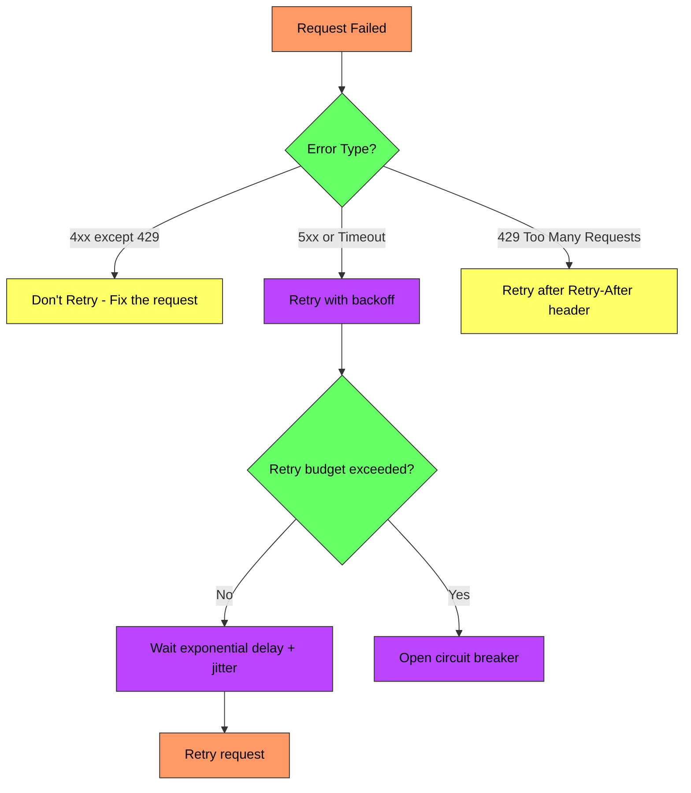
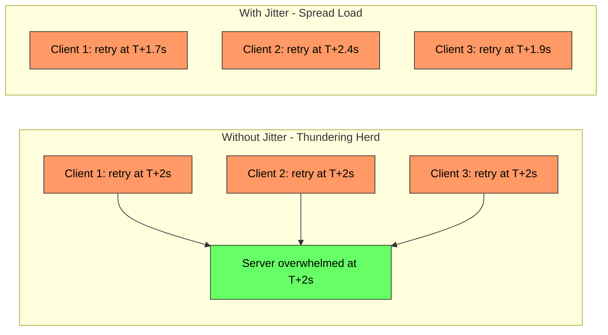
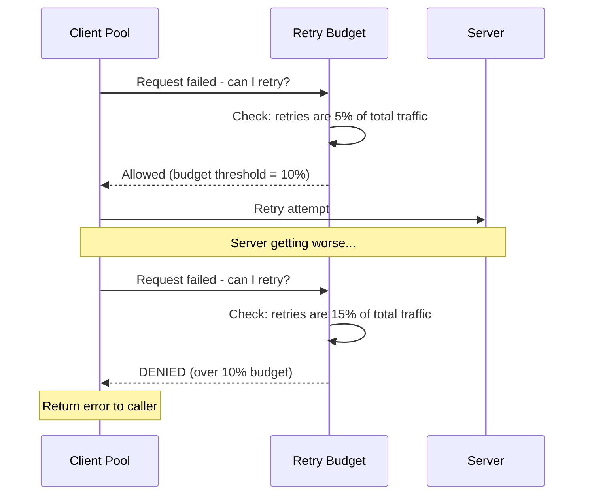
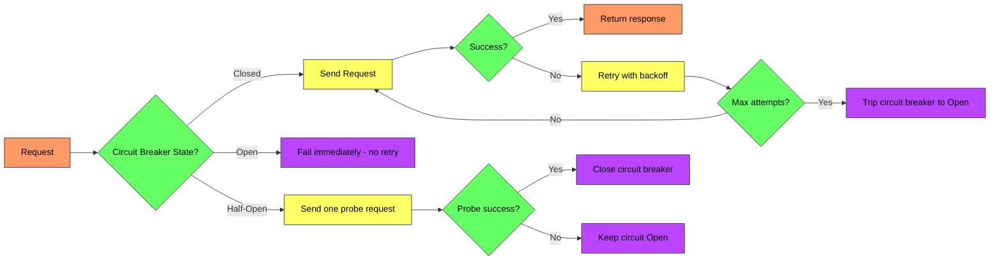

# Retry and Exponential Backoff - Complete Deep Dive

> **Prerequisites:** [Circuit Breaker](/concepts/circuit-breaker/), [Load Balancing](/concepts/load-balancing/)
> **Used in:** [Notification System](/hld/notification-system/), [Digital Wallet](/hld/digital-wallet/), [Chat System](/hld/chat-system/)

---

## What is Retry with Exponential Backoff?

A retry strategy where failed operations are retried with increasing delays between attempts. Each subsequent delay is typically double the previous one, preventing a failing system from being overwhelmed by immediate retries.

**Real-world analogy:** Imagine calling a busy restaurant for a reservation. If the line is busy, you don't immediately redial 100 times per second — you wait 1 minute, then 2 minutes, then 5 minutes. If you and 50 other people all redial at exactly the same intervals, the line stays permanently busy — so you add some randomness (jitter) to your wait time. This is exponential backoff with jitter.

---

## Transient vs Permanent Failures

The first rule of retries: only retry **transient** failures.

| Failure Type | Examples | Should Retry? |
|-------------|----------|---------------|
| **Transient** | Network timeout, 503, connection reset, rate limited (429) | Yes |
| **Permanent** | 400 Bad Request, 401 Unauthorized, 404 Not Found | No |
| **Ambiguous** | 500 Internal Server Error, timeout (did it succeed?) | Maybe (with idempotency) |



---

## Exponential Backoff Formula

```
delay = min(base_delay * 2^attempt, max_delay)
```

| Attempt | Base = 1s | Base = 100ms |
|---------|-----------|-------------|
| 1 | 1s | 100ms |
| 2 | 2s | 200ms |
| 3 | 4s | 400ms |
| 4 | 8s | 800ms |
| 5 | 16s | 1.6s |
| 6 | 32s (capped at max) | 3.2s |

**Cap the delay:** Without a max_delay, attempt 20 would wait 12+ days. Typical max: 30-60 seconds.

---

## Why Jitter Matters

Without jitter, all clients that failed at the same time retry at the same time (correlated retries). This causes **thundering herd** — the server gets hit by a wave of retries simultaneously.



### Jitter Strategies

| Strategy | Formula | Spread |
|----------|---------|--------|
| **Full jitter** | `random(0, base * 2^attempt)` | Maximum spread, lowest avg delay |
| **Equal jitter** | `base * 2^attempt / 2 + random(0, base * 2^attempt / 2)` | Guaranteed minimum wait |
| **Decorrelated jitter** | `min(max_delay, random(base, prev_delay * 3))` | AWS recommended; good spread |

**AWS recommendation:** Decorrelated jitter performs best in practice. Full jitter is simplest and nearly as effective.

---

## Retry Budget

A retry budget limits the total percentage of traffic that can be retries. This prevents cascading failures where retries amplify load.



| Approach | How It Works |
|----------|-------------|
| **Per-client budget** | Each client limits its own retry rate (e.g., max 3 retries per request) |
| **Global budget** | Total retry traffic across all clients capped at X% (e.g., 10% of total QPS) |
| **Token bucket** | Retries consume tokens; tokens replenish at a fixed rate |

**Google SRE recommendation:** Retry budget of 10% — if more than 10% of your requests are retries, stop retrying and let the circuit breaker open.

---

## Circuit Breaker Integration

Retries and circuit breakers work together:



**Flow:**
1. Normal: retries handle transient failures
2. Persistent failures: circuit breaker opens after N consecutive failures
3. Open circuit: all requests fail immediately (no retries, no load on downstream)
4. Half-open: periodic probe to check recovery
5. Recovered: circuit closes, retries resume normally

---

## What to Retry vs What NOT to Retry

| Retry | Don't Retry |
|-------|-------------|
| Network timeouts | Authentication failures (401, 403) |
| Connection refused | Validation errors (400) |
| 503 Service Unavailable | 404 Not Found |
| 429 Rate Limited | Business logic errors |
| 500 (if idempotent) | Non-idempotent POST that may have succeeded |
| DNS resolution failure | Certificate errors |
| Load balancer 502/504 | Payload too large (413) |

**Critical rule:** Only retry non-idempotent operations if you can detect whether the previous attempt succeeded (e.g., with an idempotency key).

---

## Real-World Implementations

| System | Retry Strategy |
|--------|---------------|
| **AWS SDK** | Exponential backoff + full jitter; max 3 attempts default |
| **gRPC** | Configurable retry policy in service config; supports hedging |
| **Envoy proxy** | Per-route retry policy with budget; retries on specific status codes |
| **Kafka producer** | `retries` config + `retry.backoff.ms`; idempotent producer prevents duplicates |
| **Spring Retry** | `@Retryable` annotation with configurable backoff |
| **Stripe API** | Client libraries retry 429s and 5xx with exponential backoff |

---

## Hedged Requests (Advanced)

Instead of waiting for a timeout to retry, send the request to multiple backends simultaneously and take the first response.

| Strategy | When | Tradeoff |
|----------|------|----------|
| **Standard retry** | After failure/timeout | Higher latency on failure |
| **Hedged request** | After P95 latency exceeded | Burns 5% extra capacity for better tail latency |
| **Speculative retry** | After fixed short delay | Good for read-only requests to replicas |

Used by Google (BigTable, Spanner) to reduce tail latency.

---

## When to Use / When NOT to Use

✅ **Use retry with backoff when:**
- Downstream services have transient failures
- Network is unreliable (cross-region, mobile clients)
- Rate limiting is in place (honor Retry-After)
- Operations are idempotent or you have idempotency keys

❌ **Don't use (or be very careful) when:**
- Failures are permanent (fix the root cause instead)
- Operation is non-idempotent and you can't detect duplicates
- System is already overloaded (retries make it worse — use circuit breaker)
- Latency budget is tight (retries add seconds)
- Upstream has its own retry (retry amplification across layers)

---

## Common Interview Questions

**Q1: What is retry amplification and how do you prevent it?**
> If Service A retries 3 times to Service B, and B retries 3 times to Service C, a single failure at C generates 9 requests (3 x 3). With N layers, it's 3^N. Prevention: only retry at the outermost layer (closest to the user), or use retry budgets at each layer to cap total retry traffic at ~10%.

**Q2: Why is full jitter better than no jitter in exponential backoff?**
> Without jitter, all clients that fail at time T retry at T+2, T+4, T+8 simultaneously — creating periodic load spikes (thundering herd). Full jitter randomizes the delay across the entire range [0, base * 2^attempt], spreading retries uniformly over time. AWS's analysis shows decorrelated jitter completes work faster than both full jitter and equal jitter in practice.

**Q3: How would you implement a retry budget in a microservices architecture?**
> Each service tracks two counters: total outgoing requests and retry attempts (per downstream). If retry_count / total_count exceeds a threshold (e.g., 10%), new retry attempts are rejected — the request fails immediately. The budget resets over a sliding window (e.g., last 60 seconds). This prevents a degraded downstream from being overwhelmed by retry storms.

**Q4: Should you retry a POST request that timed out?**
> It depends. The timeout means you don't know if the server processed the request. If the POST is idempotent (uses an idempotency key), retry safely. If it's not idempotent (e.g., debit an account), retrying could double-charge. In that case: query the server to check if the operation completed, or design the API with idempotency keys from the start.

---

## Navigation

[← Back to Fundamentals](/concepts)

[All Concepts](/concepts/) | [HLD Designs](/hld/)
