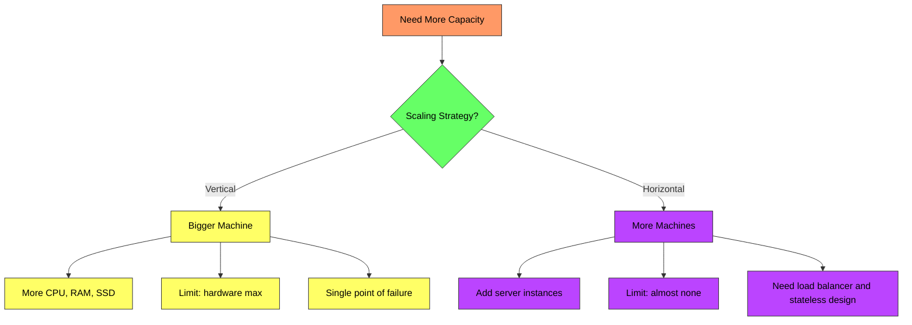
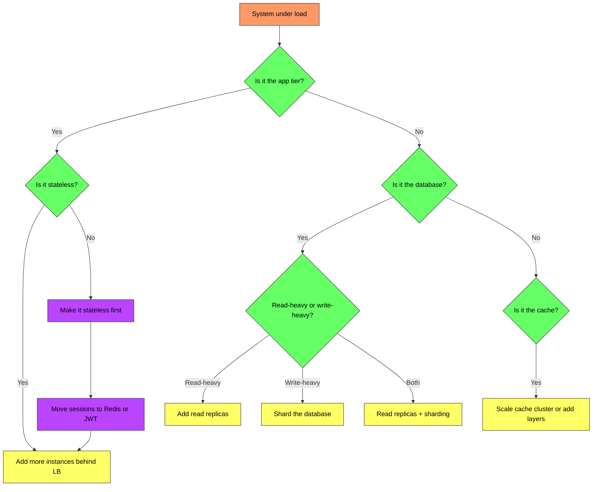
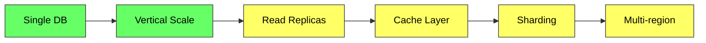

# Scalability - Complete Deep Dive

> **Prerequisites:** [Load Balancing](/concepts/load-balancing/), [Caching](/concepts/caching/)
> **Used in:** Every system design — scalability is a core non-functional requirement in all designs

---

## What is Scalability?

Scalability is the ability of a system to handle increased load by adding resources, without fundamental changes to the architecture. A scalable system maintains performance (latency, throughput) as demand grows.

**Real-world analogy:** Think of a pizza restaurant. **Vertical scaling** = buying a bigger oven (one oven does more). **Horizontal scaling** = opening more branches (many ovens work in parallel). The bigger oven eventually maxes out. More branches can scale almost indefinitely, but you need a system to route customers to the right branch and keep menus consistent.

---

## Vertical vs Horizontal Scaling

| Aspect | Vertical Scaling (Scale Up) | Horizontal Scaling (Scale Out) |
|--------|---------------------------|-------------------------------|
| **How** | Bigger hardware (CPU, RAM, disk) | More machines |
| **Limit** | Hardware max (~96 cores, 24TB RAM) | Practically unlimited |
| **Downtime** | Usually requires restart | Zero downtime (rolling) |
| **Cost curve** | Exponential (2x power ≠ 2x cost) | Linear (2x machines ≈ 2x cost) |
| **Complexity** | Low (same code, bigger box) | High (distributed systems challenges) |
| **Failure** | Single point of failure | Redundant by design |
| **Best for** | Databases, early-stage products | Stateless services, web/app tier |

---

## Scaling Decision Tree

---

## Stateless Services

The foundation of horizontal scaling is **statelessness** — any instance can handle any request because no request-specific state lives on the server.

| Stateful (hard to scale) | Stateless (easy to scale) |
|--------------------------|--------------------------|
| Session stored in server memory | Session in Redis or encoded in JWT |
| File uploads stored locally | Files in S3 or object storage |
| In-process cache per server | Shared cache (Redis cluster) |
| WebSocket bound to one server | WebSocket with pub-sub backplane |

---

## Auto-Scaling

Auto-scaling automatically adjusts the number of instances based on metrics:

| Metric | Scale-out Trigger | Scale-in Trigger |
|--------|-------------------|------------------|
| **CPU utilization** | > 70% for 3 min | < 30% for 10 min |
| **Request count** | > 1000 RPS per instance | < 200 RPS per instance |
| **Queue depth** | > 1000 messages pending | < 100 messages pending |
| **Response time** | P95 > 500ms | P95 < 100ms |

**Key parameters:**
- **Cooldown period:** Wait 5-10 min between scaling events to avoid thrashing
- **Min/max instances:** Set bounds (min=2 for redundancy, max=50 for cost)
- **Predictive scaling:** Pre-scale before known traffic spikes (e.g., Black Friday)

---

## Scaling the Database

The database is typically the hardest component to scale. The progression:

| Stage | Handles | Technique |
|-------|---------|-----------|
| **Single DB** | < 1K QPS | One powerful machine |
| **Vertical scale** | 1-5K QPS | Bigger machine (more RAM, faster SSD) |
| **Read replicas** | 10-50K read QPS | Route reads to replicas, writes to primary |
| **Cache layer** | 100K+ read QPS | Redis/Memcached absorbs 90%+ of reads |
| **Sharding** | 50K+ write QPS | Split data across multiple DB instances |
| **Multi-region** | Global scale | Replicate across regions for low latency |

---

## Real-World Numbers (Order of Magnitude)

| Component | Single Instance Capacity |
|-----------|------------------------|
| **Nginx/HAProxy** | ~50K-100K concurrent connections |
| **Application server** | 500-5K RPS (depends on work per request) |
| **PostgreSQL** | 5K-20K QPS (depends on query complexity) |
| **MySQL** | 5K-30K QPS |
| **Redis** | 100K-200K ops/sec (single thread) |
| **Kafka** | 500K-2M messages/sec per broker |
| **Elasticsearch** | 1K-10K queries/sec per node |

---

## Scaling the Cache

| Strategy | When | How |
|----------|------|-----|
| **Single Redis** | < 100K ops/sec | One instance handles everything |
| **Redis Cluster** | 100K-1M+ ops/sec | Shard keys across multiple nodes |
| **Multi-layer cache** | Mixed access patterns | L1 (in-process) → L2 (Redis) → L3 (CDN) |
| **Read replicas** | Read-heavy, geo-distributed | Redis replicas in each region |

---

## Comparison: Scaling Strategies

| Strategy | Complexity | Cost | Best For |
|----------|-----------|------|----------|
| **Vertical scaling** | Low | High per unit | Quick fix, databases |
| **Horizontal scaling** | Medium | Linear | Stateless app tier |
| **Caching** | Low-Medium | Low | Read-heavy workloads |
| **Read replicas** | Medium | Medium | Read-heavy databases |
| **Sharding** | High | Medium | Write-heavy databases |
| **CDN** | Low | Low | Static content, global users |
| **Async processing** | Medium | Low | Spiky workloads |

---

## When to Use Which

✅ **Vertical scaling when:**
- Early stage, low traffic (< 1K RPS)
- Database that's hard to shard
- Quick fix while planning horizontal approach
- Workload is CPU/memory bound on a single process

✅ **Horizontal scaling when:**
- Expecting growth beyond single-machine limits
- Need high availability (no single point of failure)
- Workload is parallelizable
- Cost efficiency matters at scale

❌ **Common mistakes:**
- Premature sharding before trying read replicas + caching
- Scaling out stateful services without extracting state first
- Not setting auto-scaling cooldown periods (leads to thrashing)
- Ignoring the database bottleneck while scaling the app tier

---

## Common Interview Questions

**Q1: How would you scale a system from 100 users to 10M users?**
> Progressive approach: (1) Start with a single server + DB. (2) Separate app and DB to different machines. (3) Add a load balancer + multiple app servers. (4) Add Redis cache to reduce DB load. (5) Add read replicas for read-heavy queries. (6) CDN for static content. (7) Shard the database when write throughput is the bottleneck. (8) Add message queues for async work. (9) Multi-region for global latency. Each step is triggered by a specific bottleneck, not done preemptively.

**Q2: What's the difference between scaling out and scaling up for databases?**
> Scaling up (vertical) means a bigger DB machine — more RAM means more data fits in the buffer pool, faster CPUs handle more queries. It's simple but has limits and creates a single point of failure. Scaling out (horizontal) means sharding — splitting data across multiple DB instances. Each shard handles a subset of the data. It's complex (need shard keys, cross-shard queries are expensive) but practically unlimited.

**Q3: How do you make a service stateless?**
> Identify all server-local state: sessions, caches, file uploads, WebSocket connections. Move sessions to Redis or use JWTs. Move files to S3. Move caches to a shared Redis cluster. For WebSockets, use a pub-sub backplane (Redis Pub/Sub) so any server can push to any client. Once no request depends on hitting a specific server, you can scale horizontally behind a load balancer.

**Q4: When is vertical scaling the right choice?**
> For databases in the early-to-mid stage (sharding is complex and premature optimization). For batch processing jobs that benefit from more RAM/CPU on a single node. For systems where the engineering cost of horizontal scaling exceeds the hardware cost of a bigger machine. Rule of thumb: if a $10K/month machine solves your problem for the next 2 years, that's cheaper than 3 months of engineering time to implement sharding.

---

## Navigation

← [Load Balancing](/concepts/load-balancing/) | [Database Sharding](/concepts/database-sharding/) →

[All Concepts](/concepts/) | [HLD Designs](/hld/)
