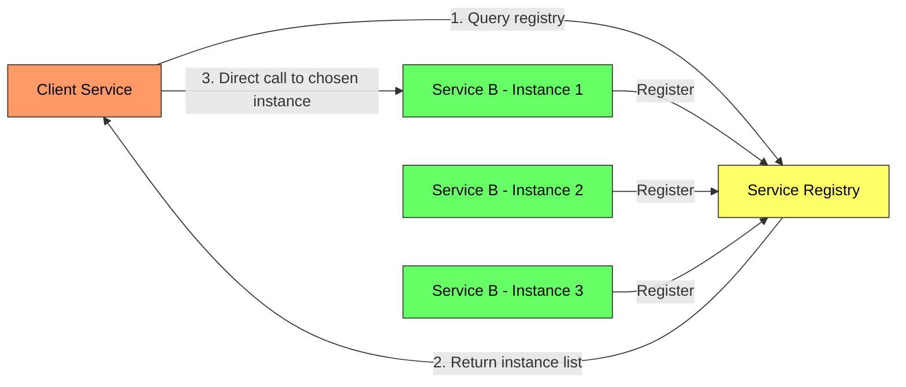
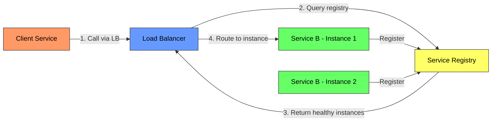
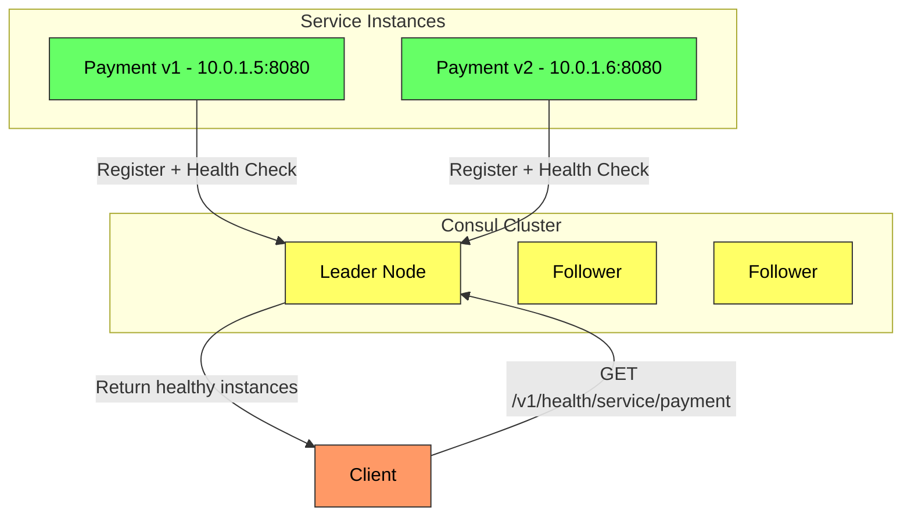
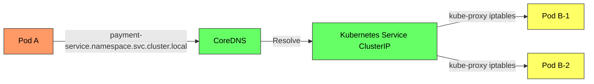
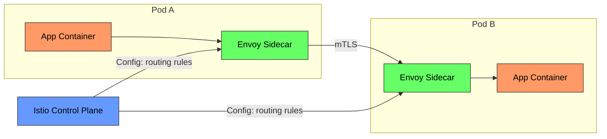

# Service Discovery - Complete Deep Dive

> **Prerequisites:** [Load Balancing](/concepts/load-balancing/), [Microservices](/concepts/microservices/)
> **Used in:** [Uber](/hld/uber/), [Chat System](/hld/chat-system/), [Notification System](/hld/notification-system/)

---

## What is Service Discovery?

Service discovery is the mechanism by which services in a distributed system locate and communicate with each other. It answers the fundamental question: "Service A needs to talk to Service B — what IP address and port is B running on right now?"

**Real-world analogy:** Imagine a large hospital where departments move floors frequently due to renovations. Doctors can't memorize room numbers that change weekly. Instead, the hospital has a front desk directory (registry) that always knows the current location of every department. When Dr. Smith needs the lab, she calls the front desk, gets the current floor and room, and goes directly there. Service discovery is that front desk.

---

## The Problem

In modern systems, services are:
- **Ephemeral** — containers start and die constantly (auto-scaling, deployments)
- **Dynamic** — IP addresses change with every restart
- **Numerous** — hundreds of service instances across multiple hosts
- **Multi-zone** — spread across availability zones and regions

Hardcoding `http://192.168.1.42:8080` breaks immediately when that instance is replaced.

---

## How It Works

### Client-Side Discovery

The client queries a service registry directly and picks an instance.

**Pros:** No extra network hop, client can use smart load balancing (least connections, weighted)
**Cons:** Client needs discovery logic in every language/framework, tightly coupled to registry

**Used by:** Netflix Eureka + Ribbon, gRPC client-side balancing

---

### Server-Side Discovery

The client calls a load balancer or gateway; the router queries the registry.

**Pros:** Client is simple (just a URL), discovery logic is centralized, language-agnostic
**Cons:** Extra network hop through LB, LB can become bottleneck

**Used by:** AWS ELB + ECS, Kubernetes Services, Nginx + Consul

---

## Discovery Mechanisms

### DNS-Based Discovery

| Mechanism | How It Works | Limitation |
|-----------|-------------|-----------|
| **A records** | Service name resolves to IP addresses | TTL-based caching causes stale entries |
| **SRV records** | Returns IP + port + priority + weight | More complex client parsing |
| **Round-robin DNS** | Multiple A records rotated | No health checking, uneven distribution |

**Problem with DNS:** TTL caching means clients may talk to dead instances for 30-300 seconds after a failure. Works for stable services, not for rapidly scaling microservices.

---

### Registry-Based: Consul

**Consul features:**
- Service registration with health checks (HTTP, TCP, gRPC, script)
- DNS interface (service.consul) AND HTTP API
- Key-value store for configuration
- Multi-datacenter federation
- Service mesh (Consul Connect) with mTLS

---

### Registry-Based: Netflix Eureka

| Feature | Eureka |
|---------|--------|
| **Registration** | Services self-register via REST API |
| **Heartbeat** | Every 30s; evicted after 90s of no heartbeat |
| **Client caching** | Clients cache registry locally (survives Eureka downtime) |
| **Replication** | Peer-to-peer between Eureka instances (AP system) |
| **Self-preservation** | If too many services deregister simultaneously, Eureka assumes network partition and stops evicting |

---

### Kubernetes DNS

**Kubernetes discovery:**
- Every Service gets a DNS name: `<service>.<namespace>.svc.cluster.local`
- ClusterIP acts as a virtual IP with kube-proxy routing to healthy pods
- Headless services (ClusterIP: None) return individual pod IPs for client-side balancing
- Endpoints controller automatically updates as pods start/stop

---

### Service Mesh: Istio and Envoy

**Service mesh adds:**
- Automatic service discovery via sidecar proxy
- mTLS between all services (zero-trust networking)
- Traffic splitting (canary deployments: 95% v1, 5% v2)
- Circuit breaking, retries, timeouts — configured externally, not in application code
- Observability (distributed tracing, metrics) without code changes

---

## Comparison Table

| Feature | DNS | Consul | Eureka | Kubernetes | Service Mesh |
|---------|-----|--------|--------|------------|-------------|
| **Health checking** | None | Built-in | Heartbeat | Liveness/Readiness probes | Sidecar-level |
| **Staleness** | TTL-based (30-300s) | Real-time | 30s heartbeat | Real-time | Real-time |
| **Load balancing** | Round-robin only | Client-side | Client-side (Ribbon) | kube-proxy (random) | Envoy (L7) |
| **Multi-DC** | Yes (GeoDNS) | Built-in | Manual | Federation | Multi-cluster |
| **Complexity** | Lowest | Medium | Medium | Integrated | Highest |
| **Language agnostic** | Yes | Yes (DNS/HTTP API) | Java-centric | Yes | Yes |

---

## When to Use / When NOT to Use

✅ **Use service discovery when:**
- Running microservices with dynamic scaling
- Services have multiple instances with changing IPs
- You need health-aware routing (skip dead instances)
- Deploying across multiple environments or regions

❌ **Don't need it when:**
- Monolithic application (single deployment)
- Fixed infrastructure with static IPs (rare today)
- Fewer than 5 services with stable endpoints
- Using a PaaS that handles routing transparently (Heroku, App Engine)

---

## Common Interview Questions

**Q1: What happens when the service registry goes down?**
> With client-side discovery (Eureka), clients cache the registry locally. If Eureka is down, clients use their cached copy — stale but functional. With server-side (Kubernetes), if CoreDNS is down, DNS resolution fails and new connections fail, but existing connections continue. In practice, registries are clustered (3-5 nodes) for high availability. Consul uses Raft consensus; Eureka uses peer-to-peer replication.

**Q2: How does Kubernetes service discovery differ from Consul?**
> Kubernetes builds discovery into the platform — every Service automatically gets a DNS name and a ClusterIP with health-aware routing via probes. Consul is a standalone tool you add to any infrastructure. Kubernetes is simpler within a cluster but harder across clusters. Consul supports multi-datacenter natively and offers more flexibility (KV store, service mesh). Many teams use Consul even on Kubernetes for cross-cluster discovery.

**Q3: Client-side vs server-side discovery — when to use each?**
> Client-side (Eureka, gRPC) when: you need smart load balancing (least connections, weighted), ultra-low latency (no extra hop), and services are in the same language ecosystem. Server-side (Kubernetes, AWS ELB) when: services are polyglot, you want clients decoupled from discovery logic, or you're already on a platform that provides it. Most modern systems use server-side (Kubernetes built-in) for simplicity.

**Q4: How do you handle service discovery across multiple regions?**
> Options: (1) Global load balancer (AWS Route 53 / Cloudflare) routes to the nearest region's entry point, then intra-region discovery takes over. (2) Multi-DC registry (Consul WAN federation) knows instances in all regions. (3) Service mesh with multi-cluster support (Istio multi-cluster). The key decision: do you want cross-region calls (higher latency, more resilient) or region-local only (lower latency, less resilient)?

---

## Navigation

[← Back to Fundamentals](/concepts)

[All Concepts](/concepts/) | [HLD Designs](/hld/)
