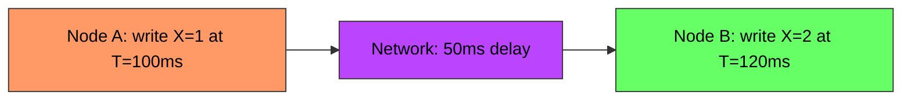
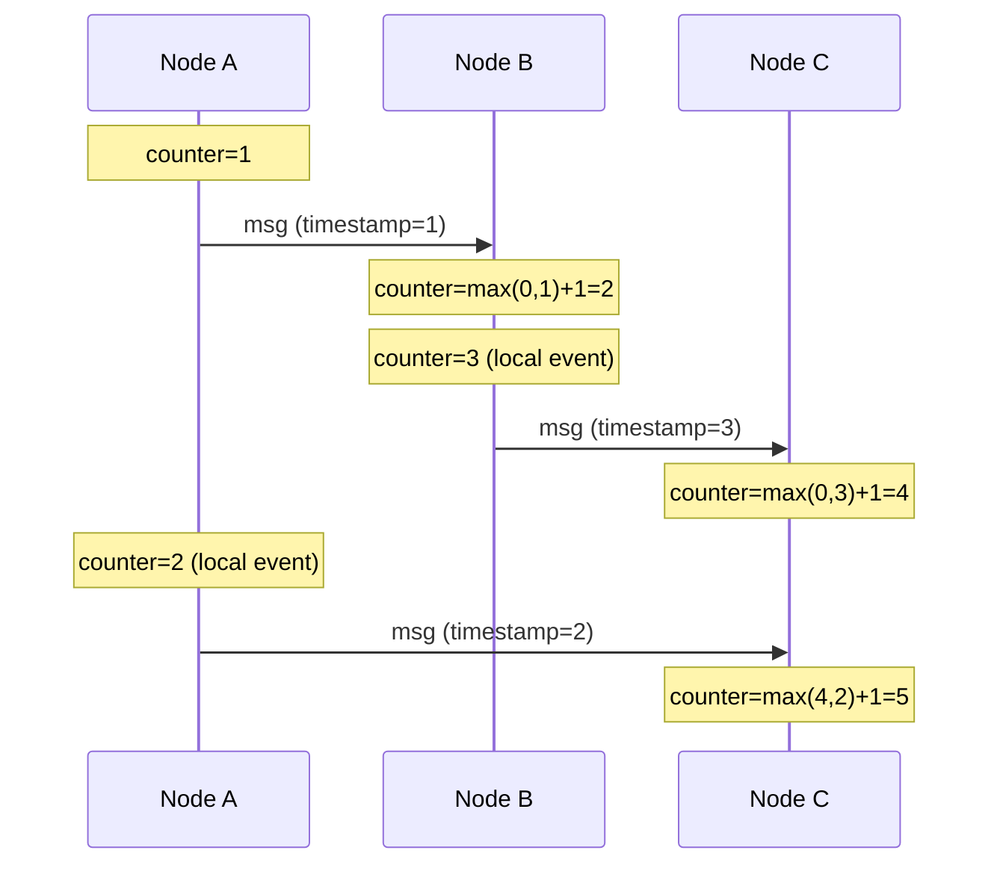
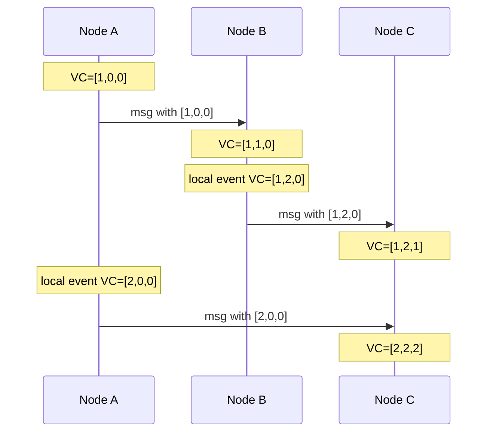
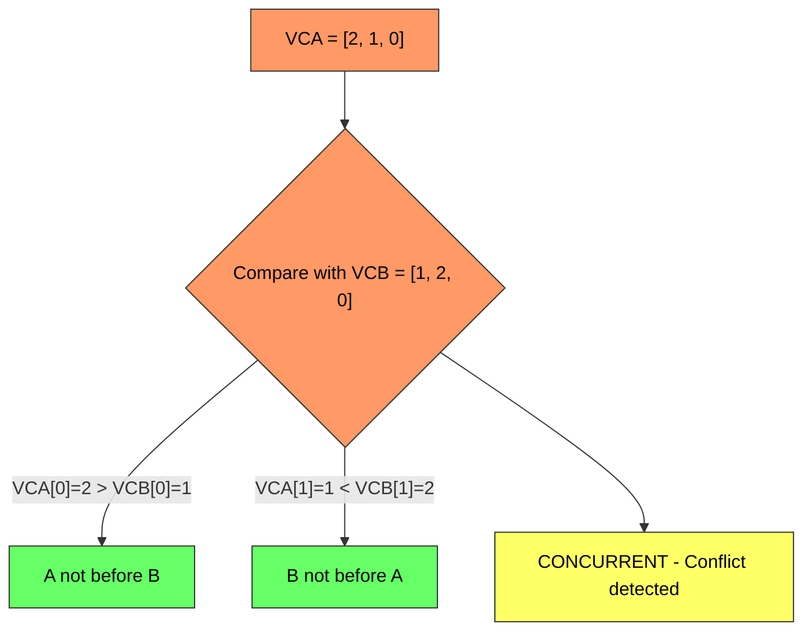
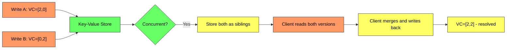

# Vector Clocks - Complete Deep Dive

> **Prerequisites:** [Database Replication](/concepts/database-replication/), [Consistency Models](/concepts/consistency-models/)
> **Used in:** [Key-Value Store](/hld/KeyValueStore/), [Chat System](/hld/ChatSystem/)

---

## What are Vector Clocks?

Vector clocks are a mechanism for tracking causality between events in a distributed system. They answer the question: "Did event A happen before event B, or were they concurrent?"

**Real-world analogy:** Imagine three friends writing a collaborative story by mail. Each person keeps a counter of how many letters they've sent. When Alice sends a letter, she includes her counter AND the latest counters she's seen from Bob and Carol. If Bob receives a letter from Alice with counters [Alice:3, Bob:1, Carol:2], he knows Alice has seen his first letter and Carol's first two. If he later gets a letter with [Alice:2, Bob:0, Carol:1], that letter was actually written earlier — it's from the past, not a new conflicting version.

---

## The Problem: Ordering Events in Distributed Systems

Physical clocks cannot be trusted in distributed systems:
- Clock skew between machines (even with NTP, drift is 10-200ms)
- No global clock that all nodes can access simultaneously
- Network delays make "simultaneous" meaningless

**Question:** Did A happen before B? If A's clock is 50ms fast, then real-time order is B→A, not A→B. Physical timestamps lie.

---

## Lamport Timestamps (Precursor)

Leslie Lamport's logical clock: a single counter per node.

**Rules:**
1. Before each event, increment your counter
2. When sending a message, include your counter
3. When receiving a message, set your counter to max(yours, received) + 1

**Limitation of Lamport timestamps:** If `L(A) < L(B)`, you know A MIGHT have happened before B. But you cannot distinguish "A caused B" from "A and B are concurrent." You get a total order, but lose concurrency information.

---

## Vector Clocks: How They Work

A vector clock is an array of counters — one per node in the system.

**For N nodes:** `VC = [count_node1, count_node2, ..., count_nodeN]`

**Rules:**
1. Before each event on node i: increment `VC[i]`
2. When sending a message: include entire vector clock
3. When receiving a message from node j: for each entry k, set `VC[k] = max(VC[k], received_VC[k])`, then increment `VC[i]`

---

## Detecting Relationships

Given two vector clocks `VCA` and `VCB`:

| Relationship | Condition | Meaning |
|-------------|-----------|---------|
| **A happened-before B** | Every entry in VCA ≤ corresponding entry in VCB, and at least one is strictly less | A causally precedes B |
| **B happened-before A** | Every entry in VCB ≤ corresponding entry in VCA | B causally precedes A |
| **Concurrent** | Neither dominates the other | A and B are independent — conflict |

**Example:**
- `[2,1,0]` vs `[3,2,1]` → First happened-before second (every entry ≤)
- `[2,1,0]` vs `[1,2,0]` → Concurrent (neither dominates)
- `[2,1,0]` vs `[2,1,0]` → Same event

---

## Conflict Resolution Strategies

When vector clocks detect concurrent writes, the system must resolve the conflict:

| Strategy | How It Works | Used By |
|----------|-------------|---------|
| **Last-Writer-Wins (LWW)** | Use physical timestamp to pick winner; discard loser | Cassandra, DynamoDB (default) |
| **Client-side resolution** | Return all conflicting versions to client; client merges | Riak (sibling values) |
| **CRDTs** | Data structures that merge automatically without conflicts | Riak 2.0, Redis CRDT |
| **Application merge** | Domain-specific merge logic (union for sets, max for counters) | Custom implementations |

---

## Vector Clocks in DynamoDB

DynamoDB uses a simplified version of vector clocks for conflict detection:

1. Each item has a version number per replica
2. When replicas receive concurrent writes during a partition, both versions are stored
3. On the next read, if siblings exist, the application-level conflict resolution kicks in
4. In practice, DynamoDB prefers LWW for simplicity — but the underlying mechanism tracks causality

---

## Vector Clocks in Riak

Riak was the canonical example of vector clocks in production:

1. Each write increments the writing node's counter in the vector clock
2. If a read finds siblings (concurrent writes), Riak returns ALL versions to the client
3. The client must merge (e.g., union of shopping cart items) and write back
4. The merged version's vector clock dominates all siblings

**Problem: Clock pruning.** With many nodes, vector clocks grow unbounded. Riak prunes entries older than a threshold, which can cause false conflicts (siblings that aren't truly concurrent).

---

## Vector Clocks vs Alternatives

| Mechanism | Detects Causality | Detects Concurrency | Size | Used By |
|-----------|-------------------|---------------------|------|---------|
| **Physical timestamps** | No (clock skew) | No | O(1) | Simple systems |
| **Lamport timestamp** | Partial (one direction) | No | O(1) | Ordering events |
| **Vector clock** | Yes | Yes | O(N nodes) | Riak, DynamoDB |
| **Version vector** | Yes | Yes | O(N replicas) | Dynamo-style stores |
| **Dotted version vector** | Yes | Yes (no false conflicts) | O(N) | Riak 2.0 |
| **Hybrid logical clock** | Yes | Yes | O(1) | CockroachDB |

---

## When to Use / When NOT to Use

✅ **Use vector clocks when:**
- Multiple nodes can write the same key concurrently (leaderless replication)
- You need to detect conflicts rather than silently overwrite
- Application can handle merge logic (shopping carts, collaborative editing)
- Causal ordering matters but global ordering doesn't

❌ **Don't use when:**
- Single-leader replication (no concurrent writes by design)
- LWW is acceptable (last writer wins — simpler, lossy)
- Number of nodes is very large (vector grows to O(N), impractical for 1000+ nodes)
- Strong consistency is already enforced (consensus protocols handle ordering)

---

## Common Interview Questions

**Q1: Why can't we just use physical timestamps instead of vector clocks?**
> Physical clocks are not perfectly synchronized across machines. NTP keeps drift to 10-200ms, but that's enough for concurrent writes to be ordered incorrectly. A write at T=100ms on Machine A might actually happen after T=120ms on Machine B if A's clock is fast. Vector clocks use logical ordering based on message passing, which is immune to clock skew.

**Q2: What's the difference between Lamport timestamps and vector clocks?**
> Lamport timestamps give a total order — if `L(A) < L(B)`, A might have happened before B. But you can't distinguish "A caused B" from "A and B are concurrent." Vector clocks solve this: if VCA < VCB (component-wise), A definitely happened before B. If neither dominates, they're concurrent. Vector clocks trade O(N) space for concurrency detection.

**Q3: How would you handle a shopping cart with vector clocks?**
> When two concurrent adds happen (e.g., User adds milk on phone and bread on laptop simultaneously), both versions are stored as siblings. On the next read, the application receives both versions: {milk} and {bread}. The merge strategy is "union" — the resolved cart becomes {milk, bread}. The application writes back the merged version with a new vector clock that dominates both siblings.

**Q4: Why did Riak move away from pure vector clocks to dotted version vectors?**
> With pure vector clocks, sibling explosion could occur: if a client reads N siblings and writes back without resolving all of them, new siblings accumulate. Dotted version vectors (DVV) associate each value with a single "dot" (node + counter), allowing the system to precisely identify which values are superseded by a new write, eliminating false concurrency and reducing sibling growth.

---

## Navigation

[← Back to Fundamentals](/concepts)

[All Concepts](/concepts/) | [HLD Designs](/hld/)
