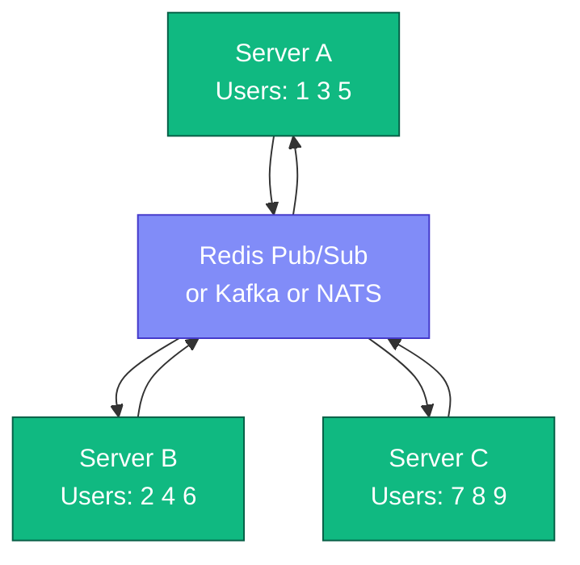

# WebSocket vs SSE vs Polling - Complete Deep Dive

> **Prerequisites:** [Load Balancing](/concepts/load-balancing/), [API Design](/concepts/api-design/)
> **Used in:** [Chat System](/hld/ChatSystem/), [Uber](/hld/Uber/), [Zomato](/hld/Zomato/), [Stock Broker](/hld/StockBroker/)

---

## What is Real-Time Communication?

Real-time communication is getting data from server to client as soon as it's available, without the client explicitly asking for it.

**Real-world analogy:** Imagine waiting for a package delivery.
- **Polling:** You walk to the mailbox every 5 minutes to check. Mostly empty trips.
- **Long Polling:** You stand at the mailbox and wait until the mailman arrives, then go back inside. Repeat.
- **SSE:** You install a doorbell that rings when a package arrives (one-way notification).
- **WebSocket:** You have a direct phone line to the delivery driver who gives you real-time updates, and you can ask questions back.

---

## The Four Approaches

### 1. Short Polling (Regular Polling)

Client repeatedly asks the server at fixed intervals.

```
Client                              Server
  │                                   │
  │── GET /messages?since=100 ───────▶│
  │◀── 200 OK (no new messages) ─────│  ← Wasted request
  │                                   │
  │    ... wait 5 seconds ...         │
  │                                   │
  │── GET /messages?since=100 ───────▶│
  │◀── 200 OK (no new messages) ─────│  ← Wasted request
  │                                   │
  │    ... wait 5 seconds ...         │
  │                                   │
  │── GET /messages?since=100 ───────▶│
  │◀── 200 OK [{msg: "hello"}] ──────│  ← Finally got data!
  │                                   │
```

**Problem:** Most requests return empty. Wastes bandwidth and server resources. Delay = up to polling interval.

---

### 2. Long Polling

Client sends request, server holds it open until data is available (or timeout).

```
Client                              Server
  │                                   │
  │── GET /messages?since=100 ───────▶│
  │                                   │  Server holds connection
  │         ... waiting ...           │  open (30s timeout)
  │                                   │
  │                                   │  New message arrives!
  │◀── 200 OK [{msg: "hello"}] ──────│
  │                                   │
  │── GET /messages?since=101 ───────▶│  ← Immediately reconnect
  │                                   │  Server holds again...
  │         ... waiting ...           │
```

**Improvement over polling:** No wasted requests. Data arrives as soon as available. But each response requires a new connection.

---

### 3. Server-Sent Events (SSE)

Server pushes data to client over a single long-lived HTTP connection. One-way only (server → client).

```
Client                              Server
  │                                   │
  │── GET /events (Accept: text/     │
  │   event-stream) ────────────────▶│
  │                                   │
  │◀── data: {"msg": "hello"} ───────│  Push 1
  │                                   │
  │◀── data: {"msg": "world"} ───────│  Push 2
  │                                   │
  │◀── data: {"typing": true} ───────│  Push 3
  │                                   │
  │    (connection stays open         │
  │     indefinitely)                 │
```

```javascript
// Client-side (browser)
const evtSource = new EventSource('/events/notifications');

evtSource.onmessage = (event) => {
  const data = JSON.parse(event.data);
  showNotification(data);
};

// Auto-reconnects if connection drops!
```

**Key feature:** Built-in browser reconnection. Uses standard HTTP (works through proxies, CDNs). One-way only.

---

### 4. WebSocket

Full-duplex, bidirectional communication over a single TCP connection.

```
Client                              Server
  │                                   │
  │── HTTP Upgrade: websocket ───────▶│  Handshake
  │◀── 101 Switching Protocols ──────│
  │                                   │
  │═══ WebSocket Connection ═══════════  (persistent TCP)
  │                                   │
  │──▶ {"type": "send_msg",          │  Client → Server
  │      "text": "hello"}            │
  │                                   │
  │◀── {"type": "new_msg",           │  Server → Client
  │      "from": "Bob",              │
  │      "text": "hey!"}             │
  │                                   │
  │◀── {"type": "typing",            │  Server → Client
  │      "user": "Bob"}              │
  │                                   │
  │──▶ {"type": "read_receipt",      │  Client → Server
  │      "msgId": "abc"}             │
```

---

## Comparison Table

| Feature | Short Polling | Long Polling | SSE | WebSocket |
|---|---|---|---|---|
| Direction | Client → Server | Client → Server | Server → Client | Bidirectional |
| Latency | Up to interval | Near real-time | Real-time | Real-time |
| Connection overhead | New conn each poll | New conn each response | Single long-lived | Single long-lived |
| Browser support | All | All | All modern (no IE) | All modern |
| HTTP compatible | Yes | Yes | Yes | No (upgrades to WS) |
| Works through proxies | Yes | Sometimes issues | Yes | Sometimes issues |
| Auto-reconnect | N/A | Manual | Built-in | Manual |
| Server resource usage | Low per request | Medium (held conns) | Low | Medium |
| Scalability | Easy | Medium | Easy | Hard |
| Max connections | N/A | Limited | ~6 per domain | ~65K per server |
| Binary data | No | No | No (text only) | Yes |

---

## Scaling WebSockets

The hardest challenge in real-time systems. Here's why and how:

### The Problem

```
Server A has WebSocket to User 1
Server B has WebSocket to User 2

User 1 sends message to User 2.
Server A receives it... but User 2 is on Server B!

How does Server A forward to Server B?
```

### Solution: Pub/Sub Layer



**Flow:**
1. User 1 sends msg to User 2 via WebSocket on Server A
2. Server A publishes to Redis channel "user:2"
3. Server B (subscribed to "user:2") receives it
4. Server B pushes to User 2's WebSocket

### Connection Management

```
Sticky Sessions (Load Balancer):
  - Once a WebSocket is established, all traffic goes to same server
  - Use IP hash or cookie-based routing
  - Problem: uneven load if some users are chatty

Connection Registry (Redis):
  - Store mapping: userId → serverId
  - When message arrives, look up which server holds the connection
  - Route message to correct server via pub/sub
```

### Heartbeats and Reconnection

```
Client                              Server
  │                                   │
  │◀── PING ─────────────────────────│  Every 30s
  │──▶ PONG ─────────────────────────│
  │                                   │
  │◀── PING ─────────────────────────│
  │    (no PONG in 10s)              │
  │    Connection considered dead     │
  │    Clean up resources             │
```

---

## When to Use What

| Use Case | Best Choice | Why |
|---|---|---|
| Chat application | WebSocket | Bidirectional, low latency, typing indicators |
| Live sports scores | SSE | Server push only, auto-reconnect, simple |
| Stock ticker | WebSocket | High-frequency updates, bidirectional (subscribe/unsubscribe) |
| Email inbox | Long Polling | Infrequent updates, simpler infra |
| Social media feed refresh | Short Polling | Low frequency, simple, cacheable |
| Ride tracking (Uber) | WebSocket or SSE | Continuous location updates |
| Notifications | SSE | One-way server push, reliable |
| Online gaming | WebSocket | Low latency, bidirectional, binary data |
| IoT sensor data | WebSocket | High throughput, bidirectional control |
| Dashboard metrics | SSE | Server push, auto-reconnect |

---

## When NOT to Use WebSockets

- **Infrequent updates** (once per minute) — polling or SSE is simpler
- **One-way server push only** — SSE is lighter weight
- **Behind restrictive corporate proxies** — WebSocket upgrade often blocked
- **When HTTP caching matters** — WebSocket responses can't be cached
- **Simple CRUD operations** — REST is sufficient
- **When you can't afford sticky sessions** — WebSocket scaling is complex

---

## Real-World Examples

| Company | Technology | Use Case |
|---|---|---|
| **Slack** | WebSocket | Real-time messaging, typing indicators, presence |
| **Uber** | WebSocket + gRPC streaming | Driver location tracking, ride status |
| **Discord** | WebSocket | Voice + text chat, presence, real-time events |
| **Robinhood** | WebSocket | Real-time stock price updates |
| **Twitter** | SSE (Streaming API) | Real-time tweet delivery to clients |
| **Facebook** | Long Polling (MQTT internally) | Chat, notifications |
| **Twitch** | WebSocket (IRC protocol) | Chat messages during streams |

---

## Common Interview Questions

**Q: "How would you implement real-time messaging in a chat app?"**
A: WebSocket for bidirectional communication. Client establishes WS connection on app open. Messages sent via WS to server, which stores in DB and forwards via Pub/Sub (Redis) to the recipient's WS server. Use heartbeats for connection health. On disconnect, queue messages and deliver on reconnect.

**Q: "How do you scale WebSocket servers to millions of users?"**
A: Multiple WS servers behind a load balancer with sticky sessions. Add Redis Pub/Sub (or Kafka) as a message bus between servers. Store connection registry (userId → serverId) in Redis. Each server subscribes to channels for its connected users. Horizontally scale by adding more WS servers.

**Q: "What happens when a WebSocket connection drops?"**
A: Client-side: auto-reconnect with exponential backoff. Server-side: heartbeat timeout triggers cleanup. On reconnect, client sends last received message ID, server replays missed messages from a short-term buffer (Redis sorted set or DB). Design for at-least-once delivery with client-side deduplication.

**Q: "Why not just use WebSocket for everything?"**
A: WebSocket adds complexity (connection management, scaling, sticky sessions). For one-way push, SSE is simpler and works through CDNs/proxies. For infrequent data, polling is cheapest. WebSocket shines only when you need low-latency bidirectional communication. Over-engineering with WebSocket when polling suffices wastes engineering effort.

**Q: "How would you handle 1 million concurrent WebSocket connections?"**
A: Each server handles ~50-100K connections (with proper tuning). Need 10-20 servers. Use consistent hashing to distribute users. Redis Pub/Sub or Kafka for cross-server communication. Monitor connection counts per server. Auto-scale based on connection count metrics. Consider regional deployment to reduce latency.

---

[← Back to Fundamentals](/concepts) | [Next: Idempotency →](/concepts/idempotency/)
