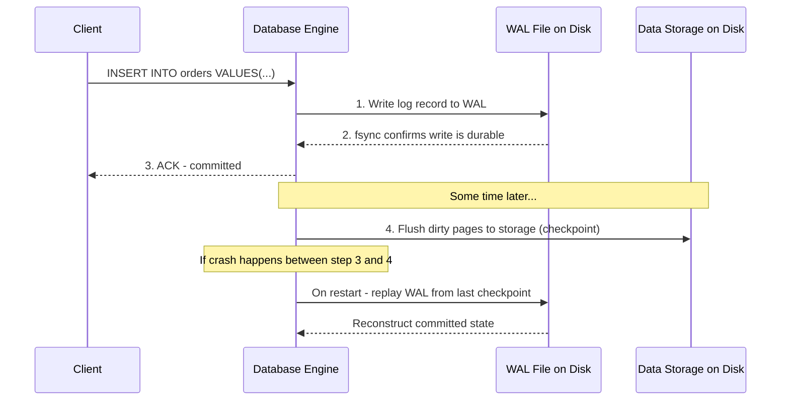
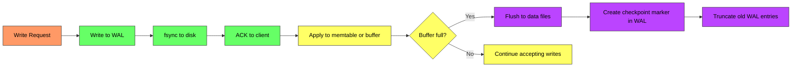
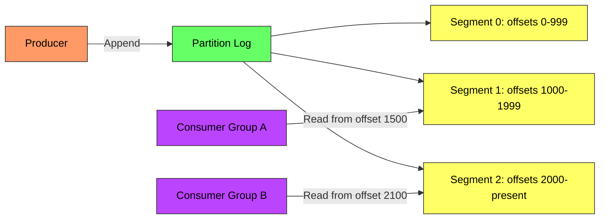
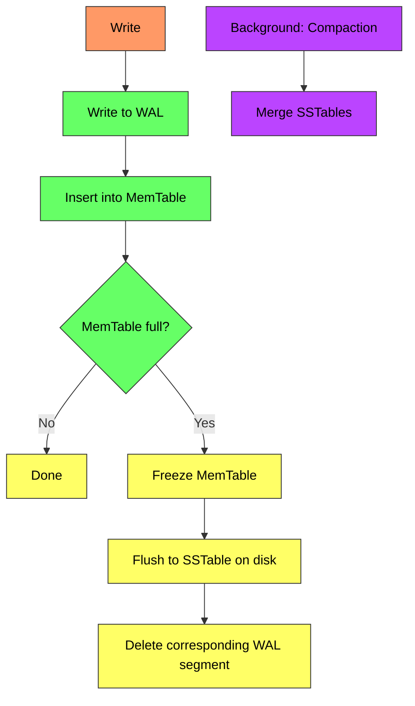

# Write-Ahead Log (WAL) - Complete Deep Dive

> **Prerequisites:** [Database Indexing](/concepts/database-indexing/), [Message Queues](/concepts/message-queues/)
> **Used in:** [Key-Value Store](/hld/KeyValueStore/), [Chat System](/hld/ChatSystem/), All database-backed systems

---

## What is a Write-Ahead Log?

A Write-Ahead Log (WAL) is a sequential, append-only file where every modification is written BEFORE it's applied to the main data structure. If the system crashes, the WAL provides a complete record of all committed operations that can be replayed to restore the correct state.

**Real-world analogy:** Think of a chef in a restaurant. Before cooking anything, the chef writes the order on a paper ticket (WAL) and pins it to the board. If the chef gets interrupted mid-cooking (crash), they look at the tickets to see exactly what was ordered and what still needs to be made. The ticket is the source of truth, not the half-cooked food on the stove.

---

## Why Do We Need WAL?

The core problem: databases keep data in memory (buffer pool) for performance, but memory is volatile. If the system crashes, uncommitted data in memory is lost.

**The guarantee:** If the system acknowledged a write to the client, that write WILL survive any crash — because it's already on disk in the WAL before the acknowledgment is sent.

---

## How WAL Works

**Key sequence:**
1. Client sends a write
2. Database appends the operation to the WAL file
3. `fsync()` ensures the WAL record hits physical disk
4. Client receives acknowledgment (durability guaranteed)
5. Change is applied to in-memory structures
6. Periodically, in-memory data is flushed to main storage files (checkpoint)
7. WAL entries before the checkpoint can be safely deleted

---

## WAL in Databases

### PostgreSQL WAL

PostgreSQL writes all modifications to WAL segments (16MB files by default) before modifying data pages. The WAL is also used for:
- **Crash recovery:** Replay WAL from the last checkpoint
- **Replication:** Stream WAL to replicas for synchronization
- **Point-in-time recovery:** Replay WAL to any specific timestamp

### MySQL InnoDB Redo Log

MySQL's InnoDB engine uses a redo log (functionally identical to WAL):
- Fixed-size circular buffer (default 2 files × 48MB)
- Writes redo log entries before modifying buffer pool pages
- Checkpoint process flushes dirty pages and advances the log

---

## WAL in Kafka (Append-Only Log)

Kafka's entire storage model IS a WAL. Each partition is an append-only log on disk:

- Messages are only appended, never modified
- Each message gets a sequential offset
- Consumers track their position by offset
- Old segments are deleted based on retention policy
- Replication works by followers reading the leader's log

---

## WAL in LSM Trees

LSM (Log-Structured Merge) trees use WAL as the first step of their write path:

Used by: Cassandra, RocksDB, LevelDB, HBase

---

## Crash Recovery Process

| Step | Action |
|------|--------|
| 1 | System restarts after crash |
| 2 | Find the last checkpoint marker in WAL |
| 3 | Replay all WAL entries AFTER the checkpoint |
| 4 | Re-apply committed transactions |
| 5 | Discard uncommitted transactions |
| 6 | System is now consistent and ready to serve |

Recovery time depends on the interval between checkpoints. More frequent checkpoints = faster recovery but more I/O during normal operation.

---

## WAL vs Other Durability Approaches

| Approach | Durability | Write Performance | Recovery Speed | Use Case |
|----------|------------|-------------------|----------------|----------|
| **WAL + Checkpoint** | Strong | Fast (sequential writes) | Medium | PostgreSQL, MySQL |
| **Write directly to data file** | Strong | Slow (random I/O) | Instant | Simple systems |
| **In-memory only** | None (volatile) | Fastest | N/A (data lost) | Redis without AOF |
| **Append-only file (AOF)** | Strong | Fast (sequential) | Slow (replay all) | Redis AOF |
| **Journaling (ext4/NTFS)** | Strong | Fast | Fast | Filesystems |

---

## Performance Characteristics

| Aspect | WAL Advantage |
|--------|--------------|
| **Write pattern** | Sequential append (100-1000x faster than random writes on HDD) |
| **Disk I/O** | Single fsync per batch of writes (group commit) |
| **Throughput** | Can batch multiple writes into one WAL flush |
| **SSD benefit** | Still faster than random writes; reduces write amplification |

**Group commit optimization:** Instead of fsync-ing after every single write, batch multiple writes and fsync once. Trades a few milliseconds of latency for dramatically higher throughput.

---

## When to Use

✅ **Use when:**
- Building a database or storage engine that needs crash recovery
- You need durability guarantees before acknowledging writes
- Implementing replication (stream the WAL to replicas)
- Building an event log or event sourcing system
- You need point-in-time recovery capabilities

❌ **Don't use when:**
- Data loss is acceptable (pure cache, ephemeral data)
- Writes are infrequent and you can afford to write directly to data files
- You're using a managed database that already handles this for you
- Storage space is extremely limited (WAL adds overhead)

---

## Common Interview Questions

**Q1: Why is sequential writing to WAL faster than directly updating data files?**
> Data files require random I/O — updating a row means seeking to that row's position on disk. WAL is always sequential append, which is 100-1000x faster on HDDs (no seek time) and 10-50x faster on SSDs (reduces write amplification and leverages sequential write optimization in flash controllers). One sequential fsync is far cheaper than many random writes.

**Q2: How does WAL enable replication?**
> The WAL is a complete, ordered record of all writes. To replicate, you stream WAL entries from the primary to replicas in order. Each replica applies WAL entries to its own data files, maintaining an identical copy. PostgreSQL uses this approach (streaming replication). Kafka followers replicate by reading the leader's partition log.

**Q3: What happens if the WAL itself becomes corrupted?**
> WAL entries include CRC checksums. On recovery, if a checksum fails, the entry is considered incomplete (mid-write crash). The database discards that entry and all subsequent ones — the transaction was never acknowledged to the client, so no data loss from the client's perspective. The system recovers to the last fully-written, committed entry.

**Q4: What is the relationship between WAL and fsync?**
> `fsync()` forces the OS to flush its write buffer to physical disk. Without fsync, the WAL write might sit in the OS page cache and be lost on crash. The sequence is: write() to WAL file → fsync() → only then ACK to client. This is the critical path for durability. Some systems offer a "relaxed durability" mode that skips fsync for higher throughput, risking the last few milliseconds of writes on crash.

**Q5: How does Kafka's log differ from a database WAL?**
> A database WAL is a temporary recovery mechanism — entries are discarded after checkpoint. Kafka's log IS the primary data store — messages live in the log until the retention period expires. Consumers read directly from the log at their own pace. This makes Kafka both a message broker and a durable storage system, while a database WAL is purely an internal implementation detail for crash safety.

---

## Navigation

← [Bloom Filters](/concepts/bloom-filters/) | [Event Sourcing](/concepts/event-sourcing/) →

[All Concepts](/concepts/) | [HLD Designs](/hld/)
