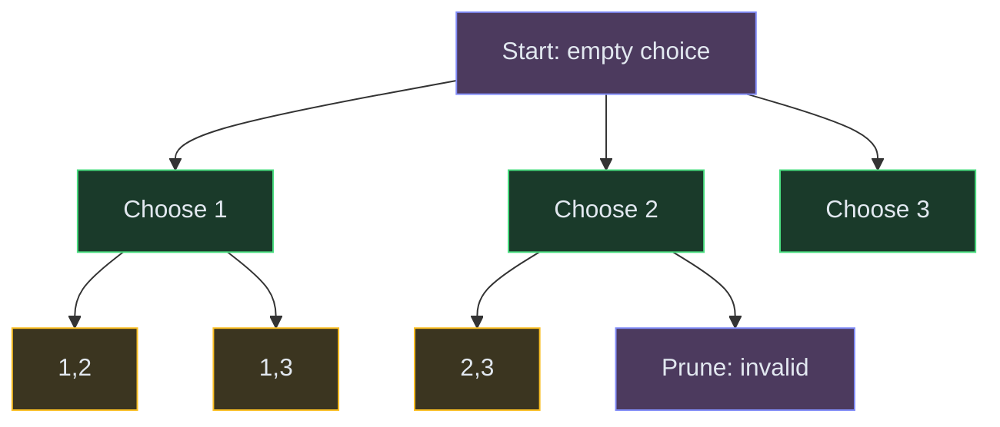

# Backtracking

**The pattern:** Build a solution incrementally, making one choice at a time. If a choice leads to a dead end, undo it (backtrack) and try the next option. It's a controlled brute-force that prunes bad paths early.

**Why this matters in interviews:** Backtracking solves permutations, combinations, subsets, constraint-satisfaction (N-Queens, Sudoku), and word search. The template is nearly identical across all these problems — learn it once, apply it everywhere.

---

## When to Recognize It

- The problem asks for **all possible** solutions (not just one or a count)
- You need to **generate permutations, combinations, or subsets**
- There are **constraints** that rule out certain paths early
- Keywords: "generate all," "find all valid," "place queens," "fill grid," "all paths"
- The brute force would explore every possibility — backtracking prunes infeasible branches

---

## How It Works

Think of it as exploring a maze. At each fork, you pick a direction. If you hit a wall (invalid state), you go back to the last fork and try a different direction. You keep doing this until you've explored every viable path.

**The backtracking framework:**
1. **Choose** — pick an option from the remaining choices
2. **Explore** — recurse with that choice added
3. **Unchoose** — remove the choice (backtrack) and try the next option

---

## Template Code

### Code

<button class="tab-btn active">Python</button>
<button class="tab-btn">Java</button>
<button class="tab-btn">C++</button>
<button class="tab-btn">JavaScript</button>

<pre><code class="language-python">def backtrack(result, path, choices):
    """Generic backtracking template."""
    if is_solution(path):
        result.append(path[:])  # save a copy
        return

    for choice in choices:
        if not is_valid(choice, path):
            continue  # prune

        path.append(choice)        # choose
        backtrack(result, path, next_choices(choice))  # explore
        path.pop()                 # unchoose (backtrack)

# Subsets: generate all subsets of nums
def subsets(nums):
    result = []
    def bt(start, path):
        result.append(path[:])
        for i in range(start, len(nums)):
            path.append(nums[i])
            bt(i + 1, path)
            path.pop()
    bt(0, [])
    return result</code></pre>

<pre><code class="language-java">// Subsets
List&lt;List&lt;Integer&gt;&gt; subsets(int[] nums) {
    List&lt;List&lt;Integer&gt;&gt; result = new ArrayList&lt;&gt;();
    backtrack(result, new ArrayList&lt;&gt;(), nums, 0);
    return result;
}

void backtrack(List&lt;List&lt;Integer&gt;&gt; result, List&lt;Integer&gt; path, int[] nums, int start) {
    result.add(new ArrayList&lt;&gt;(path));
    for (int i = start; i &lt; nums.length; i++) {
        path.add(nums[i]);
        backtrack(result, path, nums, i + 1);
        path.remove(path.size() - 1);
    }
}</code></pre>

<pre><code class="language-cpp">// Subsets
vector&lt;vector&lt;int&gt;&gt; subsets(vector&lt;int&gt;&amp; nums) {
    vector&lt;vector&lt;int&gt;&gt; result;
    vector&lt;int&gt; path;
    function&lt;void(int)&gt; bt = [&amp;](int start) {
        result.push_back(path);
        for (int i = start; i &lt; nums.size(); i++) {
            path.push_back(nums[i]);
            bt(i + 1);
            path.pop_back();
        }
    };
    bt(0);
    return result;
}</code></pre>

<pre><code class="language-javascript">// Subsets
function subsets(nums) {
    const result = [];
    function bt(start, path) {
        result.push([...path]);
        for (let i = start; i &lt; nums.length; i++) {
            path.push(nums[i]);
            bt(i + 1, path);
            path.pop();
        }
    }
    bt(0, []);
    return result;
}</code></pre>

---

## Variations

### Permutations

Every element must be used exactly once. Track which elements are already used.

### Code

<button class="tab-btn active">Python</button>
<button class="tab-btn">Java</button>
<button class="tab-btn">C++</button>
<button class="tab-btn">JavaScript</button>

<pre><code class="language-python">def permutations(nums):
    result = []
    def bt(path, used):
        if len(path) == len(nums):
            result.append(path[:])
            return
        for i in range(len(nums)):
            if used[i]:
                continue
            used[i] = True
            path.append(nums[i])
            bt(path, used)
            path.pop()
            used[i] = False
    bt([], [False] * len(nums))
    return result</code></pre>

<pre><code class="language-java">List&lt;List&lt;Integer&gt;&gt; permutations(int[] nums) {
    List&lt;List&lt;Integer&gt;&gt; result = new ArrayList&lt;&gt;();
    boolean[] used = new boolean[nums.length];
    bt(result, new ArrayList&lt;&gt;(), nums, used);
    return result;
}

void bt(List&lt;List&lt;Integer&gt;&gt; result, List&lt;Integer&gt; path, int[] nums, boolean[] used) {
    if (path.size() == nums.length) {
        result.add(new ArrayList&lt;&gt;(path));
        return;
    }
    for (int i = 0; i &lt; nums.length; i++) {
        if (used[i]) continue;
        used[i] = true;
        path.add(nums[i]);
        bt(result, path, nums, used);
        path.remove(path.size() - 1);
        used[i] = false;
    }
}</code></pre>

<pre><code class="language-cpp">vector&lt;vector&lt;int&gt;&gt; permutations(vector&lt;int&gt;&amp; nums) {
    vector&lt;vector&lt;int&gt;&gt; result;
    vector&lt;int&gt; path;
    vector&lt;bool&gt; used(nums.size(), false);
    function&lt;void()&gt; bt = [&amp;]() {
        if (path.size() == nums.size()) {
            result.push_back(path);
            return;
        }
        for (int i = 0; i &lt; nums.size(); i++) {
            if (used[i]) continue;
            used[i] = true;
            path.push_back(nums[i]);
            bt();
            path.pop_back();
            used[i] = false;
        }
    };
    bt();
    return result;
}</code></pre>

<pre><code class="language-javascript">function permutations(nums) {
    const result = [];
    const used = new Array(nums.length).fill(false);
    function bt(path) {
        if (path.length === nums.length) {
            result.push([...path]);
            return;
        }
        for (let i = 0; i &lt; nums.length; i++) {
            if (used[i]) continue;
            used[i] = true;
            path.push(nums[i]);
            bt(path);
            path.pop();
            used[i] = false;
        }
    }
    bt([]);
    return result;
}</code></pre>

### Combination Sum (Reuse Allowed)

Allow picking the same element multiple times. Instead of `start = i + 1`, recurse with `start = i`.

### N-Queens (Constraint Satisfaction)

Place queens one row at a time. For each row, try every column. Prune if the column, diagonal, or anti-diagonal is already attacked.

---

## Complexity

| Problem | Time | Space |
|---|---|---|
| Subsets | O(2^n) | O(n) recursion depth |
| Permutations | O(n!) | O(n) |
| Combination Sum | O(2^t) where t = target/min | O(target/min) |
| N-Queens | O(n!) | O(n) |

These are exponential — that's expected. Backtracking doesn't make them polynomial; it just prunes dead branches so you explore far fewer than the theoretical maximum.

---

## Common Mistakes

- **Forgetting to copy the path** — `result.append(path[:])` not `result.append(path)`. Without copying, all entries point to the same (now-empty) list.
- **Not skipping duplicates** — for problems with duplicate elements, sort first and skip `nums[i] == nums[i-1]` when `i > start`
- **Wrong start index** — subsets/combinations use `start = i + 1` (no reuse), combination sum uses `start = i` (reuse allowed), permutations iterate from 0 (all positions)
- **Not pruning early enough** — if the remaining choices can't possibly lead to a valid solution, prune before recursing

---

## Practice Problems

- [Subsets](/dsa/problem/subsets)
- [Permutations](/dsa/problem/permutations)
- [Combination Sum](/dsa/problem/combination-sum)
- [N-Queens](/dsa/problem/n-queens)
- [Word Search](/dsa/problem/word-search)

---

## Key Takeaways

- Backtracking = DFS on the decision tree with pruning
- The template is: choose → explore → unchoose. Everything else is just the pruning condition.
- Subsets: include/exclude each element. Permutations: pick any unused element. Combinations: pick from remaining elements forward.
- Pruning is what makes backtracking fast enough — without it, you're just brute force
