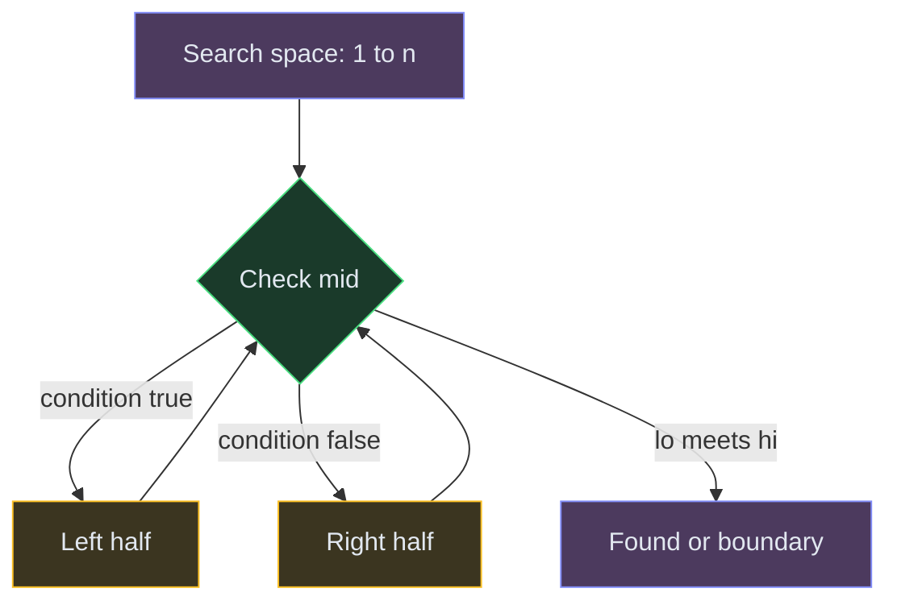

# Binary Search

**The pattern:** Repeatedly halve the search space by checking a midpoint condition. If the condition is met, search one half; otherwise, search the other. Each step eliminates 50% of possibilities.

**Why this matters in interviews:** Binary search appears everywhere — sorted arrays, answer-space problems, rotated arrays, matrix search. It reduces O(n) linear scans to O(log n). Interviewers love it because the idea is simple but getting the boundary conditions right is tricky.

---

## When to Recognize It

- The input is **sorted** (or has a monotonic property)
- You're searching for a specific value or the **boundary** where a condition flips
- The problem asks for "minimum X such that..." or "maximum X such that..." (binary search on answer)
- Keywords: "sorted," "rotated sorted," "minimum speed," "maximum days," "find peak"
- The brute force is O(n) and you need O(log n)

---

## How It Works

Imagine a phone book with 1000 pages. To find "Smith," you open to the middle — page 500. If "Smith" comes after page 500 alphabetically, you ignore the first half and search pages 501-1000. Next, you check page 750. Each step cuts the remaining pages in half. After ~10 steps, you've found it.

**The key invariant:** At every step, the answer is always within `[lo, hi]`. We never exclude the half that might contain the answer.

---

## Template Code

### Code

<button class="tab-btn active">Python</button>
<button class="tab-btn">Java</button>
<button class="tab-btn">C++</button>
<button class="tab-btn">JavaScript</button>

<pre><code class="language-python">def binary_search(nums, target):
    """Standard binary search for exact match."""
    lo, hi = 0, len(nums) - 1

    while lo &lt;= hi:
        mid = lo + (hi - lo) // 2
        if nums[mid] == target:
            return mid
        elif nums[mid] &lt; target:
            lo = mid + 1
        else:
            hi = mid - 1

    return -1  # not found</code></pre>

<pre><code class="language-java">int binarySearch(int[] nums, int target) {
    int lo = 0, hi = nums.length - 1;

    while (lo &lt;= hi) {
        int mid = lo + (hi - lo) / 2;
        if (nums[mid] == target) return mid;
        else if (nums[mid] &lt; target) lo = mid + 1;
        else hi = mid - 1;
    }
    return -1;
}</code></pre>

<pre><code class="language-cpp">int binarySearch(vector&lt;int&gt;&amp; nums, int target) {
    int lo = 0, hi = nums.size() - 1;

    while (lo &lt;= hi) {
        int mid = lo + (hi - lo) / 2;
        if (nums[mid] == target) return mid;
        else if (nums[mid] &lt; target) lo = mid + 1;
        else hi = mid - 1;
    }
    return -1;
}</code></pre>

<pre><code class="language-javascript">function binarySearch(nums, target) {
    let lo = 0, hi = nums.length - 1;

    while (lo &lt;= hi) {
        const mid = lo + Math.floor((hi - lo) / 2);
        if (nums[mid] === target) return mid;
        else if (nums[mid] &lt; target) lo = mid + 1;
        else hi = mid - 1;
    }
    return -1;
}</code></pre>

---

## Variations

### Binary Search on Answer

When the problem asks "what's the minimum/maximum value X such that some condition is satisfiable?" — you binary search on X itself, not on an array index.

### Code

<button class="tab-btn active">Python</button>
<button class="tab-btn">Java</button>
<button class="tab-btn">C++</button>
<button class="tab-btn">JavaScript</button>

<pre><code class="language-python">def binary_search_on_answer(lo, hi):
    """Find minimum value where condition is True."""
    while lo &lt; hi:
        mid = lo + (hi - lo) // 2
        if condition(mid):  # can we do it with 'mid'?
            hi = mid        # try smaller
        else:
            lo = mid + 1    # need bigger

    return lo  # minimum valid answer</code></pre>

<pre><code class="language-java">int searchOnAnswer(int lo, int hi) {
    while (lo &lt; hi) {
        int mid = lo + (hi - lo) / 2;
        if (condition(mid)) hi = mid;
        else lo = mid + 1;
    }
    return lo;
}</code></pre>

<pre><code class="language-cpp">int searchOnAnswer(int lo, int hi) {
    while (lo &lt; hi) {
        int mid = lo + (hi - lo) / 2;
        if (condition(mid)) hi = mid;
        else lo = mid + 1;
    }
    return lo;
}</code></pre>

<pre><code class="language-javascript">function searchOnAnswer(lo, hi) {
    while (lo &lt; hi) {
        const mid = lo + Math.floor((hi - lo) / 2);
        if (condition(mid)) hi = mid;
        else lo = mid + 1;
    }
    return lo;
}</code></pre>

**Example:** Koko eating bananas — binary search on the eating speed. For each speed, check if she can finish all bananas in H hours.

### Search in Rotated Sorted Array

A sorted array rotated at some pivot. One half is always sorted. Check which half is sorted, then decide if the target lies in that sorted half.

### Code

<button class="tab-btn active">Python</button>
<button class="tab-btn">Java</button>
<button class="tab-btn">C++</button>
<button class="tab-btn">JavaScript</button>

<pre><code class="language-python">def search_rotated(nums, target):
    lo, hi = 0, len(nums) - 1

    while lo &lt;= hi:
        mid = lo + (hi - lo) // 2
        if nums[mid] == target:
            return mid

        # Left half is sorted
        if nums[lo] &lt;= nums[mid]:
            if nums[lo] &lt;= target &lt; nums[mid]:
                hi = mid - 1
            else:
                lo = mid + 1
        # Right half is sorted
        else:
            if nums[mid] &lt; target &lt;= nums[hi]:
                lo = mid + 1
            else:
                hi = mid - 1

    return -1</code></pre>

<pre><code class="language-java">int searchRotated(int[] nums, int target) {
    int lo = 0, hi = nums.length - 1;
    while (lo &lt;= hi) {
        int mid = lo + (hi - lo) / 2;
        if (nums[mid] == target) return mid;
        if (nums[lo] &lt;= nums[mid]) {
            if (nums[lo] &lt;= target &amp;&amp; target &lt; nums[mid]) hi = mid - 1;
            else lo = mid + 1;
        } else {
            if (nums[mid] &lt; target &amp;&amp; target &lt;= nums[hi]) lo = mid + 1;
            else hi = mid - 1;
        }
    }
    return -1;
}</code></pre>

<pre><code class="language-cpp">int searchRotated(vector&lt;int&gt;&amp; nums, int target) {
    int lo = 0, hi = nums.size() - 1;
    while (lo &lt;= hi) {
        int mid = lo + (hi - lo) / 2;
        if (nums[mid] == target) return mid;
        if (nums[lo] &lt;= nums[mid]) {
            if (nums[lo] &lt;= target &amp;&amp; target &lt; nums[mid]) hi = mid - 1;
            else lo = mid + 1;
        } else {
            if (nums[mid] &lt; target &amp;&amp; target &lt;= nums[hi]) lo = mid + 1;
            else hi = mid - 1;
        }
    }
    return -1;
}</code></pre>

<pre><code class="language-javascript">function searchRotated(nums, target) {
    let lo = 0, hi = nums.length - 1;
    while (lo &lt;= hi) {
        const mid = lo + Math.floor((hi - lo) / 2);
        if (nums[mid] === target) return mid;
        if (nums[lo] &lt;= nums[mid]) {
            if (nums[lo] &lt;= target &amp;&amp; target &lt; nums[mid]) hi = mid - 1;
            else lo = mid + 1;
        } else {
            if (nums[mid] &lt; target &amp;&amp; target &lt;= nums[hi]) lo = mid + 1;
            else hi = mid - 1;
        }
    }
    return -1;
}</code></pre>

### Find Minimum in Rotated Sorted Array

Binary search for the pivot point — the minimum is where the sorted order breaks.

---

## Complexity

| Variant | Time | Space |
|---|---|---|
| Standard binary search | O(log n) | O(1) |
| Search on answer | O(log(range) × check) | O(1) |
| Rotated array search | O(log n) | O(1) |

---

## Common Mistakes

- **Integer overflow in mid calculation** — use `lo + (hi - lo) / 2` instead of `(lo + hi) / 2`
- **Wrong loop condition** — `lo <= hi` for exact match, `lo < hi` for boundary search. Mixing them up causes infinite loops or missed answers
- **Off-by-one in boundary updates** — when using `lo < hi`, set `hi = mid` (not `mid - 1`) to avoid skipping the answer
- **Not identifying which half is sorted in rotated arrays** — always check `nums[lo] <= nums[mid]` first

---

## Practice Problems

- [Binary Search](/dsa/problem/binary-search)
- [Search in Rotated Sorted Array](/dsa/problem/search-in-rotated-sorted-array)
- [Koko Eating Bananas](/dsa/problem/koko-eating-bananas)
- [Find Minimum in Rotated Sorted Array](/dsa/problem/find-minimum-in-rotated-sorted-array)
- [Search a 2D Matrix](/dsa/problem/search-a-2d-matrix)

---

## Key Takeaways

- Binary search works on any monotonic condition, not just sorted arrays
- "Binary search on answer" is the most powerful variant — works whenever you can verify a candidate answer in O(n) or less
- For rotated arrays, one half is always sorted — use that to decide which half to search
- Get the template right (loop condition + boundary updates) and the rest is just plugging in the condition
