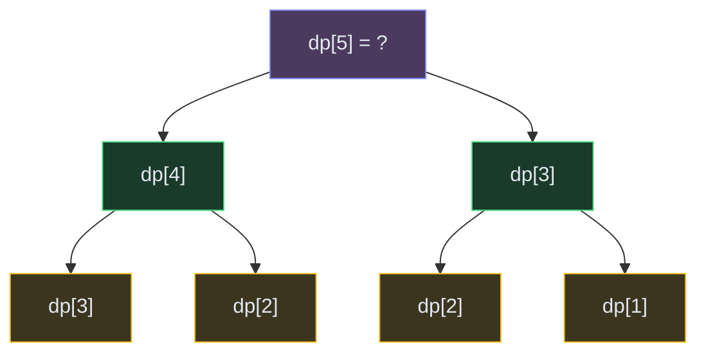

# Dynamic Programming

**The pattern:** Break a problem into overlapping subproblems, solve each once, store the result, and reuse it. DP = recursion + memoization (top-down) or iterative table-filling (bottom-up).

**Why this matters in interviews:** DP is the most-feared interview topic, but it follows predictable patterns. Once you identify the "state" and "transition," the code writes itself. ~25% of hard-level problems use DP.

---

## When to Recognize It

- The problem asks for **optimal value** (max profit, min cost, number of ways)
- You can define the answer in terms of **smaller subproblems** of the same type
- The brute force involves **repeated computation** of the same states
- Keywords: "minimum cost," "number of ways," "longest/shortest subsequence," "can you reach..."
- The problem has **optimal substructure** (optimal solution uses optimal sub-solutions)

---

## How It Works

Think of climbing stairs. To reach step 5, you came from step 4 or step 3. To reach step 4, you came from step 3 or step 2. Notice step 3 gets computed twice? DP stores that answer so you only compute it once.

**The DP framework (4 steps):**
1. **Define the state:** What does `dp[i]` (or `dp[i][j]`) represent?
2. **Find the transition:** How does `dp[i]` relate to smaller states?
3. **Set base cases:** What's the answer for the smallest inputs?
4. **Determine the order:** Fill the table so dependencies are computed first.

---

## Template Code

### Code

<button class="tab-btn active">Python</button>
<button class="tab-btn">Java</button>
<button class="tab-btn">C++</button>
<button class="tab-btn">JavaScript</button>

<pre><code class="language-python"># 1D DP: Climbing Stairs (number of ways to reach step n)
def climb_stairs(n):
    if n &lt;= 2:
        return n
    dp = [0] * (n + 1)
    dp[1], dp[2] = 1, 2

    for i in range(3, n + 1):
        dp[i] = dp[i-1] + dp[i-2]  # transition

    return dp[n]

# Space-optimized (only need last 2 values)
def climb_stairs_opt(n):
    if n &lt;= 2:
        return n
    prev2, prev1 = 1, 2
    for i in range(3, n + 1):
        curr = prev1 + prev2
        prev2, prev1 = prev1, curr
    return prev1</code></pre>

<pre><code class="language-java">// 1D DP: Climbing Stairs
int climbStairs(int n) {
    if (n &lt;= 2) return n;
    int[] dp = new int[n + 1];
    dp[1] = 1; dp[2] = 2;
    for (int i = 3; i &lt;= n; i++) {
        dp[i] = dp[i-1] + dp[i-2];
    }
    return dp[n];
}

// Space-optimized
int climbStairsOpt(int n) {
    if (n &lt;= 2) return n;
    int prev2 = 1, prev1 = 2;
    for (int i = 3; i &lt;= n; i++) {
        int curr = prev1 + prev2;
        prev2 = prev1;
        prev1 = curr;
    }
    return prev1;
}</code></pre>

<pre><code class="language-cpp">// 1D DP: Climbing Stairs
int climbStairs(int n) {
    if (n &lt;= 2) return n;
    vector&lt;int&gt; dp(n + 1);
    dp[1] = 1; dp[2] = 2;
    for (int i = 3; i &lt;= n; i++) {
        dp[i] = dp[i-1] + dp[i-2];
    }
    return dp[n];
}</code></pre>

<pre><code class="language-javascript">// 1D DP: Climbing Stairs
function climbStairs(n) {
    if (n &lt;= 2) return n;
    const dp = new Array(n + 1).fill(0);
    dp[1] = 1; dp[2] = 2;
    for (let i = 3; i &lt;= n; i++) {
        dp[i] = dp[i-1] + dp[i-2];
    }
    return dp[n];
}</code></pre>

---

## Variations

### 2D DP: Longest Common Subsequence (LCS)

`dp[i][j]` = LCS of `text1[0..i-1]` and `text2[0..j-1]`.

### Code

<button class="tab-btn active">Python</button>
<button class="tab-btn">Java</button>
<button class="tab-btn">C++</button>
<button class="tab-btn">JavaScript</button>

<pre><code class="language-python">def longest_common_subsequence(text1, text2):
    m, n = len(text1), len(text2)
    dp = [[0] * (n + 1) for _ in range(m + 1)]

    for i in range(1, m + 1):
        for j in range(1, n + 1):
            if text1[i-1] == text2[j-1]:
                dp[i][j] = dp[i-1][j-1] + 1
            else:
                dp[i][j] = max(dp[i-1][j], dp[i][j-1])

    return dp[m][n]</code></pre>

<pre><code class="language-java">int longestCommonSubsequence(String text1, String text2) {
    int m = text1.length(), n = text2.length();
    int[][] dp = new int[m + 1][n + 1];
    for (int i = 1; i &lt;= m; i++) {
        for (int j = 1; j &lt;= n; j++) {
            if (text1.charAt(i-1) == text2.charAt(j-1))
                dp[i][j] = dp[i-1][j-1] + 1;
            else
                dp[i][j] = Math.max(dp[i-1][j], dp[i][j-1]);
        }
    }
    return dp[m][n];
}</code></pre>

<pre><code class="language-cpp">int longestCommonSubsequence(string text1, string text2) {
    int m = text1.size(), n = text2.size();
    vector&lt;vector&lt;int&gt;&gt; dp(m + 1, vector&lt;int&gt;(n + 1, 0));
    for (int i = 1; i &lt;= m; i++) {
        for (int j = 1; j &lt;= n; j++) {
            if (text1[i-1] == text2[j-1])
                dp[i][j] = dp[i-1][j-1] + 1;
            else
                dp[i][j] = max(dp[i-1][j], dp[i][j-1]);
        }
    }
    return dp[m][n];
}</code></pre>

<pre><code class="language-javascript">function longestCommonSubsequence(text1, text2) {
    const m = text1.length, n = text2.length;
    const dp = Array.from({length: m + 1}, () =&gt; Array(n + 1).fill(0));
    for (let i = 1; i &lt;= m; i++) {
        for (let j = 1; j &lt;= n; j++) {
            if (text1[i-1] === text2[j-1])
                dp[i][j] = dp[i-1][j-1] + 1;
            else
                dp[i][j] = Math.max(dp[i-1][j], dp[i][j-1]);
        }
    }
    return dp[m][n];
}</code></pre>

### 0/1 Knapsack

`dp[i][w]` = max value using first i items with weight capacity w. For each item: take it (`dp[i-1][w - weight[i]] + value[i]`) or skip it (`dp[i-1][w]`).

### Longest Increasing Subsequence (LIS)

`dp[i]` = length of LIS ending at index i. For each j < i where `nums[j] < nums[i]`: `dp[i] = max(dp[i], dp[j] + 1)`.

**Optimization:** Use patience sorting with binary search for O(n log n).

---

## Complexity

| Pattern | Time | Space |
|---|---|---|
| 1D DP (climbing stairs, house robber) | O(n) | O(n) or O(1) |
| 2D DP (LCS, grid paths) | O(m * n) | O(m * n) or O(n) |
| 0/1 Knapsack | O(n * W) | O(n * W) or O(W) |
| LIS (DP) | O(n²) | O(n) |
| LIS (binary search) | O(n log n) | O(n) |

---

## Common Mistakes

- **No clear state definition** — if you can't say what `dp[i]` means in one sentence, restart your thinking
- **Wrong base cases** — off-by-one errors in DP usually come from incorrect initialization
- **Forgetting to consider "skip" option** — in knapsack-style problems, you can always choose NOT to take the current item
- **Not optimizing space** — if `dp[i]` only depends on `dp[i-1]`, you only need two rows (or two variables), not the full table

---

## Practice Problems

- [Climbing Stairs](/dsa/problem/climbing-stairs)
- [Coin Change](/dsa/problem/coin-change)
- [Longest Common Subsequence](/dsa/problem/longest-common-subsequence)
- [Longest Increasing Subsequence](/dsa/problem/longest-increasing-subsequence)
- [House Robber](/dsa/problem/house-robber)

---

## Key Takeaways

- DP = recursion with memory. If you can write the recursive solution, you can convert to DP.
- Always start by defining what `dp[i]` represents — this is the hardest and most important step
- Most DP problems fall into patterns: linear (1D), grid (2D), knapsack (take/skip), interval, or bitmask
- Space optimization: if current state only depends on previous row, keep only 2 rows
