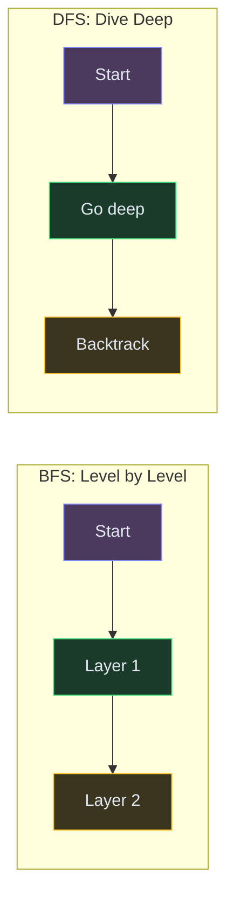

# Graph BFS and DFS

**The pattern:** Explore all reachable nodes in a graph systematically. BFS explores layer by layer (closest first), DFS dives deep before backtracking. These are the two fundamental building blocks of every graph algorithm.

**Why this matters in interviews:** ~20% of medium/hard problems are graph traversals in disguise. Grids, matrices, word transformations, course prerequisites — they're all graphs once you see the nodes and edges.

---

## When to Recognize It

- The problem has **nodes and connections** (explicit graph, grid, or implicit neighbors)
- "Find all connected components" → BFS or DFS
- "Shortest path in unweighted graph" → BFS
- "Can I reach X from Y?" → either BFS or DFS
- "Detect a cycle" → DFS with coloring, or BFS (Kahn's)
- Grid problems: each cell is a node, 4-directional moves are edges

---

## How It Works

**BFS** is like ripples from a stone dropped in water — they spread outward uniformly. You find the closest things first.

**DFS** is like exploring a maze by following one path to a dead end, then backtracking to try the next fork. You go deep before going wide.



| | BFS | DFS |
|---|---|---|
| Data structure | Queue | Stack (or recursion) |
| Explores | Nearest first | Deepest first |
| Shortest path? | Yes (unweighted) | No |
| Space | O(width) | O(depth) |
| Best for | Shortest path, level-order | Cycle detection, topological sort, exhaustive search |

---

## Template Code

### Code

<div class="code-tabs">
<div class="tab-buttons">
<button class="tab-btn active">Python</button>
<button class="tab-btn">Java</button>
<button class="tab-btn">C++</button>
<button class="tab-btn">JavaScript</button>
</div>
<div class="tab-content active">

<pre><code class="language-python">from collections import deque

# BFS template (graph as adjacency list)
def bfs(graph, start):
    visited = set([start])
    queue = deque([start])

    while queue:
        node = queue.popleft()
        # Process node here
        for neighbor in graph[node]:
            if neighbor not in visited:
                visited.add(neighbor)
                queue.append(neighbor)

# DFS template (recursive)
def dfs(graph, node, visited):
    visited.add(node)
    # Process node here
    for neighbor in graph[node]:
        if neighbor not in visited:
            dfs(graph, neighbor, visited)

# Grid BFS (find connected region)
def grid_bfs(grid, start_r, start_c):
    rows, cols = len(grid), len(grid[0])
    queue = deque([(start_r, start_c)])
    visited = set([(start_r, start_c)])
    directions = [(0,1), (0,-1), (1,0), (-1,0)]

    while queue:
        r, c = queue.popleft()
        for dr, dc in directions:
            nr, nc = r + dr, c + dc
            if 0 &lt;= nr &lt; rows and 0 &lt;= nc &lt; cols:
                if (nr, nc) not in visited and grid[nr][nc] == 1:
                    visited.add((nr, nc))
                    queue.append((nr, nc))
    return len(visited)</code></pre>

</div>
<div class="tab-content">

<pre><code class="language-java">// BFS template
void bfs(List&lt;List&lt;Integer&gt;&gt; graph, int start) {
    boolean[] visited = new boolean[graph.size()];
    Queue&lt;Integer&gt; queue = new LinkedList&lt;&gt;();
    visited[start] = true;
    queue.offer(start);

    while (!queue.isEmpty()) {
        int node = queue.poll();
        // Process node
        for (int neighbor : graph.get(node)) {
            if (!visited[neighbor]) {
                visited[neighbor] = true;
                queue.offer(neighbor);
            }
        }
    }
}

// DFS template (iterative with stack)
void dfs(List&lt;List&lt;Integer&gt;&gt; graph, int start) {
    boolean[] visited = new boolean[graph.size()];
    Deque&lt;Integer&gt; stack = new ArrayDeque&lt;&gt;();
    stack.push(start);

    while (!stack.isEmpty()) {
        int node = stack.pop();
        if (visited[node]) continue;
        visited[node] = true;
        // Process node
        for (int neighbor : graph.get(node)) {
            if (!visited[neighbor]) stack.push(neighbor);
        }
    }
}</code></pre>

</div>
<div class="tab-content">

<pre><code class="language-cpp">// BFS template
void bfs(vector&lt;vector&lt;int&gt;&gt;&amp; graph, int start) {
    vector&lt;bool&gt; visited(graph.size(), false);
    queue&lt;int&gt; q;
    visited[start] = true;
    q.push(start);

    while (!q.empty()) {
        int node = q.front(); q.pop();
        // Process node
        for (int neighbor : graph[node]) {
            if (!visited[neighbor]) {
                visited[neighbor] = true;
                q.push(neighbor);
            }
        }
    }
}

// DFS template (recursive)
void dfs(vector&lt;vector&lt;int&gt;&gt;&amp; graph, int node, vector&lt;bool&gt;&amp; visited) {
    visited[node] = true;
    // Process node
    for (int neighbor : graph[node]) {
        if (!visited[neighbor]) {
            dfs(graph, neighbor, visited);
        }
    }
}</code></pre>

</div>
<div class="tab-content">

<pre><code class="language-javascript">// BFS template
function bfs(graph, start) {
    const visited = new Set([start]);
    const queue = [start];
    let i = 0;

    while (i &lt; queue.length) {
        const node = queue[i++];
        // Process node
        for (const neighbor of graph[node]) {
            if (!visited.has(neighbor)) {
                visited.add(neighbor);
                queue.push(neighbor);
            }
        }
    }
}

// DFS template (iterative)
function dfs(graph, start) {
    const visited = new Set();
    const stack = [start];

    while (stack.length) {
        const node = stack.pop();
        if (visited.has(node)) continue;
        visited.add(node);
        // Process node
        for (const neighbor of graph[node]) {
            if (!visited.has(neighbor)) stack.push(neighbor);
        }
    }
}</code></pre>

</div>
</div>

---

## Variations

### Connected Components (Count Islands)

Run BFS/DFS from every unvisited node. Each time you start a new traversal, that's a new connected component.

### Code

```python
def count_islands(grid):
    rows, cols = len(grid), len(grid[0])
    visited = set()
    islands = 0

    def dfs(r, c):
        if r < 0 or r >= rows or c < 0 or c >= cols:
            return
        if (r, c) in visited or grid[r][c] == '0':
            return
        visited.add((r, c))
        dfs(r+1, c)
        dfs(r-1, c)
        dfs(r, c+1)
        dfs(r, c-1)

    for r in range(rows):
        for c in range(cols):
            if grid[r][c] == '1' and (r, c) not in visited:
                dfs(r, c)
                islands += 1

    return islands
```

### Cycle Detection (Directed Graph)

Use DFS with three states: unvisited (white), in-progress (gray), done (black). If you visit a gray node, you've found a cycle.

### Code

```python
def has_cycle(graph, n):
    """Detect cycle in directed graph using DFS coloring."""
    WHITE, GRAY, BLACK = 0, 1, 2
    color = [WHITE] * n

    def dfs(node):
        color[node] = GRAY
        for neighbor in graph[node]:
            if color[neighbor] == GRAY:
                return True  # back edge = cycle
            if color[neighbor] == WHITE and dfs(neighbor):
                return True
        color[node] = BLACK
        return False

    return any(color[i] == WHITE and dfs(i) for i in range(n))
```

### Multi-Source BFS

Start BFS from multiple sources simultaneously. Used in "rotting oranges" (all rotten oranges spread at the same time) or "walls and gates" (distance from nearest gate).

---

## Complexity

| Algorithm | Time | Space |
|---|---|---|
| BFS/DFS on adjacency list | O(V + E) | O(V) |
| BFS/DFS on grid (m x n) | O(m * n) | O(m * n) |
| Cycle detection | O(V + E) | O(V) |

---

## Common Mistakes

- **Marking visited too late in BFS** — mark when adding to queue, not when popping. Otherwise you add the same node multiple times
- **Forgetting diagonal neighbors** — some grid problems allow 8-directional movement, not just 4
- **Stack overflow with DFS on large grids** — for grids with 1000x1000 cells, iterative DFS or BFS is safer than recursive
- **Not building the adjacency list correctly** — for undirected graphs, add edges both directions

---

## Practice Problems

- [Number of Islands](/dsa/problem/number-of-islands)
- [Clone Graph](/dsa/problem/clone-graph)
- [Course Schedule](/dsa/problem/course-schedule)
- [Pacific Atlantic Water Flow](/dsa/problem/pacific-atlantic-water-flow)
- [Rotting Oranges](/dsa/problem/rotting-oranges)

---

## Key Takeaways

- BFS = queue = shortest path in unweighted graphs. DFS = stack/recursion = exhaustive exploration.
- For grids: each cell is a node, adjacency is 4 neighbors. Same BFS/DFS templates apply.
- Connected components = count how many times you start a new traversal
- Cycle detection in directed graphs needs three colors (white/gray/black), not just visited/unvisited
