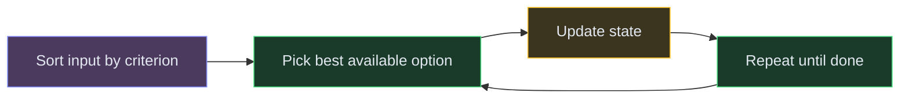

# Greedy Algorithms

**The pattern:** At each step, make the locally optimal choice — the best option right now — and trust that this leads to the globally optimal solution. No backtracking, no future lookahead. Greedy works when the "best local choice" provably leads to the best overall answer.

**Why this matters in interviews:** Greedy problems are fast to code (usually O(n log n) due to sorting) and elegant, but the hard part is **proving** the greedy choice is correct. Interviewers want to see you articulate WHY greedy works, not just the code.

---

## When to Recognize It

- The problem asks for **minimum/maximum** something and the solution can be built incrementally
- **Sorting** the input by some criterion reveals an obvious strategy
- You can argue: "taking the best available option now never hurts the future"
- Keywords: "minimum number of intervals," "maximum activities," "jump to the end," "assign tasks"
- Interval problems: sort by end time. Jump problems: track the farthest reachable position.

---

## How It Works

Think of it like filling a backpack at a buffet with limited plate space. The greedy strategy: always grab the dish with the best value-to-size ratio first. You don't reconsider — you just keep grabbing the best remaining option until you're full.

**The key question:** "Does choosing the locally best option ever prevent us from finding the globally best solution?" If the answer is no, greedy works.

---

## Template Code

### Code

<button class="tab-btn active">Python</button>
<button class="tab-btn">Java</button>
<button class="tab-btn">C++</button>
<button class="tab-btn">JavaScript</button>

<pre><code class="language-python"># Jump Game: can you reach the last index?
def can_jump(nums):
    farthest = 0
    for i in range(len(nums)):
        if i &gt; farthest:
            return False  # can't reach this position
        farthest = max(farthest, i + nums[i])
    return True

# Jump Game II: minimum jumps to reach end
def min_jumps(nums):
    jumps = 0
    current_end = 0
    farthest = 0

    for i in range(len(nums) - 1):
        farthest = max(farthest, i + nums[i])
        if i == current_end:  # must jump now
            jumps += 1
            current_end = farthest

    return jumps

# Merge Intervals
def merge_intervals(intervals):
    intervals.sort(key=lambda x: x[0])
    merged = [intervals[0]]

    for start, end in intervals[1:]:
        if start &lt;= merged[-1][1]:
            merged[-1][1] = max(merged[-1][1], end)
        else:
            merged.append([start, end])

    return merged</code></pre>

<pre><code class="language-java">// Jump Game
boolean canJump(int[] nums) {
    int farthest = 0;
    for (int i = 0; i &lt; nums.length; i++) {
        if (i &gt; farthest) return false;
        farthest = Math.max(farthest, i + nums[i]);
    }
    return true;
}

// Jump Game II
int minJumps(int[] nums) {
    int jumps = 0, currentEnd = 0, farthest = 0;
    for (int i = 0; i &lt; nums.length - 1; i++) {
        farthest = Math.max(farthest, i + nums[i]);
        if (i == currentEnd) {
            jumps++;
            currentEnd = farthest;
        }
    }
    return jumps;
}

// Merge Intervals
int[][] mergeIntervals(int[][] intervals) {
    Arrays.sort(intervals, (a, b) -&gt; a[0] - b[0]);
    List&lt;int[]&gt; merged = new ArrayList&lt;&gt;();
    merged.add(intervals[0]);
    for (int i = 1; i &lt; intervals.length; i++) {
        int[] last = merged.get(merged.size() - 1);
        if (intervals[i][0] &lt;= last[1]) {
            last[1] = Math.max(last[1], intervals[i][1]);
        } else {
            merged.add(intervals[i]);
        }
    }
    return merged.toArray(new int[0][]);
}</code></pre>

<pre><code class="language-cpp">// Jump Game
bool canJump(vector&lt;int&gt;&amp; nums) {
    int farthest = 0;
    for (int i = 0; i &lt; nums.size(); i++) {
        if (i &gt; farthest) return false;
        farthest = max(farthest, i + nums[i]);
    }
    return true;
}

// Jump Game II
int minJumps(vector&lt;int&gt;&amp; nums) {
    int jumps = 0, currentEnd = 0, farthest = 0;
    for (int i = 0; i &lt; (int)nums.size() - 1; i++) {
        farthest = max(farthest, i + nums[i]);
        if (i == currentEnd) {
            jumps++;
            currentEnd = farthest;
        }
    }
    return jumps;
}

// Merge Intervals
vector&lt;vector&lt;int&gt;&gt; mergeIntervals(vector&lt;vector&lt;int&gt;&gt;&amp; intervals) {
    sort(intervals.begin(), intervals.end());
    vector&lt;vector&lt;int&gt;&gt; merged = {intervals[0]};
    for (int i = 1; i &lt; intervals.size(); i++) {
        if (intervals[i][0] &lt;= merged.back()[1]) {
            merged.back()[1] = max(merged.back()[1], intervals[i][1]);
        } else {
            merged.push_back(intervals[i]);
        }
    }
    return merged;
}</code></pre>

<pre><code class="language-javascript">// Jump Game
function canJump(nums) {
    let farthest = 0;
    for (let i = 0; i &lt; nums.length; i++) {
        if (i &gt; farthest) return false;
        farthest = Math.max(farthest, i + nums[i]);
    }
    return true;
}

// Jump Game II
function minJumps(nums) {
    let jumps = 0, currentEnd = 0, farthest = 0;
    for (let i = 0; i &lt; nums.length - 1; i++) {
        farthest = Math.max(farthest, i + nums[i]);
        if (i === currentEnd) {
            jumps++;
            currentEnd = farthest;
        }
    }
    return jumps;
}

// Merge Intervals
function mergeIntervals(intervals) {
    intervals.sort((a, b) =&gt; a[0] - b[0]);
    const merged = [intervals[0]];
    for (let i = 1; i &lt; intervals.length; i++) {
        const last = merged[merged.length - 1];
        if (intervals[i][0] &lt;= last[1]) {
            last[1] = Math.max(last[1], intervals[i][1]);
        } else {
            merged.push(intervals[i]);
        }
    }
    return merged;
}</code></pre>

---

## Variations

### Non-Overlapping Intervals (Interval Scheduling)

Sort by end time. Greedily pick the interval that finishes earliest (leaves the most room for future intervals). Count how many you need to remove.

### Code

<button class="tab-btn active">Python</button>
<button class="tab-btn">Java</button>
<button class="tab-btn">C++</button>
<button class="tab-btn">JavaScript</button>

<pre><code class="language-python">def erase_overlap_intervals(intervals):
    intervals.sort(key=lambda x: x[1])  # sort by END time
    count = 0
    prev_end = float('-inf')

    for start, end in intervals:
        if start &gt;= prev_end:
            prev_end = end  # keep this interval
        else:
            count += 1  # remove this interval (overlaps)

    return count</code></pre>

<pre><code class="language-java">int eraseOverlapIntervals(int[][] intervals) {
    Arrays.sort(intervals, (a, b) -&gt; a[1] - b[1]);
    int count = 0, prevEnd = Integer.MIN_VALUE;
    for (int[] interval : intervals) {
        if (interval[0] &gt;= prevEnd) prevEnd = interval[1];
        else count++;
    }
    return count;
}</code></pre>

<pre><code class="language-cpp">int eraseOverlapIntervals(vector&lt;vector&lt;int&gt;&gt;&amp; intervals) {
    sort(intervals.begin(), intervals.end(),
          { return a[1] &lt; b[1]; });
    int count = 0, prevEnd = INT_MIN;
    for (auto&amp; iv : intervals) {
        if (iv[0] &gt;= prevEnd) prevEnd = iv[1];
        else count++;
    }
    return count;
}</code></pre>

<pre><code class="language-javascript">function eraseOverlapIntervals(intervals) {
    intervals.sort((a, b) =&gt; a[1] - b[1]);
    let count = 0, prevEnd = -Infinity;
    for (const [start, end] of intervals) {
        if (start &gt;= prevEnd) prevEnd = end;
        else count++;
    }
    return count;
}</code></pre>

### Task Scheduler (Cooldown Constraint)

The most frequent task dictates the minimum time. Fill idle slots with other tasks. Greedy insight: schedule the most frequent task first to minimize idle gaps.

### Activity Selection

Classic greedy: sort activities by finish time, always pick the one that ends earliest and doesn't conflict with the last picked.

---

## Complexity

| Problem | Time | Space |
|---|---|---|
| Jump Game | O(n) | O(1) |
| Jump Game II | O(n) | O(1) |
| Merge Intervals | O(n log n) | O(n) |
| Non-Overlapping Intervals | O(n log n) | O(1) |
| Task Scheduler | O(n) | O(1) |

Most greedy solutions are O(n) after O(n log n) sorting.

---

## Common Mistakes

- **Sorting by the wrong criterion** — for interval scheduling, sort by END time (not start time). Sorting by start time maximizes overlap, not selection.
- **Not proving greedy correctness** — just because greedy gives the right answer on examples doesn't mean it's correct. Think about exchange arguments: "if we swap a greedy choice with a non-greedy one, does the answer get worse?"
- **Applying greedy when DP is needed** — greedy fails for 0/1 knapsack, coin change (with arbitrary denominations), and problems where local optimality doesn't guarantee global optimality
- **Off-by-one in Jump Game II** — iterate to `n-2` (not `n-1`) because you don't need to jump FROM the last index

---

## Practice Problems

- [Jump Game](/dsa/problem/jump-game)
- [Jump Game II](/dsa/problem/jump-game-ii)
- [Merge Intervals](/dsa/problem/merge-intervals)
- [Non-Overlapping Intervals](/dsa/problem/non-overlapping-intervals)
- [Task Scheduler](/dsa/problem/task-scheduler)

---

## Key Takeaways

- Greedy = make the best local choice at each step, with no backtracking
- The hardest part isn't coding — it's proving WHY greedy works. Practice the "exchange argument."
- Interval problems: sort by end time. Jump problems: track farthest reachable position.
- If greedy doesn't obviously work, it probably doesn't. Fall back to DP.
