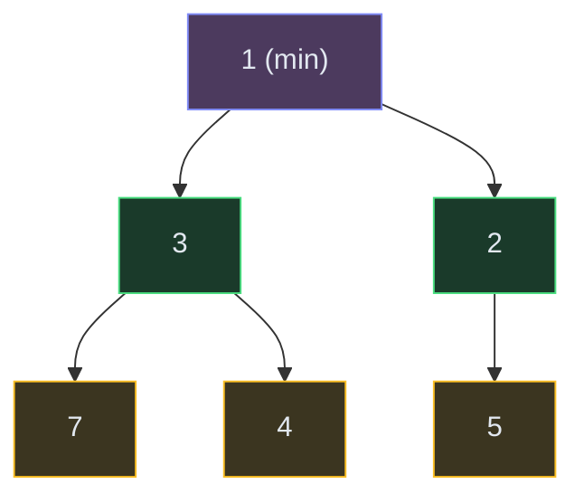

# Heaps and Priority Queues

**The pattern:** Use a heap (priority queue) to efficiently maintain the smallest or largest element as data streams in. Instead of sorting everything, the heap gives you the extreme value in O(log n) per operation.

**Why this matters in interviews:** Heaps power "top K," "merge K sorted," "running median," and scheduling problems. They're the go-to when you need repeated access to the min or max while data keeps changing.

---

## When to Recognize It

- You need the **K largest or K smallest** elements
- You're **merging K sorted** things (lists, arrays, streams)
- You need a **running median** or percentile as data arrives
- The problem involves **scheduling by priority** (smallest deadline, highest frequency)
- Keywords: "top K," "Kth largest," "merge sorted," "median," "priority," "schedule"

---

## How It Works

A heap is a complete binary tree where every parent is smaller (min-heap) or larger (max-heap) than its children. The root is always the minimum (or maximum). Think of it as a "lazy sort" — you don't sort everything, you just keep the most important element on top.

**Operations:**
- `push(x)`: Add element, bubble up — O(log n)
- `pop()`: Remove root (min/max), bubble down — O(log n)
- `peek()`: Look at root — O(1)

**Key insight:** A heap of size K requires O(n log K) to process n elements. When K << n, this is much faster than sorting (O(n log n)).

---

## Template Code

### Code

<button class="tab-btn active">Python</button>
<button class="tab-btn">Java</button>
<button class="tab-btn">C++</button>
<button class="tab-btn">JavaScript</button>

<pre><code class="language-python">import heapq

# Top K largest elements
def top_k_largest(nums, k):
    # Use min-heap of size k
    # The root is the kth largest (smallest in our heap)
    heap = nums[:k]
    heapq.heapify(heap)  # O(k)

    for num in nums[k:]:
        if num &gt; heap[0]:  # bigger than our smallest?
            heapq.heapreplace(heap, num)  # pop + push in one step

    return heap  # contains the k largest elements

# Kth largest element
def kth_largest(nums, k):
    heap = nums[:k]
    heapq.heapify(heap)
    for num in nums[k:]:
        if num &gt; heap[0]:
            heapq.heapreplace(heap, num)
    return heap[0]  # root = kth largest</code></pre>

<pre><code class="language-java">// Top K largest using min-heap of size K
int[] topKLargest(int[] nums, int k) {
    PriorityQueue&lt;Integer&gt; minHeap = new PriorityQueue&lt;&gt;();
    for (int num : nums) {
        minHeap.offer(num);
        if (minHeap.size() &gt; k) minHeap.poll();
    }
    return minHeap.stream().mapToInt(Integer::intValue).toArray();
}

// Kth largest
int kthLargest(int[] nums, int k) {
    PriorityQueue&lt;Integer&gt; minHeap = new PriorityQueue&lt;&gt;();
    for (int num : nums) {
        minHeap.offer(num);
        if (minHeap.size() &gt; k) minHeap.poll();
    }
    return minHeap.peek();
}</code></pre>

<pre><code class="language-cpp">// Top K largest using min-heap of size K
vector&lt;int&gt; topKLargest(vector&lt;int&gt;&amp; nums, int k) {
    priority_queue&lt;int, vector&lt;int&gt;, greater&lt;int&gt;&gt; minHeap;
    for (int num : nums) {
        minHeap.push(num);
        if (minHeap.size() &gt; k) minHeap.pop();
    }
    vector&lt;int&gt; result;
    while (!minHeap.empty()) {
        result.push_back(minHeap.top());
        minHeap.pop();
    }
    return result;
}</code></pre>

<pre><code class="language-javascript">// JavaScript doesn't have a built-in heap.
// For interviews, explain you'd use a MinPriorityQueue.
// Here's the logic with a simple sorted approach:
function topKLargest(nums, k) {
    // In real code, use a min-heap library
    const heap = [];
    for (const num of nums) {
        heap.push(num);
        heap.sort((a, b) =&gt; a - b);
        if (heap.length &gt; k) heap.shift();
    }
    return heap;
}</code></pre>

---

## Variations

### Merge K Sorted Lists

Maintain a min-heap with one element from each list. Pop the smallest, push the next element from that list. The heap always has at most K elements.

### Code

<button class="tab-btn active">Python</button>
<button class="tab-btn">Java</button>
<button class="tab-btn">C++</button>
<button class="tab-btn">JavaScript</button>

<pre><code class="language-python">import heapq

def merge_k_sorted(lists):
    heap = []
    for i, lst in enumerate(lists):
        if lst:
            heapq.heappush(heap, (lst[0].val, i, lst[0]))

    result = dummy = ListNode(0)
    while heap:
        val, i, node = heapq.heappop(heap)
        result.next = node
        result = result.next
        if node.next:
            heapq.heappush(heap, (node.next.val, i, node.next))

    return dummy.next</code></pre>

<pre><code class="language-java">ListNode mergeKSorted(ListNode[] lists) {
    PriorityQueue&lt;ListNode&gt; pq = new PriorityQueue&lt;&gt;((a, b) -&gt; a.val - b.val);
    for (ListNode head : lists) {
        if (head != null) pq.offer(head);
    }
    ListNode dummy = new ListNode(0), curr = dummy;
    while (!pq.isEmpty()) {
        ListNode node = pq.poll();
        curr.next = node;
        curr = curr.next;
        if (node.next != null) pq.offer(node.next);
    }
    return dummy.next;
}</code></pre>

<pre><code class="language-cpp">ListNode* mergeKSorted(vector&lt;ListNode*&gt;&amp; lists) {
    auto cmp =  { return a-&gt;val &gt; b-&gt;val; };
    priority_queue&lt;ListNode*, vector&lt;ListNode*&gt;, decltype(cmp)&gt; pq(cmp);
    for (auto head : lists) {
        if (head) pq.push(head);
    }
    ListNode dummy(0);
    ListNode* curr = &amp;dummy;
    while (!pq.empty()) {
        auto node = pq.top(); pq.pop();
        curr-&gt;next = node;
        curr = curr-&gt;next;
        if (node-&gt;next) pq.push(node-&gt;next);
    }
    return dummy.next;
}</code></pre>

<pre><code class="language-javascript">function mergeKSorted(lists) {
    // Using a simple approach — in interviews, explain min-heap usage
    const vals = [];
    for (const head of lists) {
        let node = head;
        while (node) { vals.push(node.val); node = node.next; }
    }
    vals.sort((a, b) =&gt; a - b);
    const dummy = { next: null };
    let curr = dummy;
    for (const v of vals) {
        curr.next = { val: v, next: null };
        curr = curr.next;
    }
    return dummy.next;
}</code></pre>

### Two Heaps: Running Median

Keep a max-heap for the lower half and a min-heap for the upper half. The median is at the top of the larger heap (or average of both tops).

### Top K Frequent Elements

Count frequencies with a hash map, then use a min-heap of size K on the frequencies.

---

## Complexity

| Operation | Time |
|---|---|
| Push | O(log n) |
| Pop | O(log n) |
| Peek | O(1) |
| Heapify n elements | O(n) |
| Top K from n elements | O(n log k) |
| Merge K sorted lists (total N nodes) | O(N log K) |

---

## Common Mistakes

- **Using max-heap when you need min-heap** — for "K largest," use a min-heap of size K (the root is the Kth largest). Counter-intuitive but correct.
- **Forgetting Python heapq is min-heap only** — for max-heap, negate values: `heappush(heap, -val)`
- **Not handling duplicates in merge-K** — add a tiebreaker (index) to avoid comparison errors when values are equal
- **Letting the heap grow unbounded** — for top-K, always maintain heap size at most K by popping when size exceeds K

---

## Practice Problems

- [Kth Largest Element in an Array](/dsa/problem/kth-largest-element-in-an-array)
- [Merge K Sorted Lists](/dsa/problem/merge-k-sorted-lists)
- [Find Median from Data Stream](/dsa/problem/find-median-from-data-stream)
- [Top K Frequent Elements](/dsa/problem/top-k-frequent-elements)
- [Task Scheduler](/dsa/problem/task-scheduler)

---

## Key Takeaways

- Heap = "give me the min/max quickly while things keep changing"
- For "K largest": min-heap of size K. For "K smallest": max-heap of size K. The names feel backwards — remember it.
- Merge-K-anything: put one from each into a heap, pop smallest, push next from that source
- Two heaps (max-heap lower + min-heap upper) = running median in O(log n) per insert
