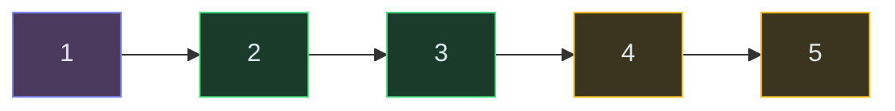

# Linked Lists

**The pattern:** Manipulate nodes that point to each other. The core techniques are reversal (rewiring pointers), fast/slow (tortoise and hare), and merge (weaving two lists together). Nearly every linked list problem uses one of these three.

**Why this matters in interviews:** Linked lists test pointer manipulation, edge-case handling, and in-place algorithms. They're simple in concept but tricky in execution — one wrong pointer assignment corrupts the whole list.

---

## When to Recognize It

- The problem gives you a **singly or doubly linked list**
- You need to **reverse** all or part of the list
- You need to **detect a cycle** or find the **middle node**
- You're asked to **merge two sorted lists** or **remove nodes**
- Keywords: "reverse," "middle," "cycle," "merge," "remove nth from end"
- The constraint is **O(1) extra space** (no arrays allowed)

---

## How It Works

Think of a linked list as a chain of paper clips. You can only move forward by following the link. To reverse, you unclip each one and attach it facing the other direction. To find the middle, send two people walking — one at normal speed, one at double speed. When the fast one finishes, the slow one is in the middle.

**The three core techniques:**
1. **Reversal:** Rewire `next` pointers to point backward
2. **Fast/Slow:** Two pointers at different speeds to find middle or detect cycles
3. **Dummy head:** A fake node before the real head simplifies edge cases

---

## Template Code

### Code

<button class="tab-btn active">Python</button>
<button class="tab-btn">Java</button>
<button class="tab-btn">C++</button>
<button class="tab-btn">JavaScript</button>

<pre><code class="language-python"># Reverse a linked list (iterative)
def reverse_list(head):
    prev = None
    current = head

    while current:
        next_node = current.next  # save next
        current.next = prev       # reverse link
        prev = current            # advance prev
        current = next_node       # advance current

    return prev  # new head

# Detect cycle (Floyd's algorithm)
def has_cycle(head):
    slow = fast = head
    while fast and fast.next:
        slow = slow.next
        fast = fast.next.next
        if slow == fast:
            return True
    return False

# Find middle node (slow/fast)
def find_middle(head):
    slow = fast = head
    while fast and fast.next:
        slow = slow.next
        fast = fast.next.next
    return slow  # middle (or second middle if even)</code></pre>

<pre><code class="language-java">// Reverse a linked list
ListNode reverseList(ListNode head) {
    ListNode prev = null, current = head;
    while (current != null) {
        ListNode next = current.next;
        current.next = prev;
        prev = current;
        current = next;
    }
    return prev;
}

// Detect cycle
boolean hasCycle(ListNode head) {
    ListNode slow = head, fast = head;
    while (fast != null &amp;&amp; fast.next != null) {
        slow = slow.next;
        fast = fast.next.next;
        if (slow == fast) return true;
    }
    return false;
}

// Find middle
ListNode findMiddle(ListNode head) {
    ListNode slow = head, fast = head;
    while (fast != null &amp;&amp; fast.next != null) {
        slow = slow.next;
        fast = fast.next.next;
    }
    return slow;
}</code></pre>

<pre><code class="language-cpp">// Reverse a linked list
ListNode* reverseList(ListNode* head) {
    ListNode* prev = nullptr;
    ListNode* current = head;
    while (current) {
        ListNode* next = current-&gt;next;
        current-&gt;next = prev;
        prev = current;
        current = next;
    }
    return prev;
}

// Detect cycle
bool hasCycle(ListNode* head) {
    ListNode* slow = head;
    ListNode* fast = head;
    while (fast &amp;&amp; fast-&gt;next) {
        slow = slow-&gt;next;
        fast = fast-&gt;next-&gt;next;
        if (slow == fast) return true;
    }
    return false;
}</code></pre>

<pre><code class="language-javascript">// Reverse a linked list
function reverseList(head) {
    let prev = null, current = head;
    while (current) {
        const next = current.next;
        current.next = prev;
        prev = current;
        current = next;
    }
    return prev;
}

// Detect cycle
function hasCycle(head) {
    let slow = head, fast = head;
    while (fast &amp;&amp; fast.next) {
        slow = slow.next;
        fast = fast.next.next;
        if (slow === fast) return true;
    }
    return false;
}</code></pre>

---

## Variations

### Merge Two Sorted Lists

Use a dummy node as the starting point. Compare heads of both lists, attach the smaller one, advance that pointer.

### Code

<button class="tab-btn active">Python</button>
<button class="tab-btn">Java</button>
<button class="tab-btn">C++</button>
<button class="tab-btn">JavaScript</button>

<pre><code class="language-python">def merge_sorted(l1, l2):
    dummy = ListNode(0)
    current = dummy

    while l1 and l2:
        if l1.val &lt;= l2.val:
            current.next = l1
            l1 = l1.next
        else:
            current.next = l2
            l2 = l2.next
        current = current.next

    current.next = l1 or l2  # attach remaining
    return dummy.next</code></pre>

<pre><code class="language-java">ListNode mergeSorted(ListNode l1, ListNode l2) {
    ListNode dummy = new ListNode(0), curr = dummy;
    while (l1 != null &amp;&amp; l2 != null) {
        if (l1.val &lt;= l2.val) { curr.next = l1; l1 = l1.next; }
        else { curr.next = l2; l2 = l2.next; }
        curr = curr.next;
    }
    curr.next = (l1 != null) ? l1 : l2;
    return dummy.next;
}</code></pre>

<pre><code class="language-cpp">ListNode* mergeSorted(ListNode* l1, ListNode* l2) {
    ListNode dummy(0);
    ListNode* curr = &amp;dummy;
    while (l1 &amp;&amp; l2) {
        if (l1-&gt;val &lt;= l2-&gt;val) { curr-&gt;next = l1; l1 = l1-&gt;next; }
        else { curr-&gt;next = l2; l2 = l2-&gt;next; }
        curr = curr-&gt;next;
    }
    curr-&gt;next = l1 ? l1 : l2;
    return dummy.next;
}</code></pre>

<pre><code class="language-javascript">function mergeSorted(l1, l2) {
    const dummy = { val: 0, next: null };
    let curr = dummy;
    while (l1 &amp;&amp; l2) {
        if (l1.val &lt;= l2.val) { curr.next = l1; l1 = l1.next; }
        else { curr.next = l2; l2 = l2.next; }
        curr = curr.next;
    }
    curr.next = l1 || l2;
    return dummy.next;
}</code></pre>

### Remove Nth Node From End

Use two pointers: advance the first pointer N steps ahead, then move both together. When the first reaches the end, the second is at the node to remove.

### Reverse a Sublist (Between Positions)

Navigate to the node before the sublist starts. Reverse the sublist in-place, then reconnect the boundaries.

---

## Complexity

| Operation | Time | Space |
|---|---|---|
| Reverse | O(n) | O(1) |
| Cycle detection | O(n) | O(1) |
| Find middle | O(n) | O(1) |
| Merge two sorted | O(n + m) | O(1) |
| Remove nth from end | O(n) | O(1) |

---

## Common Mistakes

- **Losing the reference to the next node** — always save `next = current.next` BEFORE rewiring `current.next`
- **Forgetting the dummy node** — without it, removing the head node becomes a special case. Dummy simplifies everything.
- **Off-by-one in "remove nth from end"** — count carefully. Use a dummy node to handle removing the head.
- **Not handling null/empty list** — always check `if not head` or `if not head.next` at the start

---

## Practice Problems

- [Reverse Linked List](/dsa/problem/reverse-linked-list)
- [Linked List Cycle](/dsa/problem/linked-list-cycle)
- [Merge Two Sorted Lists](/dsa/problem/merge-two-sorted-lists)
- [Remove Nth Node From End of List](/dsa/problem/remove-nth-node-from-end-of-list)
- [Reorder List](/dsa/problem/reorder-list)

---

## Key Takeaways

- Three techniques cover 90% of linked list problems: reversal, fast/slow, dummy head
- Always draw it out. Pointer manipulation is error-prone — a quick sketch catches bugs before code does.
- Dummy nodes eliminate edge cases for head insertion/deletion
- Fast/slow pointers: fast moves 2x. When fast finishes, slow is at the middle. If they meet, there's a cycle.
