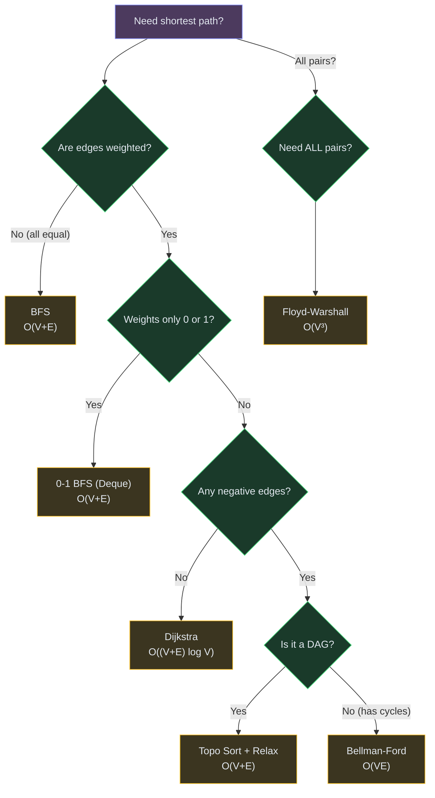
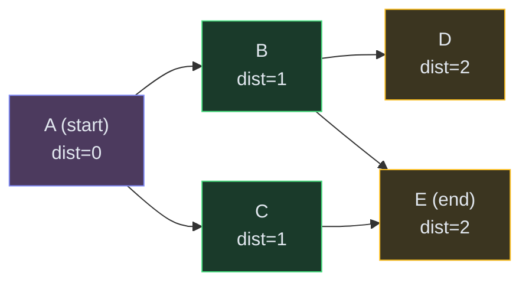
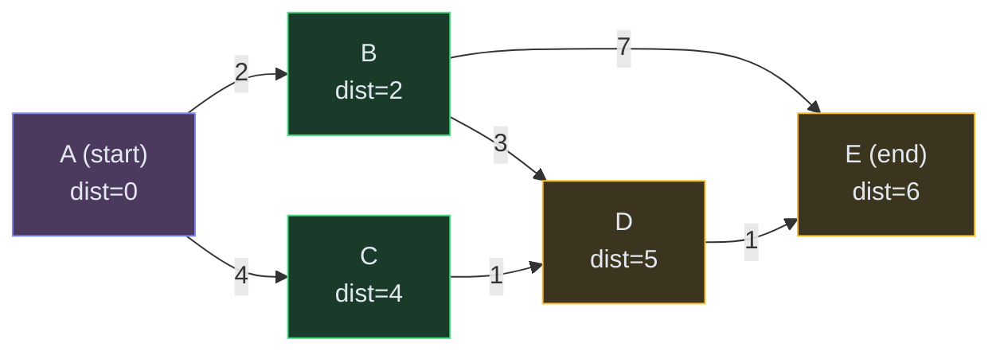
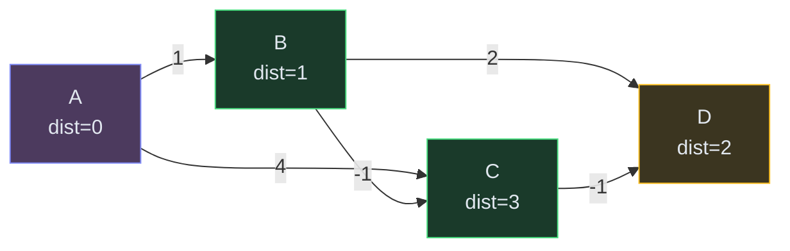
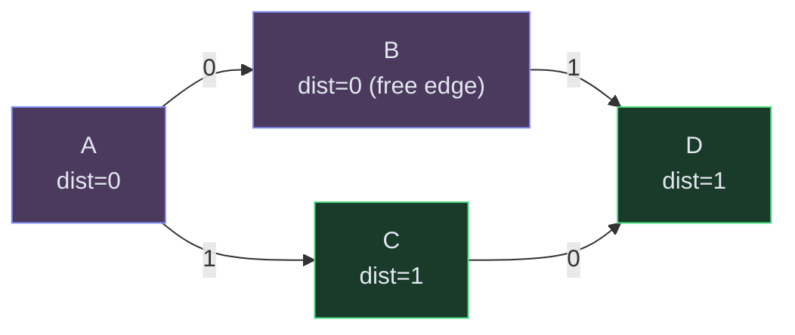

# Shortest Path Algorithms

**The problem:** Given a graph (nodes connected by edges), find the path from a source node to a destination with the minimum total cost (distance, time, weight).

**Why this matters in interviews:** ~15% of graph problems are shortest-path variants. Once you recognize the type, you pick the right algorithm and the code is mostly template.

---

## When to Use Which (Decision Tree)



**Rule of thumb:** Start with BFS (unweighted) or Dijkstra (weighted). Only reach for Bellman-Ford when you see negative edges or "at most K stops."

---

## 1. BFS (Breadth-First Search) — Unweighted Graphs

**When:** All edges have equal weight (or no weight). Every step costs 1.

**Intuition:** Imagine dropping a stone in a pond. Ripples spread outward one layer at a time. BFS explores all nodes 1 step away, then 2 steps, then 3 — so the first time you reach a node is guaranteed to be the shortest path.

**How it works (step by step):**



1. Start at A (distance = 0). Add A to a queue.
2. Process A: discover B and C (distance = 1). Add both to queue.
3. Process B: discover D and E (distance = 2). Add to queue.
4. Process C: discover E — but E is already visited (distance = 2). Skip.
5. We reach E with distance **2**. That's the shortest path.

**Key insight:** The queue ensures we always process nodes in order of their distance from the source. First arrival = shortest path.

**Complexity:** O(V + E) time, O(V) space.

### Code


```python
from collections import deque

def bfs_shortest(graph, src, dst):
    # graph = adjacency list: {node: [neighbors]}
    queue = deque([(src, 0)])  # (node, distance)
    visited = {src}
    
    while queue:
        node, dist = queue.popleft()
        if node == dst:
            return dist
        for neighbor in graph[node]:
            if neighbor not in visited:
                visited.add(neighbor)
                queue.append((neighbor, dist + 1))
    
    return -1  # unreachable
```

```java
int bfsShort(List<List<Integer>> graph, int src, int dst) {
    Queue<int[]> q = new LinkedList<>();
    boolean[] vis = new boolean[graph.size()];
    q.offer(new int[]{src, 0});
    vis[src] = true;
    while (!q.isEmpty()) {
        int[] cur = q.poll();
        if (cur[0] == dst) return cur[1];
        for (int nb : graph.get(cur[0])) {
            if (!vis[nb]) {
                vis[nb] = true;
                q.offer(new int[]{nb, cur[1] + 1});
            }
        }
    }
    return -1;
}
```

```cpp
int bfsShort(vector<vector<int>>& graph, int src, int dst) {
    queue<pair<int,int>> q;
    vector<bool> vis(graph.size(), false);
    q.push({src, 0});
    vis[src] = true;
    while (!q.empty()) {
        auto [node, dist] = q.front(); q.pop();
        if (node == dst) return dist;
        for (int nb : graph[node]) {
            if (!vis[nb]) {
                vis[nb] = true;
                q.push({nb, dist + 1});
            }
        }
    }
    return -1;
}
```

```javascript
function bfsShort(graph, src, dst) {
    const queue = [[src, 0]];
    const visited = new Set([src]);
    let i = 0;
    while (i < queue.length) {
        const [node, dist] = queue[i++];
        if (node === dst) return dist;
        for (const nb of graph[node]) {
            if (!visited.has(nb)) {
                visited.add(nb);
                queue.push([nb, dist + 1]);
            }
        }
    }
    return -1;
}
```


**Common interview problems using BFS shortest path:**
- [Word Ladder](/dsa/problem/word-ladder) — each word is a node, edges connect words differing by 1 letter
- [Rotting Oranges](/dsa/problem/rotting-oranges) — multi-source BFS on a grid
- [Shortest Path in Binary Matrix](/dsa/problem/shortest-path-in-binary-matrix) — grid BFS with 8 directions

---

## 2. Dijkstra's Algorithm — Weighted Graphs (No Negative Edges)

**When:** Edges have different positive weights (road lengths, travel times). You want the cheapest path from source to all nodes.

**Intuition:** Like BFS, but instead of a regular queue (FIFO), we use a **priority queue (min-heap)** that always processes the node with the smallest known distance first. This guarantees that when we pop a node, its distance is final.

**How it works (step by step):**



**Walkthrough:**
1. Start: dist[A]=0, everything else = infinity. Heap: [(0, A)]
2. Pop A (dist=0). Relax neighbors: dist[B]=2, dist[C]=4. Heap: [(2,B), (4,C)]
3. Pop B (dist=2). Relax: dist[D]=min(inf, 2+3)=5, dist[E]=min(inf, 2+7)=9. Heap: [(4,C), (5,D), (9,E)]
4. Pop C (dist=4). Relax: dist[D]=min(5, 4+1)=5 (no change). Heap: [(5,D), (9,E)]
5. Pop D (dist=5). Relax: dist[E]=min(9, 5+1)=6. Heap: [(6,E), (9,E)]
6. Pop E (dist=6). Done! Shortest path A→B→D→E costs **6**.

**Key insight:** Once a node is popped from the heap, its distance is finalized — you'll never find a shorter path to it. This is why negative edges break Dijkstra (a later discovery could be shorter via a negative edge, but you already finalized the node).

**Complexity:** O((V + E) log V) with a binary heap.

### Code


```python
import heapq

def dijkstra(graph, src, dst):
    # graph = {node: [(neighbor, weight), ...]}
    dist = {src: 0}
    heap = [(0, src)]  # (distance, node)
    
    while heap:
        d, node = heapq.heappop(heap)
        if node == dst:
            return d
        if d > dist.get(node, float('inf')):
            continue  # stale entry, skip
        for neighbor, weight in graph[node]:
            new_dist = d + weight
            if new_dist < dist.get(neighbor, float('inf')):
                dist[neighbor] = new_dist
                heapq.heappush(heap, (new_dist, neighbor))
    
    return -1  # unreachable
```

```java
int dijkstra(List<List<int[]>> graph, int src, int dst) {
    int n = graph.size();
    int[] dist = new int[n];
    Arrays.fill(dist, Integer.MAX_VALUE);
    dist[src] = 0;
    // min-heap: [distance, node]
    PriorityQueue<int[]> pq = new PriorityQueue<>((a,b) -> a[0] - b[0]);
    pq.offer(new int[]{0, src});
    while (!pq.isEmpty()) {
        int[] cur = pq.poll();
        int d = cur[0], node = cur[1];
        if (node == dst) return d;
        if (d > dist[node]) continue;
        for (int[] edge : graph.get(node)) {
            int nb = edge[0], w = edge[1];
            if (d + w < dist[nb]) {
                dist[nb] = d + w;
                pq.offer(new int[]{dist[nb], nb});
            }
        }
    }
    return -1;
}
```

```cpp
int dijkstra(vector<vector<pair<int,int>>>& graph, int src, int dst) {
    int n = graph.size();
    vector<int> dist(n, INT_MAX);
    dist[src] = 0;
    priority_queue<pair<int,int>, vector<pair<int,int>>, greater<>> pq;
    pq.push({0, src});
    while (!pq.empty()) {
        auto [d, node] = pq.top(); pq.pop();
        if (node == dst) return d;
        if (d > dist[node]) continue;
        for (auto [nb, w] : graph[node]) {
            if (d + w < dist[nb]) {
                dist[nb] = d + w;
                pq.push({dist[nb], nb});
            }
        }
    }
    return -1;
}
```

```javascript
function dijkstra(graph, src, dst) {
    // graph = [[{to, w}, ...], ...]  (adjacency list)
    const n = graph.length;
    const dist = Array(n).fill(Infinity);
    dist[src] = 0;
    // Simple heap using sorted insertion (for interview; use a real heap lib in prod)
    const heap = [[0, src]]; // [dist, node]
    while (heap.length) {
        heap.sort((a, b) => a[0] - b[0]);
        const [d, node] = heap.shift();
        if (node === dst) return d;
        if (d > dist[node]) continue;
        for (const {to, w} of graph[node]) {
            if (d + w < dist[to]) {
                dist[to] = d + w;
                heap.push([dist[to], to]);
            }
        }
    }
    return -1;
}
```


**Common interview problems using Dijkstra:**
- [Network Delay Time](/dsa/problem/network-delay-time) — classic single-source shortest path
- [Path With Minimum Effort](/dsa/problem/path-with-minimum-effort) — Dijkstra on a grid with edge weights = height difference

---

## 3. Bellman-Ford — When Edges Can Be Negative

**When:** Graph has negative edge weights, OR you need "shortest path with at most K edges" (the classic "cheapest flights within K stops" variant).

**Intuition:** Relax every edge, V-1 times. Each round guarantees we've found the shortest path using at most that many edges. Brute-force but handles negative weights correctly.

**How it works:**



**Round 1:** Relax all edges. dist[B]=1, dist[C]=4, dist[D]=3.
**Round 2:** Relax again. dist[C]=min(4, 1+(-1))=0. But wait — dist[C] via B is 1+(-1)=0... actually let me recompute. A→B=1, B→C: 1+(-1)=0, C→D: 0+(-1)=-1. After 2 rounds, dist[D]=min(3, -1)=... 

Actually let me give a cleaner example:

**The algorithm:**
1. Initialize dist[src] = 0, all others = infinity
2. Repeat V-1 times: for every edge (u, v, weight), if dist[u] + weight < dist[v], update dist[v]
3. After V-1 rounds, all shortest paths are found
4. (Optional) Do one more round — if any distance decreases, there's a negative cycle

**Why V-1 rounds?** The longest shortest path has at most V-1 edges. Each round "extends" paths by one edge. So after V-1 rounds, even the longest path is optimal.

**The K-stops interview trick:** If the problem says "at most K stops" (like cheapest flights), just run K rounds instead of V-1. After K rounds, you have the shortest path using at most K edges.

**Complexity:** O(V × E) time, O(V) space. Slower than Dijkstra, but handles negatives.

### Code


```python
def bellman_ford(n, edges, src, dst):
    # edges = [(u, v, weight), ...]
    dist = [float('inf')] * n
    dist[src] = 0
    
    for _ in range(n - 1):  # V-1 rounds
        for u, v, w in edges:
            if dist[u] != float('inf') and dist[u] + w < dist[v]:
                dist[v] = dist[u] + w
    
    # Check for negative cycle (optional)
    for u, v, w in edges:
        if dist[u] != float('inf') and dist[u] + w < dist[v]:
            return -1  # negative cycle exists
    
    return dist[dst] if dist[dst] != float('inf') else -1
```

```java
int bellmanFord(int n, int[][] edges, int src, int dst) {
    int[] dist = new int[n];
    Arrays.fill(dist, Integer.MAX_VALUE);
    dist[src] = 0;
    for (int i = 0; i < n - 1; i++) {
        for (int[] e : edges) {
            if (dist[e[0]] != Integer.MAX_VALUE && dist[e[0]] + e[2] < dist[e[1]]) {
                dist[e[1]] = dist[e[0]] + e[2];
            }
        }
    }
    return dist[dst] == Integer.MAX_VALUE ? -1 : dist[dst];
}
```

```cpp
int bellmanFord(int n, vector<array<int,3>>& edges, int src, int dst) {
    vector<int> dist(n, INT_MAX);
    dist[src] = 0;
    for (int i = 0; i < n - 1; i++) {
        for (auto& [u, v, w] : edges) {
            if (dist[u] != INT_MAX && dist[u] + w < dist[v])
                dist[v] = dist[u] + w;
        }
    }
    return dist[dst] == INT_MAX ? -1 : dist[dst];
}
```

```javascript
function bellmanFord(n, edges, src, dst) {
    const dist = Array(n).fill(Infinity);
    dist[src] = 0;
    for (let i = 0; i < n - 1; i++) {
        for (const [u, v, w] of edges) {
            if (dist[u] !== Infinity && dist[u] + w < dist[v]) {
                dist[v] = dist[u] + w;
            }
        }
    }
    return dist[dst] === Infinity ? -1 : dist[dst];
}
```


**Common interview problems using Bellman-Ford:**
- [Cheapest Flights Within K Stops](/dsa/problem/cheapest-flights-within-k-stops) — run K rounds instead of V-1
- Negative cycle detection — if V-th round still reduces distances

---

## 4. 0-1 BFS — When Weights Are Only 0 or 1

**When:** Edge weights are only 0 or 1. Common in grid problems where some moves are "free" (e.g., walking on a road = 0, breaking a wall = 1).

**Intuition:** Like BFS, but use a **deque (double-ended queue)** instead of a regular queue. Weight-0 edges go to the front (process next, same distance), weight-1 edges go to the back (process later, distance + 1). This keeps the deque sorted by distance without needing a heap — O(V+E) instead of O((V+E) log V).

**How it works:**



- A→B costs 0: push B to **front** of deque (same distance layer)
- A→C costs 1: push C to **back** of deque (next distance layer)

**Complexity:** O(V + E) — same as BFS! Much faster than Dijkstra for 0-1 graphs.

### Code


```python
from collections import deque

def bfs01(graph, src, dst):
    # graph = {node: [(neighbor, weight)]} where weight is 0 or 1
    dist = {src: 0}
    dq = deque([src])
    
    while dq:
        node = dq.popleft()
        if node == dst:
            return dist[node]
        for neighbor, w in graph[node]:
            new_dist = dist[node] + w
            if new_dist < dist.get(neighbor, float('inf')):
                dist[neighbor] = new_dist
                if w == 0:
                    dq.appendleft(neighbor)  # front — same layer
                else:
                    dq.append(neighbor)      # back — next layer
    
    return -1
```

```java
int bfs01(List<List<int[]>> graph, int src, int dst) {
    int n = graph.size();
    int[] dist = new int[n];
    Arrays.fill(dist, Integer.MAX_VALUE);
    dist[src] = 0;
    Deque<Integer> dq = new ArrayDeque<>();
    dq.offerFirst(src);
    while (!dq.isEmpty()) {
        int node = dq.pollFirst();
        if (node == dst) return dist[node];
        for (int[] edge : graph.get(node)) {
            int nb = edge[0], w = edge[1];
            if (dist[node] + w < dist[nb]) {
                dist[nb] = dist[node] + w;
                if (w == 0) dq.offerFirst(nb);
                else dq.offerLast(nb);
            }
        }
    }
    return -1;
}
```

```cpp
int bfs01(vector<vector<pair<int,int>>>& graph, int src, int dst) {
    int n = graph.size();
    vector<int> dist(n, INT_MAX);
    dist[src] = 0;
    deque<int> dq;
    dq.push_front(src);
    while (!dq.empty()) {
        int node = dq.front(); dq.pop_front();
        if (node == dst) return dist[node];
        for (auto [nb, w] : graph[node]) {
            if (dist[node] + w < dist[nb]) {
                dist[nb] = dist[node] + w;
                if (w == 0) dq.push_front(nb);
                else dq.push_back(nb);
            }
        }
    }
    return -1;
}
```

```javascript
function bfs01(graph, src, dst) {
    const n = graph.length;
    const dist = Array(n).fill(Infinity);
    dist[src] = 0;
    const dq = [src]; // use as deque (shift/unshift for front, push for back)
    while (dq.length) {
        const node = dq.shift();
        if (node === dst) return dist[node];
        for (const [nb, w] of graph[node]) {
            if (dist[node] + w < dist[nb]) {
                dist[nb] = dist[node] + w;
                if (w === 0) dq.unshift(nb);
                else dq.push(nb);
            }
        }
    }
    return -1;
}
```


**When to spot it:** grid problems where "some cells are free to cross, some cost 1." Classic: minimum obstacle removals to reach the corner.

---

## 5. Floyd-Warshall — All Pairs Shortest Path

**When:** You need the shortest distance between **every pair** of nodes, and the graph is small (V ≤ 400). Also handles negative edges (but no negative cycles).

**Intuition:** For every pair (i, j), ask: "is it shorter to go directly, or through some intermediate node k?" Try every possible intermediate k. Three nested loops — that's the whole algorithm.

**The core idea in one line:**
```
dist[i][j] = min(dist[i][j], dist[i][k] + dist[k][j])
```

"Can I get from i to j cheaper by routing through k?"

**Complexity:** O(V³) time, O(V²) space. Only practical for V ≤ ~400.

### Code


```python
def floyd_warshall(n, edges):
    # Returns dist[i][j] = shortest path from i to j
    INF = float('inf')
    dist = [[INF] * n for _ in range(n)]
    for i in range(n):
        dist[i][i] = 0
    for u, v, w in edges:
        dist[u][v] = min(dist[u][v], w)
    
    for k in range(n):          # intermediate node
        for i in range(n):      # source
            for j in range(n):  # destination
                if dist[i][k] + dist[k][j] < dist[i][j]:
                    dist[i][j] = dist[i][k] + dist[k][j]
    
    return dist
```

```java
int[][] floydWarshall(int n, int[][] edges) {
    int INF = (int) 1e9;
    int[][] dist = new int[n][n];
    for (int[] row : dist) Arrays.fill(row, INF);
    for (int i = 0; i < n; i++) dist[i][i] = 0;
    for (int[] e : edges) dist[e[0]][e[1]] = Math.min(dist[e[0]][e[1]], e[2]);
    
    for (int k = 0; k < n; k++)
        for (int i = 0; i < n; i++)
            for (int j = 0; j < n; j++)
                if (dist[i][k] + dist[k][j] < dist[i][j])
                    dist[i][j] = dist[i][k] + dist[k][j];
    return dist;
}
```

```cpp
vector<vector<int>> floydWarshall(int n, vector<array<int,3>>& edges) {
    const int INF = 1e9;
    vector<vector<int>> dist(n, vector<int>(n, INF));
    for (int i = 0; i < n; i++) dist[i][i] = 0;
    for (auto& [u, v, w] : edges) dist[u][v] = min(dist[u][v], w);
    
    for (int k = 0; k < n; k++)
        for (int i = 0; i < n; i++)
            for (int j = 0; j < n; j++)
                if (dist[i][k] + dist[k][j] < dist[i][j])
                    dist[i][j] = dist[i][k] + dist[k][j];
    return dist;
}
```

```javascript
function floydWarshall(n, edges) {
    const INF = Infinity;
    const dist = Array.from({length: n}, () => Array(n).fill(INF));
    for (let i = 0; i < n; i++) dist[i][i] = 0;
    for (const [u, v, w] of edges) dist[u][v] = Math.min(dist[u][v], w);
    
    for (let k = 0; k < n; k++)
        for (let i = 0; i < n; i++)
            for (let j = 0; j < n; j++)
                if (dist[i][k] + dist[k][j] < dist[i][j])
                    dist[i][j] = dist[i][k] + dist[k][j];
    return dist;
}
```


**Common interview problems:**
- Find the city with the smallest number of neighbors at a threshold distance
- Shortest path between all pairs in a small graph

---

## Comparison Cheat Sheet

| Algorithm | Time | Negative edges | All pairs | Best for |
|---|---|---|---|---|
| **BFS** | O(V+E) | ❌ | ❌ | Unweighted (grids, word problems) |
| **Dijkstra** | O((V+E) log V) | ❌ | ❌ | Weighted, non-negative (most real problems) |
| **Bellman-Ford** | O(VE) | ✅ | ❌ | Negative edges, K-stops constraint |
| **0-1 BFS** | O(V+E) | ❌ | ❌ | Weights are only 0 or 1 (obstacle grids) |
| **Floyd-Warshall** | O(V³) | ✅ | ✅ | All-pairs, small V (≤400) |
| **Topo Sort + Relax** | O(V+E) | ✅ | ❌ | DAGs only (fastest possible) |

---

## Common Mistakes in Interviews

1. **Using Dijkstra with negative edges** — it gives wrong answers. If you see negative weights, switch to Bellman-Ford.
2. **Not marking visited in BFS** — leads to infinite loops and TLE.
3. **Processing stale heap entries in Dijkstra** — always check `if d > dist[node]: continue` after popping.
4. **Forgetting that Floyd-Warshall needs `k` as the outermost loop** — if you put `k` inside, it breaks the DP correctness.
5. **Confusing "K stops" with "K edges"** — K stops = K+1 edges. Bellman-Ford with K rounds gives paths with at most K edges (= K-1 stops).

---

## When to Use What — Quick Reference

- **Grid, all moves cost 1** → BFS
- **Grid, some moves free (cost 0), some cost 1** → 0-1 BFS
- **Weighted road network, find cheapest route** → Dijkstra
- **"Cheapest flight with at most K stops"** → Bellman-Ford (K rounds)
- **"Distance from every node to every other node"** → Floyd-Warshall (if V ≤ 400) or run Dijkstra V times (if sparse)
- **DAG (no cycles) with weights** → Topological sort then relax in order (fastest: O(V+E))
