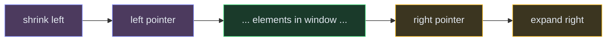

# Sliding Window

**The pattern:** Maintain a "window" (a contiguous subarray or substring) that slides across the input, expanding or shrinking to find an optimal answer — longest, shortest, or maximum/minimum something.

**Why this matters in interviews:** Sliding window converts brute-force O(n²) or O(n³) substring/subarray problems into O(n). It's one of the highest-frequency patterns and often the first optimization interviewers expect you to reach for.

---

## When to Recognize It

- The input is a **linear structure** (array, string)
- You're asked for **longest/shortest subarray or substring** with some property
- The constraint involves a **running sum, count, or frequency** within a contiguous range
- Keywords: "contiguous," "subarray," "substring," "at most K," "window"
- You can express validity as: "while the window is invalid, shrink from the left"

---

## How It Works

Think of it like looking through a physical window on a train. As the train moves forward, new scenery appears on the right, and old scenery disappears on the left. You're trying to find the best view (optimal window).

**The two flavors:**

1. **Fixed window:** The window size is given (size K). Slide it one step at a time.
2. **Variable window:** Expand the right pointer until the window becomes invalid, then shrink from the left until it's valid again. Track the best answer along the way.

---

## Template Code

### Code

<button class="tab-btn active">Python</button>
<button class="tab-btn">Java</button>
<button class="tab-btn">C++</button>
<button class="tab-btn">JavaScript</button>

<pre><code class="language-python">def sliding_window(s, k):
    """Variable-size sliding window template."""
    left = 0
    best = 0
    window_state = {}  # track frequencies, sum, etc.

    for right in range(len(s)):
        # 1. Expand: add s[right] to window state
        window_state[s[right]] = window_state.get(s[right], 0) + 1

        # 2. Shrink: while window is invalid, remove from left
        while not is_valid(window_state):
            window_state[s[left]] -= 1
            if window_state[s[left]] == 0:
                del window_state[s[left]]
            left += 1

        # 3. Update answer
        best = max(best, right - left + 1)

    return best</code></pre>

<pre><code class="language-java">int slidingWindow(String s) {
    int left = 0, best = 0;
    Map&lt;Character, Integer&gt; window = new HashMap&lt;&gt;();

    for (int right = 0; right &lt; s.length(); right++) {
        // 1. Expand: add s[right]
        window.merge(s.charAt(right), 1, Integer::sum);

        // 2. Shrink: while invalid
        while (!isValid(window)) {
            char c = s.charAt(left);
            window.merge(c, -1, Integer::sum);
            if (window.get(c) == 0) window.remove(c);
            left++;
        }

        // 3. Update answer
        best = Math.max(best, right - left + 1);
    }
    return best;
}</code></pre>

<pre><code class="language-cpp">int slidingWindow(string s) {
    int left = 0, best = 0;
    unordered_map&lt;char, int&gt; window;

    for (int right = 0; right &lt; s.size(); right++) {
        // 1. Expand
        window[s[right]]++;

        // 2. Shrink
        while (!isValid(window)) {
            window[s[left]]--;
            if (window[s[left]] == 0) window.erase(s[left]);
            left++;
        }

        // 3. Update
        best = max(best, right - left + 1);
    }
    return best;
}</code></pre>

<pre><code class="language-javascript">function slidingWindow(s) {
    let left = 0, best = 0;
    const window = new Map();

    for (let right = 0; right &lt; s.length; right++) {
        // 1. Expand
        window.set(s[right], (window.get(s[right]) || 0) + 1);

        // 2. Shrink
        while (!isValid(window)) {
            window.set(s[left], window.get(s[left]) - 1);
            if (window.get(s[left]) === 0) window.delete(s[left]);
            left++;
        }

        // 3. Update
        best = Math.max(best, right - left + 1);
    }
    return best;
}</code></pre>

---

## Variations

### Fixed-Size Window

When the window size K is given, you don't need the while loop — just slide by adding one element to the right and removing one from the left.

### Code

<button class="tab-btn active">Python</button>
<button class="tab-btn">Java</button>
<button class="tab-btn">C++</button>
<button class="tab-btn">JavaScript</button>

<pre><code class="language-python">def fixed_window(nums, k):
    """Fixed-size window: max sum of subarray of size k."""
    window_sum = sum(nums[:k])
    best = window_sum

    for i in range(k, len(nums)):
        window_sum += nums[i] - nums[i - k]  # slide
        best = max(best, window_sum)

    return best</code></pre>

<pre><code class="language-java">int fixedWindow(int[] nums, int k) {
    int windowSum = 0;
    for (int i = 0; i &lt; k; i++) windowSum += nums[i];
    int best = windowSum;

    for (int i = k; i &lt; nums.length; i++) {
        windowSum += nums[i] - nums[i - k];
        best = Math.max(best, windowSum);
    }
    return best;
}</code></pre>

<pre><code class="language-cpp">int fixedWindow(vector&lt;int&gt;&amp; nums, int k) {
    int windowSum = accumulate(nums.begin(), nums.begin() + k, 0);
    int best = windowSum;

    for (int i = k; i &lt; nums.size(); i++) {
        windowSum += nums[i] - nums[i - k];
        best = max(best, windowSum);
    }
    return best;
}</code></pre>

<pre><code class="language-javascript">function fixedWindow(nums, k) {
    let windowSum = nums.slice(0, k).reduce((a, b) =&gt; a + b, 0);
    let best = windowSum;

    for (let i = k; i &lt; nums.length; i++) {
        windowSum += nums[i] - nums[i - k];
        best = Math.max(best, windowSum);
    }
    return best;
}</code></pre>

### Minimum Window (Shrink to Find Shortest)

When finding the **shortest** valid window, the template flips: expand until valid, then shrink while still valid, recording the minimum length.

### Frequency-Constrained Window

When the constraint is "at most K distinct characters" or "at most K replacements allowed," the `isValid` check becomes a frequency comparison.

---

## Complexity

| Variant | Time | Space |
|---|---|---|
| Fixed window | O(n) | O(1) or O(k) |
| Variable window | O(n) | O(alphabet size) |

**Why O(n)?** Each element is added to the window exactly once (right pointer) and removed at most once (left pointer). Two pointers, each traversing the array once = 2n operations total.

---

## Common Mistakes

- **Forgetting to shrink** — expanding forever gives you the whole array, not the optimal sub-window
- **Off-by-one on window size** — the window length is `right - left + 1`, not `right - left`
- **Updating answer at the wrong time** — for "longest valid," update after shrinking; for "shortest valid," update before/during shrinking
- **Using a nested loop that resets left** — the left pointer should only move forward, never backward. If you reset `left = 0` inside the loop, you've broken the O(n) guarantee

---

## Practice Problems

- [Longest Substring Without Repeating Characters](/dsa/problem/longest-substring-without-repeating-characters)
- [Minimum Window Substring](/dsa/problem/minimum-window-substring)
- [Max Consecutive Ones III](/dsa/problem/max-consecutive-ones-iii)
- [Longest Repeating Character Replacement](/dsa/problem/longest-repeating-character-replacement)
- [Permutation in String](/dsa/problem/permutation-in-string)

---

## Key Takeaways

- Sliding window turns O(n²) brute-force subarray/substring problems into O(n)
- The core loop: **expand right, shrink left while invalid, update best**
- Fixed windows slide by one; variable windows grow and shrink dynamically
- If the problem says "contiguous subarray" + "optimal length/sum," your first thought should be sliding window
