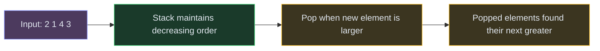

# Stacks and Queues

**The pattern:** Use LIFO (stack) or FIFO (queue) ordering to process elements in a specific sequence. The monotonic stack variant is especially powerful — it finds the next greater/smaller element for every position in O(n).

**Why this matters in interviews:** Stacks solve parentheses matching, expression evaluation, monotonic problems (temperatures, histograms), and undo systems. They appear simple but enable elegant O(n) solutions to problems that look O(n²).

---

## When to Recognize It

- **Valid parentheses** — match opening with closing brackets
- **Next greater/smaller element** — for each element, find the first larger/smaller to the right
- **Largest rectangle in histogram** — classic monotonic stack
- Keywords: "matching pairs," "next greater," "stock span," "daily temperatures"
- You need to process things in **reverse order** of arrival (LIFO)
- You need to maintain a **sorted property** as elements arrive (monotonic stack)

---

## How It Works

**Monotonic Stack:** Imagine a stack of plates where you only allow increasing heights. When a new plate arrives that's shorter than the top, you keep popping taller plates until you find one shorter (or the stack is empty). Each popped plate now knows: "this new plate is my next smaller element."



**Key insight:** Each element is pushed once and popped once → O(n) total, even though it looks like a nested loop.

---

## Template Code

### Code

<div class="code-tabs">
<div class="tab-buttons">
<button class="tab-btn active">Python</button>
<button class="tab-btn">Java</button>
<button class="tab-btn">C++</button>
<button class="tab-btn">JavaScript</button>
</div>
<div class="tab-content active">

<pre><code class="language-python"># Monotonic stack: next greater element for each position
def next_greater(nums):
    n = len(nums)
    result = [-1] * n
    stack = []  # stores indices

    for i in range(n):
        # Pop elements smaller than current
        while stack and nums[stack[-1]] &lt; nums[i]:
            idx = stack.pop()
            result[idx] = nums[i]
        stack.append(i)

    return result

# Valid parentheses
def is_valid(s):
    stack = []
    pairs = {')': '(', '}': '{', ']': '['}

    for char in s:
        if char in pairs:
            if not stack or stack[-1] != pairs[char]:
                return False
            stack.pop()
        else:
            stack.append(char)

    return len(stack) == 0</code></pre>

</div>
<div class="tab-content">

<pre><code class="language-java">// Monotonic stack: next greater element
int[] nextGreater(int[] nums) {
    int n = nums.length;
    int[] result = new int[n];
    Arrays.fill(result, -1);
    Deque&lt;Integer&gt; stack = new ArrayDeque&lt;&gt;();

    for (int i = 0; i &lt; n; i++) {
        while (!stack.isEmpty() &amp;&amp; nums[stack.peek()] &lt; nums[i]) {
            result[stack.pop()] = nums[i];
        }
        stack.push(i);
    }
    return result;
}

// Valid parentheses
boolean isValid(String s) {
    Deque&lt;Character&gt; stack = new ArrayDeque&lt;&gt;();
    Map&lt;Character, Character&gt; pairs = Map.of(')', '(', '}', '{', ']', '[');

    for (char c : s.toCharArray()) {
        if (pairs.containsKey(c)) {
            if (stack.isEmpty() || stack.peek() != pairs.get(c)) return false;
            stack.pop();
        } else {
            stack.push(c);
        }
    }
    return stack.isEmpty();
}</code></pre>

</div>
<div class="tab-content">

<pre><code class="language-cpp">// Monotonic stack: next greater element
vector&lt;int&gt; nextGreater(vector&lt;int&gt;&amp; nums) {
    int n = nums.size();
    vector&lt;int&gt; result(n, -1);
    stack&lt;int&gt; stk;

    for (int i = 0; i &lt; n; i++) {
        while (!stk.empty() &amp;&amp; nums[stk.top()] &lt; nums[i]) {
            result[stk.top()] = nums[i];
            stk.pop();
        }
        stk.push(i);
    }
    return result;
}

// Valid parentheses
bool isValid(string s) {
    stack&lt;char&gt; stk;
    unordered_map&lt;char, char&gt; pairs = {{')', '('}, {'}', '{'}, {']', '['}};

    for (char c : s) {
        if (pairs.count(c)) {
            if (stk.empty() || stk.top() != pairs[c]) return false;
            stk.pop();
        } else {
            stk.push(c);
        }
    }
    return stk.empty();
}</code></pre>

</div>
<div class="tab-content">

<pre><code class="language-javascript">// Monotonic stack: next greater element
function nextGreater(nums) {
    const n = nums.length;
    const result = new Array(n).fill(-1);
    const stack = [];

    for (let i = 0; i &lt; n; i++) {
        while (stack.length &amp;&amp; nums[stack[stack.length - 1]] &lt; nums[i]) {
            result[stack.pop()] = nums[i];
        }
        stack.push(i);
    }
    return result;
}

// Valid parentheses
function isValid(s) {
    const stack = [];
    const pairs = { ')': '(', '}': '{', ']': '[' };

    for (const char of s) {
        if (pairs[char]) {
            if (!stack.length || stack[stack.length - 1] !== pairs[char]) return false;
            stack.pop();
        } else {
            stack.push(char);
        }
    }
    return stack.length === 0;
}</code></pre>

</div>
</div>

---

## Variations

### Largest Rectangle in Histogram

For each bar, find how far it can extend left and right without hitting a shorter bar. Use a monotonic increasing stack — when a shorter bar arrives, pop and calculate area for each popped bar.

### Code

```python
def largest_rectangle(heights):
    stack = []  # stores indices of increasing heights
    max_area = 0
    heights.append(0)  # sentinel to flush remaining bars

    for i, h in enumerate(heights):
        while stack and heights[stack[-1]] > h:
            height = heights[stack.pop()]
            width = i if not stack else i - stack[-1] - 1
            max_area = max(max_area, height * width)
        stack.append(i)

    heights.pop()  # remove sentinel
    return max_area
```

### Queue Using Two Stacks

Push to one stack (inbox). When you need to pop/peek from the queue, if the other stack (outbox) is empty, pour everything from inbox to outbox (reverses order → FIFO).

### Monotonic Decreasing Stack

For "next smaller element" or "stock span," maintain a decreasing stack instead. Pop when the new element is smaller than the top.

---

## Complexity

| Operation | Time |
|---|---|
| Valid parentheses | O(n) |
| Next greater element | O(n) |
| Largest rectangle | O(n) |
| Queue using stacks (amortized) | O(1) per operation |

**Why monotonic stack is O(n):** Every element is pushed once and popped at most once. Even though there's a while loop inside the for loop, the total pops across all iterations is bounded by n.

---

## Common Mistakes

- **Forgetting the sentinel value in histogram** — without appending 0 at the end, bars remaining in the stack don't get processed
- **Storing values instead of indices** — you almost always need indices to calculate widths/distances
- **Confusing monotonic direction** — for "next greater," maintain a decreasing stack. For "next smaller," maintain an increasing stack.
- **Not handling empty stack** — always check `stack` before accessing `stack[-1]` or `stack.top()`

---

## Practice Problems

- [Valid Parentheses](/dsa/problem/valid-parentheses)
- [Daily Temperatures](/dsa/problem/daily-temperatures)
- [Largest Rectangle in Histogram](/dsa/problem/largest-rectangle-in-histogram)
- [Implement Queue Using Stacks](/dsa/problem/implement-queue-using-stacks)
- [Min Stack](/dsa/problem/min-stack)

---

## Key Takeaways

- Monotonic stack solves "next greater/smaller" in O(n) — it looks O(n²) but each element is pushed and popped exactly once
- For parentheses: push openers, pop when a closer matches the top. If stack isn't empty at the end, it's invalid.
- Store indices in the stack (not values) — you'll need them for distance/width calculations
- Queue from two stacks: amortized O(1) — the key insight is lazy transfer (only pour when outbox is empty)
