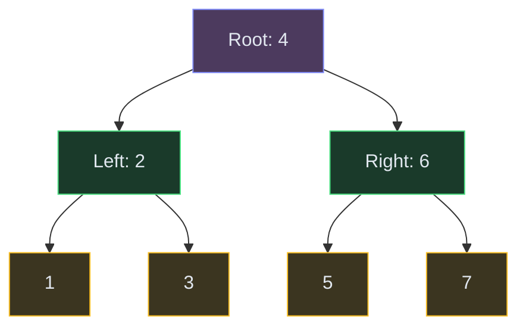

# Tree Traversals

**The pattern:** Visit every node in a binary tree in a specific order. The order you choose determines what information you can extract — sorted values (inorder), structure cloning (preorder), bottom-up computation (postorder), or level-by-level processing (BFS).

**Why this matters in interviews:** Almost every tree problem is a traversal with extra logic plugged in. Once you master the four traversal orders, tree problems become "which traversal + what do I track?"

---

## When to Recognize It

- The input is a **binary tree** (or n-ary tree)
- You need to visit all nodes and collect/compute something
- "Print nodes level by level" → BFS
- "Validate BST" or "kth smallest" → Inorder
- "Serialize/clone the tree" → Preorder
- "Calculate heights, check balance" → Postorder

---

## How It Works

Think of a tree as a family hierarchy. Each traversal visits the "parent" at a different time relative to its children:



| Order | Visit sequence | Output for tree above | Use case |
|---|---|---|---|
| **Inorder** | Left → Root → Right | 1,2,3,4,5,6,7 | BST gives sorted order |
| **Preorder** | Root → Left → Right | 4,2,1,3,6,5,7 | Clone/serialize tree |
| **Postorder** | Left → Right → Root | 1,3,2,5,7,6,4 | Delete tree, calc heights |
| **Level-order** | Level by level | [[4],[2,6],[1,3,5,7]] | BFS, shortest path in tree |

---

## Template Code

### Code

<div class="code-tabs">
<div class="tab-buttons">
<button class="tab-btn active">Python</button>
<button class="tab-btn">Java</button>
<button class="tab-btn">C++</button>
<button class="tab-btn">JavaScript</button>
</div>
<div class="tab-content active">

<pre><code class="language-python"># Recursive traversals
def inorder(root):
    if not root:
        return []
    return inorder(root.left) + [root.val] + inorder(root.right)

def preorder(root):
    if not root:
        return []
    return [root.val] + preorder(root.left) + preorder(root.right)

def postorder(root):
    if not root:
        return []
    return postorder(root.left) + postorder(root.right) + [root.val]

# Iterative inorder (most common in interviews)
def inorder_iterative(root):
    result, stack = [], []
    current = root
    while current or stack:
        while current:
            stack.append(current)
            current = current.left
        current = stack.pop()
        result.append(current.val)
        current = current.right
    return result

# BFS level-order
from collections import deque
def level_order(root):
    if not root:
        return []
    result = []
    queue = deque([root])
    while queue:
        level = []
        for _ in range(len(queue)):
            node = queue.popleft()
            level.append(node.val)
            if node.left:
                queue.append(node.left)
            if node.right:
                queue.append(node.right)
        result.append(level)
    return result</code></pre>

</div>
<div class="tab-content">

<pre><code class="language-java">// Iterative inorder
List&lt;Integer&gt; inorderIterative(TreeNode root) {
    List&lt;Integer&gt; result = new ArrayList&lt;&gt;();
    Deque&lt;TreeNode&gt; stack = new ArrayDeque&lt;&gt;();
    TreeNode current = root;
    while (current != null || !stack.isEmpty()) {
        while (current != null) {
            stack.push(current);
            current = current.left;
        }
        current = stack.pop();
        result.add(current.val);
        current = current.right;
    }
    return result;
}

// BFS level-order
List&lt;List&lt;Integer&gt;&gt; levelOrder(TreeNode root) {
    List&lt;List&lt;Integer&gt;&gt; result = new ArrayList&lt;&gt;();
    if (root == null) return result;
    Queue&lt;TreeNode&gt; queue = new LinkedList&lt;&gt;();
    queue.offer(root);
    while (!queue.isEmpty()) {
        int size = queue.size();
        List&lt;Integer&gt; level = new ArrayList&lt;&gt;();
        for (int i = 0; i &lt; size; i++) {
            TreeNode node = queue.poll();
            level.add(node.val);
            if (node.left != null) queue.offer(node.left);
            if (node.right != null) queue.offer(node.right);
        }
        result.add(level);
    }
    return result;
}</code></pre>

</div>
<div class="tab-content">

<pre><code class="language-cpp">// Iterative inorder
vector&lt;int&gt; inorderIterative(TreeNode* root) {
    vector&lt;int&gt; result;
    stack&lt;TreeNode*&gt; stk;
    TreeNode* current = root;
    while (current || !stk.empty()) {
        while (current) {
            stk.push(current);
            current = current-&gt;left;
        }
        current = stk.top(); stk.pop();
        result.push_back(current-&gt;val);
        current = current-&gt;right;
    }
    return result;
}

// BFS level-order
vector&lt;vector&lt;int&gt;&gt; levelOrder(TreeNode* root) {
    vector&lt;vector&lt;int&gt;&gt; result;
    if (!root) return result;
    queue&lt;TreeNode*&gt; q;
    q.push(root);
    while (!q.empty()) {
        int size = q.size();
        vector&lt;int&gt; level;
        for (int i = 0; i &lt; size; i++) {
            TreeNode* node = q.front(); q.pop();
            level.push_back(node-&gt;val);
            if (node-&gt;left) q.push(node-&gt;left);
            if (node-&gt;right) q.push(node-&gt;right);
        }
        result.push_back(level);
    }
    return result;
}</code></pre>

</div>
<div class="tab-content">

<pre><code class="language-javascript">// Iterative inorder
function inorderIterative(root) {
    const result = [], stack = [];
    let current = root;
    while (current || stack.length) {
        while (current) {
            stack.push(current);
            current = current.left;
        }
        current = stack.pop();
        result.push(current.val);
        current = current.right;
    }
    return result;
}

// BFS level-order
function levelOrder(root) {
    if (!root) return [];
    const result = [];
    const queue = [root];
    while (queue.length) {
        const size = queue.length;
        const level = [];
        for (let i = 0; i &lt; size; i++) {
            const node = queue.shift();
            level.push(node.val);
            if (node.left) queue.push(node.left);
            if (node.right) queue.push(node.right);
        }
        result.push(level);
    }
    return result;
}</code></pre>

</div>
</div>

---

## Variations

### Iterative Preorder (Stack-Based)

Push right child first, then left — so left gets processed first (LIFO).

### Code

```python
def preorder_iterative(root):
    if not root:
        return []
    result, stack = [], [root]
    while stack:
        node = stack.pop()
        result.append(node.val)
        if node.right:
            stack.append(node.right)
        if node.left:
            stack.append(node.left)
    return result
```

### Morris Traversal (O(1) Space Inorder)

Threads the tree using right pointers to avoid a stack. O(n) time, O(1) space — rarely asked but impressive if you know it.

### Validate BST Using Inorder

A valid BST has a strictly increasing inorder traversal. Track the previous value and ensure each node is greater.

---

## Complexity

| Traversal | Time | Space |
|---|---|---|
| Recursive (any order) | O(n) | O(h) call stack |
| Iterative with stack | O(n) | O(h) |
| BFS level-order | O(n) | O(w) where w = max width |
| Morris traversal | O(n) | O(1) |

Where h = height (log n for balanced, n for skewed), w = maximum width of any level.

---

## Common Mistakes

- **Forgetting the base case** — always check `if not root: return` first
- **Confusing iterative inorder pointer movement** — after popping from stack, move to `current.right`, not `current.left`
- **Not using `for _ in range(len(queue))` in BFS** — without fixing the level size, you'll mix nodes from different levels
- **Using recursion on very deep trees** — can hit stack overflow. Switch to iterative for trees that might be 10000+ nodes deep

---

## Practice Problems

- [Binary Tree Inorder Traversal](/dsa/problem/binary-tree-inorder-traversal)
- [Binary Tree Level Order Traversal](/dsa/problem/binary-tree-level-order-traversal)
- [Maximum Depth of Binary Tree](/dsa/problem/maximum-depth-of-binary-tree)
- [Validate Binary Search Tree](/dsa/problem/validate-binary-search-tree)
- [Binary Tree Right Side View](/dsa/problem/binary-tree-right-side-view)

---

## Key Takeaways

- Inorder on a BST = sorted order. This is the most-tested property in interviews.
- Preorder captures structure (root first) — use it for serialization and cloning
- Postorder computes bottom-up — heights, subtree sizes, deletion
- BFS (level-order) is just a queue — use it whenever the problem mentions "levels" or "depth"
