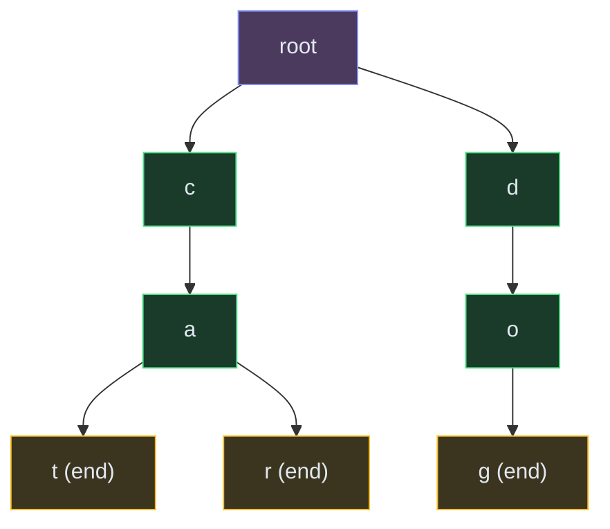

# Tries (Prefix Trees)

**The pattern:** A tree where each node represents a character, and paths from root to nodes spell out prefixes. Tries let you search, insert, and check prefixes in O(L) time (L = word length) — regardless of how many words are stored.

**Why this matters in interviews:** Tries are the go-to for prefix-based problems: autocomplete, spell check, word search in a grid with a dictionary, and IP routing. They replace brute-force string matching with elegant tree traversal.

---

## When to Recognize It

- You need to check if a **prefix exists** among many stored words
- The problem involves **autocomplete** or **type-ahead** suggestions
- You're searching a **grid for multiple dictionary words** simultaneously
- Keywords: "prefix," "starts with," "dictionary," "word search with word list"
- Comparing every word in a list for a prefix is O(n × L) — a trie does it in O(L)

---

## How It Works

Think of a dictionary organized like a tree. The root is empty. Each branch is a letter. To look up "cat," you follow root → c → a → t. If that path exists and the last node is marked as "end of word," the word exists. To check the prefix "ca," you just need the path root → c → a to exist — you don't care about the end marker.

This trie stores: "cat", "car", "dog". Checking "ca" returns true (prefix exists). Checking "cap" returns false (no 'p' after 'a').

---

## Template Code

### Code

<button class="tab-btn active">Python</button>
<button class="tab-btn">Java</button>
<button class="tab-btn">C++</button>
<button class="tab-btn">JavaScript</button>

<pre><code class="language-python">class TrieNode:
    def __init__(self):
        self.children = {}
        self.is_end = False

class Trie:
    def __init__(self):
        self.root = TrieNode()

    def insert(self, word):
        node = self.root
        for char in word:
            if char not in node.children:
                node.children[char] = TrieNode()
            node = node.children[char]
        node.is_end = True

    def search(self, word):
        node = self._find(word)
        return node is not None and node.is_end

    def starts_with(self, prefix):
        return self._find(prefix) is not None

    def _find(self, prefix):
        node = self.root
        for char in prefix:
            if char not in node.children:
                return None
            node = node.children[char]
        return node</code></pre>

<pre><code class="language-java">class Trie {
    private TrieNode root = new TrieNode();

    public void insert(String word) {
        TrieNode node = root;
        for (char c : word.toCharArray()) {
            node.children.putIfAbsent(c, new TrieNode());
            node = node.children.get(c);
        }
        node.isEnd = true;
    }

    public boolean search(String word) {
        TrieNode node = find(word);
        return node != null &amp;&amp; node.isEnd;
    }

    public boolean startsWith(String prefix) {
        return find(prefix) != null;
    }

    private TrieNode find(String prefix) {
        TrieNode node = root;
        for (char c : prefix.toCharArray()) {
            if (!node.children.containsKey(c)) return null;
            node = node.children.get(c);
        }
        return node;
    }
}

class TrieNode {
    Map&lt;Character, TrieNode&gt; children = new HashMap&lt;&gt;();
    boolean isEnd = false;
}</code></pre>

<pre><code class="language-cpp">class Trie {
    struct TrieNode {
        unordered_map&lt;char, TrieNode*&gt; children;
        bool isEnd = false;
    };
    TrieNode* root;

public:
    Trie() { root = new TrieNode(); }

    void insert(string word) {
        TrieNode* node = root;
        for (char c : word) {
            if (!node-&gt;children.count(c))
                node-&gt;children[c] = new TrieNode();
            node = node-&gt;children[c];
        }
        node-&gt;isEnd = true;
    }

    bool search(string word) {
        TrieNode* node = find(word);
        return node &amp;&amp; node-&gt;isEnd;
    }

    bool startsWith(string prefix) {
        return find(prefix) != nullptr;
    }

private:
    TrieNode* find(string prefix) {
        TrieNode* node = root;
        for (char c : prefix) {
            if (!node-&gt;children.count(c)) return nullptr;
            node = node-&gt;children[c];
        }
        return node;
    }
};</code></pre>

<pre><code class="language-javascript">class TrieNode {
    constructor() {
        this.children = {};
        this.isEnd = false;
    }
}

class Trie {
    constructor() {
        this.root = new TrieNode();
    }

    insert(word) {
        let node = this.root;
        for (const char of word) {
            if (!node.children[char]) node.children[char] = new TrieNode();
            node = node.children[char];
        }
        node.isEnd = true;
    }

    search(word) {
        const node = this._find(word);
        return node !== null &amp;&amp; node.isEnd;
    }

    startsWith(prefix) {
        return this._find(prefix) !== null;
    }

    _find(prefix) {
        let node = this.root;
        for (const char of prefix) {
            if (!node.children[char]) return null;
            node = node.children[char];
        }
        return node;
    }
}</code></pre>

---

## Variations

### Word Search II (Trie + Backtracking)

Build a trie from the word list. Then DFS on the grid — at each cell, check if the path so far exists in the trie. If not, prune. This avoids repeating the DFS for each word independently.

### Autocomplete (DFS from Prefix Node)

Find the prefix node, then DFS from there collecting all words that end at `isEnd = True`. Optionally sort by frequency if you store counts.

### Wildcard Search (Design Add and Search Words)

When the character is `.` (wildcard), branch into ALL children at that level instead of a specific one. This turns the search into a mini-DFS at each wildcard position.

---

## Complexity

| Operation | Time | Space |
|---|---|---|
| Insert | O(L) | O(L) new nodes |
| Search | O(L) | O(1) |
| Starts With | O(L) | O(1) |
| Total space for N words | — | O(N × L) worst case |

Where L = length of the word. In practice, shared prefixes reduce space significantly.

---

## Common Mistakes

- **Using an array[26] instead of a map** — works only for lowercase English letters. Use a hash map for general character sets.
- **Forgetting `is_end` marker** — without it, you can't distinguish "app" (a real word) from "app" (just a prefix of "apple")
- **Not pruning in Word Search II** — the whole point of using a trie is early termination. If the prefix doesn't exist in the trie, don't explore further.
- **Memory leaks in C++** — trie nodes are heap-allocated. Either use smart pointers or implement a destructor.

---

## Practice Problems

- [Implement Trie Prefix Tree](/dsa/problem/implement-trie-prefix-tree)
- [Design Add and Search Words Data Structure](/dsa/problem/design-add-and-search-words-data-structure)

*Word Search II and Replace Words require complex grid/string-list I/O — practice these directly on LeetCode.*

---

## Key Takeaways

- Trie = prefix-optimized dictionary. Insert and lookup are O(word length), independent of dictionary size.
- The killer app: searching a grid for multiple dictionary words at once (Word Search II)
- Each node stores children (map of char → node) and an `isEnd` flag
- Space can be large, but shared prefixes help — "apple" and "application" share "appl"
