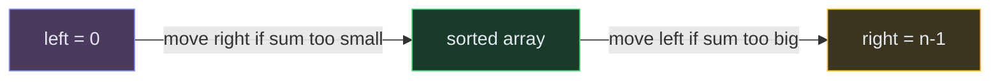

# Two Pointers

**The pattern:** Use two index variables that move through the data structure — either toward each other (opposite ends) or in the same direction — to solve the problem in a single pass without extra space.

**Why this matters in interviews:** Two pointers is the go-to optimization for sorted array problems. It replaces hash maps (O(n) space) or nested loops (O(n²) time) with an elegant O(n) time, O(1) space solution.

---

## When to Recognize It

- The input is a **sorted array** (or can be sorted without breaking the problem)
- You're looking for **pairs or triplets** that satisfy a condition (sum, difference)
- The problem involves **partitioning** or **comparing from both ends**
- Keywords: "two sum in sorted array," "pair with target," "container," "trap water"
- You need O(1) space and the brute force is O(n²)

---

## How It Works

Imagine two people walking toward each other on a bridge. One starts at the left end, one at the right. Based on what they see (too big? too small?), one of them takes a step inward. They meet somewhere in the middle — and by then, they've checked every useful combination.

**Why it works on sorted arrays:** If `arr[left] + arr[right] < target`, moving `left` forward increases the sum (since the array is sorted). If the sum is too big, moving `right` backward decreases it. Each step eliminates an entire row or column of the search space.

---

## Template Code

### Code

<button class="tab-btn active">Python</button>
<button class="tab-btn">Java</button>
<button class="tab-btn">C++</button>
<button class="tab-btn">JavaScript</button>

<pre><code class="language-python">def two_sum_sorted(nums, target):
    """Find pair in sorted array that sums to target."""
    left, right = 0, len(nums) - 1

    while left &lt; right:
        current_sum = nums[left] + nums[right]
        if current_sum == target:
            return [left, right]
        elif current_sum &lt; target:
            left += 1   # need bigger sum
        else:
            right -= 1  # need smaller sum

    return []  # no pair found</code></pre>

<pre><code class="language-java">int[] twoSumSorted(int[] nums, int target) {
    int left = 0, right = nums.length - 1;

    while (left &lt; right) {
        int sum = nums[left] + nums[right];
        if (sum == target) return new int[]{left, right};
        else if (sum &lt; target) left++;
        else right--;
    }
    return new int[]{};
}</code></pre>

<pre><code class="language-cpp">vector&lt;int&gt; twoSumSorted(vector&lt;int&gt;&amp; nums, int target) {
    int left = 0, right = nums.size() - 1;

    while (left &lt; right) {
        int sum = nums[left] + nums[right];
        if (sum == target) return {left, right};
        else if (sum &lt; target) left++;
        else right--;
    }
    return {};
}</code></pre>

<pre><code class="language-javascript">function twoSumSorted(nums, target) {
    let left = 0, right = nums.length - 1;

    while (left &lt; right) {
        const sum = nums[left] + nums[right];
        if (sum === target) return [left, right];
        else if (sum &lt; target) left++;
        else right--;
    }
    return [];
}</code></pre>

---

## Variations

### Three Sum (Sort + Two Pointers)

Fix one element, then use two pointers on the remaining sorted subarray. Skip duplicates to avoid repeated triplets.

### Code

<button class="tab-btn active">Python</button>
<button class="tab-btn">Java</button>
<button class="tab-btn">C++</button>
<button class="tab-btn">JavaScript</button>

<pre><code class="language-python">def three_sum(nums):
    nums.sort()
    result = []

    for i in range(len(nums) - 2):
        if i &gt; 0 and nums[i] == nums[i - 1]:
            continue  # skip duplicates

        left, right = i + 1, len(nums) - 1
        while left &lt; right:
            total = nums[i] + nums[left] + nums[right]
            if total == 0:
                result.append([nums[i], nums[left], nums[right]])
                while left &lt; right and nums[left] == nums[left + 1]:
                    left += 1
                while left &lt; right and nums[right] == nums[right - 1]:
                    right -= 1
                left += 1
                right -= 1
            elif total &lt; 0:
                left += 1
            else:
                right -= 1

    return result</code></pre>

<pre><code class="language-java">List&lt;List&lt;Integer&gt;&gt; threeSum(int[] nums) {
    Arrays.sort(nums);
    List&lt;List&lt;Integer&gt;&gt; result = new ArrayList&lt;&gt;();

    for (int i = 0; i &lt; nums.length - 2; i++) {
        if (i &gt; 0 &amp;&amp; nums[i] == nums[i - 1]) continue;
        int left = i + 1, right = nums.length - 1;
        while (left &lt; right) {
            int sum = nums[i] + nums[left] + nums[right];
            if (sum == 0) {
                result.add(Arrays.asList(nums[i], nums[left], nums[right]));
                while (left &lt; right &amp;&amp; nums[left] == nums[left + 1]) left++;
                while (left &lt; right &amp;&amp; nums[right] == nums[right - 1]) right--;
                left++; right--;
            } else if (sum &lt; 0) left++;
            else right--;
        }
    }
    return result;
}</code></pre>

<pre><code class="language-cpp">vector&lt;vector&lt;int&gt;&gt; threeSum(vector&lt;int&gt;&amp; nums) {
    sort(nums.begin(), nums.end());
    vector&lt;vector&lt;int&gt;&gt; result;

    for (int i = 0; i &lt; (int)nums.size() - 2; i++) {
        if (i &gt; 0 &amp;&amp; nums[i] == nums[i - 1]) continue;
        int left = i + 1, right = nums.size() - 1;
        while (left &lt; right) {
            int sum = nums[i] + nums[left] + nums[right];
            if (sum == 0) {
                result.push_back({nums[i], nums[left], nums[right]});
                while (left &lt; right &amp;&amp; nums[left] == nums[left + 1]) left++;
                while (left &lt; right &amp;&amp; nums[right] == nums[right - 1]) right--;
                left++; right--;
            } else if (sum &lt; 0) left++;
            else right--;
        }
    }
    return result;
}</code></pre>

<pre><code class="language-javascript">function threeSum(nums) {
    nums.sort((a, b) =&gt; a - b);
    const result = [];

    for (let i = 0; i &lt; nums.length - 2; i++) {
        if (i &gt; 0 &amp;&amp; nums[i] === nums[i - 1]) continue;
        let left = i + 1, right = nums.length - 1;
        while (left &lt; right) {
            const sum = nums[i] + nums[left] + nums[right];
            if (sum === 0) {
                result.push([nums[i], nums[left], nums[right]]);
                while (left &lt; right &amp;&amp; nums[left] === nums[left + 1]) left++;
                while (left &lt; right &amp;&amp; nums[right] === nums[right - 1]) right--;
                left++; right--;
            } else if (sum &lt; 0) left++;
            else right--;
        }
    }
    return result;
}</code></pre>

### Container With Most Water (Max Area)

Two pointers start at opposite ends. Move the shorter wall inward — keeping the taller wall gives you a better chance of finding a larger area.

### Same-Direction Pointers (Fast and Slow)

Used for removing duplicates in-place, partitioning, or detecting cycles. The slow pointer marks the "write position" while the fast pointer scans ahead.

---

## Complexity

| Variant | Time | Space |
|---|---|---|
| Two Sum (sorted) | O(n) | O(1) |
| Three Sum | O(n²) | O(1) extra |
| Container With Most Water | O(n) | O(1) |
| Trapping Rain Water | O(n) | O(1) |

---

## Common Mistakes

- **Using two pointers on an unsorted array** — the logic only works because moving left increases the value and moving right decreases it. Sort first if needed.
- **Not skipping duplicates in 3Sum** — leads to duplicate triplets in the result
- **Moving both pointers at once** — only move one pointer per iteration based on the comparison
- **Forgetting the `left < right` termination** — without this, pointers cross and you get invalid results or infinite loops

---

## Practice Problems

- [Two Sum II - Input Array Is Sorted](/dsa/problem/two-sum-ii-input-array-is-sorted)
- [3Sum](/dsa/problem/3sum)
- [Container With Most Water](/dsa/problem/container-with-most-water)
- [Trapping Rain Water](/dsa/problem/trapping-rain-water)
- [Remove Duplicates from Sorted Array](/dsa/problem/remove-duplicates-from-sorted-array)

---

## Key Takeaways

- Two pointers on a sorted array eliminates the need for a hash map — O(1) space
- Opposite-end pointers: move the pointer that gets you closer to the target
- Same-direction pointers: one scans, one writes (great for in-place modifications)
- For K-sum problems, fix K-2 elements and use two pointers on the rest
