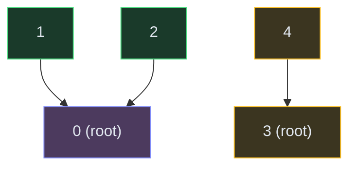

# Union-Find (Disjoint Set)

**The pattern:** Maintain a collection of disjoint sets. Support two operations efficiently: **find** (which set does this element belong to?) and **union** (merge two sets into one). With path compression and union by rank, both operations run in nearly O(1) amortized time.

**Why this matters in interviews:** Union-Find is the optimal tool for dynamic connectivity — "are these two nodes connected?" when edges are being added over time. It powers connected components, cycle detection in undirected graphs, and account merging problems.

---

## When to Recognize It

- The problem involves **grouping elements** that are connected
- Edges are being **added** and you need to track connectivity dynamically
- You need to **count connected components** as unions happen
- Keywords: "connected components," "are they in the same group," "merge accounts," "redundant connection"
- BFS/DFS works but union-find is cleaner when you're processing edges one by one

---

## How It Works

Imagine a school where students form friend groups. Each group has a "representative" (the root). To check if two students are in the same group, you find their representatives. To merge two groups, you make one representative point to the other.

Two groups: {0, 1, 2} and {3, 4}. Nodes 0 and 3 are roots. After `union(2, 4)`, the two groups merge into one.

**Two optimizations that make it fast:**
1. **Path compression:** When finding the root, make every node along the path point directly to the root. Flattens the tree.
2. **Union by rank:** Always attach the shorter tree under the taller tree. Keeps trees shallow.

Together, these give amortized O(α(n)) per operation — essentially O(1) for all practical purposes.

---

## Template Code

### Code

<button class="tab-btn active">Python</button>
<button class="tab-btn">Java</button>
<button class="tab-btn">C++</button>
<button class="tab-btn">JavaScript</button>

<pre><code class="language-python">class UnionFind:
    def __init__(self, n):
        self.parent = list(range(n))
        self.rank = [0] * n
        self.components = n

    def find(self, x):
        if self.parent[x] != x:
            self.parent[x] = self.find(self.parent[x])  # path compression
        return self.parent[x]

    def union(self, x, y):
        rx, ry = self.find(x), self.find(y)
        if rx == ry:
            return False  # already connected
        # Union by rank
        if self.rank[rx] &lt; self.rank[ry]:
            rx, ry = ry, rx
        self.parent[ry] = rx
        if self.rank[rx] == self.rank[ry]:
            self.rank[rx] += 1
        self.components -= 1
        return True

    def connected(self, x, y):
        return self.find(x) == self.find(y)</code></pre>

<pre><code class="language-java">class UnionFind {
    int[] parent, rank;
    int components;

    UnionFind(int n) {
        parent = new int[n];
        rank = new int[n];
        components = n;
        for (int i = 0; i &lt; n; i++) parent[i] = i;
    }

    int find(int x) {
        if (parent[x] != x) parent[x] = find(parent[x]);
        return parent[x];
    }

    boolean union(int x, int y) {
        int rx = find(x), ry = find(y);
        if (rx == ry) return false;
        if (rank[rx] &lt; rank[ry]) { int t = rx; rx = ry; ry = t; }
        parent[ry] = rx;
        if (rank[rx] == rank[ry]) rank[rx]++;
        components--;
        return true;
    }

    boolean connected(int x, int y) {
        return find(x) == find(y);
    }
}</code></pre>

<pre><code class="language-cpp">class UnionFind {
    vector&lt;int&gt; parent, rank_;
    int components;

public:
    UnionFind(int n) : parent(n), rank_(n, 0), components(n) {
        iota(parent.begin(), parent.end(), 0);
    }

    int find(int x) {
        if (parent[x] != x) parent[x] = find(parent[x]);
        return parent[x];
    }

    bool unite(int x, int y) {
        int rx = find(x), ry = find(y);
        if (rx == ry) return false;
        if (rank_[rx] &lt; rank_[ry]) swap(rx, ry);
        parent[ry] = rx;
        if (rank_[rx] == rank_[ry]) rank_[rx]++;
        components--;
        return true;
    }

    bool connected(int x, int y) {
        return find(x) == find(y);
    }

    int count() { return components; }
};</code></pre>

<pre><code class="language-javascript">class UnionFind {
    constructor(n) {
        this.parent = Array.from({length: n}, (_, i) =&gt; i);
        this.rank = new Array(n).fill(0);
        this.components = n;
    }

    find(x) {
        if (this.parent[x] !== x) {
            this.parent[x] = this.find(this.parent[x]);
        }
        return this.parent[x];
    }

    union(x, y) {
        let rx = this.find(x), ry = this.find(y);
        if (rx === ry) return false;
        if (this.rank[rx] &lt; this.rank[ry]) [rx, ry] = [ry, rx];
        this.parent[ry] = rx;
        if (this.rank[rx] === this.rank[ry]) this.rank[rx]++;
        this.components--;
        return true;
    }

    connected(x, y) {
        return this.find(x) === this.find(y);
    }
}</code></pre>

---

## Variations

### Redundant Connection (Cycle Detection)

Process edges one by one. If `union(u, v)` returns false (already connected), that edge creates a cycle — it's the redundant one.

### Accounts Merge (Union with String Keys)

Map each email to an index. Union emails that belong to the same account. Then group all emails by their root to get the merged accounts.

### Weighted Union-Find

Store a weight on each edge (distance to parent). Used in problems like "is the relationship consistent?" or "evaluate division."

---

## Complexity

| Operation | Time (amortized) | Space |
|---|---|---|
| Find (with path compression) | O(α(n)) ≈ O(1) | O(n) |
| Union (with rank) | O(α(n)) ≈ O(1) | O(n) |
| Connected check | O(α(n)) ≈ O(1) | O(n) |
| Build from m edges | O(m × α(n)) | O(n) |

α(n) is the inverse Ackermann function — it grows so slowly it's effectively constant (≤ 4 for any practical input size).

---

## Common Mistakes

- **Forgetting path compression** — without it, find() can degrade to O(n) in the worst case (long chains)
- **Not checking if already connected before union** — returning false when rx == ry is essential for problems like "find the redundant edge"
- **Using union-find for directed graphs** — union-find works for undirected connectivity only. For directed graphs, use DFS-based cycle detection.
- **Mapping non-integer keys incorrectly** — for strings (like emails), map to integers first using a hash map

---

## Practice Problems

- [Number of Connected Components in an Undirected Graph](/dsa/problem/number-of-connected-components-in-an-undirected-graph)
- [Redundant Connection](/dsa/problem/redundant-connection)
- [Longest Consecutive Sequence](/dsa/problem/longest-consecutive-sequence)

*Accounts Merge requires complex string-list I/O with multiple valid orderings — practice on LeetCode directly.*

---

## Key Takeaways

- Union-Find = dynamic connectivity checker. It answers "are X and Y in the same group?" in nearly O(1).
- Path compression + union by rank together give the magical O(α(n)) performance
- Use it over BFS/DFS when processing edges incrementally (one at a time) rather than all at once
- Track `components` count to know how many disjoint groups remain at any point
