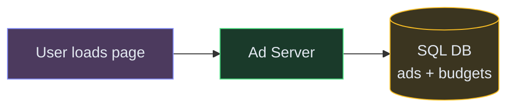
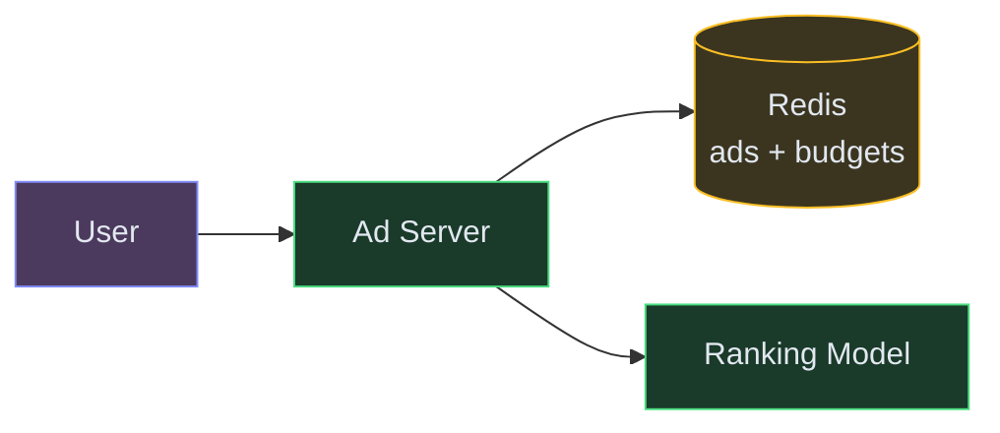
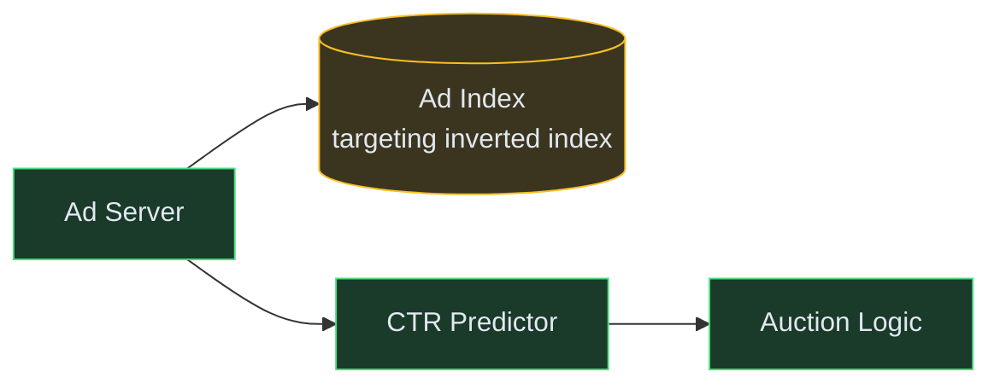
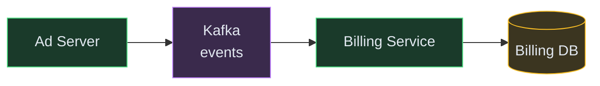

# Designing an Ad Serving System (Google Ads / Meta Ads)

**Difficulty:** Advanced
**Prerequisites:**[Caching](/concepts/caching/), [Message Queues](/concepts/message-queues/), and [Scalability](/concepts/scalability/)

---

## Understanding the Problem

An ad system selects and serves the most relevant ad to a user in real-time — within 100ms of a page load. It runs an auction among advertisers for every impression, predicts which ads the user is likely to click, charges advertisers fairly, and tracks conversions. The hard parts: running billions of auctions/day at sub-100ms latency, preventing budget overspend in a distributed system, and counting impressions/clicks accurately for billing.

---

## Naive First Cut



Why this breaks:
- SQL query for "find all eligible ads, rank by bid" at 1M QPS = instant DB meltdown
- Budget check + decrement is a race condition — 100 servers all read budget=100, all serve the ad, overspend by 99x
- No ML ranking — showing the highest bidder regardless of relevance wastes user attention and reduces clicks
- Click/impression counting in the hot path adds latency and can lose events
- Single server can't handle 1M ad decisions/second

---

## Functional Requirements

### Core (top 3)
1. **Serve an ad** — given a user context (page, demographics), return the winning ad within 100ms
2. **Run an auction** — rank eligible ads by expected value (bid × predicted CTR), select winner
3. **Track and bill** — count impressions and clicks accurately; charge advertisers per click/impression

### Below the Line
- Campaign management UI, A/B testing, frequency capping, conversion attribution, creative optimization

---

## Non-Functional Requirements

- **Latency** — ad selection in <100ms P99
- **Scale** — 1M ad requests/second (10B impressions/day)
- **Budget accuracy** — overspend <1% of daily budget
- **Billing accuracy** — no lost impressions/clicks; eventual consistency OK (within minutes)

---

## Core Entities

- **Ad** — creative, targeting criteria, bid amount, campaign reference
- **Campaign** — advertiser, daily budget, start/end dates, targeting rules
- **Impression** — ad shown to user: ad ID, user context, timestamp
- **Click** — user clicked: impression reference, timestamp, landing page

---

## API

```text
GET /v1/ads/serve?page=homepage&userId=u123&context=tech
  Response: { adId, creative: { imageUrl, title, clickUrl }, auctionPrice: 0.03 }

POST /v1/ads/click
  Body: { impressionId, adId, timestamp }
  Response: 202 Accepted

POST /v1/campaigns
  Body: { ads: [...], dailyBudget: 1000, targeting: { age: "25-34", interests: ["tech"] } }
  Response: { campaignId, status: "active" }
```

---

## High-Level Design

### FR1: Serve an Ad

The Ad Server filters eligible ads (targeting match, budget remaining), scores them using a lightweight ranking model, and returns the winner. Ad data and budgets are cached in-memory for speed.



### FR2: Run the Auction

For each request, the Ad Server runs a second-price auction: rank by `bid × pCTR`, winner pays the second-highest effective bid + $0.01. This incentivizes truthful bidding.



### FR3: Track and Bill

Impressions and clicks are logged asynchronously via Kafka. A billing pipeline aggregates events, deduplicates, and updates campaign spend.



---

## Deep Dives

### Deep Dive 1: Budget pacing — preventing overspend

**Bad:** Check budget in the DB before serving each ad. At 1M QPS, the budget row is a global hotspot. Multiple servers read budget=$100, all serve, actual spend = $5000.

**Good:** Pre-allocate budget to each Ad Server instance. If daily budget is $1000 and you have 10 servers, each gets a $100 quota. When a server's quota is exhausted, it stops serving that campaign. A central service rebalances quotas every 30 seconds based on actual spend rates.

**Great:** Combine quota allocation with probabilistic pacing. Instead of spending the full quota immediately, pace it evenly across the day using a "spend rate" target (budget ÷ remaining hours). Each server throttles serving probability for a campaign based on its spend rate vs. target. This ensures even distribution throughout the day (no "budget exhausted at 10 AM" problem) while keeping overspend under 1%.

### Deep Dive 2: Ad ranking at sub-100ms latency

**Bad:** For each request, scan all 10M ads in the database, compute CTR prediction for each, sort, return the top one. Takes seconds.

**Good:** Two-phase ranking. Phase 1 (retrieval): use an inverted index on targeting attributes to find the ~1000 eligible ads in <10ms. Phase 2 (ranking): score those 1000 with the CTR model and pick the top 10 for the auction. The index is pre-built and stored in memory.

**Great:** Cache the CTR model predictions for common user-segment × ad combinations. For the long tail (new users, new ads), compute on-the-fly with a lightweight model (logistic regression, not a massive neural net). The heavy model runs offline to generate cached scores; the light model handles real-time cold-start cases. This keeps P99 under 50ms even during traffic spikes.

### Deep Dive 3: Click fraud detection

**Bad:** Count every click and charge the advertiser. Competitors can click-spam to drain budgets. Bots can generate millions of fake clicks.

**Good:** Apply rule-based filters before billing: rate-limit clicks per IP, flag repeated clicks on the same ad from the same user, and detect known bot user-agents. Filter out ~80% of fraudulent clicks.

**Great:** Run a lightweight anomaly detector on the click stream (streaming via Kafka). Features: click velocity per IP, time-between-clicks distribution, geographic anomalies (click from India on a US-only campaign), and mouse-movement patterns (from the ad iframe). Suspicious clicks are held in a "pending" state and not billed immediately. A batch classifier confirms or rejects within 24 hours. Advertisers only pay for confirmed-valid clicks. This approach catches sophisticated bots that bypass rule-based filters.

---

## What's Expected at Each Level

| Level | Expectations |
|---|---|
| **Mid** | Two-phase ranking (retrieval + scoring). Second-price auction mechanics. Async click/impression logging via Kafka. Budget as a constraint on serving. |
| **Senior** | Budget quota allocation across servers. Pre-built inverted index for targeting. CTR prediction as ranking signal. Rate-limiting for basic fraud prevention. |
| **Staff+** | Probabilistic budget pacing across the day. Cached vs real-time CTR model for cold-start. Streaming fraud detection with held-click pipeline. Cost-per-decision analysis at 1M QPS. |
