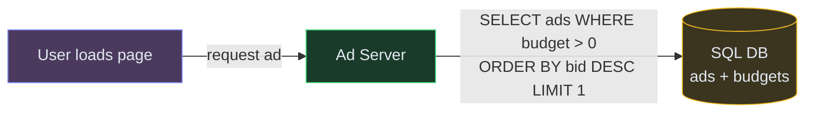
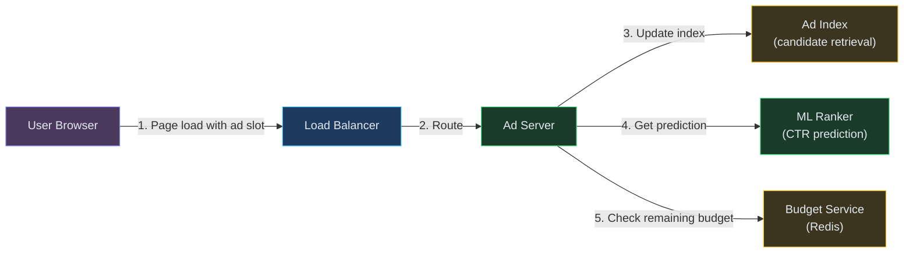
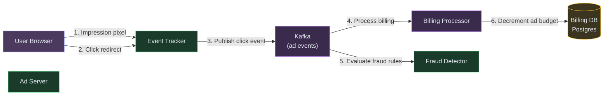
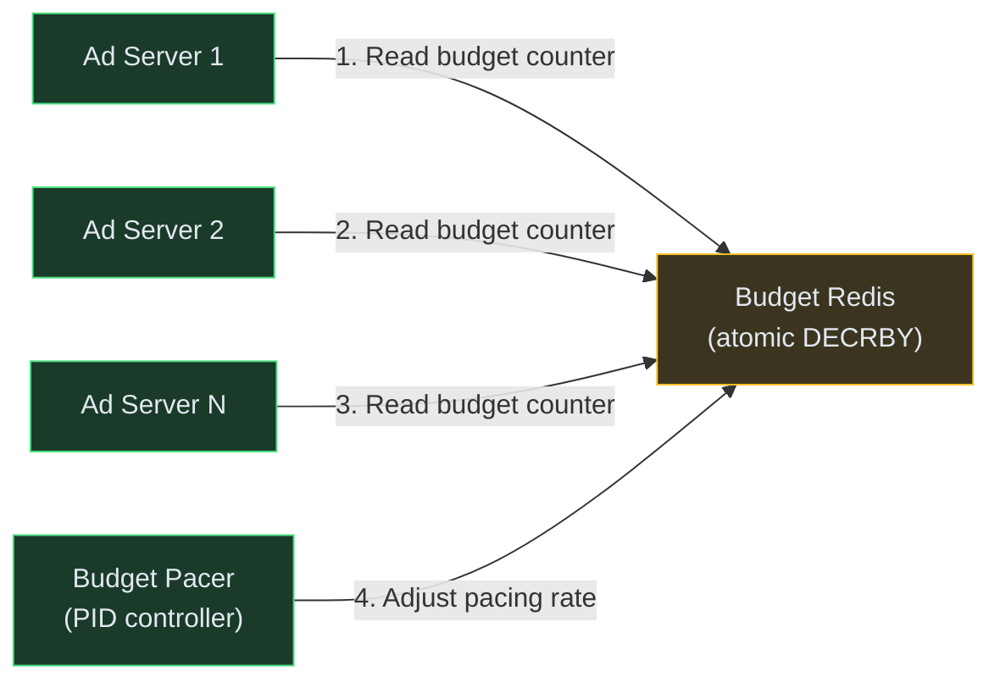
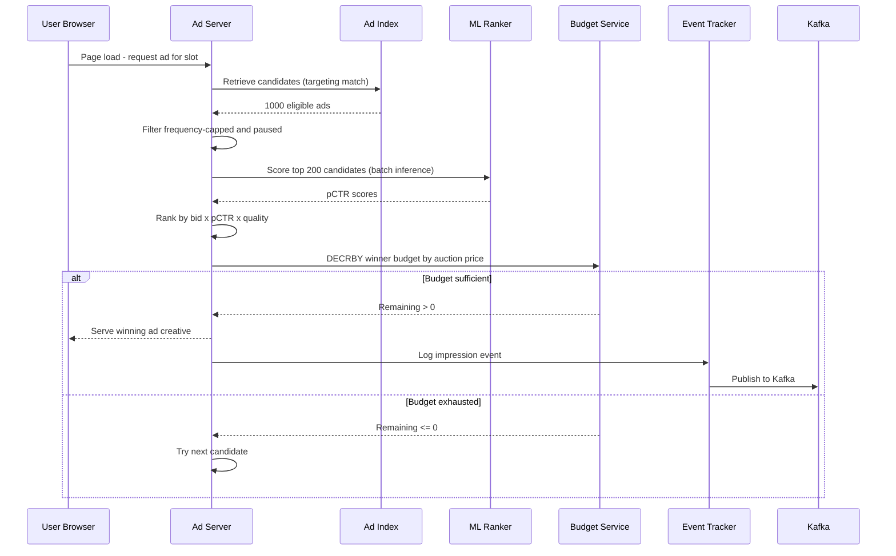
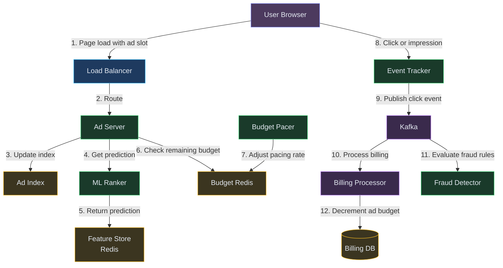

# Designing an Ad Serving and Auction System (Google Ads / Meta Ads)

**Difficulty:** Advanced **Topics:** Real-Time Bidding, Ad Ranking, ML Prediction, Budget Pacing, Fraud Detection **Asked at:** Google, Meta, Amazon, Microsoft, LinkedIn, Flipkart Ads
**Prerequisites:**[Caching](/concepts/caching/), [Message Queues](/concepts/message-queues/), and [Scalability](/concepts/scalability/)

---

## 1. Understanding the Problem

An ad system selects and serves the most relevant (and profitable) ad to a user in real-time — within 100ms of a page load. It runs an auction among millions of advertisers for every single ad impression, predicts which ads the user is likely to click, charges advertisers fairly, and tracks conversions. The hard parts: running billions of auctions per day at sub-100ms latency, preventing budget overspend in a distributed system, and detecting click fraud that costs advertisers billions.

**Real examples:** Google Ads, Meta Ads Manager, Amazon Sponsored Products, LinkedIn Campaign Manager.

---

## 1.5. Naive First Cut



Find the highest bidder with remaining budget, show their ad.

**Why this breaks:**

- Highest bid is not the best ad — an ad nobody clicks earns nothing (need predicted CTR)
- Single SQL query per impression at 1M QPS overwhelms any relational DB
- Budget check + decrement is a race condition — 1000 concurrent auctions can overspend
- No targeting — everyone sees the same ad regardless of demographics
- No conversion tracking — advertisers can't measure ROI
- Fraud bots clicking ads drain budgets with no real value

The rest of the doc evolves this into a multi-stage ranking pipeline with real-time budget pacing and fraud detection.

---

## 1.7. Prior Art We're Drawing From

- **Google Second-Price Auction (GSP)** - Generalized second-price auction: the winner pays the minimum bid needed to maintain their position (not their actual bid). This incentivizes truthful bidding — advertisers bid their true value without fear of overpaying. ([Google Research](https://research.google/pubs/pub47411/))
- **Meta Ad Ranking (Total Value)** - Ranks ads by `bid x predicted_CTR x quality_score` (called "total value"). This means a $1 bid with 10% CTR outranks a $5 bid with 1% CTR. Maximizes both revenue and user experience. ([Meta Business Help](https://www.facebook.com/business/help/))
- **LinkedIn Ad Budget Pacing** - Uses a PID controller to adjust bid multipliers throughout the day so campaigns spend their daily budget evenly (not all in the first hour). The pacer observes actual spend rate vs expected and throttles/accelerates accordingly. ([LinkedIn Engineering](https://engineering.linkedin.com/blog/2019/budget-pacing))
- **Google Click Fraud Detection** - Multi-layered system: real-time filters (impossible click patterns, bot signatures), offline ML models (anomaly detection on click streams), and manual review. Automatically credits advertisers for invalid clicks. ([Google Ad Traffic Quality](https://support.google.com/google-ads/answer/42995))

---

## 2. Technology Choices

| Tier | Purpose | Stores | Access Pattern | Primary Pick | Alternatives |
|---|---|---|---|---|---|
| Ad index | Candidate retrieval | Active ads with targeting criteria | Inverted index lookup | Elasticsearch / custom index | Redis / in-memory index |
| ML serving | CTR prediction | Trained models | Real-time inference (<10ms) | TensorFlow Serving / TorchServe | ONNX Runtime / custom C++ |
| Budget store | Campaign budgets | Remaining budget per campaign | Atomic decrement at high QPS | Redis (in-memory atomic ops) | DynamoDB |
| Event stream | Impressions and clicks | Ad events for billing and ML | High-throughput append | Kafka / Kinesis | Pulsar |
| Billing DB | Advertiser charges | Transactions and invoices | OLTP writes | Postgres / Spanner | CockroachDB |
| Feature store | ML features | User and ad features | Low-latency lookup | Redis / DynamoDB | Feast / Tecton |
| Analytics | Reporting and dashboards | Aggregated campaign metrics | OLAP queries | ClickHouse / BigQuery | Druid / Redshift |

**Why Redis for budget?** Budget decrements happen on every auction win — potentially 100K+/sec per campaign during peak. Redis DECRBY is atomic, single-digit microsecond, and handles this without locks. Postgres row-level locking would bottleneck at 1K/sec per row.

---

## 3. Functional Requirements

### Core (Top 3)

1. **Serve the highest-value ad for a slot** - given a user context and ad placement, run an auction and return the winning ad within 100ms
2. **Track impressions and clicks for billing** - record every impression and click event accurately; charge advertisers on click (CPC) or impression (CPM)
3. **Manage campaign budgets in real-time** - enforce daily and total budgets without overspend even under distributed concurrent auctions

### Below the Line

- Ad targeting (demographics, interests, retargeting)
- A/B testing for ad creatives
- Conversion tracking (post-click actions)
- Reporting dashboards for advertisers
- Ad approval and policy compliance

---

## 4. Non-Functional Requirements

### Core

- **Latency:** Ad selection P99 < 100ms (ads are on the critical path of page load)
- **Throughput:** 1M+ ad auctions per second globally
- **Budget accuracy:** Overspend tolerance < 1% (beyond that, the platform absorbs the loss)
- **Availability:** 99.99% — ad serving down = zero revenue

### Below the Line

- Click data available for reporting within 5 minutes (near-real-time)
- ML model refresh every few hours (not real-time retraining)
- Multi-region serving with geo-targeted ads

---

## 5. Core Entities

- **Campaign** - an advertiser's ad buy with budget, schedule, targeting, and bid strategy
- **Ad** - a creative (image, text, video) with targeting criteria and a landing page
- **Auction** - a single ad slot request that runs ranking across eligible ads
- **Impression** - a record that an ad was shown to a user
- **Click** - a record that a user clicked an ad
- **BudgetLedger** - real-time remaining budget per campaign

---

## 6. API / System Interface

```
GET /v1/ads/serve?slot_id=homepage_banner&user_id=u123&context={page,device,geo}
Response:
{
  "ad_id": "ad_456",
  "creative_url": "https://cdn.example.com/ad456.webp",
  "click_url": "https://track.example.com/click?imp=imp_789",
  "impression_id": "imp_789"
}
// Response within 100ms; fires impression pixel automatically
```

```
GET /v1/ads/click?imp=imp_789
Response: 302 Redirect to advertiser landing page
// Server records the click event before redirecting
```

```
POST /v1/campaigns (advertiser API)
Body: {"name": "Summer Sale", "budget_daily": 5000, "bid_cpc": 2.50, "targeting": {...}, "ads": [...]}
Response: {"campaign_id": "c_123", "status": "pending_review"}
```

Security notes: impression and click URLs include signed tokens to prevent forgery. Rate-limit click endpoint per user to prevent manual click fraud. Never trust client-reported impressions — server-side pixel tracking is the source of truth.

---

## 7. High-Level Design

### FR1: Serve the highest-value ad (auction pipeline)

The auction is a multi-stage funnel: retrieve thousands of eligible candidates → score with ML → pick the winner → apply budget check → serve.



**Flow:**
1. User loads page → Ad Server receives request with user context and slot info
2. **Candidate Retrieval** (10ms): query Ad Index for ads matching user's targeting criteria → returns ~1000 candidates
3. **Lightweight filter** (5ms): remove ads with exhausted budgets, inactive schedules, frequency-capped
4. **ML Ranking** (20ms): score remaining candidates with predicted CTR model. Rank by `bid x pCTR x quality_score` (total value)
5. **Auction** (2ms): top-ranked ad wins. Charge price = second-highest total-value / winner's pCTR (second-price)
6. **Budget check** (3ms): Redis DECRBY campaign budget. If insufficient → fallback to next candidate
7. Return winning ad creative URL to the browser. Total: 40-80ms

---

### FR2: Track impressions and clicks for billing

Every ad impression and click must be recorded durably for billing. We can't block the ad serving path on writes — use async event streaming.



**Flow:**
1. Browser loads impression pixel → Event Tracker records impression with auction metadata
2. User clicks ad → redirect through Event Tracker (records click) → lands on advertiser page
3. Events published to Kafka (durable, ordered per impression)
4. Billing Processor consumes click events, looks up the auction price, charges the advertiser
5. Fraud Detector runs in parallel — flags suspicious patterns (same user clicking same ad repeatedly, bot signatures, impossible geolocation jumps)
6. Fraudulent clicks are excluded from billing; advertisers credited automatically

---

### FR3: Budget management

The core challenge: thousands of auction servers decrement the same campaign's budget concurrently without overspending.



**Flow:**
1. Each Ad Server calls Redis DECRBY before serving a won ad
2. If DECRBY returns negative → budget exhausted, skip this ad (serve next candidate)
3. **Budget Pacer** runs every minute: compares actual spend rate vs ideal rate (budget/remaining_hours)
4. If spending too fast → pacer reduces a "bid multiplier" stored in Redis (all servers read it, effectively lowering bids)
5. If spending too slow → pacer increases multiplier (bid more aggressively)
6. Result: campaign spends evenly throughout the day with <1% overspend

---

## 6.5. Core Flows

### Flow 1: Ad Auction (full pipeline)



**Non-obvious failure path:** If ML Ranker is slow (> 50ms), Ad Server falls back to a simpler scoring model (bid x historical CTR from cache). Ads still serve — just with slightly less optimal ranking. Never show a blank ad slot.

---

## 7. Deep Dives

### Deep Dive 1: ML Ranking at Scale (sub-20ms inference)

**Bad:** Run a deep neural network for every candidate ad. With 1000 candidates and a 50ms model, that's 50 seconds — obviously impossible.

**Good:** Two-stage: lightweight model (logistic regression) scores all 1000 in 5ms → top 50 go to a heavier model (gradient boosted trees) for re-ranking in 15ms. Total: 20ms.

**Great:** **Cascade architecture with pre-computed embeddings.** User embeddings are computed once per session and cached. Ad embeddings are pre-computed at campaign creation. At serving time, ranking is a dot-product similarity (user_emb · ad_emb) which is sub-millisecond for 1000 candidates via SIMD. Only the top 20 go through the full feature-rich model. This is how Meta serves 10M+ auctions/sec.

---

### Deep Dive 2: Budget Pacing (Preventing Early Exhaustion)

**Bad:** First-come-first-served. A popular campaign's entire daily budget is spent in the first hour (morning traffic spike). No impressions for the rest of the day.

**Good:** Divide budget into hourly slices based on historical traffic distribution. Cap spending per hour.

**Great:** **PID controller** (borrowing from LinkedIn). The pacer observes actual vs target spend rate every minute and adjusts a bid multiplier. Underspend → increase multiplier (bid more). Overspend → decrease. The PID gains are tuned to converge smoothly without oscillation. This handles traffic fluctuations, competitive dynamics, and seasonal patterns without manual hourly budgets.

---

### Deep Dive 3: Click Fraud Detection

**Bad:** Trust all clicks. Bots and competitors drain budgets; advertisers lose trust and leave the platform.

**Good:** Rule-based filters: flag clicks from known bot IPs, same user clicking same ad 10 times in 1 minute, clicks with impossible timing (< 50ms after impression = automated).

**Great:** **Multi-layer detection:**
1. Real-time rules (inline, <5ms) — reject obvious bots before billing
2. Near-real-time ML (Flink, 30-second windows) — anomaly detection on click patterns per user session
3. Offline deep analysis (daily batch) — identify coordinated fraud rings across IPs and devices using graph analysis

Invalid clicks are excluded from billing retroactively. Advertisers see "invalid clicks filtered" in their reports, building trust.

---

### Deep Dive 4: Auction Fairness (Second-Price Mechanism)

**Bad:** First-price auction — winner pays their bid. Incentivizes advertisers to bid as low as possible (not their true value), leading to unstable bidding games and suboptimal revenue.

**Good:** Second-price auction — winner pays $0.01 more than the second-highest bid. Incentivizes truthful bidding (dominant strategy). Google used this for years.

**Great:** **VCG auction** (Vickrey-Clarke-Groves) for multi-slot scenarios. When showing multiple ads (like a search results page with 4 ad slots), VCG charges each winner based on the externality they impose on others. Mathematically guarantees truthful bidding and maximizes social welfare. In practice, Google shifted to first-price for display ads in 2019 because market dynamics favored transparency over theoretical optimality — but second-price remains for search ads.

---

## 7.5. Design Self-Audit

- **Stale reads?** Ad Index refreshes every few minutes (new campaigns appear with slight delay). Budget is real-time via Redis.
- **Single points of failure?** Redis budget store is the most critical — replicated with automatic failover. If Redis is briefly unavailable, Ad Servers use local cached budget estimates and reconcile after recovery (may overspend by ~0.5%).
- **Dead-letter / reconciliation?** Kafka click events that fail billing processing go to a DLQ. A reconciliation job retries and alerts on persistent failures.
- **Cost at scale?** ML inference is the biggest compute cost. Batch inference (scoring 200 candidates per request) amortizes model loading overhead. Feature store read cost is high but cacheable.
- **Hot partition?** A viral campaign with massive budget could overwhelm a single Redis key. Mitigation: shard budget across multiple keys (campaign_budget_shard_0..N) and sum on read.

---

## 8. Final Architecture



**How it works end-to-end:**

1. **User sends ad request** — browser hits the Load Balancer with page context
2. **Ad Server queries the Ad Index** — retrieves candidate ads matching targeting criteria
3. **ML Ranker scores candidates** — pulls user features from the Feature Store and predicts CTR
4. **Budget check via Redis** — Ad Server confirms the winning ad's campaign still has budget (Budget Pacer keeps this fresh)
5. **Ad is served to user** — winning creative returned in <100ms
6. **User interacts (impression/click)** — Event Tracker fires the event to Kafka
7. **Billing Processor consumes event** — deducts spend from the advertiser's account in the Billing DB
8. **Fraud Detector consumes event** — flags suspicious click patterns for retroactive credit
