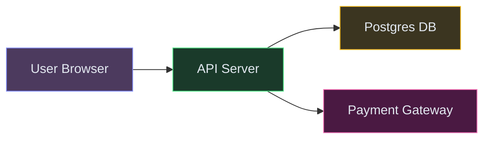
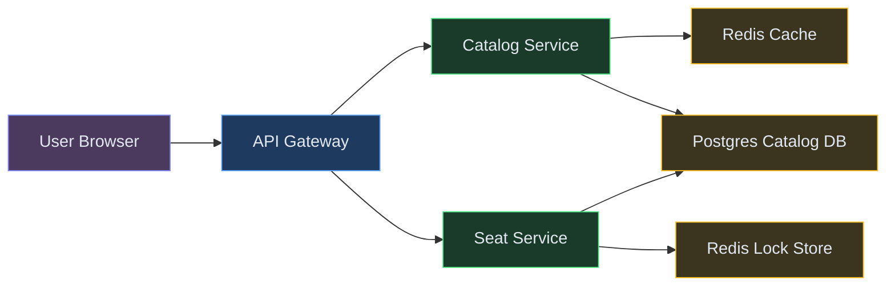
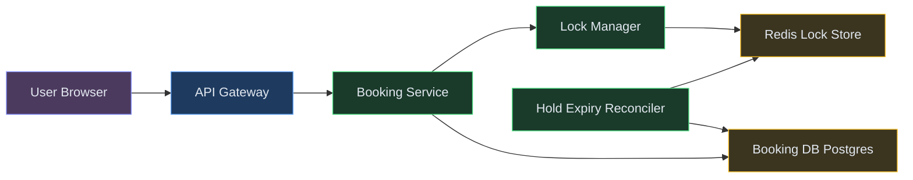
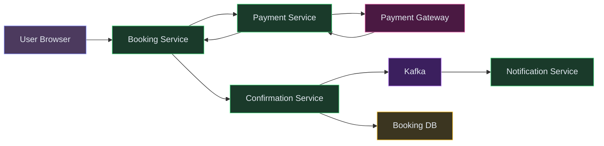
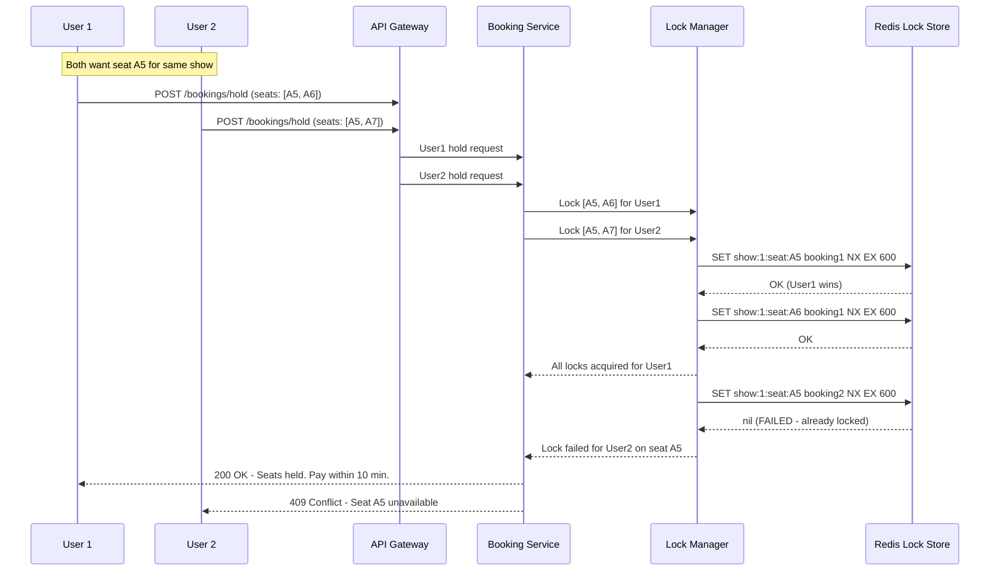
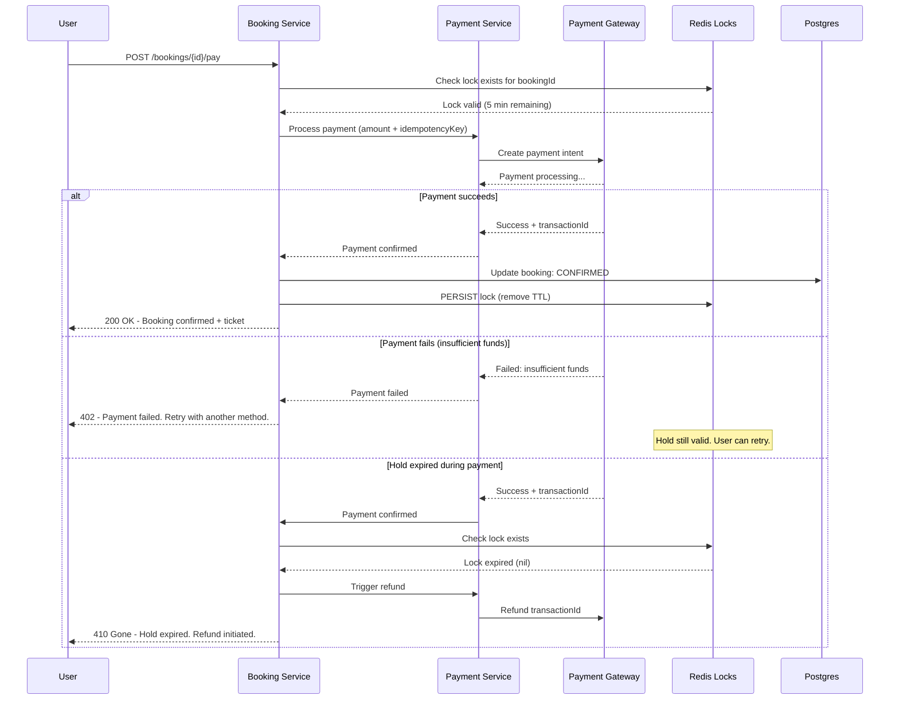
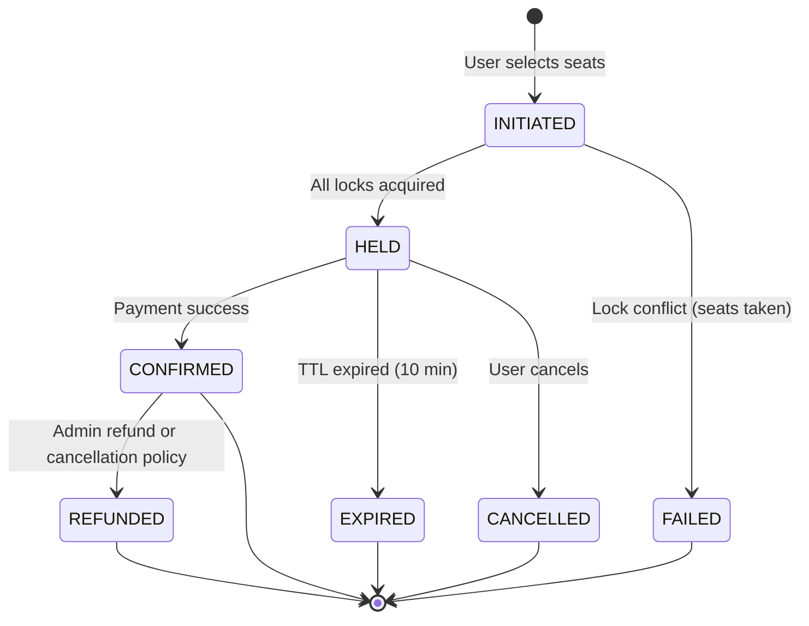
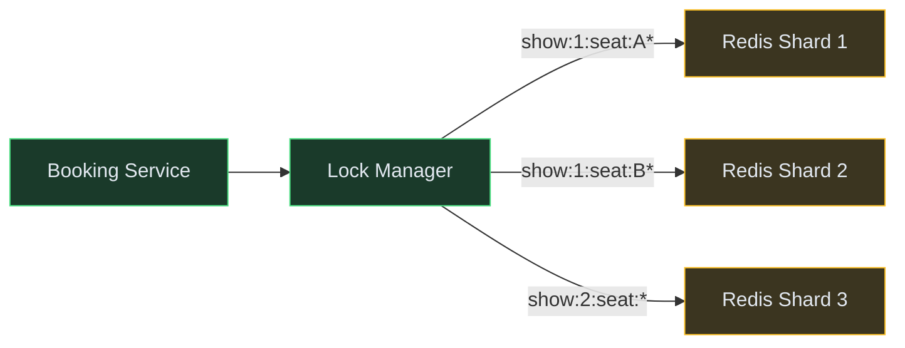
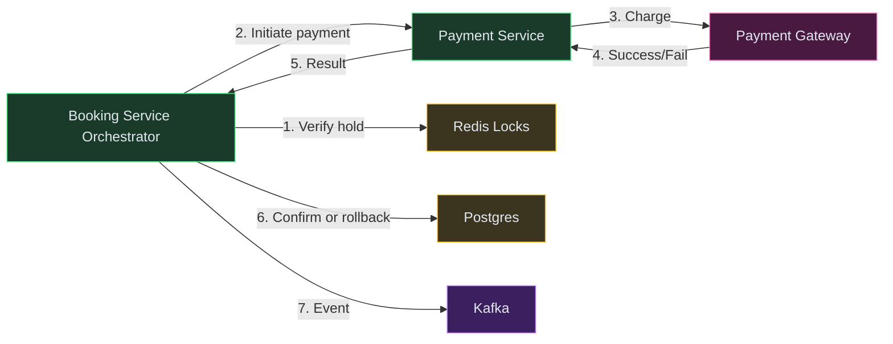
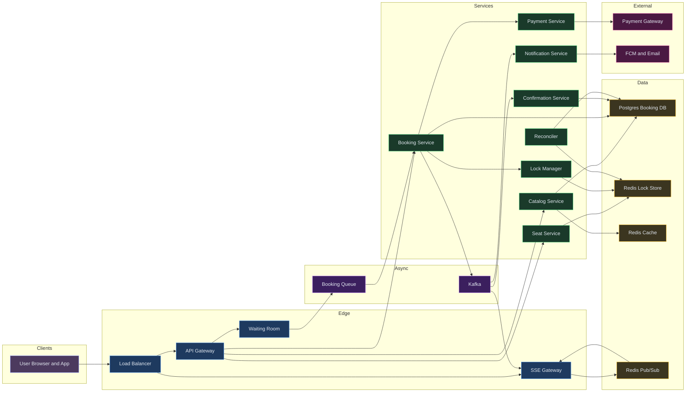

# Designing a Ticket Booking Platform (BookMyShow / Ticketmaster)

⚡ **Difficulty:** Intermediate 🏷️ **Topics:** Distributed Locking, Seat Reservation, Payment Saga, TTL Holds, Inventory Management 🏢 **Asked at:** Ticketmaster, BookMyShow, Amazon, Flipkart, PhonePe

---

## 1. Understanding the Problem

A ticket booking platform lets users browse movies and events, view available seats on a seat map, temporarily hold selected seats while completing payment, and receive confirmed tickets. The hard part? When 100K users rush to book seats for a popular movie premiere at the same time, no two users should ever successfully book the same seat, held seats must auto-release if payment isn't completed within 10 minutes, and the system must handle payment failures gracefully without leaving seats in a limbo state.

---

## 1.5. Naive First Cut



**How this breaks:**

- Two users select the same seat simultaneously → both see it as "available" → both attempt to book → double-booking
- If payment fails after marking seat as "booked," the seat is stuck — no one can book it (orphaned reservation)
- Single API server can't handle 100K concurrent users rushing for a hot event (Avengers premiere, IPL final)
- No seat hold mechanism — user selects seats, goes to payment, comes back 5 minutes later and seats were taken by someone else
- No way to show real-time seat availability updates to other users viewing the same show
- Single Postgres DB becomes a write bottleneck when 50K users try to lock seats simultaneously

The rest of the doc evolves this into a production-grade booking system with distributed locks, TTL-based holds, and payment saga patterns.

---

## 1.7. Prior Art We're Drawing From

- **Ticketmaster Virtual Queue** — Uses a virtual waiting room during high-demand on-sales. Users are assigned random positions in a queue, preventing thundering herd on the booking system. Processes users in controlled batches. ([Ticketmaster Tech Blog](https://tech.ticketmaster.com/))
- **Stripe Idempotency Keys** — Guarantees exactly-once payment processing using client-generated idempotency keys. If a payment request is retried, the same result is returned without double-charging. ([Stripe Engineering](https://stripe.com/blog/idempotency))
- **BookMyShow Engineering** — Handles 20M+ users for major movie releases using Redis-based seat locking with TTL, event-driven architecture with Kafka, and eventual consistency for non-critical reads. ([BookMyShow Engineering Blog](https://blog.bookmyshow.com/))
- **Razorpay Payment Orchestration** — Multi-gateway payment routing with automatic failover. Implements saga pattern for coordinating booking + payment as a distributed transaction. ([Razorpay Engineering](https://engineering.razorpay.com/))
- **Amazon DynamoDB Transactions** — Demonstrates conditional writes with version checks for exactly-once operations in distributed systems. Used internally for inventory management at Amazon retail. ([AWS Blog](https://aws.amazon.com/blogs/database/))

---

## 2. Functional Requirements

### Core (Top 3)

1. **Browse and select seats** — users view available shows, see a real-time seat map, and select specific seats for booking
2. **Hold seats and complete payment** — selected seats are temporarily held (10 min TTL) while user completes payment; seats auto-release on expiry
3. **Confirm booking** — after successful payment, seats are permanently marked as booked and user receives a ticket/confirmation

### Below the Line

- Browse movies/events by city, genre, language
- Cancellation and refunds
- Promotional codes and discounts
- Notifications (booking confirmation, show reminders)
- Reviews and ratings
- Waitlist for sold-out shows

---

## 3. Non-Functional Requirements

### Core

| NFR | Target |
|---|---|
| **No double-booking** | Two users must never successfully book the same seat — strong consistency on seat state |
| **Hold expiry** | Held seats auto-release exactly at TTL expiry (10 min); no manual intervention needed |
| **Peak concurrency** | Handle 100K+ concurrent booking attempts for a single hot show (movie premiere, concert) |
| **Booking latency** | Seat hold acquired in < 500ms; end-to-end booking (select → pay → confirm) < 30 seconds |

### Below the Line

- 99.99% availability for browsing (eventual consistency acceptable)
- Seat map renders in < 2 seconds with real-time availability
- Payment processing SLA: < 10 seconds
- Support 50K+ shows across 1000+ cinemas

## Scale Estimation (Back-of-Envelope)

- **Users:** 10M DAU, 100K+ concurrent during hot event launch (Avengers premiere, IPL final)
- **Write QPS:** 50K booking attempts/min peak (~833/sec sustained, bursty during on-sale windows)
- **Read QPS:** 300K seat-status reads/sec during on-sale (50K users refreshing seat maps every 2-3s)
- **Storage:** ~500GB booking data/year (5M bookings/day × booking + payment metadata)
- **Bandwidth:** ~1 Gbps at peak (seat map pushes via SSE + API responses)

---

## Technology Choices

| Tier | Purpose | Stores | Access Pattern | Primary | Alternatives |
|---|---|---|---|---|---|
| Booking DB | Booking lifecycle state | Bookings, seat assignments, payment refs | Read/write by bookingId, showId | Postgres | CockroachDB, TiDB |
| Seat Lock Store | Temporary seat holds with TTL | seatId → userId + expiryTime | Atomic CAS, TTL-based expiry | Redis Cluster | DynamoDB (conditional writes) |
| Event Catalog | Movies, shows, cinemas, schedules | Catalog metadata | Read-heavy, filtered by city/date | Postgres (read replicas) | MongoDB |
| Event Bus | Async events (booking confirmed, seat released) | Booking lifecycle events | Pub/sub per show | Kafka or Redpanda | Kinesis, RabbitMQ |
| Cache | Show listings, seat availability snapshots | Aggregated seat counts, catalog data | High-QPS reads, short TTL | Redis Cluster | Memcached |
| Queue | Booking requests during peak (virtual waiting room) | User positions, pending requests | FIFO with priorities | SQS or Kafka | RabbitMQ, Redis Streams |
| Payment Gateway | External payment processing | Transactions | Request-response with webhooks | Razorpay or Stripe | PayU, PayTM |

**Why Redis for seat locks, not Postgres row-level locks?**
During a hot event, 100K users hit the system in 10 seconds. Each seat lock attempt is a `SET seatId NX EX 600` (atomic check-and-set with 10-min TTL). Redis handles 300K+ ops/sec per shard in-memory. Postgres row-level locks would create massive lock contention, connection pool exhaustion, and deadlocks. Redis gives us sub-millisecond lock acquisition with built-in TTL for auto-release.

**Why Kafka for booking events?**
A single booking triggers 5+ downstream actions: send confirmation email, update seat map cache, record analytics, trigger invoice generation, update show occupancy counter. Kafka's consumer groups let each downstream service process independently without blocking the booking path.

---

## 4. Core Entities

- **Movie/Event** — id, title, genre, language, duration, poster, rating
- **Show** — id, movieId, cinemaHallId, startTime, endTime, pricing tiers
- **Seat** — id, hallId, row, number, category (Silver/Gold/Platinum), status
- **ShowSeat** — showId + seatId composite, state (AVAILABLE/HELD/BOOKED), heldBy, heldUntil, bookedBy
- **Booking** — id, userId, showId, seatIds[], status (INITIATED/HELD/CONFIRMED/CANCELLED/EXPIRED), paymentRef, totalAmount
- **Payment** — id, bookingId, amount, status (PENDING/SUCCESS/FAILED/REFUNDED), gateway, idempotencyKey

---

## 5. API / System Interface

```text
GET /api/v1/shows/{showId}/seats
  Response: { seats: [{ seatId, row, number, category, status, price }] }
  Auth: JWT Bearer token
  Note: Returns current availability. HELD seats show as unavailable.

POST /api/v1/bookings/hold
  Body: { showId, seatIds: ["A1", "A2", "A3"] }
  Response: { bookingId, status: "HELD", expiresAt, totalAmount }
  Auth: JWT Bearer token
  Note: Idempotency via clientRequestId header. Hold TTL = 10 minutes.

POST /api/v1/bookings/{bookingId}/pay
  Body: { paymentMethod: "upi", idempotencyKey: "uuid-v4" }
  Response: { bookingId, status: "CONFIRMED", paymentId, tickets[] }
  Auth: JWT Bearer token
  Note: Idempotency key prevents double-charge on retry.

DELETE /api/v1/bookings/{bookingId}
  Response: { status: "CANCELLED", seatsReleased: ["A1", "A2", "A3"] }
  Auth: JWT Bearer token

GET /api/v1/movies?city=bangalore&date=2025-01-15
  Response: { movies: [{ id, title, shows: [{ showId, time, cinema, availability }] }] }
  Auth: Optional (public endpoint, rate limited)
```

---

## 6. High-Level Design

### FR1: Browse Shows and View Seat Map

The first interaction: user opens the app, picks a city, selects a movie, chooses a show time, and sees a seat map with real-time availability (green = available, red = booked, yellow = held by someone else). This is a read-heavy path — thousands of users viewing the same show's seat map simultaneously.

**New components we need:**

1. **API Gateway** — Entry point for all client requests. Handles auth, rate limiting, and routing.
2. **Catalog Service** — Serves movie listings, show schedules, and cinema information. Read-heavy, cacheable.
3. **Seat Service** — Returns the seat map for a specific show. Combines static layout (seat positions) with dynamic state (available/held/booked).
4. **Redis Cache** — Caches show listings and aggregated availability. 💡 *We cache at the "show availability" level (e.g., "Show X has 45/200 seats available") for browsing, but hit the seat lock store directly for the actual seat map. Browsing doesn't need perfect consistency — a 5-second stale count is fine.*



| Color | Meaning |
|---|---|
| 🟠 Purple-Orange | Client apps |
| 🔵 Blue | Edge / Gateway |
| 🟢 Green | Backend services |
| 🟡 Yellow | Data stores |
| 🟣 Purple | Async (Kafka) |
| 🔴 Pink | External services |

**Step-by-step flow:**

1. User selects city + movie → Catalog Service returns shows from Redis cache (or Postgres on cache miss)
2. User picks a show time → Seat Service fetches the seat layout for that cinema hall (static — cached aggressively)
3. Seat Service reads all lock keys for this show from Redis: `MGET show:{showId}:seat:A1, show:{showId}:seat:A2, ...`
4. Any key that exists = seat is HELD or BOOKED. Null = AVAILABLE.
5. Returns combined seat map to the client with status per seat
6. Client renders the seat map with color coding

**Why not query Postgres for seat status?**

During a hot event, 50K users are viewing the same show's seat map. That's 50K queries/sec hitting the DB for seat status. Redis handles this trivially (MGET is O(N) where N = number of seats, typically 200-400). Postgres would require connection pooling gymnastics and still hit I/O limits.

---

### FR2: Hold Seats with TTL

When a user selects seats and clicks "Proceed to Payment," we need to temporarily reserve those seats so no one else can book them during the 10-minute payment window. If payment isn't completed, seats auto-release.

**New components we need:**

1. **Booking Service** — Orchestrates the booking lifecycle. Creates bookings, coordinates seat holds, triggers payment.
2. **Lock Manager** — Acquires distributed locks on seats with TTL. The critical path for preventing double-booking. 💡 *A distributed lock with TTL means: "this seat belongs to User A for the next 10 minutes. If User A doesn't complete the booking, the lock auto-expires and the seat becomes available again."*
3. **Hold Expiry Reconciler** — Background job that cleans up bookings whose holds expired without payment. Handles edge cases where Redis TTL fires but the booking record in Postgres isn't updated.



**Step-by-step flow:**

1. User selects seats A1, A2, A3 and clicks "Proceed to Payment" → POST /bookings/hold
2. Booking Service creates a booking record in Postgres with status `INITIATED`
3. Booking Service calls Lock Manager to acquire locks on all 3 seats atomically
4. Lock Manager executes a Redis Lua script (atomic multi-key operation):
   ```text
   For each seatId in [A1, A2, A3]:
     SET show:{showId}:seat:{seatId} {bookingId} NX EX 600
   If ANY SET fails (seat already locked) → release all acquired locks → return FAILED
   ```
5. If all locks acquired → Booking Service updates booking status to `HELD`, sets expiresAt = now + 10 min
6. Returns booking confirmation to user with countdown timer
7. If locks failed → return error "Some seats are no longer available" + which specific seats are taken

**Why atomic all-or-nothing?**

If a user selects 3 seats and we lock them one by one, we might lock A1 and A2 but fail on A3 (taken by someone else). Now we have a partial hold — user can't complete the booking but seats are locked. The Lua script ensures atomicity: either ALL seats are locked or NONE are.

**Hold Expiry Reconciler:**

- Runs every 30 seconds
- Scans bookings in HELD status where `expiresAt < now`
- For each expired booking: updates status to `EXPIRED` in Postgres, publishes `seats.released` event to Kafka
- Redis TTL handles the lock release automatically, but the reconciler ensures Postgres state is consistent

---

### FR3: Complete Payment and Confirm Booking

After seats are held, the user has 10 minutes to complete payment. Payment can fail (insufficient funds, gateway timeout, OTP expired). We need to handle all failure modes without losing the booking or double-charging.

**New components we need:**

1. **Payment Service** — Orchestrates payment flow. Calls external payment gateway, handles retries, ensures exactly-once via idempotency keys.
2. **Payment Gateway (External)** — Razorpay, Stripe, or similar. Processes the actual money transfer.
3. **Confirmation Service** — After successful payment, finalizes the booking: marks seats as permanently BOOKED, generates ticket/QR code, triggers confirmation notifications.
4. **Kafka** — Decouples booking confirmation from downstream actions (email, analytics, seat map update).



**Step-by-step flow:**

1. User clicks "Pay ₹750" → POST /bookings/{bookingId}/pay with idempotencyKey
2. Booking Service verifies hold is still valid (not expired) by checking Redis lock exists AND booking status is HELD
3. Booking Service calls Payment Service with amount + idempotencyKey
4. Payment Service calls external gateway (Razorpay): creates a payment intent, user completes UPI/card/net-banking
5. Gateway sends webhook on success → Payment Service updates payment status to SUCCESS
6. Booking Service updates booking status to `CONFIRMED`, converts Redis lock from TTL-based to permanent (remove TTL or set 24hr TTL until show time)
7. Confirmation Service generates ticket with QR code, publishes `booking.confirmed` event to Kafka
8. Kafka consumers: Notification Service sends email/SMS, Analytics records the booking, Seat Map cache is invalidated

**What if payment fails?**

- **Gateway timeout:** Payment Service retries with same idempotencyKey (gateway returns same result without re-charging)
- **Insufficient funds:** Return failure to user. Hold remains active — user can retry with different payment method within the 10-minute window
- **Hold expires during payment:** Payment Service checks hold validity before finalizing. If expired, returns error even if payment succeeded → triggers automatic refund via compensating transaction

**Why idempotency keys?**

Network failures between our server and the payment gateway mean we can't know if a payment was processed. If we retry without idempotency, user gets double-charged. With a client-generated idempotencyKey, the gateway guarantees exactly-once processing — same key = same result.

---

## 6.5. Core Flows

### Flow 1: Seat Hold with Concurrent Competition



**Non-obvious failure path:** What if the Booking Service crashes after acquiring locks in Redis but before writing the booking to Postgres? The Redis locks have a 10-minute TTL — they'll auto-expire. The reconciler won't find a matching booking in Postgres (it was never written), so no cleanup needed. The seats become available again after TTL expires. Worst case: 10 minutes of phantom unavailability for those seats.

### Flow 2: Payment Completion with Failure Handling



**Non-obvious failure path:** Payment gateway sends a success webhook but our server crashes before processing it. The gateway will retry the webhook (typically 3-5 times over 24 hours). Payment Service uses the idempotencyKey to detect duplicate webhooks and skip re-processing. If all webhook retries fail, a reconciler job polls the gateway every 5 minutes for recent payments and matches them against pending bookings.

### Booking Lifecycle State Machine



Each transition emits a Kafka event consumed by: Notification Service (user updates), Seat Map Cache (invalidation), Analytics (conversion tracking), and the Reconciler (consistency checks).

---

## 7. Deep Dives

### Deep Dive 1: Preventing Double-Booking — Distributed Locking Strategies

**Problem:** 1000 users click "Hold Seat A5" within the same second for a hot show. Exactly one must succeed; 999 must fail cleanly.

**Bad:** Application-level check-then-act. `if seat.status == AVAILABLE then seat.status = HELD`. Classic race condition — 10 threads all see "AVAILABLE" and all proceed.

**Good:** Postgres row-level lock. `SELECT ... FOR UPDATE` on the seat row, then update status. Works for moderate concurrency, but under 1000 concurrent transactions, you get lock contention, connection pool starvation, and 5+ second response times. Postgres serializes all competing transactions — they queue up behind each other.

**Great:** Redis `SET NX EX` (atomic conditional set with TTL). 💡 *SET NX = "Set only if Not eXists" — an atomic compare-and-swap in one round trip. Combined with EX (expire), it gives us a lock that auto-releases.*



**Mechanism:**

1. Lock key format: `show:{showId}:seat:{seatId}` → value: `{bookingId}:{userId}:{timestamp}`
2. Lock acquisition (Lua script for multi-seat atomicity):
   ```text
   -- Atomic multi-seat lock
   for each seatKey in requested_seats:
       result = SET seatKey bookingId NX EX 600
       if result == nil: -- someone else holds it
           -- rollback: delete all keys we just set
           for each acquired_key: DEL acquired_key
           return FAILED + which seat was taken
   return SUCCESS
   ```
3. NX guarantees only one caller succeeds for each seat — Redis is single-threaded per shard
4. EX 600 (10 minutes) ensures auto-release if payment isn't completed
5. Sharding: keys are sharded by showId across Redis cluster nodes. One hot show maps to one shard — that shard handles all lock contention for that show

**Why not Redlock?**

Redlock (consensus across N Redis nodes) adds 3-5ms latency and complexity. For seat booking, a single Redis shard with persistence (AOF every second) is sufficient. The worst case of a Redis crash is: users who had holds lose them (10-minute window restarts). This is acceptable — they can re-select and re-hold. We don't need the durability guarantees of Redlock.

**Backstop: Postgres as final gate**

Even though Redis handles the fast path, the Booking Service writes the confirmed booking to Postgres with a unique constraint: `UNIQUE(showId, seatId) WHERE status = 'CONFIRMED'`. If Redis somehow fails (split-brain, data loss), Postgres prevents actual double-booking at the persistence layer.

---

### Deep Dive 2: Seat Hold Expiry — TTL + Reconciler Pattern

**Problem:** User holds seats, goes to make tea, never pays. Those seats must become available again exactly at TTL expiry. But Redis TTL deletion is lazy (checked on access or via periodic sampling) — there's no guarantee of exact-millisecond release.

**Bad:** Application timer. Start a `setTimeout(10 min)` on the API server. If the server restarts, timer is lost. Seats stay held forever.

**Good:** Rely purely on Redis TTL. When another user queries seat status, the key is gone (expired), so they can lock it. Works for the lock itself, but: the booking record in Postgres still says "HELD" — inconsistency.

**Great:** Redis TTL for lock release + background reconciler for state consistency + Kafka event for downstream notifications.

**Mechanism:**

1. **Redis TTL (primary):** The lock key expires after exactly 600 seconds. After expiry, any new SET NX on that key will succeed — seat is available for others.
2. **Reconciler (consistency):** Runs every 30 seconds. Queries Postgres: `SELECT * FROM bookings WHERE status = 'HELD' AND expires_at < NOW()`. For each:
   - Updates status to `EXPIRED`
   - Publishes `booking.expired` event to Kafka
   - Kafka consumers: notify user ("Your hold expired"), update analytics
3. **Redis Keyspace Notifications (optional enhancement):** Subscribe to `__keyevent@0__:expired` events. When a lock key expires, immediately trigger the Postgres update instead of waiting for the 30-second reconciler sweep.

**Edge case — race between payment and expiry:**

User pays at minute 9:58 (2 seconds before expiry). Payment gateway takes 5 seconds to process. By the time we get the success response, the Redis TTL has expired and someone else might have locked the seat.

**Solution:** Before calling the payment gateway, extend the Redis lock by 2 minutes (safety buffer): `EXPIRE show:{showId}:seat:{seatId} 720`. This gives us time to process the payment response. If payment fails, we explicitly DEL the lock.

---

### Deep Dive 3: Payment Failure Handling — Saga Pattern with Compensating Transactions

**Problem:** Booking involves two systems: our seat lock (Redis + Postgres) and an external payment gateway. These can't be in a single database transaction. What if payment succeeds but our server crashes before confirming the booking? What if we confirm the booking but payment actually failed (gateway network error)?

**Bad:** Wrap everything in a distributed transaction (2PC / XA). External payment gateways don't support 2PC. Even if they did, 2PC is fragile under network partitions — the coordinator becomes a single point of failure.

**Good:** Optimistic approach — assume payment will succeed, confirm booking first, then process payment. If payment fails, roll back the booking. Problem: user already has a "confirmed" ticket for a brief moment (bad UX and potential fraud vector).

**Great:** Saga pattern with explicit compensating transactions. (Borrowing from Stripe's idempotency key pattern and Razorpay's orchestration.)



**Saga steps:**

| Step | Action | Compensating Transaction |
|---|---|---|
| 1 | Verify hold is still valid (Redis lock exists) | — (read-only check) |
| 2 | Extend lock TTL by 2 min (safety buffer) | Restore original TTL |
| 3 | Call payment gateway with idempotencyKey | Refund payment |
| 4 | On success: update booking to CONFIRMED | — |
| 5 | On failure: release lock explicitly | — |

**Idempotency key lifecycle:**

1. Client generates a UUID v4 as idempotencyKey before clicking Pay
2. Server stores `{idempotencyKey: bookingId, status: PROCESSING}` in Redis with 24hr TTL
3. If the same request arrives again (retry), check Redis: if status = PROCESSING → return "still processing"; if status = SUCCESS → return cached response; if status = FAILED → allow retry with same key
4. Gateway uses the same key: same charge is never processed twice

**Handling "zombie payments" (success webhook arrives after hold expired):**

- Payment Service receives success webhook for a booking that's already EXPIRED
- Immediately triggers refund via gateway API
- Records this as an auto-refunded transaction
- Alerts ops dashboard (unusual but not a bug)

---

### Deep Dive 4: Hot Event Scaling — Virtual Waiting Room + Queue

**Problem:** Avengers premiere — 500K users hit the booking page in 10 seconds. The Redis lock store for that show gets 500K SET NX attempts/sec. Even Redis will struggle, and the API servers will be overwhelmed.

**Bad:** Let everyone hit the system simultaneously. API gateway hits rate limits, users get 503 errors, keep retrying (thundering herd), system stays overloaded for minutes. Unfair — users with faster connections win.

**Good:** Rate limit at the API gateway (500 requests/sec). Most users get rejected. Better for the system, but terrible UX — "try again later" for 499K users.

**Great:** Virtual waiting room with fair queue. (Borrowing from Ticketmaster's approach.)


**Mechanism:**

1. **Trigger:** When a show's booking page hits > 10K concurrent viewers (tracked via WebSocket connections or session counter), activate the waiting room for that show.
2. **Assign position:** Each user arriving at the booking page gets a random position in the queue (not first-come-first-served — avoids bot advantage). Position = hash(userId + salt + timestamp_bucket).
3. **Drip processing:** Waiting Room Service dequeues users at a controlled rate (100-500 users/sec) based on the downstream system's capacity.
4. **User experience:** User sees "You're #4,521 in line. Estimated wait: 2 minutes." Position updates in real-time via SSE.
5. **When it's their turn:** User gets a time-limited token (2 minutes validity) that allows them to access the seat selection page. Token is validated at the API Gateway.
6. **Overflow:** If all seats are sold while users are in queue, remaining queue members are notified "Sold Out" and queue is drained.

**Why random position instead of arrival order?**

Arrival-order queues reward bots and users with faster network connections. Random assignment is fairer and eliminates the incentive to DDoS the system at second zero.

**Capacity math:** A cinema hall has 300 seats. Even if all 300 are booked in one go (unlikely — most users book 2-4 seats), we only need ~100 successful booking attempts. Processing 500 users/sec means the entire queue is served in ~17 minutes for a 500K-user queue. With 80% dropping off or failing, actual booking completes in 3-5 minutes.

---

### Deep Dive 5: Seat Map Real-Time Updates

**Problem:** 1000 users are viewing the same seat map. When User A holds seat A5, all other users should see it turn yellow (held) within 2-3 seconds. Otherwise, they'll select the same seat and get frustrated when their hold fails.

**Bad:** Polling. Each user's browser polls `GET /seats` every 2 seconds. 1000 users × 1 request/2sec = 500 requests/sec just for one show's seat map. Wasteful.

**Good:** Short polling with aggressive caching. Cache the seat map in Redis with 3-second TTL. 500 requests/sec all hit cache. Works, but users still see stale data for up to 3 seconds.

**Great:** Server-Sent Events (SSE) for seat status push + event-driven invalidation.

**Mechanism:**

1. When a user opens the seat map page, browser opens an SSE connection: `GET /sse/v1/shows/{showId}/seats` (long-lived HTTP connection with `text/event-stream`)
2. Gateway registers this connection to a show-specific channel
3. When any seat's status changes (held, released, booked), the Booking Service publishes to Kafka topic `show.{showId}.seat-updates`
4. A Seat Update Consumer reads from Kafka and pushes to all SSE connections for that show via Redis Pub/Sub → SSE Gateway
5. Client receives: `data: {"seatId": "A5", "status": "held", "heldBy": "someone"}` and updates the seat map UI immediately

**Why SSE instead of WebSocket?**

Seat map updates are server→client only (users don't send data back over this connection). SSE is simpler, works over HTTP/2 multiplexing, auto-reconnects, and requires no upgrade handshake. WebSocket would be overkill for a one-directional push.

**Scaling:** With SSE over HTTP/2, a single gateway can hold 100K+ connections (far cheaper than WebSocket). For hot shows with 50K concurrent viewers, 1 gateway instance suffices for the seat map push path.

---

## 7.5. Design Self-Audit

| Question | Answer |
|---|---|
| Dedicated search index? | Not needed for core booking flow. Movie/event discovery can use Postgres full-text search or Elasticsearch for advanced filtering (genre, language, nearby cinemas). Low priority — not on the critical booking path. |
| Stale reads after writes? | Seat map has 2-3 second lag via SSE push (acceptable). After YOUR hold succeeds, your own UI updates immediately (optimistic). Other users may attempt the same seat and fail — clean error handling. |
| Single points of failure? | Redis lock store uses Redis Cluster (3+ shards, each with a replica). Booking Service is stateless, horizontally scaled. Postgres uses primary + synchronous standby for booking confirmations. |
| Dead-letter / reconciliation? | Reconciler every 30s cleans expired holds. Failed payment webhooks go to DLQ with exponential retry (1min, 5min, 30min). Orphaned bookings (INITIATED for > 15 min) are auto-cancelled. |
| Data freshness across caches? | Catalog cache TTL = 60s (acceptable for movie listings). Seat map is real-time via SSE. Aggregated availability ("45 seats left") is eventually consistent (5s lag). |
| Cost at scale? | Redis Cluster (6 nodes for locks): ~$2000/month. Kafka (3 brokers): ~$1500/month. API + Booking Service (20 instances): ~$4000/month. Postgres RDS (primary + standby): ~$2000/month. Total: ~$10K/month for 1M bookings/day platform. |

---

## 8. Final Architecture



---

*Want a deep dive on multi-cinema franchise inventory aggregation, dynamic pricing (surge for hot shows), or fraud detection (bot-booking prevention)? Drop a comment below 👇*

---

## Key Technologies Mentioned

| Term | What it is |
|---|---|
| **Redis SET NX (distributed lock)** | Atomic "set if not exists" command used to acquire a seat lock — only one caller succeeds, preventing double-booking. |
| **TTL-based hold** | Lock keys expire automatically after 10 minutes, releasing seats if payment isn't completed. |
| **CQRS** | Command Query Responsibility Segregation — separating the write path (seat locks, bookings) from read path (seat map browsing) for independent scaling. |
| **Kafka** | Event bus carrying booking lifecycle events to downstream services (notifications, analytics, seat map invalidation). |
| **WebSocket** | Persistent connection for pushing real-time seat availability updates to users viewing the same show. |
| **Postgres** | ACID-compliant relational DB serving as the booking source of truth with unique constraints as a double-booking backstop. |
| **Idempotency Key** | Client-generated UUID ensuring payment retries never double-charge — gateway returns the same result for repeated keys. |

---

## What's Expected at Each Level

> This section helps you calibrate your depth. You don't need to cover everything — just know what's expected for your level.

### Mid-level

Design a basic seat selection and booking system with a database. Recognize the concurrency problem — two users selecting the same seat simultaneously. Propose a locking mechanism with prompting. You should articulate why naive check-then-act creates race conditions and sketch a happy-path flow from seat selection through payment.

### Senior

Propose Redis SET NX with TTL for seat holds. Explain atomic multi-seat locking via a Lua script (all-or-nothing semantics). Discuss the payment saga pattern and idempotency without prompting. Recognize the need for a hold expiry reconciler to keep Postgres consistent with Redis TTL state. Articulate why Postgres row-level locks fail under 100K concurrent users.

### Staff+

Address the thundering herd problem on hot events by proposing a virtual waiting room or queue-based admission control. Discuss Postgres as a backstop with unique constraints even when Redis is the fast path. Proactively mention how CDN invalidation works for seat maps, zombie payment handling (success webhook after hold expiry), and the cost trade-off of keeping expired holds in Redis vs background cleanup. Quantify the peak load numbers and explain capacity planning.

---
## 🎯 Key Takeaways

- **Redis SET NX EX** gives atomic seat locking with auto-release via TTL
- **All-or-nothing Lua script** prevents partial seat holds
- **Saga pattern** with idempotency keys handles payment failures safely
- **Virtual waiting room** protects the system during hot event on-sales

---
## Related Designs
- [Stock Broker (Robinhood)](/hld/StockBroker) — exactly-once processing, order matching
- [Digital Wallet (PhonePe)](/hld/DigitalWallet) — payment orchestration, saga pattern, idempotency
- [Job Scheduler](/hld/JobScheduler) — TTL expiry management, delayed triggers
