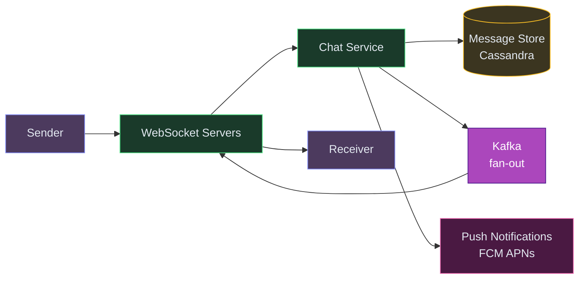
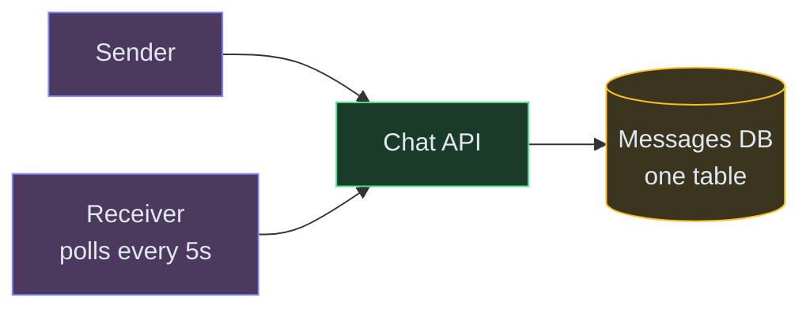
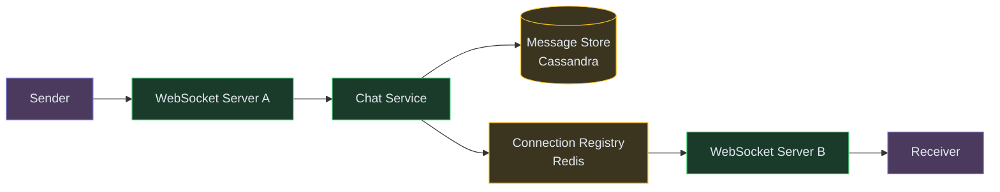
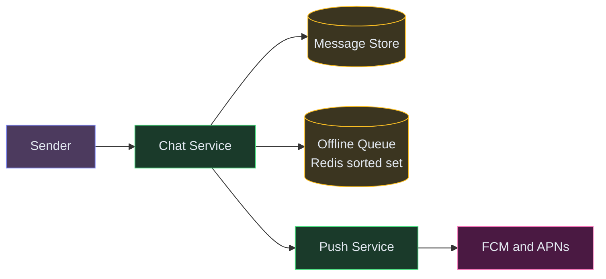
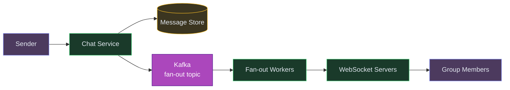
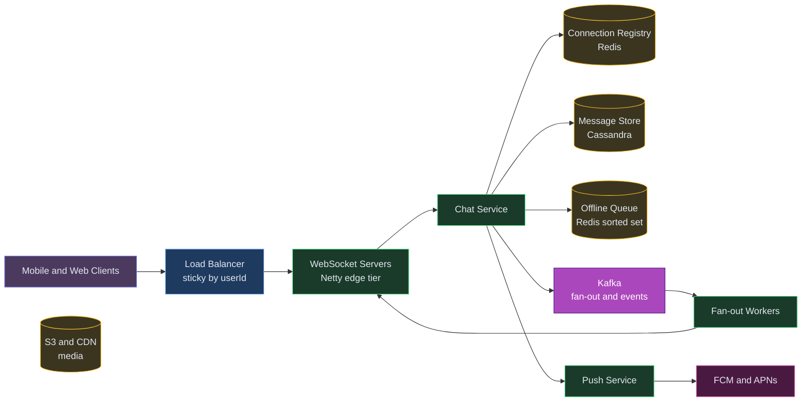

# Designing a Chat System Like WhatsApp / iMessage

⚡ **Difficulty:** Intermediate
📋 **Prerequisites:** [System Design Fundamentals](/concepts) — especially Message Queues and Caching
⏱️ **Reading time:** 20 min

---

## TL;DR

A chat system delivers messages in real-time using WebSockets for online users and stores-then-forwards for offline users.



**In 3 sentences:** Clients maintain a persistent WebSocket connection to the server. When a message is sent, the server persists it, looks up which server the receiver is connected to, and pushes it down their WebSocket. If the receiver is offline, the message waits in a queue and a push notification is sent.

---

## Understanding the Problem

💬 **What is a chat system?** A real-time messaging platform that lets users send text, images, and files to individuals or groups. Messages must be delivered reliably (even if the recipient is offline), ordered correctly, and displayed in real-time. Think WhatsApp, Telegram, Facebook Messenger, or Slack. The hard parts: guaranteed delivery across flaky mobile networks, real-time push without polling, group fan-out at scale, and end-to-end encryption.

## Naive First Cut



Sender POSTs message to an API, stored in a DB. Receiver polls the API every 5 seconds for new messages.

Why this breaks:
- **Polling is wasteful** — 500M users polling every 5s = 100M QPS of mostly-empty responses. Massive cost, terrible latency.
- **5-second delay feels laggy** — real-time chat needs sub-second delivery.
- **Single DB for all messages** — billions of messages/day, one table collapses.
- **No offline handling** — if receiver is offline when message arrives, when do they get it?
- **No ordering guarantee** — if two messages arrive out of order at the DB, display is wrong.
- **Group messages multiply the problem** — 256-member group = 256 deliveries per message.

## Prior Art

- **[WhatsApp Architecture (InfoQ)](https://highscalability.com/whatsapp-architecture/)** — Erlang-based, 2M connections per server, XMPP-derived protocol, store-and-forward for offline delivery.
- **[Facebook Messenger Iris](https://engineering.fb.com/2014/10/09/production-engineering/building-mobile-first-infrastructure-for-messenger/)** — ordered log storage (like Kafka) per conversation. Messages appended to a per-user ordered log. Clients sync via sequence numbers.
- **[Discord How Messages Are Stored](https://discord.com/blog/how-discord-stores-billions-of-messages)** — migrated from MongoDB to Cassandra to ScyllaDB. Partition per channel + bucket.
- **[Signal Protocol](https://signal.org/docs/)** — end-to-end encryption with double-ratchet. Pre-keys for offline delivery. The gold standard for E2E chat encryption.
- **[Slack Real-Time Messaging](https://slack.engineering/flannel-an-application-level-edge-cache-to-make-slack-scale/)** — WebSocket connections for real-time, application-level edge cache (Flannel) for fast channel hydration.

## Technology Choices

| Tier | Purpose | Primary pick | Alternatives |
|---|---|---|---|
| Real-time transport | Push messages to online clients | WebSocket (long-lived) | SSE, MQTT (IoT/mobile-optimized), gRPC streaming |
| Connection management | Track who's online on which server | Redis Pub/Sub + connection registry | Kafka, custom session store |
| Message storage | Durable, ordered message log | Cassandra (partition per conversation) | ScyllaDB, DynamoDB, TiDB |
| Message queue | Decouple sender from fan-out | Kafka (per-user topic or partition) | SQS, RabbitMQ, Pulsar |
| Offline delivery | Store messages until recipient connects | Redis sorted set per user | SQS per user, Cassandra unread table |
| Presence | Who's online | Redis with TTL per user | Dedicated presence service |
| Media storage | Images, files, voice notes | S3 / GCS with CDN | MinIO, Azure Blob |
| Push notifications | Offline users | FCM + APNs | OneSignal, SNS |
| E2E encryption | Message privacy | Signal Protocol (Double Ratchet) | Custom, Noise Protocol |

## Functional Requirements

**Core:**
1. Users can send messages (text) to another user in real-time (1:1 chat).
2. Users can create groups and send messages to all group members.
3. Messages are delivered reliably even if the recipient is offline (store-and-forward).

**Below the line:**
- Read receipts, typing indicators
- Media messages (images, video, voice)
- End-to-end encryption
- Message search, reactions, threads
- Voice/video calling

## Non-Functional Requirements

**Core:**
- **Real-time delivery** — P99 < 500ms for online-to-online message delivery.
- **Reliability** — zero message loss. Once the server acks, the message WILL be delivered eventually.
- **Ordering** — messages within a conversation appear in send order.
- **Scale** — 500M DAU, 100B messages/day (WhatsApp scale).

**Below the line:**
- Sub-100ms delivery latency
- Exactly-once delivery (at-least-once + client-side dedupe is acceptable)
- Multi-device sync (web + mobile + desktop)

## Scale Estimation (Back-of-Envelope)

- **Users:** 500M DAU, 50M concurrent connections at peak
- **Write QPS:** 100K messages/sec sustained, 10B messages/day
- **Read QPS:** 200K message fetches/sec (history sync + offline drain)
- **Storage:** ~5TB message storage/year (compressed, Cassandra)
- **Bandwidth:** ~500 Gbps aggregate WebSocket traffic at peak

## Core Entities

- **User** — identified by phone number or userId. Has online/offline status.
- **Conversation** — a 1:1 or group thread. Has a unique `conversationId` and list of participants.
- **Message** — text content with `messageId`, `senderId`, `conversationId`, `timestamp`, `status` (sent/delivered/read).
- **Connection** — a live WebSocket session mapping `userId → serverId:connectionId`.

## API / System Interface

```
WebSocket: wss://chat.example.com/ws
  → Client authenticates on connect (JWT)
  → Bidirectional: send messages, receive messages, typing, presence

REST (fallback + media):
POST /v1/messages         → send a message (fallback if WS down)
GET  /v1/conversations/:id/messages?after=<seqNo>  → sync history
POST /v1/media/upload     → upload image/file, get a mediaUrl
POST /v1/groups           → create group
```

**Wire format (over WebSocket):**
```json
{"type": "message", "to": "conv_123", "text": "hello", "clientMsgId": "uuid"}
{"type": "ack", "messageId": "msg_456", "status": "delivered"}
{"type": "typing", "conversationId": "conv_123", "userId": "u_789"}
```

Security: WebSocket authenticated via JWT on handshake. `clientMsgId` is for client-side dedupe (idempotency). Server generates the authoritative `messageId` and `timestamp`.

## High-Level Design

### 1) User sends a 1:1 message (both online)

**New components we need:**

1. **WebSocket Servers** — maintain persistent two-way connections with every online user.

> 💡 *WebSocket = a persistent connection that stays open so the server can push messages instantly without the client asking. Unlike HTTP (ask → answer → done), WebSocket keeps the line open.*
2. **Chat Service** — the brain. Receives messages, persists them, and figures out where the recipient is connected.
3. **Message Store (Cassandra)** — permanent storage for all messages. Partitioned by conversation so "load chat history" is a single partition read.

> 💡 *Cassandra is a distributed wide-column database designed for heavy writes. Partitioning by conversation_id means loading a chat history is a single-partition read — O(1) regardless of total messages in the system.*
4. **Connection Registry (Redis)** — a fast lookup table mapping `userId → which WebSocket server they're on`. When a message arrives for Bob, we check Redis to find which server is holding Bob's connection.



**Step-by-step flow:**

1. Sender types "Hey, are you free tonight?" and hits send → message travels over their open WebSocket connection to Server A
2. Server A forwards the message to the Chat Service
3. Chat Service persists the message to Cassandra (partition key = `conversationId`, so all messages in a chat live together) — now it's durable, even if everything crashes
4. Chat Service asks Redis: "Which server is the receiver connected to?" → answer: Server B
5. Chat Service pushes the message to Server B (via internal gRPC or pub/sub)
6. Server B pushes the message down the receiver's WebSocket → message appears on their screen instantly
7. Receiver's app sends back a `delivered` acknowledgment → this receipt flows back to the sender so they see the double-check ✓✓

**Why WebSocket instead of HTTP polling?** With polling, each user would hit our servers every 2 seconds asking "any new messages?" — for 500M users, that's 250M requests/second of mostly-empty responses. WebSocket keeps a persistent connection open so the server pushes messages the instant they arrive — zero wasted requests, sub-second delivery.

### 2) Receiver is offline — store and forward

**New components we need (in addition to the ones above):**

1. **Offline Queue (Redis sorted set)** — when the receiver isn't connected, we park message IDs here. Scored by sequence number so when they reconnect, we drain messages in perfect order.
2. **Push Service** — sends push notifications to wake up the user's phone.

> 💡 *Think of it as the "tap on the shoulder" that tells the user to open the app.*
3. **FCM / APNs** — Firebase Cloud Messaging (Android) and Apple Push Notification service (iOS). External services that deliver notifications to locked phones.



**Step-by-step flow:**

1. Chat Service checks the Connection Registry → receiver is NOT online (no WebSocket entry found)
2. Message is still persisted to Cassandra (same as before — always store first, deliver second)
3. Message ID is added to the receiver's offline queue in Redis (sorted by sequence number for ordering)
4. Push Service sends a notification via FCM/APNs: "New message from Alice" → phone buzzes
5. Later, receiver opens the app and reconnects via WebSocket → server drains the offline queue, sending all pending messages in order
6. Receiver's app acknowledges each message → server removes them from the offline queue

**Why store-and-forward instead of just "retry later"?** Mobile networks are unreliable. A user might be offline for hours (on a flight, in a tunnel, phone dead). Store-and-forward guarantees zero message loss — once the server acknowledges receipt from the sender, that message WILL reach the recipient eventually, no matter how long it takes.

### 3) Group message fan-out

**New components we need (in addition to the ones above):**

1. **Kafka** — an event bus for group message fan-out.

> 💡 *We use Kafka here because group messages need to be delivered to N members reliably. If a fan-out worker crashes mid-delivery, Kafka retries automatically — no message gets lost.*
2. **Fan-out Workers** — consume group message events and deliver to each member individually (online → push via WebSocket, offline → queue + push notification).



**Step-by-step flow:**

1. Sender sends a message to group `conv_123` (256 members) → hits Chat Service
2. Chat Service stores ONE copy of the message (partition key = `conv_123`) — not 256 copies!
3. Publishes a fan-out event to Kafka: "deliver message M to these 256 members"
4. Fan-out workers consume the event and look up each member's connection — online members get real-time WebSocket delivery, offline members get the offline queue + push notification treatment
5. If a fan-out worker crashes, Kafka retries — at-least-once delivery is guaranteed

**Why store once, fan-out on delivery?** Writing 256 copies of the same message would waste massive storage. Instead, we store one copy and fan out references (message IDs) to each member's timeline. This also makes edits and deletes trivial — change one row, and everyone sees the update.

## Potential Deep Dives

### Deep Dive 1 — How to handle 2M WebSocket connections per server

**Bad — one thread per connection (Java BIO).**
2M threads = impossible. OOM at ~10K threads.

**Good — NIO event loop (Netty, Node.js).**
Netty handles millions of connections on a single event loop group. Each connection is just a file descriptor + a small buffer. Memory = ~10KB per idle connection. 2M connections ≈ 20GB RAM. Doable on a 64GB box.

**Great — tiered connection handling.**
- **Edge tier:** lightweight WebSocket terminators (Envoy, HAProxy) that handle TLS + keepalive. Millions of connections per node.
- **Logic tier:** actual message routing in a separate service. Edge proxies messages to logic tier via gRPC.
- Separation means you can scale connection capacity (edge) independently from processing capacity (logic).

### Deep Dive 2 — Message ordering in distributed systems

**Problem:** Sender sends "Hello" then "How are you?" but they arrive at different servers or are processed out of order.

**Bad — rely on server timestamps.**
Clock skew between servers means timestamps can be out of order. NTP gives ~10ms accuracy at best.

**Good — per-conversation monotonic sequence number.**
Chat Service assigns a `seqNo` per conversation using Redis `INCR conv_seq:{convId}`. Messages display in `seqNo` order. Client sorts locally.

**Great — combine sequence number + client-side vector clock for offline conflict resolution.**
- Server assigns `seqNo` for ordering.
- Client embeds `lastSeenSeqNo` in each message so the server can detect gaps (missing message → re-request).
- For multi-device, each device maintains its own "last synced seqNo" and pulls delta on reconnect.

### Deep Dive 3 — Reliable delivery with at-least-once + client dedupe

**Problem:** Network is unreliable. Message might be delivered twice if the ack is lost.

**Flow:**
```
Sender → Server: message (clientMsgId: "abc")
Server → Sender: ack (messageId: "msg_1", clientMsgId: "abc")
Server → Receiver: message (messageId: "msg_1")
Receiver → Server: delivered ack (messageId: "msg_1")
```

**What if receiver's ack is lost?** Server retries delivery. Receiver sees `msg_1` twice. Client dedupes by `messageId` — if already in local DB, ignore.

**What if sender's send is retried?** Server checks `clientMsgId: "abc"` against a short-lived dedupe cache. If seen, returns the same `messageId` without re-storing.

**Result:** at-least-once from server side, exactly-once from user's perspective (client dedupe).

### Deep Dive 4 — How to sync message history across devices

**Problem:** User has phone + web + desktop. All three must show the same messages.

**Solution: pull-based sync with sequence numbers.**
- Each conversation has a `maxSeqNo`.
- Each device tracks `lastSyncedSeqNo` per conversation.
- On app open, device sends `GET /conversations/:id/messages?after=lastSyncedSeqNo`.
- Server returns the delta. Device applies locally.
- Real-time messages come via WebSocket; device increments its local seqNo on receipt.

This is the "ordered log" model (Facebook Iris). The server is the source of truth; clients are materialized views with a cursor.

### Deep Dive 5 — Group fan-out: write amplification vs read amplification

**Write amplification (push model):**
- On group message, write a copy to each member's inbox.
- 256-member group × 1000 messages/day = 256K writes/day for one group.
- **Pro:** reads are fast (each user reads their own inbox).
- **Con:** massive write cost at scale. Celebrity groups with 100K members are catastrophic.

**Read amplification (pull model):**
- Store one copy per conversation.
- On read, user's client fetches from the conversation's log.
- **Pro:** one write per message regardless of group size.
- **Con:** each read must merge multiple conversations' logs.

**Hybrid (what WhatsApp/Discord do):**
- **Small groups (≤256):** push model. Fan-out is bounded and fast.
- **Large channels (1000+):** pull model. Store in channel log, clients fetch on demand.
- Threshold is configurable per platform.

## Final Architecture



## Summary

| Decision | Choice | Why |
|---|---|---|
| Transport | WebSocket | Real-time bidirectional, sub-second delivery |
| Message store | Cassandra | Partition per conversation, append-only, handles billions |
| Connection registry | Redis | Sub-ms lookup of "which server has user X" |
| Offline delivery | Redis sorted set + push notification | Ordered drain on reconnect |
| Group fan-out | Kafka → workers | Async, retryable, doesn't block sender |
| Ordering | Per-conversation sequence number | Simple, no clock dependency |
| Delivery guarantee | At-least-once + client dedupe | Zero message loss, no duplicates visible to user |
| Multi-device | Pull sync with seqNo cursor | Ordered log model (Facebook Iris) |


---

## Key Technologies Mentioned

| Term | What it is |
|---|---|
| **WebSocket** | A persistent two-way connection between client and server. Unlike HTTP (request → response → done), WebSocket stays open so the server can push messages to the client anytime. |
| **Cassandra** | A distributed NoSQL database optimized for fast writes. Stores data across many machines. Perfect for append-only message logs. |
| **Kafka** | A distributed event streaming platform. Producers write events, consumers read them. Used here to decouple message sending from delivery fan-out. |
| **Redis** | In-memory key-value store (< 1ms reads). Used here for connection registry (which user is on which server) and offline message queues. |
| **FCM / APNs** | Firebase Cloud Messaging (Android) and Apple Push Notification service (iOS). How you send push notifications to phones when the app is closed. |
| **Sequence Number** | A monotonically increasing integer per conversation. Guarantees message ordering regardless of clock differences between servers. |
| **Store-and-Forward** | Pattern where the server stores a message durably first, then delivers it when the recipient is available. Ensures zero message loss. |
| **Fan-out** | Delivering one message to multiple recipients (group chat). "Fan-out on write" = copy to each inbox. "Fan-out on read" = store once, each client fetches. |

---

## What's Expected at Each Level

> This section helps you calibrate your depth. You don't need to cover everything — just know what's expected for your level.

### Mid-level

Design basic 1:1 messaging with a server relaying messages. Propose WebSocket for real-time delivery. Understand offline message storage and why polling is wasteful. With prompting, discuss how to handle group messages by fanning out to multiple recipients.

### Senior

Propose Cassandra for message storage (partition by conversation). Explain connection-level routing — how does a message find the right WebSocket server? Discuss read receipts, message ordering guarantees (per-conversation sequence numbers), and offline delivery queues. Articulate why eventual consistency is acceptable for message delivery.

### Staff+

Address end-to-end encryption key exchange (Signal protocol double-ratchet), multi-device sync with ordered-log cursors, and message fan-out for large groups (1000+ members) using the hybrid push/pull model. Discuss graceful degradation when the chat service is overloaded (backpressure on WebSocket connections). Cover message retention policies and GDPR right-to-deletion across replicated stores.

---
## 🎯 Key Takeaways

- **WebSocket** for real-time delivery — persistent connection, server pushes
- **Cassandra** for message storage — partitioned by conversation for fast reads
- **Store-and-forward** for offline users — deliver when they reconnect
- **Connection registry** in Redis routes messages to the right WebSocket server

---
## Related Designs
- [Notification System](/hld/NotificationSystem) — similar multi-channel delivery + WebSocket patterns
- [Twitter Feed](/hld/TwitterFeed) — fan-out and real-time updates
- [Stock Broker](/hld/StockBroker) — Kafka event streaming + exactly-once semantics
